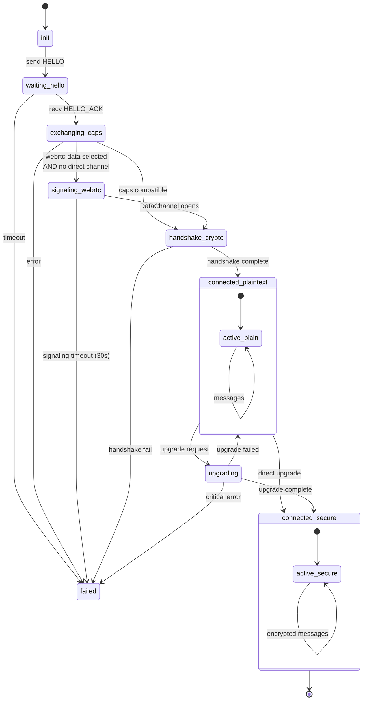
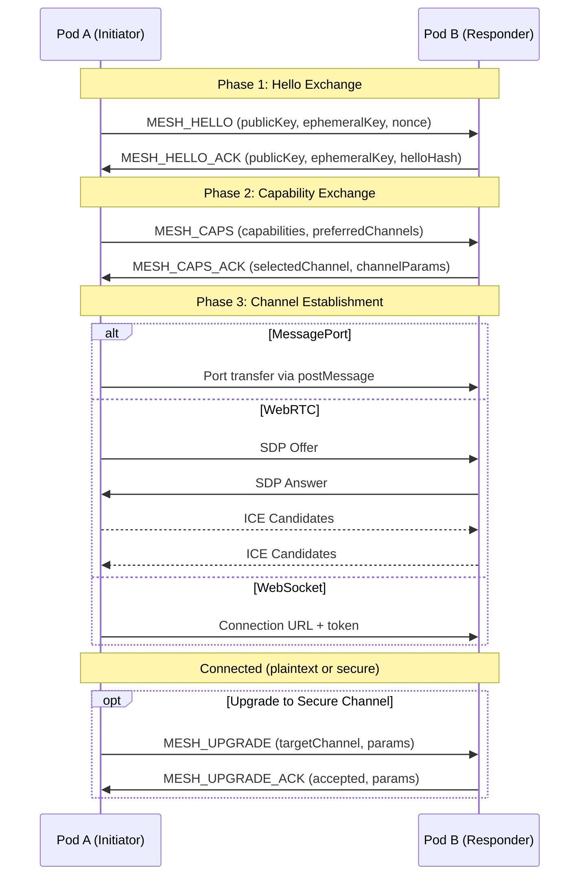

# Link Negotiation State Machine

Protocol for establishing and upgrading communication channels between pods.

**Related specs**: [session-keys.md](../crypto/session-keys.md) | [identity-keys.md](../crypto/identity-keys.md) | [webauthn-identity.md](../crypto/webauthn-identity.md) | [channel-abstraction.md](channel-abstraction.md) | [pod-socket.md](pod-socket.md) | [pod-types.md](../core/pod-types.md) | [signaling-protocol.md](signaling-protocol.md)

## 1. State Diagram



### Message Sequence



## 2. State Definitions

```typescript
type LinkState =
  | 'init'
  | 'waiting-hello'
  | 'exchanging-caps'
  | 'signaling-webrtc'
  | 'handshake-crypto'
  | 'connected-plaintext'
  | 'upgrading'
  | 'connected-secure'
  | 'failed';

interface LinkContext {
  state: LinkState;
  localPod: PodIdentity;
  remotePod?: PodIdentity;
  localCaps: PodCapabilities;
  remoteCaps?: PodCapabilities;
  negotiatedChannel?: ChannelType;
  sessionKey?: CryptoKey;
  error?: Error;
  retries: number;
  startTime: number;
}

type ChannelType =
  | 'post-message'
  | 'message-port'
  | 'broadcast-channel'
  | 'shared-worker'
  | 'webrtc-data'
  | 'websocket'
  | 'webtransport';
```

## 3. Message Types

```typescript
// HELLO - Initial contact
interface HelloMessage {
  type: 'MESH_HELLO';
  version: 1;
  from: string;                    // Pod ID
  publicKey: Uint8Array;           // Identity key
  ephemeralKey: Uint8Array;        // For ECDH
  timestamp: number;
  nonce: Uint8Array;               // 16 bytes random
}

// HELLO_ACK - Response to HELLO
interface HelloAckMessage {
  type: 'MESH_HELLO_ACK';
  version: 1;
  from: string;
  to: string;
  publicKey: Uint8Array;
  ephemeralKey: Uint8Array;
  timestamp: number;
  nonce: Uint8Array;
  helloHash: Uint8Array;           // Hash of received HELLO
}

// CAPS - Capability exchange
interface CapsMessage {
  type: 'MESH_CAPS';
  from: string;
  capabilities: PodCapabilities;
  preferredChannels: ChannelType[];
  signature: Uint8Array;
}

// CAPS_ACK - Capability acknowledgment
interface CapsAckMessage {
  type: 'MESH_CAPS_ACK';
  from: string;
  to: string;
  selectedChannel: ChannelType;
  channelParams?: ChannelParams;
  signature: Uint8Array;
}

// UPGRADE - Request channel upgrade
interface UpgradeMessage {
  type: 'MESH_UPGRADE';
  from: string;
  to: string;
  targetChannel: ChannelType;
  params: ChannelParams;
  signature: Uint8Array;
}

// UPGRADE_ACK - Accept upgrade
interface UpgradeAckMessage {
  type: 'MESH_UPGRADE_ACK';
  from: string;
  to: string;
  accepted: boolean;
  params?: ChannelParams;
  signature: Uint8Array;
}

// Channel-specific params
type ChannelParams =
  | MessagePortParams
  | WebRTCParams
  | WebSocketParams
  | WebTransportParams;

interface MessagePortParams {
  type: 'message-port';
  // Port transferred via postMessage
}

interface WebRTCParams {
  type: 'webrtc-data';
  offer?: RTCSessionDescriptionInit;
  answer?: RTCSessionDescriptionInit;
  iceCandidates?: RTCIceCandidateInit[];
}

interface WebSocketParams {
  type: 'websocket';
  url: string;
  token: string;
}

interface WebTransportParams {
  type: 'webtransport';
  url: string;
  certificateHashes?: ArrayBuffer[];
}
```

## 4. State Machine Implementation

```typescript
class LinkNegotiator {
  private context: LinkContext;
  private timers: Map<string, number> = new Map();

  constructor(localPod: PodIdentity, localCaps: PodCapabilities) {
    this.context = {
      state: 'init',
      localPod,
      localCaps,
      retries: 0,
      startTime: Date.now(),
    };
  }

  // Start negotiation (initiator side)
  async initiate(targetOrigin: string): Promise<void> {
    this.assertState('init');

    // Generate ephemeral key for this session
    const ephemeralKey = await this.generateEphemeralKey();

    // Send HELLO
    const hello: HelloMessage = {
      type: 'MESH_HELLO',
      version: 1,
      from: this.context.localPod.id,
      publicKey: this.context.localPod.publicKey,
      ephemeralKey,
      timestamp: Date.now(),
      nonce: crypto.getRandomValues(new Uint8Array(16)),
    };

    this.send(hello, targetOrigin);
    this.transition('waiting-hello');

    // Set timeout
    this.setTimeout('hello-timeout', 5000, () => {
      this.handleTimeout('hello');
    });
  }

  // Handle incoming message
  async onMessage(message: NegotiationMessage): Promise<void> {
    switch (message.type) {
      case 'MESH_HELLO':
        await this.handleHello(message);
        break;
      case 'MESH_HELLO_ACK':
        await this.handleHelloAck(message);
        break;
      case 'MESH_CAPS':
        await this.handleCaps(message);
        break;
      case 'MESH_CAPS_ACK':
        await this.handleCapsAck(message);
        break;
      case 'MESH_UPGRADE':
        await this.handleUpgrade(message);
        break;
      case 'MESH_UPGRADE_ACK':
        await this.handleUpgradeAck(message);
        break;
    }
  }

  // Handle HELLO (responder side)
  private async handleHello(message: HelloMessage): Promise<void> {
    // Verify timestamp (prevent replay)
    if (Math.abs(Date.now() - message.timestamp) > 30000) {
      throw new Error('Hello timestamp too old');
    }

    // Store remote info
    this.context.remotePod = {
      id: message.from,
      publicKey: message.publicKey,
      ephemeralKey: message.ephemeralKey,
    };

    // Generate our ephemeral key
    const ephemeralKey = await this.generateEphemeralKey();

    // Compute session key via ECDH
    this.context.sessionKey = await this.deriveSessionKey(
      message.ephemeralKey,
      ephemeralKey
    );

    // Send HELLO_ACK
    const ack: HelloAckMessage = {
      type: 'MESH_HELLO_ACK',
      version: 1,
      from: this.context.localPod.id,
      to: message.from,
      publicKey: this.context.localPod.publicKey,
      ephemeralKey,
      timestamp: Date.now(),
      nonce: crypto.getRandomValues(new Uint8Array(16)),
      helloHash: await this.hash(message),
    };

    this.send(ack, this.context.remotePod.origin);
    this.transition('exchanging-caps');

    // Send our capabilities
    await this.sendCapabilities();
  }

  // Handle HELLO_ACK (initiator side)
  private async handleHelloAck(message: HelloAckMessage): Promise<void> {
    this.assertState('waiting-hello');
    this.clearTimeout('hello-timeout');

    // Verify it's responding to our HELLO
    // (helloHash should match what we sent)

    // Store remote info
    this.context.remotePod = {
      id: message.from,
      publicKey: message.publicKey,
      ephemeralKey: message.ephemeralKey,
    };

    // Compute session key
    this.context.sessionKey = await this.deriveSessionKey(
      message.ephemeralKey,
      this.context.localPod.ephemeralKey
    );

    this.transition('exchanging-caps');

    // Send our capabilities
    await this.sendCapabilities();
  }

  // Send capabilities
  private async sendCapabilities(): Promise<void> {
    const caps: CapsMessage = {
      type: 'MESH_CAPS',
      from: this.context.localPod.id,
      capabilities: this.context.localCaps,
      preferredChannels: this.getPreferredChannels(),
      signature: await this.sign(this.context.localCaps),
    };

    this.send(caps);
  }

  // Handle capabilities
  private async handleCaps(message: CapsMessage): Promise<void> {
    // Verify signature
    if (!await this.verify(message.signature, message.capabilities, message.from)) {
      throw new Error('Invalid capability signature');
    }

    this.context.remoteCaps = message.capabilities;

    // Negotiate channel
    const channel = this.negotiateChannel(
      this.context.localCaps,
      message.capabilities,
      message.preferredChannels
    );

    if (!channel) {
      this.transition('failed');
      throw new Error('No compatible channel');
    }

    this.context.negotiatedChannel = channel;

    // Send acknowledgment
    const ack: CapsAckMessage = {
      type: 'MESH_CAPS_ACK',
      from: this.context.localPod.id,
      to: message.from,
      selectedChannel: channel,
      channelParams: await this.prepareChannelParams(channel),
      signature: await this.sign({ channel }),
    };

    this.send(ack);

    // Transition based on channel
    if (channel === 'post-message') {
      this.transition('connected-plaintext');
    } else {
      this.transition('handshake-crypto');
    }
  }

  // Negotiate best channel
  private negotiateChannel(
    local: PodCapabilities,
    remote: PodCapabilities,
    remotePreferred: ChannelType[]
  ): ChannelType | null {
    // Priority order (best to worst)
    const priority: ChannelType[] = [
      'webtransport',
      'webrtc-data',
      'websocket',
      'message-port',
      'shared-worker',
      'broadcast-channel',
      'post-message',
    ];

    for (const channel of priority) {
      if (this.channelCompatible(channel, local, remote)) {
        return channel;
      }
    }

    return null;
  }

  // Check channel compatibility
  private channelCompatible(
    channel: ChannelType,
    local: PodCapabilities,
    remote: PodCapabilities
  ): boolean {
    switch (channel) {
      case 'webtransport':
        return local.channels.webTransport && remote.channels.webTransport;

      case 'webrtc-data':
        return local.channels.webRTC?.dataChannel &&
               remote.channels.webRTC?.dataChannel;

      case 'websocket':
        return local.channels.webSocket && remote.channels.webSocket;

      case 'message-port':
        return local.channels.messagePort && remote.channels.messagePort &&
               local.origin === remote.origin;

      case 'shared-worker':
        return local.channels.sharedWorker && remote.channels.sharedWorker &&
               local.origin === remote.origin;

      case 'broadcast-channel':
        return local.channels.broadcastChannel === true &&
               remote.channels.broadcastChannel === true &&
               local.origin === remote.origin;

      case 'post-message':
        return local.channels.postMessage && remote.channels.postMessage;

      default:
        return false;
    }
  }

  // Upgrade channel
  async requestUpgrade(targetChannel: ChannelType): Promise<void> {
    this.assertState('connected-plaintext', 'connected-secure');

    if (!this.channelCompatible(
      targetChannel,
      this.context.localCaps,
      this.context.remoteCaps!
    )) {
      throw new Error(`Cannot upgrade to ${targetChannel}`);
    }

    const upgrade: UpgradeMessage = {
      type: 'MESH_UPGRADE',
      from: this.context.localPod.id,
      to: this.context.remotePod!.id,
      targetChannel,
      params: await this.prepareChannelParams(targetChannel),
      signature: await this.sign({ targetChannel }),
    };

    this.send(upgrade);
    this.transition('upgrading');
  }

  // State helpers
  private transition(newState: LinkState): void {
    console.log(`Link ${this.context.localPod.id}: ${this.context.state} -> ${newState}`);
    this.context.state = newState;
    this.emit('stateChange', newState);
  }

  private assertState(...expected: LinkState[]): void {
    if (!expected.includes(this.context.state)) {
      throw new Error(
        `Invalid state: expected ${expected.join('|')}, got ${this.context.state}`
      );
    }
  }
}
```

## 5. Channel Establishment Procedures

### 5.1 Upgrade to MessagePort

```typescript
async function upgradeToMessagePort(
  negotiator: LinkNegotiator,
  targetWindow: Window
): Promise<MessagePort> {
  // Create channel
  const channel = new MessageChannel();

  // Send one port to remote
  targetWindow.postMessage({
    type: 'MESH_PORT_TRANSFER',
    from: negotiator.localPodId,
  }, '*', [channel.port2]);

  // Return local port
  return channel.port1;
}
```

### 5.2 Upgrade to WebRTC

```typescript
async function upgradeToWebRTC(
  negotiator: LinkNegotiator
): Promise<RTCDataChannel> {
  const pc = new RTCPeerConnection({
    iceServers: [{ urls: 'stun:stun.l.google.com:19302' }],
  });

  // Create data channel
  const dc = pc.createDataChannel('mesh', {
    ordered: true,
  });

  // Create offer
  const offer = await pc.createOffer();
  await pc.setLocalDescription(offer);

  // Exchange via existing channel
  negotiator.send({
    type: 'MESH_UPGRADE',
    targetChannel: 'webrtc-data',
    params: {
      type: 'webrtc-data',
      offer,
    },
  });

  // Wait for answer
  const answer = await negotiator.waitForMessage('MESH_UPGRADE_ACK');
  await pc.setRemoteDescription(answer.params.answer);

  // Wait for connection
  await new Promise<void>((resolve, reject) => {
    dc.onopen = () => resolve();
    dc.onerror = reject;
    setTimeout(() => reject(new Error('WebRTC timeout')), 30000);
  });

  return dc;
}
```

### 5.3 Signaling-Aware WebRTC Path

When `selectedChannel === 'webrtc-data'` but the two pods have no direct channel for SDP exchange, the negotiator transitions to `signaling-webrtc` and delegates to the signaling protocol (see [signaling-protocol.md](signaling-protocol.md)):

```typescript
async function handleSignalingWebRTC(
  negotiator: LinkNegotiator,
  signaling: SignalingService,
  targetPodId: string
): Promise<PodChannel> {
  negotiator.transition('signaling-webrtc');

  // Ensure signaling connection
  if (!signaling.connected) {
    await signaling.connect(negotiator.localIdentity);
  }

  // Establish WebRTC via signaling
  const establisher = new WebRTCEstablisher(signaling, DEFAULT_ICE_CONFIG);
  const dataChannel = await establisher.initiateConnection(targetPodId);

  // Wrap raw DataChannel as PodChannel (see channel-abstraction.md)
  const channel = wrapChannel(dataChannel);

  // Continue to handshake-crypto
  negotiator.transition('handshake-crypto');
  return channel;
}
```

The signaling path is triggered automatically during capability acknowledgment when:
1. Both peers support `webrtc-data`
2. Neither peer can reach the other via `postMessage`, `MessagePort`, or `BroadcastChannel` (i.e., they are cross-origin or cross-device)
3. No existing data channel exists between them

## 6. Error Handling

```typescript
interface NegotiationError {
  code: string;
  message: string;
  recoverable: boolean;
  retryAfter?: number;
}

const ERROR_CODES = {
  TIMEOUT: { code: 'TIMEOUT', recoverable: true, retryAfter: 1000 },
  VERSION_MISMATCH: { code: 'VERSION_MISMATCH', recoverable: false },
  NO_COMPATIBLE_CHANNEL: { code: 'NO_COMPATIBLE_CHANNEL', recoverable: false },
  CRYPTO_FAILURE: { code: 'CRYPTO_FAILURE', recoverable: false },
  SIGNATURE_INVALID: { code: 'SIGNATURE_INVALID', recoverable: false },
  ORIGIN_MISMATCH: { code: 'ORIGIN_MISMATCH', recoverable: false },
};

/**
 * Note: Once a channel is negotiated and established, it is wrapped in a
 * PodChannel adapter (see channel-abstraction.md) before being passed to
 * SessionManager.getOrCreateSession(). This ensures the session layer
 * operates over a uniform interface regardless of the underlying transport.
 *
 * Example:
 *   const rawPort = await upgradeToMessagePort(negotiator, targetWindow);
 *   const channel = wrapChannel(rawPort);  // → PodChannel
 *   const session = await sessionManager.getOrCreateSession(peerId, peerKey, channel);
 */

class NegotiationErrorHandler {
  private retryCount = 0;
  private maxRetries = 3;

  async handleError(error: NegotiationError): Promise<boolean> {
    if (!error.recoverable) {
      return false;
    }

    if (this.retryCount >= this.maxRetries) {
      return false;
    }

    this.retryCount++;

    if (error.retryAfter) {
      await sleep(error.retryAfter);
    }

    return true;
  }
}
```
