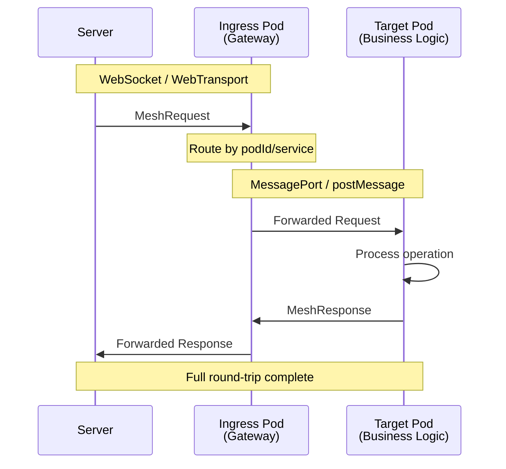
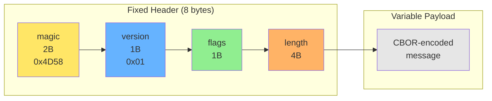

# Message Envelope Format

Application-level RPC message format for BrowserMesh routing.

**Related specs**: [wire-format.md](../core/wire-format.md) | [pod-socket.md](pod-socket.md) | [session-keys.md](../crypto/session-keys.md)

## 1. Overview

The message envelope enables:
- Request/response correlation
- Routed delivery to specific pods
- Capability-based authorization
- Streaming support
- Cancellation

## 2. Architecture



## 3. Message Types

### 3.1 Request Message

```typescript
interface MeshRequest {
  type: 'REQUEST';
  id: string;                    // Unique request ID (UUID)
  from: string;                  // Source pod ID
  target: {
    podId?: string;              // Specific pod ID
    service?: string;            // Service name
    capability?: string;         // Required capability
  };
  payload: {
    op: string;                  // Operation name
    args?: Record<string, any>;  // Operation arguments
  };
  options?: {
    timeout?: number;            // Timeout in ms
    priority?: 'low' | 'normal' | 'high';
    stream?: boolean;            // Expect streaming response
  };
  signature?: Uint8Array;        // Optional signature
  timestamp: number;
}
```

### 3.2 Response Message

```typescript
interface MeshResponse {
  type: 'RESPONSE';
  id: string;                    // Matches request ID
  from: string;                  // Responder pod ID
  to: string;                    // Original requester
  status: 'ok' | 'error' | 'streaming' | 'cancelled';
  result?: any;                  // Response data
  error?: {
    code: string;
    message: string;
    details?: any;
  };
  signature?: Uint8Array;
}
```

### 3.3 Stream Messages

```typescript
interface MeshStreamChunk {
  type: 'STREAM_CHUNK';
  id: string;                    // Request ID
  sequence: number;              // Chunk sequence number
  data: any;                     // Chunk data
  final: boolean;                // Is this the last chunk?
}

interface MeshStreamEnd {
  type: 'STREAM_END';
  id: string;
  totalChunks: number;
  checksum?: Uint8Array;
}
```

### 3.4 Control Messages

```typescript
interface MeshCancel {
  type: 'CANCEL';
  id: string;                    // Request to cancel
  reason?: string;
}

interface MeshAck {
  type: 'ACK';
  id: string;
  receivedAt: number;
}

interface MeshProgress {
  type: 'PROGRESS';
  id: string;
  percent?: number;
  message?: string;
  data?: any;
}
```

## 4. Binary Envelope Format

For efficient transport, use CBOR encoding with a fixed header:



### 4.1 Header Fields

| Field | Size | Description |
|-------|------|-------------|
| magic | 2 bytes | `0x4D 0x58` ("MX") |
| version | 1 byte | Protocol version (0x01) |
| flags | 1 byte | Message flags |
| len | 4 bytes | Payload length (big-endian) |
| payload | variable | CBOR-encoded message |

### 4.2 Flags

```typescript
enum MessageFlags {
  NONE = 0x00,
  ENCRYPTED = 0x01,         // Payload is encrypted
  COMPRESSED = 0x02,        // Payload is compressed
  SIGNED = 0x04,            // Includes signature
  STREAMING = 0x08,         // Part of a stream
  URGENT = 0x10,            // High priority
  ROUTED = 0x20,            // Has been routed (not origin)
}
```

## 5. Envelope Implementation

```typescript
class MeshEnvelope {
  static MAGIC = new Uint8Array([0x4d, 0x58]);  // "MX"
  static VERSION = 0x01;

  /**
   * Encode a message to binary envelope
   */
  static encode(
    message: MeshMessage,
    options: EnvelopeOptions = {}
  ): Uint8Array {
    let payload = cbor.encode(message);
    let flags = MessageFlags.NONE;

    // Compress if large
    if (options.compress && payload.length > 1024) {
      payload = compress(payload);
      flags |= MessageFlags.COMPRESSED;
    }

    // Encrypt if key provided
    if (options.encryptKey) {
      payload = encrypt(payload, options.encryptKey);
      flags |= MessageFlags.ENCRYPTED;
    }

    // Build header
    const header = new Uint8Array(8);
    header.set(this.MAGIC, 0);
    header[2] = this.VERSION;
    header[3] = flags;
    new DataView(header.buffer).setUint32(4, payload.length, false);

    // Concatenate
    return concat(header, payload);
  }

  /**
   * Decode binary envelope to message
   */
  static decode(
    data: Uint8Array,
    options: EnvelopeOptions = {}
  ): MeshMessage {
    // Verify header
    if (data[0] !== 0x4d || data[1] !== 0x58) {
      throw new Error('Invalid magic bytes');
    }

    const version = data[2];
    const flags = data[3];
    const length = new DataView(data.buffer, data.byteOffset).getUint32(4, false);

    let payload = data.slice(8, 8 + length);

    // Decrypt if needed
    if (flags & MessageFlags.ENCRYPTED) {
      if (!options.decryptKey) {
        throw new Error('Encrypted message but no key provided');
      }
      payload = decrypt(payload, options.decryptKey);
    }

    // Decompress if needed
    if (flags & MessageFlags.COMPRESSED) {
      payload = decompress(payload);
    }

    return cbor.decode(payload);
  }
}
```

## 6. Request/Response Correlation

```typescript
class RequestTracker {
  private pending: Map<string, PendingRequest> = new Map();

  /**
   * Create and track a new request
   */
  createRequest(
    target: MeshRequest['target'],
    payload: MeshRequest['payload'],
    options: RequestOptions = {}
  ): { request: MeshRequest; promise: Promise<any> } {
    const id = crypto.randomUUID();
    const request: MeshRequest = {
      type: 'REQUEST',
      id,
      from: this.localPodId,
      target,
      payload,
      options,
      timestamp: Date.now(),
    };

    const pending: PendingRequest = {
      request,
      resolve: null!,
      reject: null!,
      startTime: Date.now(),
    };

    const promise = new Promise((resolve, reject) => {
      pending.resolve = resolve;
      pending.reject = reject;
    });

    this.pending.set(id, pending);

    // Set timeout
    if (options.timeout) {
      setTimeout(() => {
        if (this.pending.has(id)) {
          this.pending.delete(id);
          pending.reject(new Error('Request timeout'));
        }
      }, options.timeout);
    }

    return { request, promise };
  }

  /**
   * Handle incoming response
   */
  handleResponse(response: MeshResponse): void {
    const pending = this.pending.get(response.id);
    if (!pending) {
      console.warn('Response for unknown request:', response.id);
      return;
    }

    this.pending.delete(response.id);

    if (response.status === 'ok') {
      pending.resolve(response.result);
    } else if (response.status === 'error') {
      pending.reject(new MeshError(response.error!));
    }
  }

  /**
   * Handle stream chunk
   */
  handleStreamChunk(chunk: MeshStreamChunk): void {
    const pending = this.pending.get(chunk.id);
    if (!pending?.streamHandler) return;

    pending.streamHandler(chunk.data, chunk.final);

    if (chunk.final) {
      this.pending.delete(chunk.id);
      pending.resolve(undefined);
    }
  }
}

interface PendingRequest {
  request: MeshRequest;
  resolve: (value: any) => void;
  reject: (error: Error) => void;
  startTime: number;
  streamHandler?: (data: any, final: boolean) => void;
}
```

## 7. Routing

```typescript
class MeshRouter {
  private routes: Map<string, RouteEntry> = new Map();
  private tracker: RequestTracker;

  /**
   * Route a request to target
   */
  async route(request: MeshRequest): Promise<MeshResponse> {
    const route = this.findRoute(request.target);

    if (!route) {
      return {
        type: 'RESPONSE',
        id: request.id,
        from: this.localPodId,
        to: request.from,
        status: 'error',
        error: {
          code: 'NO_ROUTE',
          message: `No route to target: ${JSON.stringify(request.target)}`,
        },
      };
    }

    // Check capability
    if (request.target.capability) {
      if (!route.capabilities.includes(request.target.capability)) {
        return {
          type: 'RESPONSE',
          id: request.id,
          from: this.localPodId,
          to: request.from,
          status: 'error',
          error: {
            code: 'CAPABILITY_DENIED',
            message: `Pod does not have capability: ${request.target.capability}`,
          },
        };
      }
    }

    // Forward to target
    return route.channel.send(request);
  }

  /**
   * Find best route for target
   */
  private findRoute(target: MeshRequest['target']): RouteEntry | undefined {
    // Direct pod ID lookup
    if (target.podId) {
      return this.routes.get(target.podId);
    }

    // Service lookup
    if (target.service) {
      return this.findServiceRoute(target.service);
    }

    // Capability lookup
    if (target.capability) {
      return this.findCapabilityRoute(target.capability);
    }

    return undefined;
  }
}
```

## 8. Flow Control

```typescript
interface FlowControl {
  // Max pending requests per peer
  maxPendingRequests: number;

  // Backpressure window
  windowSize: number;

  // Per-request limits
  maxPayloadSize: number;
  maxStreamChunks: number;
}

class FlowController {
  private pending: Map<string, number> = new Map();
  private config: FlowControl;

  canSend(peerId: string): boolean {
    const count = this.pending.get(peerId) || 0;
    return count < this.config.maxPendingRequests;
  }

  onSend(peerId: string): void {
    const count = this.pending.get(peerId) || 0;
    this.pending.set(peerId, count + 1);
  }

  onResponse(peerId: string): void {
    const count = this.pending.get(peerId) || 0;
    this.pending.set(peerId, Math.max(0, count - 1));
  }
}
```

## 9. Error Codes

```typescript
const ERROR_CODES = {
  // Routing errors
  NO_ROUTE: 'No route to destination',
  POD_NOT_FOUND: 'Target pod not found',
  SERVICE_UNAVAILABLE: 'Service unavailable',

  // Authorization errors
  UNAUTHORIZED: 'Request not authorized',
  CAPABILITY_DENIED: 'Capability not available',
  SIGNATURE_INVALID: 'Invalid request signature',

  // Execution errors
  OPERATION_FAILED: 'Operation failed',
  TIMEOUT: 'Request timeout',
  CANCELLED: 'Request cancelled',

  // Protocol errors
  INVALID_MESSAGE: 'Invalid message format',
  VERSION_MISMATCH: 'Protocol version mismatch',
  PAYLOAD_TOO_LARGE: 'Payload exceeds limit',
};
```

## 10. Usage Example

```typescript
// Client side
const { request, promise } = tracker.createRequest(
  { podId: 'pod-abc', capability: 'compute/transform' },
  { op: 'resize-image', args: { w: 200, h: 200 } },
  { timeout: 30000, stream: true }
);

const encoded = MeshEnvelope.encode(request, { compress: true });
socket.send(encoded);

const result = await promise;
console.log('Result:', result);

// Server side
socket.onmessage = async (data) => {
  const message = MeshEnvelope.decode(data);

  if (message.type === 'REQUEST') {
    try {
      const result = await handleRequest(message);
      const response: MeshResponse = {
        type: 'RESPONSE',
        id: message.id,
        from: localPodId,
        to: message.from,
        status: 'ok',
        result,
      };
      socket.send(MeshEnvelope.encode(response));
    } catch (err) {
      const response: MeshResponse = {
        type: 'RESPONSE',
        id: message.id,
        from: localPodId,
        to: message.from,
        status: 'error',
        error: {
          code: 'OPERATION_FAILED',
          message: err.message,
        },
      };
      socket.send(MeshEnvelope.encode(response));
    }
  }
};
```

## 11. Binary Request Protocol Alternative

For streaming-heavy workloads (file uploads, media transfer, large payloads), the [binary request protocol](binary-request-protocol.md) provides an alternative to the CBOR-encoded envelope format. It uses a lightweight binary framing with 22-byte headers and built-in body streaming, avoiding the overhead of CBOR encoding for large binary payloads.

| Use Case | Recommended Format |
|----------|-------------------|
| RPC calls, small payloads | CBOR Envelope (this spec) |
| File transfers, streaming | [Binary Request Protocol](binary-request-protocol.md) |
| Mixed workloads | Both (negotiate via `Accept-Format` header) |

## 12. Structured Metadata Headers

For typed, extensible metadata in envelope headers, implementations MAY use [RFC 8941](https://www.rfc-editor.org/rfc/rfc8941) / [RFC 9651](https://www.rfc-editor.org/rfc/rfc9651) HTTP Structured Fields encoding. This provides a standardized way to encode integers, decimals, strings, tokens, byte sequences, booleans, dates, and display strings with optional parameters.

```typescript
// Example: structured metadata in MeshRequest
const request: MeshRequest = {
  type: 'REQUEST',
  id: crypto.randomUUID(),
  from: localPodId,
  target: { service: 'storage' },
  payload: { op: 'upload' },
  metadata: {
    'content-type': 'application/octet-stream',
    'content-length': '1048576',       // sf-integer
    'priority': 'u=1',                 // sf-integer with parameter
    'accept-encoding': 'gzip, br',     // sf-list
  },
  timestamp: Date.now(),
};
```

See [binary-request-protocol.md](binary-request-protocol.md) for the full structured fields parser/serializer.
