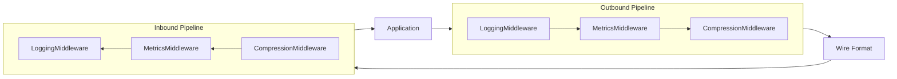

# Message Middleware

Composable transform pipeline for pod-to-pod message processing.

**Related specs**: [message-envelope.md](message-envelope.md) | [wire-format.md](../core/wire-format.md) | [client-api.md](../reference/client-api.md) | [observability.md](../operations/observability.md)

## 1. Overview

`MeshServer.use()` provides middleware for request handlers, but there is no composable transform pipeline for raw pod-to-pod messages. This spec adds:

- Bidirectional middleware pipeline (inbound + outbound)
- Built-in middleware for logging, compression, and metrics
- Content-type routing (middleware declares which message types it handles)
- Error handling modes (short-circuit vs pass-through)
- Integration with MeshServer and MeshClient



## 2. MessageMiddleware Interface

```typescript
interface MessageMiddleware {
  /** Unique middleware name */
  name: string;

  /** Transform stream for message processing */
  transform: TransformStream<MessageEnvelope, MessageEnvelope>;

  /** Execution priority (lower = earlier). Default: 100 */
  priority?: number;

  /**
   * Message type filter. If set, middleware only processes messages
   * with matching `t` field values. Unmatched messages pass through.
   */
  filter?: number[];

  /** Error handling mode for this middleware */
  errorMode?: 'short-circuit' | 'pass-through';
}

interface MessageEnvelope {
  /** Message type code (from wire-format.md) */
  t: number;
  /** Message payload */
  p: unknown;
  /** Source pod ID */
  from?: string;
  /** Destination pod ID */
  to?: string;
  /** Trace context (from observability.md) */
  trace?: TraceContext;
  /** Timestamp */
  timestamp?: number;
  /** Middleware-attached metadata */
  meta?: Record<string, unknown>;
}
```

## 3. MiddlewarePipeline

```typescript
class MiddlewarePipeline {
  private inbound: MessageMiddleware[] = [];
  private outbound: MessageMiddleware[] = [];

  /**
   * Add middleware to both inbound and outbound pipelines.
   * Middleware is sorted by priority (lower = earlier).
   */
  add(middleware: MessageMiddleware): void {
    this.inbound.push(middleware);
    this.outbound.push(middleware);
    this.sortByPriority();
  }

  /**
   * Add middleware to a specific direction only.
   */
  addDirectional(
    middleware: MessageMiddleware,
    direction: 'inbound' | 'outbound'
  ): void {
    if (direction === 'inbound') {
      this.inbound.push(middleware);
    } else {
      this.outbound.push(middleware);
    }
    this.sortByPriority();
  }

  /** Remove middleware by name */
  remove(name: string): boolean {
    const inIdx = this.inbound.findIndex(m => m.name === name);
    const outIdx = this.outbound.findIndex(m => m.name === name);
    if (inIdx >= 0) this.inbound.splice(inIdx, 1);
    if (outIdx >= 0) this.outbound.splice(outIdx, 1);
    return inIdx >= 0 || outIdx >= 0;
  }

  /** Process an outbound message through the pipeline */
  async processOutbound(message: MessageEnvelope): Promise<MessageEnvelope> {
    return this.runPipeline(message, this.outbound);
  }

  /** Process an inbound message through the pipeline */
  async processInbound(message: MessageEnvelope): Promise<MessageEnvelope> {
    return this.runPipeline(message, this.inbound);
  }

  private async runPipeline(
    message: MessageEnvelope,
    pipeline: MessageMiddleware[]
  ): Promise<MessageEnvelope> {
    let current = message;

    for (const middleware of pipeline) {
      // Skip if message type doesn't match filter
      if (middleware.filter && !middleware.filter.includes(current.t)) {
        continue;
      }

      try {
        current = await this.applyMiddleware(current, middleware);
      } catch (error) {
        if (middleware.errorMode === 'short-circuit') {
          throw error;
        }
        // pass-through: log error and continue with unmodified message
        console.warn(
          `Middleware ${middleware.name} error (pass-through):`,
          error
        );
      }
    }

    return current;
  }

  private async applyMiddleware(
    message: MessageEnvelope,
    middleware: MessageMiddleware
  ): Promise<MessageEnvelope> {
    const reader = middleware.transform.readable.getReader();
    const writer = middleware.transform.writable.getWriter();

    await writer.write(message);
    const { value } = await reader.read();
    reader.releaseLock();
    writer.releaseLock();

    return value ?? message;
  }

  private sortByPriority(): void {
    const byPriority = (a: MessageMiddleware, b: MessageMiddleware) =>
      (a.priority ?? 100) - (b.priority ?? 100);
    this.inbound.sort(byPriority);
    this.outbound.sort(byPriority);
  }
}
```

## 4. Built-in Middleware

### 4.1 LoggingMiddleware

Logs all messages passing through the pipeline.

```typescript
function createLoggingMiddleware(
  logger?: StructuredLogger
): MessageMiddleware {
  return {
    name: 'logging',
    priority: 10,
    errorMode: 'pass-through',
    transform: new TransformStream({
      transform(message, controller) {
        const log = logger ?? console;
        log.info?.(`[middleware:logging] t=0x${message.t.toString(16)} ` +
          `from=${message.from?.slice(0, 8)} to=${message.to?.slice(0, 8)}`);
        controller.enqueue(message);
      },
    }),
  };
}
```

### 4.2 CompressionMiddleware

Compresses payloads larger than a threshold using DecompressionStream.

```typescript
function createCompressionMiddleware(
  options: { threshold?: number; algorithm?: 'gzip' | 'deflate' } = {}
): MessageMiddleware {
  const threshold = options.threshold ?? 1024; // 1 KB
  const algorithm = options.algorithm ?? 'gzip';

  return {
    name: 'compression',
    priority: 90,
    errorMode: 'pass-through',
    transform: new TransformStream({
      async transform(message, controller) {
        const payload = message.p;

        if (payload instanceof Uint8Array && payload.length > threshold) {
          // Compress
          const cs = new CompressionStream(algorithm);
          const writer = cs.writable.getWriter();
          const reader = cs.readable.getReader();

          writer.write(payload);
          writer.close();

          const chunks: Uint8Array[] = [];
          let result;
          while (!(result = await reader.read()).done) {
            chunks.push(result.value);
          }

          const compressed = concatBuffers(chunks);

          // Only use compressed version if it's actually smaller
          if (compressed.length < payload.length) {
            controller.enqueue({
              ...message,
              p: compressed,
              meta: {
                ...message.meta,
                compressed: algorithm,
                originalSize: payload.length,
              },
            });
            return;
          }
        }

        controller.enqueue(message);
      },
    }),
  };
}
```

### 4.3 DecompressionMiddleware

Decompresses inbound payloads.

```typescript
function createDecompressionMiddleware(): MessageMiddleware {
  return {
    name: 'decompression',
    priority: 10,
    errorMode: 'pass-through',
    transform: new TransformStream({
      async transform(message, controller) {
        if (message.meta?.compressed && message.p instanceof Uint8Array) {
          const algorithm = message.meta.compressed as string;
          const ds = new DecompressionStream(algorithm);
          const writer = ds.writable.getWriter();
          const reader = ds.readable.getReader();

          writer.write(message.p);
          writer.close();

          const chunks: Uint8Array[] = [];
          let result;
          while (!(result = await reader.read()).done) {
            chunks.push(result.value);
          }

          controller.enqueue({
            ...message,
            p: concatBuffers(chunks),
            meta: { ...message.meta, compressed: undefined },
          });
          return;
        }

        controller.enqueue(message);
      },
    }),
  };
}
```

### 4.4 MetricsMiddleware

Collects message-level metrics for the observability system.

```typescript
function createMetricsMiddleware(
  metrics: MetricsCollector
): MessageMiddleware {
  return {
    name: 'metrics',
    priority: 20,
    errorMode: 'pass-through',
    transform: new TransformStream({
      transform(message, controller) {
        metrics.incrementCounter('mesh.middleware.messages', {
          type: `0x${message.t.toString(16)}`,
          direction: message.from ? 'inbound' : 'outbound',
        });

        if (message.p instanceof Uint8Array) {
          metrics.recordHistogram('mesh.middleware.payload_size', message.p.length, {
            type: `0x${message.t.toString(16)}`,
          });
        }

        // Track processing timestamp
        const enriched = {
          ...message,
          meta: {
            ...message.meta,
            middlewareTimestamp: Date.now(),
          },
        };

        controller.enqueue(enriched);
      },
    }),
  };
}
```

## 5. Error Handling Modes

Each middleware declares how errors should be handled:

| Mode | Behavior |
|------|----------|
| `short-circuit` | Error stops the pipeline and propagates to caller |
| `pass-through` | Error is logged; message continues unmodified |

```typescript
// Example: validation middleware with short-circuit
function createValidationMiddleware(): MessageMiddleware {
  return {
    name: 'validation',
    priority: 5,
    errorMode: 'short-circuit',
    transform: new TransformStream({
      transform(message, controller) {
        if (!message.t || typeof message.t !== 'number') {
          throw new Error('Invalid message: missing type code');
        }
        if (message.t < 0x01 || message.t > 0xFF) {
          throw new Error(`Invalid message type: 0x${message.t.toString(16)}`);
        }
        controller.enqueue(message);
      },
    }),
  };
}
```

## 6. Content-Type Routing

Middleware can declare which message types it handles via the `filter` property. Messages with non-matching `t` values skip the middleware entirely:

```typescript
// Only process pub/sub messages (0x90-0x95)
const pubsubLogger: MessageMiddleware = {
  name: 'pubsub-logger',
  priority: 15,
  filter: [0x90, 0x91, 0x92, 0x93, 0x94, 0x95],
  transform: new TransformStream({
    transform(message, controller) {
      console.log(`[PubSub] type=0x${message.t.toString(16)}`);
      controller.enqueue(message);
    },
  }),
};

// Only process stream messages (0x10-0x16)
const streamMetrics: MessageMiddleware = {
  name: 'stream-metrics',
  priority: 20,
  filter: [0x10, 0x11, 0x12, 0x13, 0x14, 0x15, 0x16],
  transform: new TransformStream({
    transform(message, controller) {
      // Track stream-specific metrics
      controller.enqueue(message);
    },
  }),
};
```

## 7. Integration with MeshServer and MeshClient

### MeshServer Integration

```typescript
// Adding middleware to a server
const server = createServer();

server.useMiddleware(createLoggingMiddleware());
server.useMiddleware(createCompressionMiddleware({ threshold: 2048 }));
server.useMiddleware(createMetricsMiddleware(metrics));

// Middleware runs on all inbound requests before handlers
// and on all outbound responses after handlers
```

### MeshClient Integration

```typescript
// Adding middleware to a client
const client = createClient();

// Outbound middleware processes messages before sending
client.useMiddleware(createCompressionMiddleware());

// Inbound middleware processes messages after receiving
client.useMiddleware(createDecompressionMiddleware());
```

### Custom Middleware

```typescript
// Rate-limiting middleware
function createRateLimitMiddleware(
  maxPerSecond: number
): MessageMiddleware {
  let count = 0;
  let windowStart = Date.now();

  return {
    name: 'rate-limit',
    priority: 5,
    errorMode: 'short-circuit',
    transform: new TransformStream({
      transform(message, controller) {
        const now = Date.now();
        if (now - windowStart > 1000) {
          count = 0;
          windowStart = now;
        }

        count++;
        if (count > maxPerSecond) {
          throw new Error('Rate limit exceeded');
        }

        controller.enqueue(message);
      },
    }),
  };
}
```

## 8. Limits

| Resource | Limit |
|----------|-------|
| Max middleware per pipeline | 16 |
| Processing timeout per middleware | 5000 ms |
| Max message size through pipeline | 64 KB |
| Compression threshold (default) | 1 KB |
| Max filter types per middleware | 32 |
| Middleware name max length | 64 characters |
