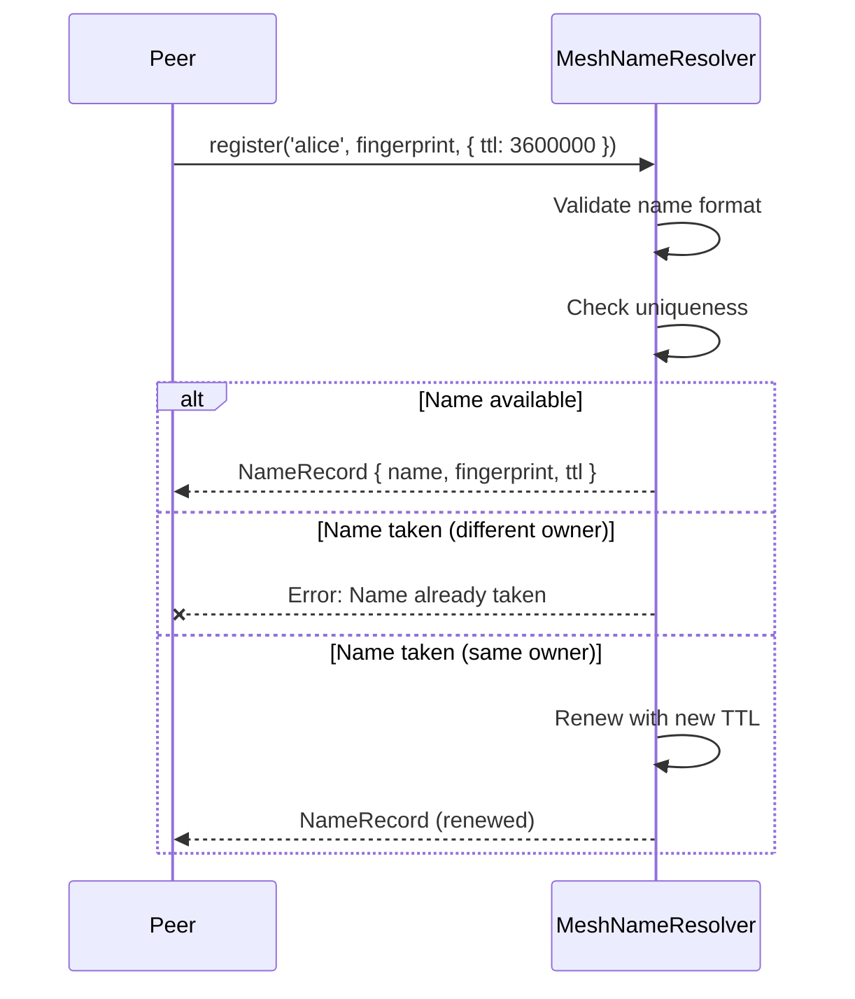
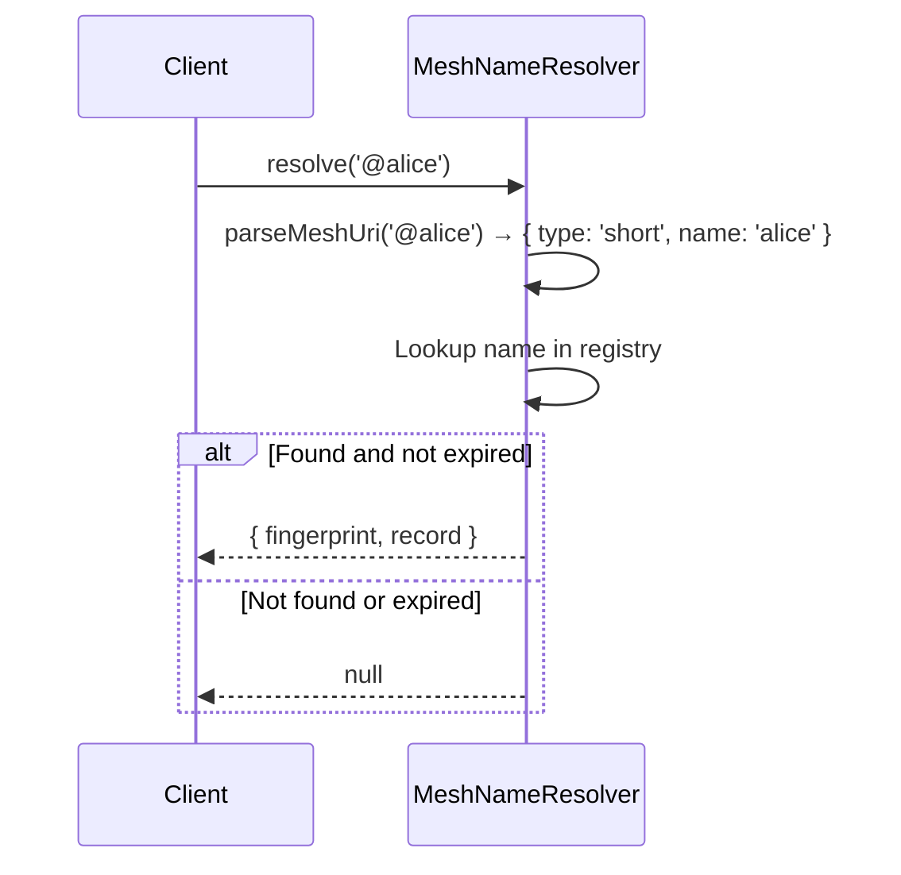

# Name Resolution

Decentralized human-friendly name resolution for BrowserMesh identities.

**Related specs**: [pod-addr.md](pod-addr.md) | [wire-format.md](../core/wire-format.md) | [signaling-protocol.md](signaling-protocol.md)

## 1. Overview

The name resolution system maps human-friendly identifiers (`@alice`, `mesh://alice/path`) to identity fingerprints. Names are first-come-first-served with TTL-based expiry, ownership transfer, and reverse lookup.

Wire types: `NAME_REGISTER` (0xB5), `NAME_RESOLVE` (0xB6), `NAME_TRANSFER` (0xB7)

## 2. Name Format Grammar

```abnf
name          = name-start 0*62name-char name-end
name-start    = LOWER / DIGIT
name-end      = LOWER / DIGIT
name-char     = LOWER / DIGIT / "." / "-" / "_"
LOWER         = %x61-7A  ; a-z
DIGIT         = %x30-39  ; 0-9
```

Constraints:
- Minimum length: 2 characters
- Maximum length: 64 characters
- Must start and end with lowercase alphanumeric
- Interior may contain `.`, `-`, `_`
- Case-sensitive (all lowercase)

Regex: `^[a-z0-9][a-z0-9._-]{0,62}[a-z0-9]$`

## 3. URI Formats

| Format | Type | Example | Fields |
|--------|------|---------|--------|
| `@name` | Short | `@alice` | name only |
| `@name@relay` | Qualified | `@alice@relay.example.com` | name + relay |
| `did:key:fp` | DID | `did:key:z6MkABC...` | fingerprint |
| `mesh://name/path` | Mesh URI | `mesh://alice/svc/api` | name + path |

### Parse Result

```typescript
type ParsedUri =
  | { type: 'short'; name: string; relay: null; path: null }
  | { type: 'qualified'; name: string; relay: string; path: null }
  | { type: 'did'; fingerprint: string; path: null }
  | { type: 'mesh'; name: string; relay: null; path: string | null };
```

## 4. TypeScript Interfaces

```typescript
interface NameRecord {
  name: string;
  fingerprint: string;   // Owner's identity fingerprint
  timestamp: number;      // Registration time (ms)
  ttl: number;            // Time-to-live (ms), default 3600000 (1 hour)
  relay: string | null;   // Preferred relay server
  metadata: Record<string, unknown> | null;
}
```

## 5. Wire Message Formats

### NAME_REGISTER (0xB5)

```typescript
interface NameRegisterMessage {
  type: 0xB5;
  from: string;
  payload: {
    name: string;
    fingerprint: string;
    ttl?: number;
    relay?: string;
    metadata?: Record<string, unknown>;
  };
}
```

### NAME_RESOLVE (0xB6)

```typescript
interface NameResolveMessage {
  type: 0xB6;
  from: string;
  to?: string;
  payload: {
    uri: string;            // Any supported URI format
  };
}

interface NameResolveResponse {
  type: 0xB6;
  from: string;
  to: string;
  payload: {
    fingerprint: string | null;
    record: NameRecord | null;
  };
}
```

### NAME_TRANSFER (0xB7)

```typescript
interface NameTransferMessage {
  type: 0xB7;
  from: string;
  payload: {
    name: string;
    fromFingerprint: string;
    toFingerprint: string;
  };
}
```

## 6. Registration Flow



## 7. Resolution Flow



## 8. TTL and Expiration

- Default TTL: 1 hour (3,600,000 ms)
- A record expires when `now > timestamp + ttl`
- Only the current owner can renew (re-register) a name
- Expired names become available for registration by anyone
- `prune()` removes all expired records from the registry

## 9. Uniqueness and Collision Resolution

- First-come-first-served: the first registration wins
- A second registration attempt for an existing, non-expired name from a different fingerprint throws an error
- Same-owner re-registration renews the record (updates timestamp and TTL)
- Name transfer atomically changes ownership

## 10. Security Considerations

- **Name squatting**: TTL-based expiry prevents indefinite squatting. Short TTLs (default 1 hour) require active renewal.
- **Cache poisoning**: Each resolver maintains its own authoritative registry. Cross-resolver sync uses signed NAME_REGISTER messages verified against the sender's identity.
- **Impersonation**: Names are bound to fingerprints. Only the current owner (verified by fingerprint match) can renew, transfer, or unregister a name.
- **Transfer safety**: Both the current owner's fingerprint and the destination fingerprint must be specified, preventing unauthorized transfers.
