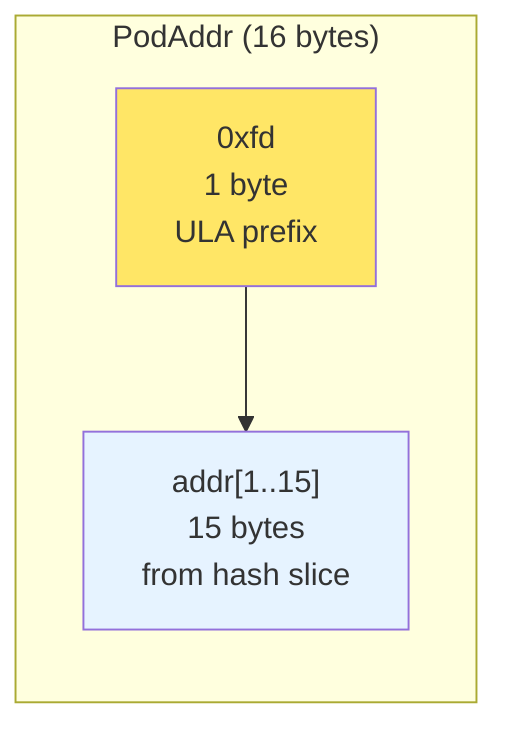
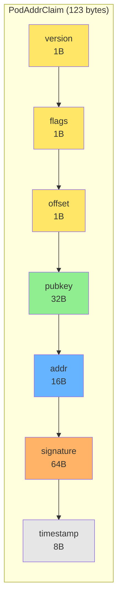

# PodAddr Binary Format

Cryptographically-derived virtual addresses for BrowserMesh pods.

**Related specs**: [identity-keys.md](../crypto/identity-keys.md) | [wire-format.md](../core/wire-format.md) | [identity-persistence.md](../crypto/identity-persistence.md)

## 1. Overview

PodAddr provides IPv6-like addresses derived from pod identity keys:
- **Self-certifying**: Address derivable from public key
- **Multiple addresses per identity**: For sharding, routing, roles
- **ULA-compatible**: Falls into non-routed private address space

## 2. Address Derivation

### 2.1 Sliding Window Method

Given a 32-byte hash `m = SHA-256(publicKey)`:

```
offset 0  → bytes [0..15]   = addr[0]
offset 1  → bytes [1..16]   = addr[1]
...
offset 16 → bytes [16..31]  = addr[16]
```

**17 valid addresses** from 17 contiguous 16-byte windows.

### 2.2 ULA Formatting

Force Unique Local Address (ULA) prefix `fd00::/8`:

```typescript
function deriveAddress(publicKey: Uint8Array, offset: number): Uint8Array {
  const m = sha256(publicKey);
  const slice = m.slice(offset, offset + 16);

  // Force ULA prefix
  const addr = new Uint8Array(16);
  addr[0] = 0xfd;
  addr.set(slice.slice(1, 16), 1);

  return addr;
}
```

Result: 17 stable virtual IPv6 addresses per identity, all under `fd00::/8`.

## 3. Binary Formats

### 3.1 PodAddr (16 bytes)



### 3.2 PodAddrClaim (variable length)

Proves ownership of an address.



**Fields**:
- `version`: Protocol version (currently 0x01)
- `flags`: Reserved for extensions
- `offset`: Address derivation offset (0-16)
- `pubkey`: Ed25519 public key (32 bytes)
- `addr`: The claimed PodAddr (16 bytes)
- `sig`: Ed25519 signature over `[pubkey || offset || addr || ts || context]`
- `ts`: Unix timestamp in milliseconds (8 bytes, big-endian)

### 3.3 CBOR Encoding

```typescript
interface PodAddrClaimCBOR {
  v: 1;                    // version
  f: number;               // flags
  o: number;               // offset
  k: Uint8Array;           // public key (32 bytes)
  a: Uint8Array;           // address (16 bytes)
  s: Uint8Array;           // signature (64 bytes)
  t: number;               // timestamp
}
```

## 4. Address Claim Protocol

### 4.1 Creating a Claim

```typescript
class PodAddrClaim {
  static async create(
    identity: PodIdentity,
    offset: number,
    context: string = 'pod-addr-claim'
  ): Promise<PodAddrClaimCBOR> {
    const publicKey = await identity.getPublicKey();
    const addr = deriveAddress(publicKey, offset);
    const timestamp = Date.now();

    // Sign the claim
    const message = concat(
      publicKey,
      new Uint8Array([offset]),
      addr,
      bigEndian64(timestamp),
      new TextEncoder().encode(context)
    );

    const signature = await identity.sign(message);

    return {
      v: 1,
      f: 0,
      o: offset,
      k: publicKey,
      a: addr,
      s: signature,
      t: timestamp,
    };
  }
}
```

### 4.2 Verifying a Claim

```typescript
async function verifyClaim(
  claim: PodAddrClaimCBOR,
  context: string = 'pod-addr-claim',
  maxAge: number = 30000  // 30 seconds
): Promise<boolean> {
  // 1. Check timestamp freshness
  if (Math.abs(Date.now() - claim.t) > maxAge) {
    return false;
  }

  // 2. Verify address derivation
  const expectedAddr = deriveAddress(claim.k, claim.o);
  if (!arraysEqual(expectedAddr, claim.a)) {
    return false;
  }

  // 3. Verify signature
  const publicKey = await importEd25519PublicKey(claim.k);
  const message = concat(
    claim.k,
    new Uint8Array([claim.o]),
    claim.a,
    bigEndian64(claim.t),
    new TextEncoder().encode(context)
  );

  return crypto.subtle.verify(
    'Ed25519',
    publicKey,
    claim.s,
    message
  );
}
```

## 5. KDF-Based Derivation (Privacy-Enhanced)

For unlinkable addresses, use HKDF instead of sliding windows:

```typescript
function deriveAddressKDF(
  publicKey: Uint8Array,
  index: number,
  context: string = 'browsermesh'
): Uint8Array {
  const seed = sha256(publicKey);

  const derived = hkdf(
    seed,                                    // input key material
    new TextEncoder().encode('pod-addr'),    // salt
    concat(
      new TextEncoder().encode(context),
      new Uint8Array([index])
    ),                                        // info
    16                                        // output length
  );

  // Force ULA prefix
  derived[0] = 0xfd;
  return derived;
}
```

**Comparison**:

| Aspect | Sliding Window | KDF-based |
|--------|----------------|-----------|
| Deterministic | Yes | Yes |
| Addresses | 17 max | Unlimited |
| Linkability | High | Low |
| Computation | Fast | Slightly slower |

## 6. Address Types

```typescript
enum AddrType {
  CONTROL = 0,     // Control plane / management
  DATA = 1,        // Data plane / user traffic
  ROUTING = 2,     // Routing announcements
  SERVICE = 3,     // Service endpoints
}

interface TypedPodAddr {
  type: AddrType;
  index: number;
  addr: Uint8Array;
}

function deriveTypedAddress(
  publicKey: Uint8Array,
  type: AddrType,
  index: number
): TypedPodAddr {
  const combined = type * 16 + index;  // Up to 16 addresses per type
  return {
    type,
    index,
    addr: deriveAddressKDF(publicKey, combined),
  };
}
```

## 7. Address Resolution

### 7.1 Announce Message

```typescript
interface AddrAnnounce {
  type: 'ADDR_ANNOUNCE';
  claims: PodAddrClaimCBOR[];  // All claimed addresses
  capabilities: PodCapabilities;
  ttl: number;                  // Time to live in ms
}
```

### 7.2 Lookup Request

```typescript
interface AddrLookup {
  type: 'ADDR_LOOKUP';
  addr: Uint8Array;            // Target address
  nonce: Uint8Array;           // Random nonce
}

interface AddrResponse {
  type: 'ADDR_RESPONSE';
  claim: PodAddrClaimCBOR;     // Proof of ownership
  nonce: Uint8Array;           // Echo of request nonce
  channel: ChannelInfo;        // How to reach this pod
}
```

## 8. Address Table

```typescript
class AddrTable {
  private entries: Map<string, AddrEntry> = new Map();

  insert(claim: PodAddrClaimCBOR, channel: ChannelInfo): void {
    const key = base64url(claim.a);
    this.entries.set(key, {
      claim,
      channel,
      lastSeen: Date.now(),
    });
  }

  lookup(addr: Uint8Array): AddrEntry | undefined {
    return this.entries.get(base64url(addr));
  }

  gc(maxAge: number = 300000): void {
    const now = Date.now();
    for (const [key, entry] of this.entries) {
      if (now - entry.lastSeen > maxAge) {
        this.entries.delete(key);
      }
    }
  }
}

interface AddrEntry {
  claim: PodAddrClaimCBOR;
  channel: ChannelInfo;
  lastSeen: number;
}
```

## 9. IPv6 String Formatting

```typescript
function formatIPv6(addr: Uint8Array): string {
  const parts: string[] = [];
  for (let i = 0; i < 16; i += 2) {
    parts.push(((addr[i] << 8) | addr[i + 1]).toString(16));
  }
  return parts.join(':');
}

function parseIPv6(str: string): Uint8Array {
  const parts = str.split(':');
  const addr = new Uint8Array(16);
  for (let i = 0; i < 8; i++) {
    const value = parseInt(parts[i], 16);
    addr[i * 2] = (value >> 8) & 0xff;
    addr[i * 2 + 1] = value & 0xff;
  }
  return addr;
}

// Example: fd4a:7b2c:9e1f:3d0a:b8c6:2e5f:1a09:d7e3
```

## 10. Security Considerations

### 10.1 Address Linkability

Sliding window addresses are **strongly linkable**:
- Anyone knowing one address can brute-force offsets
- Public key reveals all addresses

**Mitigation**: Use KDF-based derivation when privacy matters.

### 10.2 Replay Protection

Claims include:
- Timestamp (30-second window)
- Context binding
- Random challenges for interactive proofs

### 10.3 Address Squatting

Cannot claim addresses for keys you don't control:
- Signature verification binds address to private key
- Challenge-response proves real-time possession

## 11. Helper Functions

```typescript
function bigEndian64(value: number): Uint8Array {
  const buffer = new ArrayBuffer(8);
  const view = new DataView(buffer);
  view.setBigUint64(0, BigInt(value), false);
  return new Uint8Array(buffer);
}

function arraysEqual(a: Uint8Array, b: Uint8Array): boolean {
  if (a.length !== b.length) return false;
  for (let i = 0; i < a.length; i++) {
    if (a[i] !== b[i]) return false;
  }
  return true;
}
```

## 12. Additional Address Formats

Beyond IPv6 formatting, pod addresses support multiple human-readable encodings. All formats derive from the same Ed25519 public key material (see [identity-keys.md §14](../crypto/identity-keys.md#14-multiple-address-formats)).

### 12.1 Base58Check Encoding

Base58Check provides compact, human-readable addresses suitable for QR codes and display:

```typescript
function podAddrToBase58(addr: Uint8Array): string {
  return base58CheckEncode(addr);
}

function base58ToPodAddr(str: string): Uint8Array {
  const decoded = base58CheckDecode(str);
  if (decoded.length !== 16) {
    throw new Error('Invalid PodAddr: expected 16 bytes');
  }
  if (decoded[0] !== 0xfd) {
    throw new Error('Invalid PodAddr: missing ULA prefix');
  }
  return decoded;
}
```

### 12.2 Hex Encoding

Lowercase hex for debugging and logging:

```typescript
function podAddrToHex(addr: Uint8Array): string {
  return Array.from(addr).map(b => b.toString(16).padStart(2, '0')).join('');
}

function hexToPodAddr(hex: string): Uint8Array {
  if (hex.length !== 32) {
    throw new Error('Invalid hex PodAddr: expected 32 hex characters');
  }
  return new Uint8Array(hex.match(/.{2}/g)!.map(h => parseInt(h, 16)));
}
```

### 12.3 Multicodec Prefix

For interoperability with IPFS/libp2p, addresses can be prefixed with a [multicodec](https://github.com/multiformats/multicodec) identifier:

```typescript
const MULTICODEC_ED25519_PUB = 0xed;
const MULTICODEC_BROWSERMESH_ADDR = 0x0401; // Tentative allocation

function podAddrWithMulticodec(addr: Uint8Array): Uint8Array {
  // Unsigned varint encoding of multicodec code
  const prefix = encodeVarint(MULTICODEC_BROWSERMESH_ADDR);
  return concat(prefix, addr);
}

function podIdWithMulticodec(publicKey: Uint8Array): Uint8Array {
  const prefix = encodeVarint(MULTICODEC_ED25519_PUB);
  return concat(prefix, publicKey);
}
```

### 12.4 Format Comparison

| Format | Example (truncated) | Size | Use Case |
|--------|-------------------|------|----------|
| IPv6 | `fd4a:7b2c:9e1f:3d0a:...` | 39 chars | Network layer, routing |
| Base58Check | `2NEpo7TZRRrLZS...` | ~25 chars | Display, QR codes |
| Hex | `fd4a7b2c9e1f3d0a...` | 32 chars | Debugging, logs |
| Multicodec | `0x0401 + raw bytes` | 18 bytes | IPFS/libp2p interop |

### 12.5 Conversion Functions

```typescript
/** Convert between all address formats */
class PodAddrConverter {
  static toIPv6(addr: Uint8Array): string {
    return formatIPv6(addr);
  }

  static toBase58(addr: Uint8Array): string {
    return podAddrToBase58(addr);
  }

  static toHex(addr: Uint8Array): string {
    return podAddrToHex(addr);
  }

  static fromIPv6(str: string): Uint8Array {
    return parseIPv6(str);
  }

  static fromBase58(str: string): Uint8Array {
    return base58ToPodAddr(str);
  }

  static fromHex(hex: string): Uint8Array {
    return hexToPodAddr(hex);
  }
}
```

> **Cross-reference**: See [identity-keys.md §14](../crypto/identity-keys.md#14-multiple-address-formats) for Pod ID (not PodAddr) format conversions, and Base58Check implementation details.
