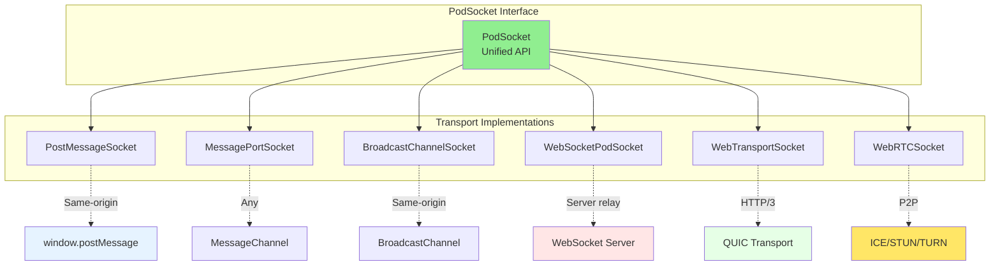
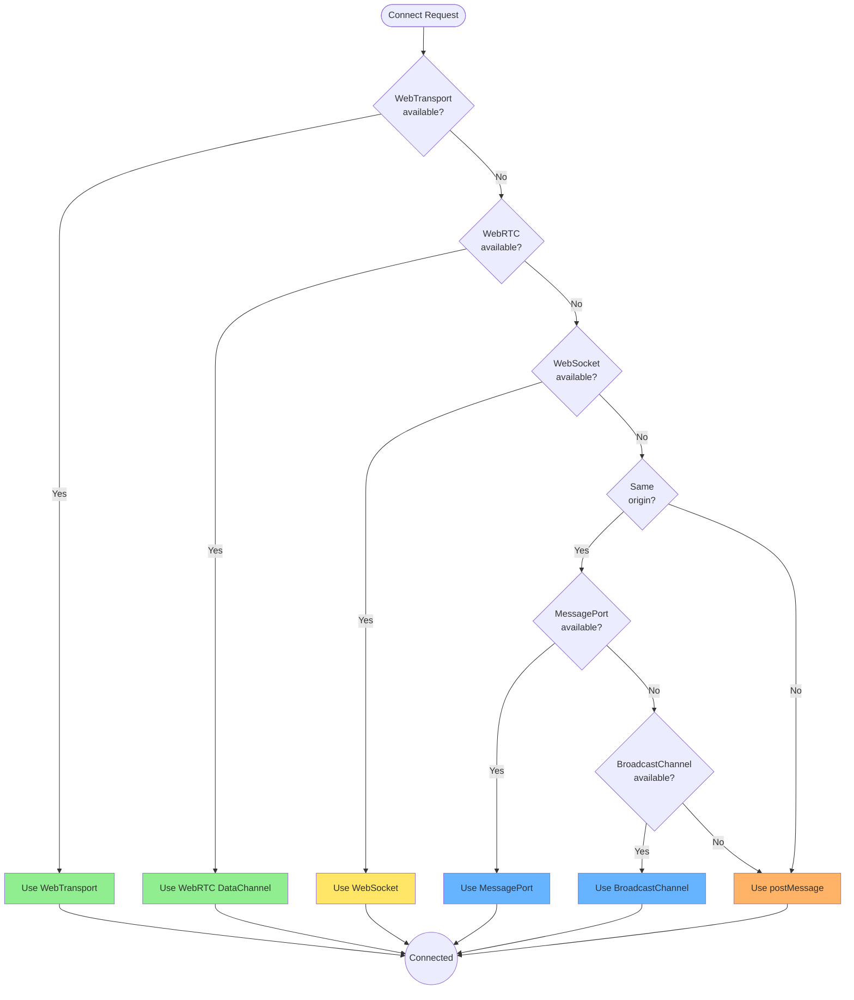

# PodSocket Abstraction

A unified socket abstraction for all browser communication channels.

**Related specs**: [link-negotiation.md](link-negotiation.md) | [session-keys.md](../crypto/session-keys.md) | [message-envelope.md](message-envelope.md)

## 1. Overview

PodSocket provides a consistent interface regardless of the underlying transport:
- postMessage
- MessagePort
- BroadcastChannel
- WebSocket
- WebTransport
- WebRTC DataChannel



## 2. Interface

```typescript
interface PodSocket {
  // Identity
  readonly id: string;
  readonly localPodId: string;
  readonly remotePodId: string;

  // State
  readonly readyState: PodSocketState;
  readonly transport: TransportType;

  // Events
  onopen: ((event: Event) => void) | null;
  onclose: ((event: CloseEvent) => void) | null;
  onerror: ((event: ErrorEvent) => void) | null;
  onmessage: ((event: MessageEvent) => void) | null;

  // Methods
  send(data: Uint8Array | MeshEnvelope): void;
  close(code?: number, reason?: string): void;

  // Stream support (optional)
  readonly readable?: ReadableStream<Uint8Array>;
  readonly writable?: WritableStream<Uint8Array>;

  // Upgrade
  upgrade(transport: TransportType): Promise<PodSocket>;

  // Metrics
  readonly metrics: SocketMetrics;
}

type PodSocketState = 'connecting' | 'open' | 'closing' | 'closed';

type TransportType =
  | 'post-message'
  | 'message-port'
  | 'broadcast-channel'
  | 'websocket'
  | 'webtransport'
  | 'webrtc-data';

interface SocketMetrics {
  messagesSent: number;
  messagesReceived: number;
  bytesSent: number;
  bytesReceived: number;
  latencyMs: number;
  lastActivity: number;
}

interface CloseEvent {
  code: number;
  reason: string;
  wasClean: boolean;
}
```

## 3. Factory

### Transport Selection



```typescript
class PodSocketFactory {
  // Create socket for specific transport
  static create(
    transport: TransportType,
    options: SocketOptions
  ): PodSocket {
    switch (transport) {
      case 'post-message':
        return new PostMessageSocket(options);
      case 'message-port':
        return new MessagePortSocket(options);
      case 'broadcast-channel':
        return new BroadcastChannelSocket(options);
      case 'websocket':
        return new WebSocketPodSocket(options);
      case 'webtransport':
        return new WebTransportSocket(options);
      case 'webrtc-data':
        return new WebRTCSocket(options);
      default:
        throw new Error(`Unknown transport: ${transport}`);
    }
  }

  // Auto-select best transport
  static async connect(
    localPod: PodIdentity,
    remotePod: PodIdentity,
    options?: ConnectOptions
  ): Promise<PodSocket> {
    // Negotiate best transport
    const transport = await this.negotiateTransport(localPod, remotePod);
    return this.create(transport, {
      localPodId: localPod.id,
      remotePodId: remotePod.id,
      ...options,
    });
  }

  private static async negotiateTransport(
    local: PodIdentity,
    remote: PodIdentity
  ): Promise<TransportType> {
    const localCaps = local.capabilities.channels;
    const remoteCaps = remote.capabilities.channels;
    const sameOrigin = local.origin === remote.origin;

    // Priority order
    if (localCaps.webTransport && remoteCaps.webTransport) {
      return 'webtransport';
    }
    if (localCaps.webRTC?.dataChannel && remoteCaps.webRTC?.dataChannel) {
      return 'webrtc-data';
    }
    if (localCaps.webSocket && remoteCaps.webSocket) {
      return 'websocket';
    }
    if (sameOrigin && localCaps.messagePort && remoteCaps.messagePort) {
      return 'message-port';
    }
    if (sameOrigin && localCaps.broadcastChannel && remoteCaps.broadcastChannel) {
      return 'broadcast-channel';
    }

    return 'post-message';
  }
}

interface SocketOptions {
  localPodId: string;
  remotePodId: string;
  targetWindow?: Window;
  targetOrigin?: string;
  port?: MessagePort;
  url?: string;
  channel?: string;
}

interface ConnectOptions {
  timeout?: number;
  preferredTransport?: TransportType;
}
```

## 4. PostMessage Implementation

```typescript
class PostMessageSocket implements PodSocket {
  readonly id = crypto.randomUUID();
  readonly transport: TransportType = 'post-message';

  private _readyState: PodSocketState = 'connecting';
  private targetWindow: Window;
  private targetOrigin: string;
  private _metrics: SocketMetrics;

  onopen: ((event: Event) => void) | null = null;
  onclose: ((event: CloseEvent) => void) | null = null;
  onerror: ((event: ErrorEvent) => void) | null = null;
  onmessage: ((event: MessageEvent) => void) | null = null;

  constructor(private options: SocketOptions) {
    this.targetWindow = options.targetWindow || window.parent;
    this.targetOrigin = options.targetOrigin || '*';
    this._metrics = this.initMetrics();

    this.setupListener();
    this.open();
  }

  get localPodId(): string { return this.options.localPodId; }
  get remotePodId(): string { return this.options.remotePodId; }
  get readyState(): PodSocketState { return this._readyState; }
  get metrics(): SocketMetrics { return this._metrics; }

  private setupListener(): void {
    window.addEventListener('message', (event) => {
      if (event.origin !== this.targetOrigin && this.targetOrigin !== '*') {
        return;
      }

      const data = event.data;
      if (!data || data.to !== this.localPodId) {
        return;
      }

      this._metrics.messagesReceived++;
      this._metrics.bytesReceived += JSON.stringify(data).length;
      this._metrics.lastActivity = Date.now();

      if (this.onmessage) {
        this.onmessage(new MessageEvent('message', { data }));
      }
    });
  }

  private open(): void {
    // Send connection request
    this.targetWindow.postMessage({
      type: 'MESH_SOCKET_OPEN',
      socketId: this.id,
      from: this.localPodId,
      to: this.remotePodId,
    }, this.targetOrigin);

    this._readyState = 'open';
    if (this.onopen) {
      this.onopen(new Event('open'));
    }
  }

  send(data: Uint8Array | MeshEnvelope): void {
    if (this._readyState !== 'open') {
      throw new Error('Socket is not open');
    }

    const message = data instanceof Uint8Array
      ? { type: 'MESH_DATA', payload: Array.from(data) }
      : data;

    this.targetWindow.postMessage({
      ...message,
      socketId: this.id,
      from: this.localPodId,
      to: this.remotePodId,
    }, this.targetOrigin);

    this._metrics.messagesSent++;
    this._metrics.bytesSent += JSON.stringify(message).length;
    this._metrics.lastActivity = Date.now();
  }

  close(code = 1000, reason = ''): void {
    this._readyState = 'closing';

    this.targetWindow.postMessage({
      type: 'MESH_SOCKET_CLOSE',
      socketId: this.id,
      code,
      reason,
    }, this.targetOrigin);

    this._readyState = 'closed';
    if (this.onclose) {
      this.onclose({ code, reason, wasClean: true });
    }
  }

  async upgrade(transport: TransportType): Promise<PodSocket> {
    // Request upgrade
    const newSocket = await PodSocketFactory.create(transport, {
      ...this.options,
    });

    // Close old socket
    this.close(1000, 'upgrading');

    return newSocket;
  }

  private initMetrics(): SocketMetrics {
    return {
      messagesSent: 0,
      messagesReceived: 0,
      bytesSent: 0,
      bytesReceived: 0,
      latencyMs: 0,
      lastActivity: Date.now(),
    };
  }
}
```

## 5. MessagePort Implementation

```typescript
class MessagePortSocket implements PodSocket {
  readonly id = crypto.randomUUID();
  readonly transport: TransportType = 'message-port';

  private port: MessagePort;
  private _readyState: PodSocketState = 'connecting';
  private _metrics: SocketMetrics;

  onopen: ((event: Event) => void) | null = null;
  onclose: ((event: CloseEvent) => void) | null = null;
  onerror: ((event: ErrorEvent) => void) | null = null;
  onmessage: ((event: MessageEvent) => void) | null = null;

  constructor(private options: SocketOptions) {
    if (options.port) {
      this.port = options.port;
    } else {
      throw new Error('MessagePort required');
    }

    this._metrics = this.initMetrics();
    this.setupPort();
  }

  get localPodId(): string { return this.options.localPodId; }
  get remotePodId(): string { return this.options.remotePodId; }
  get readyState(): PodSocketState { return this._readyState; }
  get metrics(): SocketMetrics { return this._metrics; }

  private setupPort(): void {
    this.port.onmessage = (event) => {
      this._metrics.messagesReceived++;
      this._metrics.lastActivity = Date.now();

      if (event.data.type === 'MESH_SOCKET_CLOSE') {
        this.handleClose(event.data);
      } else if (this.onmessage) {
        this.onmessage(event);
      }
    };

    this.port.onmessageerror = (event) => {
      if (this.onerror) {
        this.onerror(new ErrorEvent('error', { message: 'Message error' }));
      }
    };

    this.port.start();
    this._readyState = 'open';

    if (this.onopen) {
      this.onopen(new Event('open'));
    }
  }

  send(data: Uint8Array | MeshEnvelope): void {
    if (this._readyState !== 'open') {
      throw new Error('Socket is not open');
    }

    // Can transfer ArrayBuffers for efficiency
    if (data instanceof Uint8Array) {
      const buffer = data.buffer.slice(
        data.byteOffset,
        data.byteOffset + data.byteLength
      );
      this.port.postMessage(buffer, [buffer]);
    } else {
      this.port.postMessage(data);
    }

    this._metrics.messagesSent++;
    this._metrics.lastActivity = Date.now();
  }

  close(code = 1000, reason = ''): void {
    this._readyState = 'closing';

    this.port.postMessage({
      type: 'MESH_SOCKET_CLOSE',
      code,
      reason,
    });

    this.port.close();
    this._readyState = 'closed';

    if (this.onclose) {
      this.onclose({ code, reason, wasClean: true });
    }
  }

  private handleClose(data: { code: number; reason: string }): void {
    this._readyState = 'closed';
    this.port.close();

    if (this.onclose) {
      this.onclose({
        code: data.code,
        reason: data.reason,
        wasClean: true,
      });
    }
  }

  async upgrade(transport: TransportType): Promise<PodSocket> {
    throw new Error('MessagePort cannot be upgraded');
  }

  private initMetrics(): SocketMetrics {
    return {
      messagesSent: 0,
      messagesReceived: 0,
      bytesSent: 0,
      bytesReceived: 0,
      latencyMs: 0,
      lastActivity: Date.now(),
    };
  }
}
```

## 6. WebRTC DataChannel Implementation

```typescript
class WebRTCSocket implements PodSocket {
  readonly id = crypto.randomUUID();
  readonly transport: TransportType = 'webrtc-data';

  private pc: RTCPeerConnection;
  private dc: RTCDataChannel | null = null;
  private _readyState: PodSocketState = 'connecting';
  private _metrics: SocketMetrics;

  // Stream interfaces
  private _readable?: ReadableStream<Uint8Array>;
  private _writable?: WritableStream<Uint8Array>;

  onopen: ((event: Event) => void) | null = null;
  onclose: ((event: CloseEvent) => void) | null = null;
  onerror: ((event: ErrorEvent) => void) | null = null;
  onmessage: ((event: MessageEvent) => void) | null = null;

  constructor(private options: SocketOptions) {
    this._metrics = this.initMetrics();

    this.pc = new RTCPeerConnection({
      iceServers: [{ urls: 'stun:stun.l.google.com:19302' }],
    });

    this.setupPeerConnection();
  }

  get localPodId(): string { return this.options.localPodId; }
  get remotePodId(): string { return this.options.remotePodId; }
  get readyState(): PodSocketState { return this._readyState; }
  get metrics(): SocketMetrics { return this._metrics; }

  get readable(): ReadableStream<Uint8Array> | undefined {
    return this._readable;
  }

  get writable(): WritableStream<Uint8Array> | undefined {
    return this._writable;
  }

  private setupPeerConnection(): void {
    // Create data channel (initiator)
    this.dc = this.pc.createDataChannel('mesh', {
      ordered: true,
      maxRetransmits: 3,
    });

    this.setupDataChannel(this.dc);

    // Handle incoming data channels (responder)
    this.pc.ondatachannel = (event) => {
      this.dc = event.channel;
      this.setupDataChannel(this.dc);
    };

    this.pc.onconnectionstatechange = () => {
      if (this.pc.connectionState === 'failed') {
        this._readyState = 'closed';
        if (this.onerror) {
          this.onerror(new ErrorEvent('error', {
            message: 'WebRTC connection failed',
          }));
        }
      }
    };
  }

  private setupDataChannel(dc: RTCDataChannel): void {
    dc.binaryType = 'arraybuffer';

    dc.onopen = () => {
      this._readyState = 'open';
      this.setupStreams(dc);
      if (this.onopen) {
        this.onopen(new Event('open'));
      }
    };

    dc.onclose = () => {
      this._readyState = 'closed';
      if (this.onclose) {
        this.onclose({ code: 1000, reason: '', wasClean: true });
      }
    };

    dc.onerror = (event) => {
      if (this.onerror) {
        this.onerror(new ErrorEvent('error', { message: 'DataChannel error' }));
      }
    };

    dc.onmessage = (event) => {
      this._metrics.messagesReceived++;
      this._metrics.bytesReceived += event.data.byteLength || event.data.length;
      this._metrics.lastActivity = Date.now();

      if (this.onmessage) {
        this.onmessage(event);
      }
    };
  }

  private setupStreams(dc: RTCDataChannel): void {
    // Create readable stream
    this._readable = new ReadableStream({
      start: (controller) => {
        dc.onmessage = (event) => {
          const data = event.data instanceof ArrayBuffer
            ? new Uint8Array(event.data)
            : new TextEncoder().encode(event.data);
          controller.enqueue(data);
        };

        dc.onclose = () => controller.close();
        dc.onerror = () => controller.error(new Error('DataChannel error'));
      },
    });

    // Create writable stream
    this._writable = new WritableStream({
      write: (chunk) => {
        dc.send(chunk);
      },
      close: () => {
        dc.close();
      },
    });
  }

  // Signaling interface
  async createOffer(): Promise<RTCSessionDescriptionInit> {
    const offer = await this.pc.createOffer();
    await this.pc.setLocalDescription(offer);
    return offer;
  }

  async handleOffer(offer: RTCSessionDescriptionInit): Promise<RTCSessionDescriptionInit> {
    await this.pc.setRemoteDescription(offer);
    const answer = await this.pc.createAnswer();
    await this.pc.setLocalDescription(answer);
    return answer;
  }

  async handleAnswer(answer: RTCSessionDescriptionInit): Promise<void> {
    await this.pc.setRemoteDescription(answer);
  }

  async addIceCandidate(candidate: RTCIceCandidateInit): Promise<void> {
    await this.pc.addIceCandidate(candidate);
  }

  onIceCandidate(callback: (candidate: RTCIceCandidateInit | null) => void): void {
    this.pc.onicecandidate = (event) => {
      callback(event.candidate?.toJSON() ?? null);
    };
  }

  send(data: Uint8Array | MeshEnvelope): void {
    if (!this.dc || this._readyState !== 'open') {
      throw new Error('Socket is not open');
    }

    const payload = data instanceof Uint8Array
      ? data
      : new TextEncoder().encode(JSON.stringify(data));

    this.dc.send(payload);

    this._metrics.messagesSent++;
    this._metrics.bytesSent += payload.byteLength;
    this._metrics.lastActivity = Date.now();
  }

  close(code = 1000, reason = ''): void {
    this._readyState = 'closing';

    if (this.dc) {
      this.dc.close();
    }
    this.pc.close();

    this._readyState = 'closed';
    if (this.onclose) {
      this.onclose({ code, reason, wasClean: true });
    }
  }

  async upgrade(transport: TransportType): Promise<PodSocket> {
    throw new Error('WebRTC is already the highest transport');
  }

  private initMetrics(): SocketMetrics {
    return {
      messagesSent: 0,
      messagesReceived: 0,
      bytesSent: 0,
      bytesReceived: 0,
      latencyMs: 0,
      lastActivity: Date.now(),
    };
  }
}
```

## 7. Socket Pool

```typescript
class PodSocketPool {
  private sockets: Map<string, PodSocket> = new Map();
  private pendingConnections: Map<string, Promise<PodSocket>> = new Map();

  // Get or create socket to remote pod
  async getSocket(
    localPod: PodIdentity,
    remotePod: PodIdentity
  ): Promise<PodSocket> {
    const key = `${localPod.id}:${remotePod.id}`;

    // Check existing
    const existing = this.sockets.get(key);
    if (existing && existing.readyState === 'open') {
      return existing;
    }

    // Check pending
    const pending = this.pendingConnections.get(key);
    if (pending) {
      return pending;
    }

    // Create new connection
    const promise = PodSocketFactory.connect(localPod, remotePod);
    this.pendingConnections.set(key, promise);

    try {
      const socket = await promise;
      this.sockets.set(key, socket);

      socket.onclose = () => {
        this.sockets.delete(key);
      };

      return socket;
    } finally {
      this.pendingConnections.delete(key);
    }
  }

  // Close all sockets
  closeAll(): void {
    for (const socket of this.sockets.values()) {
      socket.close();
    }
    this.sockets.clear();
  }

  // Get metrics for all sockets
  getMetrics(): Map<string, SocketMetrics> {
    const metrics = new Map<string, SocketMetrics>();
    for (const [key, socket] of this.sockets) {
      metrics.set(key, socket.metrics);
    }
    return metrics;
  }
}
```
