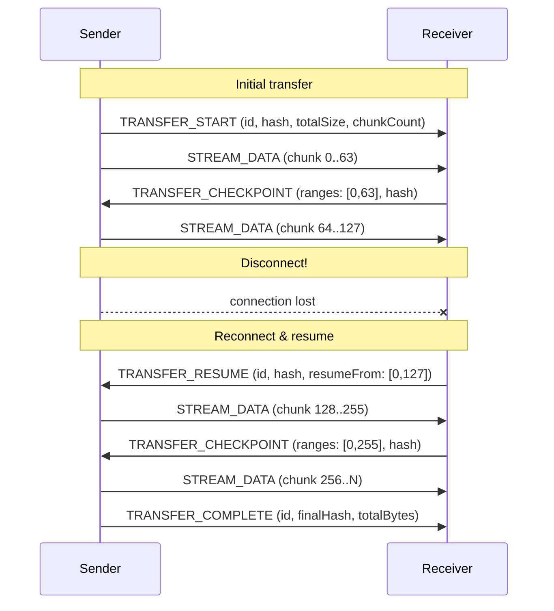
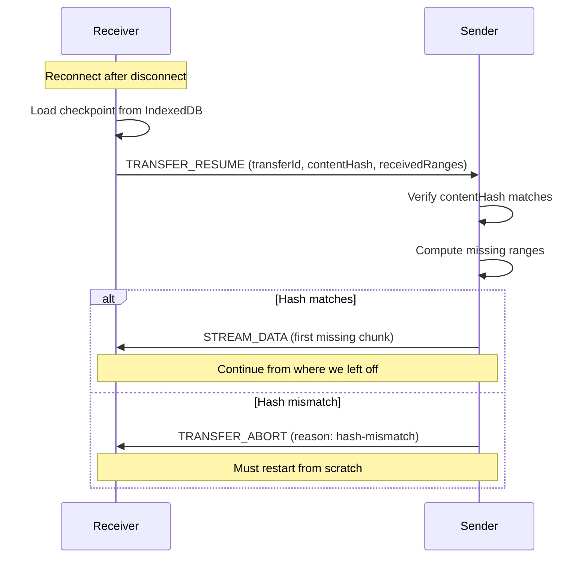

# Resumable Transfer

Checkpoint-and-resume protocol for large data transfers that survive disconnections.

**Related specs**: [streaming-protocol.md](streaming-protocol.md) | [wire-format.md](../core/wire-format.md) | [session-resumption.md](session-resumption.md) | [channel-abstraction.md](channel-abstraction.md)

## 1. Overview

[streaming-protocol.md](streaming-protocol.md) provides chunk-based streaming with backpressure but has no checkpoint mechanism. If a connection drops mid-transfer, the entire stream must restart from byte zero. This spec adds:

- Transfer-level checkpoints with range tracking
- Resume protocol using content hash verification
- Per-chunk integrity via SHA-256
- IndexedDB-based checkpoint persistence
- Wraps STREAM_START/STREAM_DATA for backward compatibility



## 2. Wire Format Messages

Resumable transfer messages use type codes 0x17-0x1B, adjacent to the Stream block (0x10-0x16).

```typescript
enum ResumableTransferMessageType {
  TRANSFER_START      = 0x17,
  TRANSFER_CHECKPOINT = 0x18,
  TRANSFER_RESUME     = 0x19,
  TRANSFER_COMPLETE   = 0x1A,
  TRANSFER_ABORT      = 0x1B,
}
```

### 2.1 TRANSFER_START (0x17)

Initiates a resumable transfer.

```typescript
interface TransferStartMessage {
  t: 0x17;
  p: {
    transferId: string;           // Unique transfer identifier
    contentHash: Uint8Array;      // SHA-256 of full content
    totalSize: number;            // Total bytes
    chunkCount: number;           // Total number of chunks
    chunkSize: number;            // Bytes per chunk (last chunk may be smaller)
    checkpointInterval: number;   // Checkpoint every N chunks
    metadata?: Record<string, unknown>;  // Application metadata
  };
}
```

### 2.2 TRANSFER_CHECKPOINT (0x18)

Receiver acknowledges received ranges. Sent every `checkpointInterval` chunks.

```typescript
interface TransferCheckpointMessage {
  t: 0x18;
  p: {
    transferId: string;
    receivedRanges: [number, number][];  // Sorted non-overlapping [start, end] inclusive
    lastSeq: number;                     // Last sequence number received
    checkpointHash: Uint8Array;          // SHA-256 of received data so far
  };
}
```

### 2.3 TRANSFER_RESUME (0x19)

Receiver requests transfer continuation after reconnection.

```typescript
interface TransferResumeMessage {
  t: 0x19;
  p: {
    transferId: string;
    contentHash: Uint8Array;               // Must match original
    resumeFrom: [number, number][];        // Already-received ranges
    sessionTicket?: Uint8Array;            // Optional session resumption ticket
  };
}
```

### 2.4 TRANSFER_COMPLETE (0x1A)

Sender signals all chunks sent. Receiver verifies final hash.

```typescript
interface TransferCompleteMessage {
  t: 0x1A;
  p: {
    transferId: string;
    finalHash: Uint8Array;      // SHA-256 of complete content
    totalBytes: number;         // Actual bytes transferred
    transferDuration: number;   // Total time including pauses (ms)
  };
}
```

### 2.5 TRANSFER_ABORT (0x1B)

Either side aborts the transfer.

```typescript
interface TransferAbortMessage {
  t: 0x1B;
  p: {
    transferId: string;
    reason: 'cancelled' | 'hash-mismatch' | 'timeout' | 'storage-full' | 'error';
    lastCheckpoint?: TransferCheckpointMessage['p'];
  };
}
```

## 3. Transfer Context

```typescript
interface TransferContext {
  /** Unique transfer identifier */
  transferId: string;

  /** SHA-256 of the complete content */
  contentHash: Uint8Array;

  /** Total size in bytes */
  totalSize: number;

  /** Total number of chunks */
  chunkCount: number;

  /** Bytes per chunk (default: 16384) */
  chunkSize: number;

  /** Checkpoint every N chunks (default: 64) */
  checkpointInterval: number;

  /** Transfer state */
  state: TransferState;

  /** Timestamp of transfer start */
  startedAt: number;

  /** Timestamp of last activity */
  lastActivityAt: number;
}

type TransferState =
  | 'pending'
  | 'active'
  | 'paused'
  | 'resuming'
  | 'completing'
  | 'completed'
  | 'aborted';
```

## 4. Checkpoint Management

### 4.1 Range Tracking

Received ranges are tracked as sorted, non-overlapping inclusive `[start, end]` arrays:

```typescript
class RangeTracker {
  private ranges: [number, number][] = [];

  /** Add a received chunk index */
  add(index: number): void {
    this.ranges.push([index, index]);
    this.merge();
  }

  /** Add a contiguous range of chunk indices */
  addRange(start: number, end: number): void {
    this.ranges.push([start, end]);
    this.merge();
  }

  /** Merge overlapping and adjacent ranges */
  private merge(): void {
    if (this.ranges.length <= 1) return;

    this.ranges.sort((a, b) => a[0] - b[0]);
    const merged: [number, number][] = [this.ranges[0]];

    for (let i = 1; i < this.ranges.length; i++) {
      const last = merged[merged.length - 1];
      const current = this.ranges[i];

      if (current[0] <= last[1] + 1) {
        last[1] = Math.max(last[1], current[1]);
      } else {
        merged.push(current);
      }
    }

    this.ranges = merged;
  }

  /** Get first missing chunk index */
  firstMissing(total: number): number | null {
    if (this.ranges.length === 0) return 0;
    if (this.ranges[0][0] > 0) return 0;

    for (let i = 0; i < this.ranges.length - 1; i++) {
      if (this.ranges[i][1] + 1 < this.ranges[i + 1][0]) {
        return this.ranges[i][1] + 1;
      }
    }

    const lastEnd = this.ranges[this.ranges.length - 1][1];
    return lastEnd < total - 1 ? lastEnd + 1 : null;
  }

  /** Check if all chunks received */
  isComplete(total: number): boolean {
    return this.ranges.length === 1 &&
           this.ranges[0][0] === 0 &&
           this.ranges[0][1] === total - 1;
  }

  /** Export ranges for wire format */
  toRanges(): [number, number][] {
    return [...this.ranges];
  }

  /** Total chunks received */
  get receivedCount(): number {
    return this.ranges.reduce((sum, [s, e]) => sum + (e - s + 1), 0);
  }
}
```

### 4.2 Checkpoint Hash

The checkpoint hash covers all received data in order:

```typescript
async function computeCheckpointHash(
  chunks: Map<number, Uint8Array>,
  ranges: [number, number][]
): Promise<Uint8Array> {
  const hasher = new Uint8Array(0); // Incremental SHA-256
  const ordered: Uint8Array[] = [];

  for (const [start, end] of ranges) {
    for (let i = start; i <= end; i++) {
      const chunk = chunks.get(i);
      if (chunk) ordered.push(chunk);
    }
  }

  const combined = concatBuffers(ordered);
  const hash = await crypto.subtle.digest('SHA-256', combined);
  return new Uint8Array(hash);
}
```

## 5. Resume Protocol



### Resume Handler (Sender Side)

```typescript
class ResumableTransferSender {
  private content: Uint8Array;
  private context: TransferContext;

  async handleResume(msg: TransferResumeMessage): Promise<void> {
    // Verify content hash matches
    if (!arraysEqual(msg.p.contentHash, this.context.contentHash)) {
      await this.abort('hash-mismatch');
      return;
    }

    // Compute missing ranges from received ranges
    const received = new RangeTracker();
    for (const [start, end] of msg.p.resumeFrom) {
      received.addRange(start, end);
    }

    // Send missing chunks
    this.context.state = 'active';
    for (let i = 0; i < this.context.chunkCount; i++) {
      if (!received.contains(i)) {
        const chunkData = this.getChunk(i);
        await this.sendChunk(i, chunkData);
      }
    }
  }

  private getChunk(index: number): Uint8Array {
    const start = index * this.context.chunkSize;
    const end = Math.min(start + this.context.chunkSize, this.content.length);
    return this.content.slice(start, end);
  }
}
```

## 6. Chunk-Level Integrity

Each chunk sent via STREAM_DATA includes a SHA-256 hash for selective retransmission:

```typescript
interface ResumableChunkMetadata {
  /** Chunk sequence index */
  seq: number;

  /** SHA-256 of this chunk's data */
  chunkHash: Uint8Array;

  /** Transfer ID this chunk belongs to */
  transferId: string;
}

class ChunkVerifier {
  async verifyChunk(data: Uint8Array, expectedHash: Uint8Array): Promise<boolean> {
    const hash = new Uint8Array(
      await crypto.subtle.digest('SHA-256', data)
    );
    return arraysEqual(hash, expectedHash);
  }

  /** Request retransmission of a corrupted chunk */
  async requestRetransmit(transferId: string, seq: number): Promise<void> {
    // Send a checkpoint with a gap at the corrupted chunk
    // Sender will retransmit the missing range
  }
}
```

## 7. CheckpointStore

IndexedDB persistence for surviving page reload:

```typescript
interface CheckpointRecord {
  transferId: string;
  contentHash: Uint8Array;
  totalSize: number;
  chunkCount: number;
  chunkSize: number;
  receivedRanges: [number, number][];
  receivedChunks: Map<number, Uint8Array>;
  checkpointHash: Uint8Array;
  createdAt: number;
  updatedAt: number;
}

class CheckpointStore {
  private db: IDBDatabase;
  private readonly DB_NAME = 'browsermesh-transfers';
  private readonly STORE_NAME = 'checkpoints';

  async open(): Promise<void> {
    this.db = await new Promise((resolve, reject) => {
      const request = indexedDB.open(this.DB_NAME, 1);
      request.onupgradeneeded = () => {
        const db = request.result;
        if (!db.objectStoreNames.contains(this.STORE_NAME)) {
          const store = db.createObjectStore(this.STORE_NAME, { keyPath: 'transferId' });
          store.createIndex('updatedAt', 'updatedAt');
        }
      };
      request.onsuccess = () => resolve(request.result);
      request.onerror = () => reject(request.error);
    });
  }

  /** Save a checkpoint */
  async save(record: CheckpointRecord): Promise<void> {
    record.updatedAt = Date.now();
    const tx = this.db.transaction(this.STORE_NAME, 'readwrite');
    await tx.objectStore(this.STORE_NAME).put(record);
  }

  /** Load a checkpoint by transfer ID */
  async load(transferId: string): Promise<CheckpointRecord | null> {
    const tx = this.db.transaction(this.STORE_NAME, 'readonly');
    const result = await tx.objectStore(this.STORE_NAME).get(transferId);
    return result ?? null;
  }

  /** Delete a completed transfer's checkpoint */
  async delete(transferId: string): Promise<void> {
    const tx = this.db.transaction(this.STORE_NAME, 'readwrite');
    await tx.objectStore(this.STORE_NAME).delete(transferId);
  }

  /** List active (incomplete) transfers */
  async listActive(): Promise<CheckpointRecord[]> {
    const tx = this.db.transaction(this.STORE_NAME, 'readonly');
    const all = await tx.objectStore(this.STORE_NAME).getAll();
    return all.filter(r => {
      const tracker = new RangeTracker();
      for (const [s, e] of r.receivedRanges) tracker.addRange(s, e);
      return !tracker.isComplete(r.chunkCount);
    });
  }

  /** Remove stale checkpoints older than maxAge (ms) */
  async prune(maxAge: number = 86_400_000): Promise<number> {
    const cutoff = Date.now() - maxAge;
    const tx = this.db.transaction(this.STORE_NAME, 'readwrite');
    const store = tx.objectStore(this.STORE_NAME);
    const index = store.index('updatedAt');
    const range = IDBKeyRange.upperBound(cutoff);

    let pruned = 0;
    const cursor = await index.openCursor(range);
    while (cursor) {
      await cursor.delete();
      pruned++;
      await cursor.continue();
    }
    return pruned;
  }
}
```

## 8. Integration with Streaming Protocol

Resumable transfer wraps the existing streaming protocol messages:

```typescript
class ResumableTransfer {
  private stream: MeshStream;
  private checkpointStore: CheckpointStore;
  private rangeTracker: RangeTracker;

  /**
   * Start a resumable transfer.
   * Uses STREAM_START from streaming-protocol.md under the hood,
   * with TRANSFER_START as the first payload to establish context.
   */
  async start(content: Uint8Array, metadata?: Record<string, unknown>): Promise<void> {
    const contentHash = new Uint8Array(
      await crypto.subtle.digest('SHA-256', content)
    );
    const chunkCount = Math.ceil(content.length / this.chunkSize);

    // Send TRANSFER_START
    await this.send({
      t: ResumableTransferMessageType.TRANSFER_START,
      p: {
        transferId: this.transferId,
        contentHash,
        totalSize: content.length,
        chunkCount,
        chunkSize: this.chunkSize,
        checkpointInterval: this.checkpointInterval,
        metadata,
      },
    });

    // Send chunks via STREAM_DATA
    for (let i = 0; i < chunkCount; i++) {
      const start = i * this.chunkSize;
      const end = Math.min(start + this.chunkSize, content.length);
      const chunkData = content.slice(start, end);
      const chunkHash = new Uint8Array(
        await crypto.subtle.digest('SHA-256', chunkData)
      );

      await this.stream.write(chunkData, {
        seq: i,
        chunkHash,
        transferId: this.transferId,
      });

      // Wait for checkpoint acknowledgment at intervals
      if ((i + 1) % this.checkpointInterval === 0) {
        await this.waitForCheckpoint();
      }
    }

    // Send TRANSFER_COMPLETE
    await this.send({
      t: ResumableTransferMessageType.TRANSFER_COMPLETE,
      p: {
        transferId: this.transferId,
        finalHash: contentHash,
        totalBytes: content.length,
        transferDuration: Date.now() - this.startedAt,
      },
    });
  }
}
```

### Size Limit Extension

Standard streaming-protocol has a 256 MB limit per stream. Resumable mode extends this to 4 GB by using `TRANSFER_START.totalSize` as the authoritative size:

| Mode | Max Size |
|------|----------|
| Standard stream | 256 MB |
| Resumable transfer | 4 GB |

## 9. Limits

| Resource | Limit |
|----------|-------|
| Max transfer size | 4 GB |
| Max concurrent resumable transfers | 4 |
| Checkpoint interval | 64-1024 chunks |
| Default chunk size | 16 KB |
| Resume window | 24 hours |
| Max buffered chunks (receiver) | 256 |
| Checkpoint storage quota | 100 MB |
| Stale checkpoint prune age | 24 hours |
| Chunk hash algorithm | SHA-256 |
| Transfer ID format | UUID v4 |
