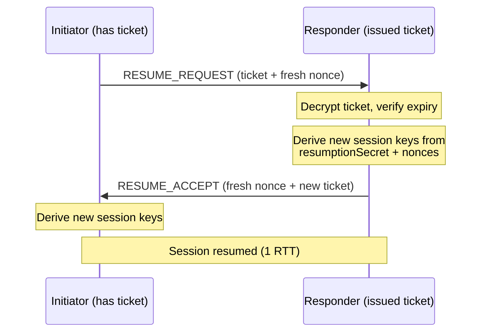
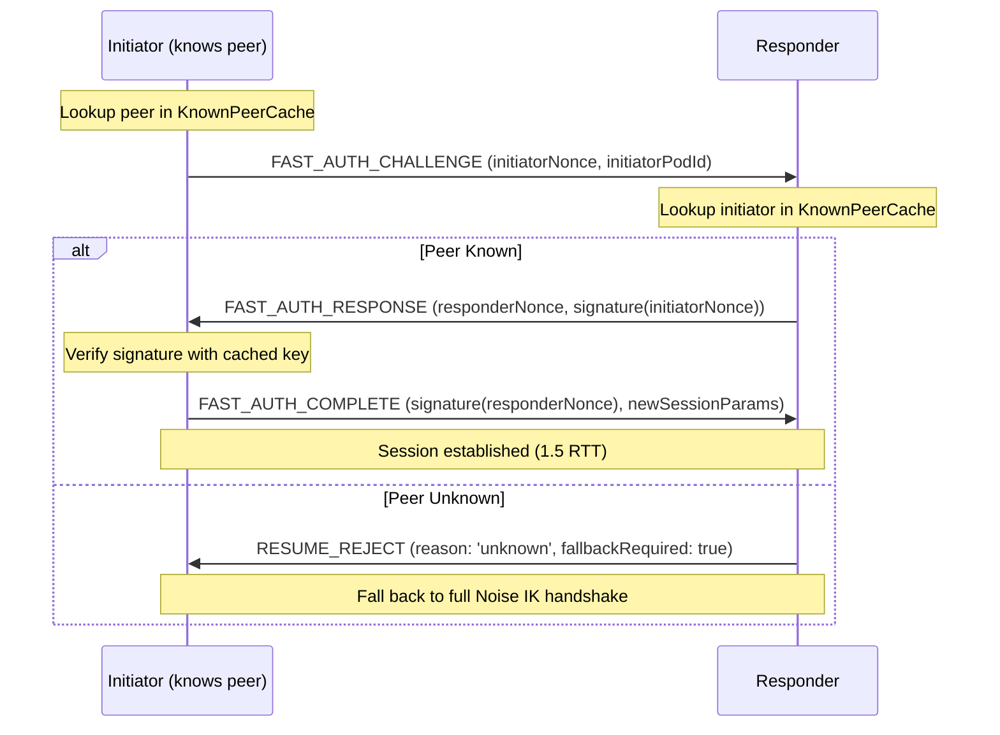
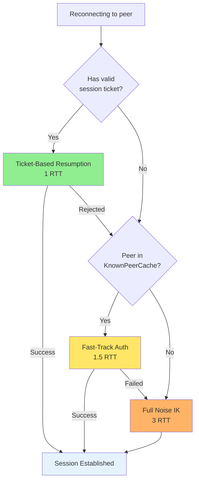

# Session Resumption

Abbreviated reconnection for BrowserMesh sessions.

**Related specs**: [session-keys.md](../crypto/session-keys.md) | [wire-format.md](../core/wire-format.md) | [channel-abstraction.md](channel-abstraction.md) | [pod-migration.md](../coordination/pod-migration.md)

## 1. Overview

Every reconnection currently repeats the full 3-way Noise IK DH handshake (see [session-keys.md](../crypto/session-keys.md)). This spec adds abbreviated reconnection using session tickets:

- 1-RTT resumption vs 3-RTT full handshake
- Encrypted session tickets with expiry
- Forward secrecy via fresh nonce exchange
- Fallback to full handshake on ticket rejection

## 2. Session Ticket

A session ticket is an encrypted blob that captures enough state to re-derive session keys without repeating the full DH exchange.

```typescript
interface SessionTicket {
  /** Ticket version */
  version: 1;

  /** Unique ticket identifier */
  ticketId: Uint8Array;         // 16 bytes

  /** Session ID this ticket resumes */
  sessionId: Uint8Array;        // 16 bytes

  /** Peer identity (Ed25519 public key) */
  peerIdentity: Uint8Array;     // 32 bytes

  /** Resumption secret (derived from original handshake) */
  resumptionSecret: Uint8Array; // 32 bytes

  /** Creation timestamp */
  issuedAt: number;

  /** Expiry timestamp */
  expiresAt: number;

  /** Negotiated features from original session */
  features: number;
}
```

### Ticket Encryption

Tickets are encrypted with a server-side ticket key that rotates periodically. The peer never sees the plaintext ticket contents — they store and present the opaque blob.

```typescript
class TicketManager {
  private ticketKey: CryptoKey;
  private previousTicketKey?: CryptoKey;
  private keyRotatedAt: number = 0;

  /** Issue a ticket after successful handshake */
  async issueTicket(session: SessionContext): Promise<Uint8Array> {
    const ticket: SessionTicket = {
      version: 1,
      ticketId: crypto.getRandomValues(new Uint8Array(16)),
      sessionId: session.id,
      peerIdentity: session.remoteIdentity,
      resumptionSecret: await this.deriveResumptionSecret(session),
      issuedAt: Date.now(),
      expiresAt: Date.now() + TICKET_DEFAULTS.ticketLifetime,
      features: session.features,
    };

    return this.encryptTicket(ticket);
  }

  /** Decrypt and validate a presented ticket */
  async validateTicket(encrypted: Uint8Array): Promise<SessionTicket | null> {
    // Try current key first, then previous key
    let ticket = await this.decryptTicket(encrypted, this.ticketKey);
    if (!ticket && this.previousTicketKey) {
      ticket = await this.decryptTicket(encrypted, this.previousTicketKey);
    }
    if (!ticket) return null;

    // Check expiry
    if (Date.now() > ticket.expiresAt) return null;

    return ticket;
  }

  private async deriveResumptionSecret(session: SessionContext): Promise<Uint8Array> {
    const hkdfKey = await crypto.subtle.importKey(
      'raw', session.handshakeHash, 'HKDF', false, ['deriveBits']
    );

    const bits = await crypto.subtle.deriveBits(
      {
        name: 'HKDF',
        hash: 'SHA-256',
        salt: new Uint8Array(0),
        info: new TextEncoder().encode('resumption'),
      },
      hkdfKey,
      256
    );

    return new Uint8Array(bits);
  }

  private async encryptTicket(ticket: SessionTicket): Promise<Uint8Array> {
    const plaintext = cbor.encode(ticket);
    const nonce = crypto.getRandomValues(new Uint8Array(12));

    const ciphertext = await crypto.subtle.encrypt(
      { name: 'AES-GCM', iv: nonce },
      this.ticketKey,
      plaintext
    );

    return concat(nonce, new Uint8Array(ciphertext));
  }

  private async decryptTicket(
    encrypted: Uint8Array,
    key: CryptoKey
  ): Promise<SessionTicket | null> {
    try {
      const nonce = encrypted.subarray(0, 12);
      const ciphertext = encrypted.subarray(12);

      const plaintext = await crypto.subtle.decrypt(
        { name: 'AES-GCM', iv: nonce },
        key,
        ciphertext
      );

      return cbor.decode(new Uint8Array(plaintext));
    } catch {
      return null;
    }
  }
}
```

## 3. Resumption Protocol



### Comparison with Full Handshake

| Property | Full Handshake | Resumption |
|----------|---------------|------------|
| Round trips | 3 RTT | 1 RTT |
| DH operations | 4 | 0 |
| Forward secrecy | Per-session ephemeral | Per-resumption nonce |
| Identity verification | Full | Ticket-bound |

## 4. Wire Format Messages

Resumption messages reuse type codes in the Handshake block:

```typescript
enum ResumptionMessageType {
  RESUME_REQUEST = 0x06,
  RESUME_ACCEPT  = 0x07,
  RESUME_REJECT  = 0x08,
}
```

> These extend the Handshake (0x0*) block after UPGRADE_ACK (0x05).

### 4.1 RESUME_REQUEST (0x06)

```typescript
interface ResumeRequestMessage extends MessageEnvelope {
  t: 0x06;
  p: {
    ticket: Uint8Array;          // Encrypted session ticket
    clientNonce: Uint8Array;     // 32-byte fresh random nonce
    timestamp: number;
  };
}
```

### 4.2 RESUME_ACCEPT (0x07)

```typescript
interface ResumeAcceptMessage extends MessageEnvelope {
  t: 0x07;
  p: {
    serverNonce: Uint8Array;     // 32-byte fresh random nonce
    newTicket: Uint8Array;       // Replacement ticket for next resumption
    sessionId: Uint8Array;       // Resumed session ID
  };
}
```

### 4.3 RESUME_REJECT (0x08)

```typescript
interface ResumeRejectMessage extends MessageEnvelope {
  t: 0x08;
  p: {
    reason: 'expired' | 'invalid' | 'revoked' | 'unknown';
    fallbackRequired: boolean;   // True: must do full handshake
  };
}
```

## 5. Key Derivation on Resume

New session keys are derived from the resumption secret and both nonces, providing forward secrecy for the resumed session:

```typescript
async function deriveResumedSessionKeys(
  resumptionSecret: Uint8Array,
  clientNonce: Uint8Array,
  serverNonce: Uint8Array
): Promise<{ sendKey: CryptoKey; recvKey: CryptoKey }> {
  const ikm = concat(resumptionSecret, clientNonce, serverNonce);

  const hkdfKey = await crypto.subtle.importKey(
    'raw', ikm, 'HKDF', false, ['deriveKey']
  );

  const [sendKey, recvKey] = await Promise.all([
    crypto.subtle.deriveKey(
      {
        name: 'HKDF',
        hash: 'SHA-256',
        salt: new Uint8Array(0),
        info: new TextEncoder().encode('resumed-send'),
      },
      hkdfKey,
      { name: 'AES-GCM', length: 256 },
      false,
      ['encrypt', 'decrypt']
    ),
    crypto.subtle.deriveKey(
      {
        name: 'HKDF',
        hash: 'SHA-256',
        salt: new Uint8Array(0),
        info: new TextEncoder().encode('resumed-recv'),
      },
      hkdfKey,
      { name: 'AES-GCM', length: 256 },
      false,
      ['encrypt', 'decrypt']
    ),
  ]);

  return { sendKey, recvKey };
}
```

## 6. Ticket Rotation

Tickets are replaced on each successful resumption to limit exposure:

1. After RESUME_ACCEPT, the old ticket is invalidated
2. A new ticket is issued in RESUME_ACCEPT's `newTicket` field
3. The client stores the new ticket for the next resumption
4. If the client loses the ticket, it falls back to full handshake

### Ticket Key Rotation

The server-side ticket encryption key rotates every 12 hours:

```typescript
const TICKET_DEFAULTS = {
  ticketLifetime: 24 * 60 * 60 * 1000,  // 24 hours
  ticketKeyRotation: 12 * 60 * 60 * 1000, // 12 hours
  maxTicketSize: 512,                     // bytes
  maxTicketsPerPeer: 4,                   // Allow a few in-flight
};
```

## 7. Fallback to Full Handshake

If resumption fails (ticket expired, invalid, or revoked), the responder sends RESUME_REJECT with `fallbackRequired: true`. The initiator then performs a full Noise IK handshake (see [session-keys.md](../crypto/session-keys.md)).

```typescript
async function connectWithResumption(
  peer: PeerInfo,
  ticketStore: TicketStore,
  sessionManager: SessionManager,
  channel: PodChannel
): Promise<SessionCrypto> {
  const ticket = ticketStore.getTicket(peer.podId);

  if (ticket) {
    try {
      return await attemptResumption(ticket, channel);
    } catch (e) {
      // Resumption failed — fall through to full handshake
      ticketStore.removeTicket(peer.podId);
    }
  }

  // Full handshake
  return sessionManager.performHandshake(peer.staticKey, channel);
}
```

## 8. Integration with Session Re-Key

Session resumption integrates with the re-key protocol (see [session-keys.md](../crypto/session-keys.md) §9.1):

- Resumed sessions have independent nonce counters (starting from 0)
- Re-key thresholds apply to the resumed session independently
- A re-key during a resumed session produces a new ticket automatically

## 9. Security Properties

| Property | Mechanism |
|----------|-----------|
| Forward secrecy | Fresh nonces mixed into key derivation |
| Replay protection | One-time ticket use; replaced on each resumption |
| Ticket confidentiality | AES-GCM encryption with rotating server key |
| Identity binding | Ticket contains peer identity; verified on presentation |
| Downgrade prevention | Fallback to full handshake preserves all security properties |

## 10. Limits

| Resource | Limit |
|----------|-------|
| Ticket lifetime | 24 hours |
| Ticket key rotation | 12 hours |
| Max ticket size | 512 bytes |
| Max tickets per peer | 4 |
| Resumption timeout | 5 seconds |

## 11. Fast-Track Authentication

For peers that have previously authenticated and established trust, fast-track authentication provides a lighter-weight reconnection path using challenge-response with signed nonces. This is faster than ticket-based resumption when the peer's identity key is already cached.

### 11.1 Wire Format

```typescript
enum FastAuthMessageType {
  FAST_AUTH_CHALLENGE  = 0x09,
  FAST_AUTH_RESPONSE   = 0x0A,
  FAST_AUTH_COMPLETE   = 0x0B,
}
```

> These extend the Handshake (0x0*) block after RESUME_REJECT (0x08).

### 11.2 Known Peer Cache

```typescript
interface KnownPeerEntry {
  /** Peer's Ed25519 public key */
  identityKey: Uint8Array;

  /** Peer's static DH public key (X25519) */
  staticDHKey: Uint8Array;

  /** Trust level based on interaction history */
  trustLevel: 'verified' | 'seen' | 'introduced';

  /** Optional registration receipt (signed proof of prior auth) */
  registrationReceipt?: Uint8Array;

  /** When this entry was last used */
  lastUsed: number;

  /** Entry expiry (TTL-based) */
  expiresAt: number;

  /** Number of successful authentications */
  authCount: number;
}

interface KnownPeerCache {
  get(podId: string): KnownPeerEntry | undefined;
  set(podId: string, entry: KnownPeerEntry): void;
  delete(podId: string): void;
  prune(): void;  // Remove expired entries
}

const KNOWN_PEER_DEFAULTS = {
  maxEntries: 256,
  defaultTTL: 7 * 24 * 60 * 60 * 1000,  // 7 days
  verifiedTTL: 30 * 24 * 60 * 60 * 1000, // 30 days
  seenTTL: 24 * 60 * 60 * 1000,          // 1 day
};
```

### 11.3 Protocol Flow



### 11.4 Message Definitions

```typescript
interface FastAuthChallengeMessage extends MessageEnvelope {
  t: 0x09;
  p: {
    initiatorNonce: Uint8Array;   // 32-byte random nonce
    initiatorPodId: string;       // Initiator's pod ID
    timestamp: number;
  };
}

interface FastAuthResponseMessage extends MessageEnvelope {
  t: 0x0A;
  p: {
    responderNonce: Uint8Array;   // 32-byte random nonce
    challengeSignature: Uint8Array;  // Ed25519 signature over initiatorNonce
    responderPodId: string;
  };
}

interface FastAuthCompleteMessage extends MessageEnvelope {
  t: 0x0B;
  p: {
    responseSignature: Uint8Array;   // Ed25519 signature over responderNonce
    sessionParams: {
      sessionId: Uint8Array;         // New session ID
      features: number;              // Negotiated features
    };
  };
}
```

### 11.5 Key Derivation

After fast-track auth completes, session keys are derived from both nonces and the known peer's static DH key:

```typescript
async function deriveFastTrackSessionKeys(
  localStaticDH: CryptoKeyPair,
  remoteStaticDHPublic: CryptoKey,
  initiatorNonce: Uint8Array,
  responderNonce: Uint8Array
): Promise<{ sendKey: CryptoKey; recvKey: CryptoKey }> {
  // Perform static-static DH
  const sharedSecret = await crypto.subtle.deriveBits(
    { name: 'X25519', public: remoteStaticDHPublic },
    localStaticDH.privateKey,
    256
  );

  const ikm = concat(
    new Uint8Array(sharedSecret),
    initiatorNonce,
    responderNonce
  );

  const hkdfKey = await crypto.subtle.importKey(
    'raw', ikm, 'HKDF', false, ['deriveKey']
  );

  const [sendKey, recvKey] = await Promise.all([
    crypto.subtle.deriveKey(
      {
        name: 'HKDF',
        hash: 'SHA-256',
        salt: new Uint8Array(0),
        info: new TextEncoder().encode('fast-track-send'),
      },
      hkdfKey,
      { name: 'AES-GCM', length: 256 },
      false,
      ['encrypt', 'decrypt']
    ),
    crypto.subtle.deriveKey(
      {
        name: 'HKDF',
        hash: 'SHA-256',
        salt: new Uint8Array(0),
        info: new TextEncoder().encode('fast-track-recv'),
      },
      hkdfKey,
      { name: 'AES-GCM', length: 256 },
      false,
      ['encrypt', 'decrypt']
    ),
  ]);

  return { sendKey, recvKey };
}
```

### 11.6 Reconnection Decision Tree



### 11.7 Comparison

| Method | RTT | DH Ops | Forward Secrecy | Identity Check |
|--------|-----|--------|-----------------|----------------|
| Ticket-based | 1 | 0 | Per-resumption nonce | Ticket-bound |
| Fast-track | 1.5 | 1 (static-static) | Per-session nonce pair | Signature verification |
| Full Noise IK | 3 | 4 | Per-session ephemeral | Full |

### 11.8 Security Considerations

- Fast-track auth does **not** provide ephemeral forward secrecy (uses static-static DH). If a peer's long-term key is compromised, past fast-track sessions are vulnerable.
- Trust levels gate which peers can use fast-track: only `verified` and `seen` peers are eligible.
- The KnownPeerCache MUST be stored securely (encrypted at rest via identity-persistence.md).
- Challenge nonces MUST be cryptographically random and never reused.
- Signatures bind to specific nonces, preventing replay attacks.
