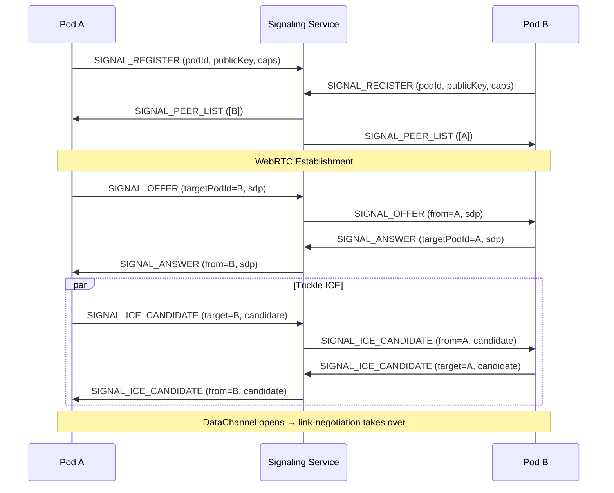
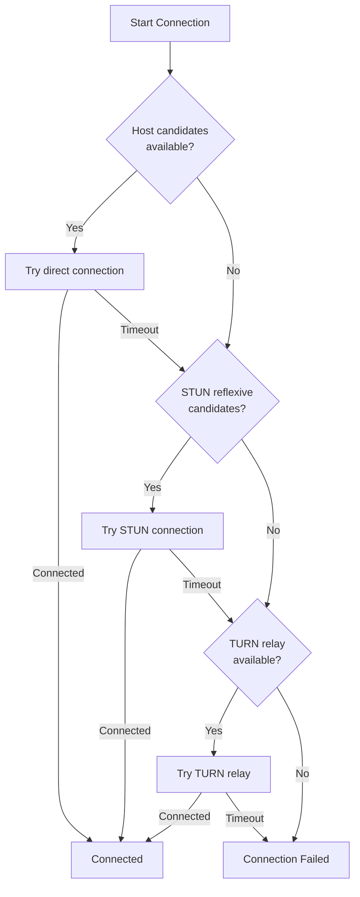
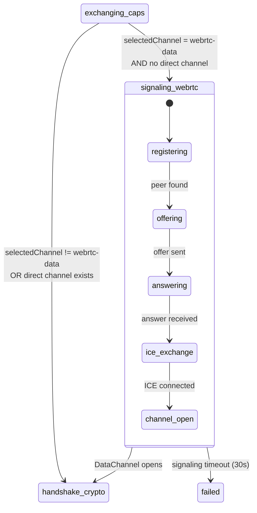

# Signaling Protocol

Pre-connection signaling for WebRTC establishment between pods that have no existing data channel.

**Related specs**: [link-negotiation.md](link-negotiation.md) | [channel-abstraction.md](channel-abstraction.md) | [session-keys.md](../crypto/session-keys.md) | [identity-keys.md](../crypto/identity-keys.md) | [transport-probing.md](transport-probing.md)

## 1. Overview

WebRTC requires SDP offer/answer exchange and ICE candidate relay before a data channel exists. [link-negotiation.md](link-negotiation.md) assumes a channel is already available for the negotiation handshake. This spec defines the signaling layer that bootstraps that first channel:

- SignalingService interface for pluggable signaling transports
- PeerProfile for discoverable peer metadata
- ICE server configuration and rotation
- Trickle ICE candidate exchange protocol
- NAT traversal strategy with fallback chain
- Integration with link-negotiation state machine



## 2. Wire Format Messages

Signaling messages use type codes 0x43-0x48 in the Discovery block.

```typescript
enum SignalingMessageType {
  SIGNAL_REGISTER       = 0x43,
  SIGNAL_OFFER          = 0x44,
  SIGNAL_ANSWER         = 0x45,
  SIGNAL_ICE_CANDIDATE  = 0x46,
  SIGNAL_PEER_LIST      = 0x47,
  SIGNAL_PEER_LEFT      = 0x48,
}
```

### 2.1 SIGNAL_REGISTER (0x43)

Register presence on the signaling service.

```typescript
interface SignalRegisterMessage {
  t: 0x43;
  p: {
    podId: string;
    publicKey: Uint8Array;
    capabilities: string[];
    signalingTransport: SignalingTransportType;
  };
}

type SignalingTransportType = 'websocket' | 'mesh-relay' | 'http-polling';
```

### 2.2 SIGNAL_OFFER (0x44)

SDP offer forwarded to a target peer.

```typescript
interface SignalOfferMessage {
  t: 0x44;
  p: {
    targetPodId: string;
    sdp: string;
    offerHash: Uint8Array;  // SHA-256 of SDP for integrity
  };
}
```

### 2.3 SIGNAL_ANSWER (0x45)

SDP answer in response to an offer.

```typescript
interface SignalAnswerMessage {
  t: 0x45;
  p: {
    targetPodId: string;
    sdp: string;
    answerHash: Uint8Array;  // SHA-256 of SDP for integrity
  };
}
```

### 2.4 SIGNAL_ICE_CANDIDATE (0x46)

ICE candidate trickling.

```typescript
interface SignalIceCandidateMessage {
  t: 0x46;
  p: {
    targetPodId: string;
    candidate: string;       // SDP candidate string
    sdpMLineIndex: number;   // Media line index
    sdpMid?: string;         // Media stream ID
    usernameFragment?: string;
  };
}
```

### 2.5 SIGNAL_PEER_LIST (0x47)

Current peer roster from the signaling service.

```typescript
interface SignalPeerListMessage {
  t: 0x47;
  p: {
    peers: PeerProfile[];
  };
}
```

### 2.6 SIGNAL_PEER_LEFT (0x48)

Notification that a peer has disconnected from signaling.

```typescript
interface SignalPeerLeftMessage {
  t: 0x48;
  p: {
    podId: string;
    reason: 'disconnect' | 'timeout' | 'evicted';
  };
}
```

## 3. PeerProfile

Discoverable metadata for each peer registered on the signaling service.

```typescript
interface PeerProfile {
  /** Pod identity */
  podId: string;
  publicKey: Uint8Array;

  /** Advertised capabilities */
  capabilities: string[];

  /** Presence state (see presence-protocol.md) */
  presence: 'active' | 'idle' | 'away';

  /** How this peer is connected to signaling */
  signalingTransport: SignalingTransportType;

  /** Registration timestamp */
  registeredAt: number;

  /** Last heartbeat timestamp */
  lastSeen: number;
}
```

## 4. SignalingService Interface

```typescript
interface SignalingService {
  /** Connect to the signaling service */
  connect(identity: PodIdentity): Promise<void>;

  /** Disconnect from the signaling service */
  disconnect(): Promise<void>;

  /** Send an SDP offer to a peer */
  sendOffer(targetPodId: string, sdp: RTCSessionDescriptionInit): Promise<void>;

  /** Send an SDP answer to a peer */
  sendAnswer(targetPodId: string, sdp: RTCSessionDescriptionInit): Promise<void>;

  /** Send an ICE candidate to a peer */
  sendCandidate(targetPodId: string, candidate: RTCIceCandidateInit): Promise<void>;

  /** Get current peer list */
  getPeers(): PeerProfile[];

  /** Event handlers */
  on(event: 'offer', handler: (from: string, sdp: RTCSessionDescriptionInit) => void): void;
  on(event: 'answer', handler: (from: string, sdp: RTCSessionDescriptionInit) => void): void;
  on(event: 'candidate', handler: (from: string, candidate: RTCIceCandidateInit) => void): void;
  on(event: 'peer-joined', handler: (peer: PeerProfile) => void): void;
  on(event: 'peer-left', handler: (podId: string, reason: string) => void): void;

  off(event: string, handler: (...args: unknown[]) => void): void;
}
```

## 5. ICE Server Configuration

```typescript
interface IceServerConfig {
  /** STUN server URLs */
  stunUrls: string[];

  /** TURN server URLs with credentials */
  turnServers: TurnServerConfig[];

  /** Credential rotation interval (ms) */
  credentialRotationInterval: number;

  /** Max candidates to gather per type */
  maxCandidatesPerType: number;
}

interface TurnServerConfig {
  urls: string[];
  username: string;
  credential: string;
  credentialType: 'password' | 'oauth';
  expiresAt?: number;
}

const DEFAULT_ICE_CONFIG: IceServerConfig = {
  stunUrls: [
    'stun:stun.l.google.com:19302',
    'stun:stun1.l.google.com:19302',
  ],
  turnServers: [],
  credentialRotationInterval: 3600_000, // 1 hour
  maxCandidatesPerType: 5,
};
```

### 5.1 Credential Rotation

TURN credentials are short-lived. The signaling service provides fresh credentials on connection and rotates them periodically:

```typescript
class IceServerManager {
  private config: IceServerConfig;
  private rotationTimer?: number;

  getIceServers(): RTCIceServer[] {
    const servers: RTCIceServer[] = [];

    // STUN servers (no credentials needed)
    servers.push({ urls: this.config.stunUrls });

    // TURN servers (with credentials)
    for (const turn of this.config.turnServers) {
      if (turn.expiresAt && turn.expiresAt < Date.now()) {
        continue; // Skip expired
      }
      servers.push({
        urls: turn.urls,
        username: turn.username,
        credential: turn.credential,
      });
    }

    return servers;
  }

  async rotateCredentials(): Promise<void> {
    // Request new TURN credentials from signaling service
    const newCredentials = await this.signalingService.requestTurnCredentials();
    this.config.turnServers = newCredentials;
  }
}
```

## 6. Trickle ICE Protocol

ICE candidates are exchanged incrementally as they are discovered, rather than waiting for the full gathering to complete.

### 6.1 Candidate Buffering

Candidates received before `setRemoteDescription()` must be buffered:

```typescript
class TrickleIceHandler {
  private candidateBuffer: RTCIceCandidateInit[] = [];
  private remoteDescriptionSet = false;

  /** Buffer or apply a received candidate */
  async addCandidate(candidate: RTCIceCandidateInit): Promise<void> {
    if (!this.remoteDescriptionSet) {
      this.candidateBuffer.push(candidate);
      return;
    }
    await this.pc.addIceCandidate(new RTCIceCandidate(candidate));
  }

  /** Call after setRemoteDescription to flush buffer */
  async onRemoteDescriptionSet(): Promise<void> {
    this.remoteDescriptionSet = true;
    for (const candidate of this.candidateBuffer) {
      await this.pc.addIceCandidate(new RTCIceCandidate(candidate));
    }
    this.candidateBuffer = [];
  }

  /** Signal end-of-candidates */
  async onEndOfCandidates(): Promise<void> {
    await this.pc.addIceCandidate(null as any);
  }
}
```

### 6.2 Connectivity Check Priority

ICE candidate types are prioritized to prefer direct connections:

| Priority | Type | Description |
|----------|------|-------------|
| 1 (highest) | `host` | Direct LAN connection |
| 2 | `srflx` | Server-reflexive (STUN) |
| 3 | `prflx` | Peer-reflexive (discovered during checks) |
| 4 (lowest) | `relay` | TURN relay (always works, highest latency) |

## 7. NAT Traversal Strategy

```typescript
interface NatTraversalConfig {
  /** Connection attempt timeout per strategy (ms) */
  strategyTimeout: number;

  /** Candidate type priority */
  candidatePriority: CandidateType[];

  /** Whether to attempt relay if direct fails */
  allowRelay: boolean;

  /** Max total connection time before giving up (ms) */
  maxConnectionTime: number;
}

type CandidateType = 'host' | 'srflx' | 'prflx' | 'relay';

const DEFAULT_NAT_CONFIG: NatTraversalConfig = {
  strategyTimeout: 5000,
  candidatePriority: ['host', 'srflx', 'prflx', 'relay'],
  allowRelay: true,
  maxConnectionTime: 30_000,
};
```

### Fallback Chain



## 8. Signaling Transport Options

### 8.1 WebSocket Signaling Adapter (Primary)

```typescript
class WebSocketSignalingAdapter implements SignalingService {
  private ws: WebSocket;
  private reconnectAttempts = 0;
  private maxReconnectAttempts = 5;

  async connect(identity: PodIdentity): Promise<void> {
    this.ws = new WebSocket(this.signalingUrl);

    this.ws.onopen = () => {
      this.send({
        t: SignalingMessageType.SIGNAL_REGISTER,
        p: {
          podId: identity.id,
          publicKey: identity.publicKey,
          capabilities: identity.capabilities,
          signalingTransport: 'websocket',
        },
      });
    };

    this.ws.onmessage = (event) => {
      const msg = decode(event.data);
      this.handleMessage(msg);
    };

    this.ws.onclose = () => {
      this.attemptReconnect();
    };
  }

  private attemptReconnect(): void {
    if (this.reconnectAttempts >= this.maxReconnectAttempts) return;
    const delay = Math.min(1000 * 2 ** this.reconnectAttempts, 30_000);
    this.reconnectAttempts++;
    setTimeout(() => this.connect(this.identity), delay);
  }
}
```

### 8.2 Mesh Relay Signaling

Use existing mesh connections to relay signaling messages. Avoids needing a dedicated signaling server when peers are partially connected:

```typescript
class MeshRelaySignalingAdapter implements SignalingService {
  constructor(private existingSessions: SessionManager) {}

  async sendOffer(targetPodId: string, sdp: RTCSessionDescriptionInit): Promise<void> {
    // Find a session that can reach the target
    const route = await this.existingSessions.findRoute(targetPodId);
    if (!route) throw new Error('No relay path to target');

    await route.send({
      t: SignalingMessageType.SIGNAL_OFFER,
      p: {
        targetPodId,
        sdp: sdp.sdp!,
        offerHash: await sha256(sdp.sdp!),
      },
    });
  }
}
```

### 8.3 HTTP Polling Signaling Adapter (Fallback)

For environments where WebSocket is blocked:

```typescript
class HttpPollingSignalingAdapter implements SignalingService {
  private pollInterval = 2000; // ms
  private pollTimer?: number;

  async connect(identity: PodIdentity): Promise<void> {
    // Register via HTTP POST
    await fetch(`${this.baseUrl}/register`, {
      method: 'POST',
      body: JSON.stringify({
        podId: identity.id,
        publicKey: encodeBase64(identity.publicKey),
        capabilities: identity.capabilities,
      }),
    });

    // Start polling for messages
    this.pollTimer = setInterval(() => this.poll(), this.pollInterval);
  }

  private async poll(): Promise<void> {
    const response = await fetch(`${this.baseUrl}/messages/${this.podId}`);
    const messages = await response.json();
    for (const msg of messages) {
      this.handleMessage(msg);
    }
  }
}
```

## 9. WebRTC Establishment Flow

Complete flow from signaling through to established data channel:

```typescript
class WebRTCEstablisher {
  private pc: RTCPeerConnection;
  private trickleIce: TrickleIceHandler;

  constructor(
    private signaling: SignalingService,
    private iceConfig: IceServerConfig
  ) {}

  /** Initiate a WebRTC connection to a peer */
  async initiateConnection(targetPodId: string): Promise<RTCDataChannel> {
    this.pc = new RTCPeerConnection({
      iceServers: new IceServerManager(this.iceConfig).getIceServers(),
    });
    this.trickleIce = new TrickleIceHandler(this.pc);

    // Create data channel before offer
    const dc = this.pc.createDataChannel('mesh', {
      ordered: true,
      protocol: 'browsermesh/v1',
    });

    // Trickle ICE candidates
    this.pc.onicecandidate = (event) => {
      if (event.candidate) {
        this.signaling.sendCandidate(targetPodId, event.candidate.toJSON());
      }
    };

    // Create and send offer
    const offer = await this.pc.createOffer();
    await this.pc.setLocalDescription(offer);
    await this.signaling.sendOffer(targetPodId, offer);

    // Wait for answer via signaling
    const answer = await this.waitForAnswer(targetPodId);
    await this.pc.setRemoteDescription(new RTCSessionDescription(answer));
    await this.trickleIce.onRemoteDescriptionSet();

    // Wait for data channel to open
    return new Promise((resolve, reject) => {
      dc.onopen = () => resolve(dc);
      dc.onerror = (e) => reject(new Error(`DataChannel error: ${e}`));
      setTimeout(() => reject(new Error('WebRTC timeout')), 30_000);
    });
  }

  /** Handle an incoming offer from a peer */
  async handleIncomingOffer(
    fromPodId: string,
    sdp: RTCSessionDescriptionInit
  ): Promise<RTCDataChannel> {
    this.pc = new RTCPeerConnection({
      iceServers: new IceServerManager(this.iceConfig).getIceServers(),
    });
    this.trickleIce = new TrickleIceHandler(this.pc);

    // Trickle ICE candidates
    this.pc.onicecandidate = (event) => {
      if (event.candidate) {
        this.signaling.sendCandidate(fromPodId, event.candidate.toJSON());
      }
    };

    // Set remote offer
    await this.pc.setRemoteDescription(new RTCSessionDescription(sdp));
    await this.trickleIce.onRemoteDescriptionSet();

    // Create and send answer
    const answer = await this.pc.createAnswer();
    await this.pc.setLocalDescription(answer);
    await this.signaling.sendAnswer(fromPodId, answer);

    // Wait for data channel from remote
    return new Promise((resolve, reject) => {
      this.pc.ondatachannel = (event) => {
        const dc = event.channel;
        dc.onopen = () => resolve(dc);
        dc.onerror = (e) => reject(new Error(`DataChannel error: ${e}`));
      };
      setTimeout(() => reject(new Error('WebRTC timeout')), 30_000);
    });
  }

  private waitForAnswer(targetPodId: string): Promise<RTCSessionDescriptionInit> {
    return new Promise((resolve, reject) => {
      const handler = (from: string, sdp: RTCSessionDescriptionInit) => {
        if (from === targetPodId) {
          this.signaling.off('answer', handler);
          resolve(sdp);
        }
      };
      this.signaling.on('answer', handler);
      setTimeout(() => {
        this.signaling.off('answer', handler);
        reject(new Error('Answer timeout'));
      }, 15_000);
    });
  }
}
```

## 10. Integration with Link Negotiation

When the link negotiation state machine selects `webrtc-data` as the channel and no existing data channel is available, it transitions to the `signaling_webrtc` state (see [link-negotiation.md](link-negotiation.md) Section 5.3).



### Integration Point

```typescript
async function handleSignalingWebRTC(
  negotiator: LinkNegotiator,
  signaling: SignalingService,
  targetPodId: string
): Promise<RTCDataChannel> {
  const establisher = new WebRTCEstablisher(signaling, DEFAULT_ICE_CONFIG);

  // Connect to signaling if not already connected
  if (!signaling.connected) {
    await signaling.connect(negotiator.localIdentity);
  }

  // Initiate WebRTC via signaling
  const dataChannel = await establisher.initiateConnection(targetPodId);

  // Wrap as PodChannel (see channel-abstraction.md)
  return dataChannel;
}
```

## 11. Error Handling

```typescript
const SIGNALING_ERRORS = {
  SIGNALING_CONNECT_FAILED: {
    code: 'SIGNALING_CONNECT_FAILED',
    recoverable: true,
    retryAfter: 2000,
  },
  PEER_NOT_FOUND: {
    code: 'PEER_NOT_FOUND',
    recoverable: true,
    retryAfter: 5000,
  },
  OFFER_REJECTED: {
    code: 'OFFER_REJECTED',
    recoverable: false,
  },
  ICE_FAILED: {
    code: 'ICE_FAILED',
    recoverable: true,
    retryAfter: 3000,
  },
  SIGNALING_TIMEOUT: {
    code: 'SIGNALING_TIMEOUT',
    recoverable: true,
    retryAfter: 5000,
  },
};
```

## 12. Limits

| Resource | Limit |
|----------|-------|
| Max peers per signaling session | 64 |
| Signaling registration TTL | 5 minutes (requires heartbeat) |
| Heartbeat interval | 30 seconds |
| Max buffered ICE candidates | 50 |
| Offer/answer timeout | 15 seconds |
| Total connection timeout | 30 seconds |
| Max concurrent signaling connections | 4 |
| HTTP polling interval | 2 seconds |
| Max reconnect attempts | 5 |
| Reconnect backoff max | 30 seconds |
