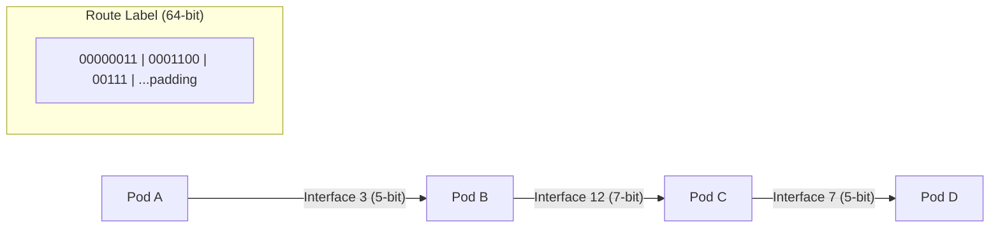

# Source Route Labels

Compact multi-hop path encoding for efficient routing through the mesh.

**Related specs**: [wire-format.md](../core/wire-format.md) | [dht-routing.md](dht-routing.md) | [service-model.md](../coordination/service-model.md)

## 1. Overview

The routing header in [wire-format.md](../core/wire-format.md) uses a `via` array of Pod IDs for multi-hop routing. Each Pod ID is 32 bytes, making a 4-hop path cost 128 bytes of routing overhead. This spec adds compact path encoding using variable-length labels:

- 64-bit route label encodes up to 8 hops
- Variable-length encoding forms (5-bit, 7-bit, 10-bit)
- Bidirectional: forward labels can be reversed for return paths
- Extends existing routing header (0x30-0x32) without new message types



## 2. RouteLabel Type

A route label is a 64-bit integer encoding a sequence of interface numbers:

```typescript
/** 64-bit compact route encoding */
type RouteLabel = bigint;

/** A route label of 1n means "self" (no hops) */
const SELF_ROUTE: RouteLabel = 1n;
```

## 3. Encoding Forms

Each hop is encoded using a variable-length form. The encoding scheme is negotiated per-link based on the number of interfaces each node has:

```typescript
interface EncodingForm {
  /** Number of bits for the interface number */
  bitCount: number;

  /** Length of the prefix that identifies this form */
  prefixLen: number;

  /** Prefix bits that identify this form */
  prefix: number;
}
```

### Standard Encoding Scheme

| Form | Prefix | Prefix Length | Data Bits | Max Interfaces | Total Bits |
|------|--------|---------------|-----------|----------------|------------|
| 0 | `0` | 1 | 4 | 15 | 5 |
| 1 | `10` | 2 | 5 | 31 | 7 |
| 2 | `110` | 3 | 7 | 127 | 10 |

```typescript
const STANDARD_SCHEME: EncodingForm[] = [
  { bitCount: 4, prefixLen: 1, prefix: 0b0 },     // Form 0: 5-bit total
  { bitCount: 5, prefixLen: 2, prefix: 0b10 },     // Form 1: 7-bit total
  { bitCount: 7, prefixLen: 3, prefix: 0b110 },    // Form 2: 10-bit total
];
```

### Form Selection

The smallest form that can represent the interface number is used:

```typescript
function selectForm(
  interfaceNum: number,
  scheme: EncodingForm[]
): EncodingForm {
  for (const form of scheme) {
    if (interfaceNum < (1 << form.bitCount)) {
      return form;
    }
  }
  throw new Error(`Interface number ${interfaceNum} too large for scheme`);
}
```

## 4. Encoding and Decoding

### 4.1 encodeRoute

```typescript
function encodeRoute(
  interfaces: number[],
  scheme: EncodingForm[] = STANDARD_SCHEME
): RouteLabel {
  if (interfaces.length === 0) return SELF_ROUTE;
  if (interfaces.length > 8) {
    throw new Error('Max 8 hops exceeded');
  }

  let label = 0n;
  let bitPos = 0;

  for (const iface of interfaces) {
    const form = selectForm(iface, scheme);
    const totalBits = form.prefixLen + form.bitCount;

    // Write prefix
    label |= BigInt(form.prefix) << BigInt(bitPos);
    bitPos += form.prefixLen;

    // Write interface number
    label |= BigInt(iface) << BigInt(bitPos);
    bitPos += form.bitCount;

    if (bitPos > 64) {
      throw new Error('Route label overflow (>64 bits)');
    }
  }

  return label;
}
```

### 4.2 decodeRoute

```typescript
function decodeRoute(
  label: RouteLabel,
  scheme: EncodingForm[] = STANDARD_SCHEME
): number[] {
  if (label === SELF_ROUTE) return [];

  const interfaces: number[] = [];
  let bitPos = 0;

  while (bitPos < 64) {
    // Try each form, longest prefix first
    let matched = false;
    for (const form of [...scheme].reverse()) {
      const prefixMask = (1n << BigInt(form.prefixLen)) - 1n;
      const prefix = (label >> BigInt(bitPos)) & prefixMask;

      if (Number(prefix) === form.prefix) {
        bitPos += form.prefixLen;

        const dataMask = (1n << BigInt(form.bitCount)) - 1n;
        const iface = Number((label >> BigInt(bitPos)) & dataMask);
        bitPos += form.bitCount;

        interfaces.push(iface);
        matched = true;
        break;
      }
    }

    if (!matched) break;

    // Stop if remaining bits are all zero (padding)
    const remaining = label >> BigInt(bitPos);
    if (remaining === 0n) break;
  }

  return interfaces;
}
```

## 5. Route Reversal

A forward route label can be reversed to compute the return path. Each hop's interface number is replaced with the reverse interface (the interface on which the packet arrived):

```typescript
function reverseRoute(
  label: RouteLabel,
  scheme: EncodingForm[] = STANDARD_SCHEME
): RouteLabel {
  const hops = decodeRoute(label, scheme);
  hops.reverse();
  return encodeRoute(hops, scheme);
}
```

> **Note**: This produces a valid return path only if interface numbers are symmetric (interface X on node A leading to node B corresponds to interface Y on node B leading back to node A). Nodes must maintain this reverse mapping.

```typescript
interface ReverseInterfaceMap {
  /** For each interface, the reverse interface on the peer */
  reverseOf: Map<number, number>;
}

function reverseRouteAccurate(
  label: RouteLabel,
  nodeReverseMaps: ReverseInterfaceMap[],
  scheme: EncodingForm[] = STANDARD_SCHEME
): RouteLabel {
  const forwardHops = decodeRoute(label, scheme);
  const reverseHops: number[] = [];

  for (let i = forwardHops.length - 1; i >= 0; i--) {
    const reverseIface = nodeReverseMaps[i].reverseOf.get(forwardHops[i]);
    if (reverseIface === undefined) {
      throw new Error(`No reverse mapping for interface ${forwardHops[i]}`);
    }
    reverseHops.push(reverseIface);
  }

  return encodeRoute(reverseHops, scheme);
}
```

## 6. Label Splicing

When forwarding a packet, a node removes its own hop from the label and prepends the outgoing interface:

```typescript
function spliceLabel(
  label: RouteLabel,
  scheme: EncodingForm[] = STANDARD_SCHEME
): { nextHop: number; remainder: RouteLabel } {
  const hops = decodeRoute(label, scheme);

  if (hops.length === 0) {
    return { nextHop: -1, remainder: SELF_ROUTE };
  }

  const nextHop = hops[0];
  const remainder = encodeRoute(hops.slice(1), scheme);
  return { nextHop, remainder };
}
```

## 7. Integration with Wire Format

Route labels extend the existing routing header (0x30-0x32) as an alternative encoding:

```typescript
interface RoutingHeaderExtended {
  /** Standard via array (existing) */
  via?: string[];

  /** Compact route label (this spec) */
  routeLabel?: RouteLabel;

  /** Which encoding scheme to use */
  encodingScheme?: 'standard' | number;  // Custom scheme ID

  /** Max hops remaining */
  ttl: number;
}
```

When both `via` and `routeLabel` are present, `routeLabel` takes precedence. Nodes that don't understand route labels fall back to the `via` array.

## 8. Limits

| Resource | Limit |
|----------|-------|
| Max hops per label | 8 (matching MAX_VIA_HOPS) |
| Label size | 64 bits (8 bytes) |
| Max interface number (Form 0) | 15 |
| Max interface number (Form 1) | 31 |
| Max interface number (Form 2) | 127 |
| Encoding forms per scheme | 3 |
| vs. Pod ID array (8 hops) | 256 bytes → 8 bytes (32x reduction) |
