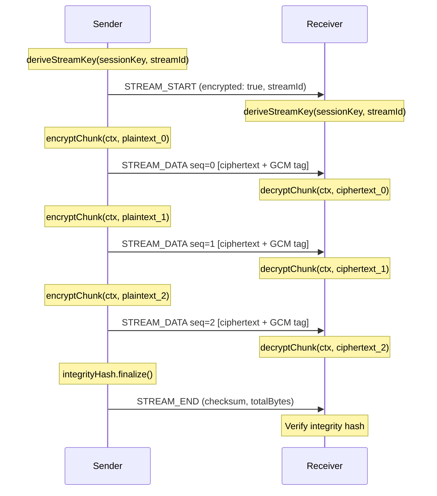

# Stream Encryption

Per-stream encryption for large payload transfer in BrowserMesh.

**Related specs**: [streaming-protocol.md](streaming-protocol.md) | [session-keys.md](../crypto/session-keys.md) | [wire-format.md](../core/wire-format.md)

## 1. Overview

When a stream carries sensitive or large payloads, each stream can opt into **per-stream encryption** by setting `encrypted: true` in the STREAM_START message (see [streaming-protocol.md](streaming-protocol.md)). Each stream derives an independent sub-key from the session key, so compromising one stream does not compromise others within the same session.

Key properties:

- **Stream key isolation** — every stream gets its own AES-256-GCM key derived via HKDF
- **Chunk-level encryption** — each STREAM_DATA chunk is individually authenticated and encrypted
- **Transparent integration** — encryption is applied through Web Streams API `TransformStream` pipes, so application code reads and writes plaintext
- **Optional integrity hash** — a running SHA-256 hash can be included in STREAM_END for end-to-end verification

## 2. Key Derivation

Each stream derives a dedicated sub-key from the session key using HKDF-SHA-256, keyed by the stream's unique 16-byte identifier.

```typescript
interface StreamEncryptionContext {
  /** Stream-specific encryption key */
  streamKey: CryptoKey;
  /** 16-byte stream identifier */
  streamId: Uint8Array;
  /** First 4 bytes of streamId, used as nonce prefix */
  noncePrefix: Uint8Array;
  /** Running chunk sequence number */
  sequenceNumber: number;
}

async function deriveStreamKey(
  sessionKey: CryptoKey,
  streamId: Uint8Array
): Promise<StreamEncryptionContext> {
  // HKDF derivation
  const hkdfKey = await crypto.subtle.importKey(
    'raw',
    await crypto.subtle.exportKey('raw', sessionKey),
    'HKDF',
    false,
    ['deriveKey']
  );

  const streamKey = await crypto.subtle.deriveKey(
    {
      name: 'HKDF',
      hash: 'SHA-256',
      salt: streamId,
      info: new TextEncoder().encode('stream-encryption'),
    },
    hkdfKey,
    { name: 'AES-GCM', length: 256 },
    false,
    ['encrypt', 'decrypt']
  );

  return {
    streamKey,
    streamId,
    noncePrefix: streamId.slice(0, 4),
    sequenceNumber: 0,
  };
}
```

The `sessionKey` is the send or receive key from the Noise IK handshake (see [session-keys.md](../crypto/session-keys.md)). Both peers derive the same `streamKey` because they share the session key and the `streamId` is transmitted in the STREAM_START message.

## 3. Chunk Encryption

Each STREAM_DATA chunk is encrypted with AES-256-GCM. The 12-byte nonce is constructed as `noncePrefix[4B] || sequenceNumber[8B]`, guaranteeing uniqueness within the stream as long as the sequence number does not wrap.

```typescript
function buildNonce(ctx: StreamEncryptionContext): Uint8Array {
  const nonce = new Uint8Array(12);
  nonce.set(ctx.noncePrefix, 0);
  new DataView(nonce.buffer).setBigUint64(4, BigInt(ctx.sequenceNumber), false);
  return nonce;
}

async function encryptChunk(
  ctx: StreamEncryptionContext,
  plaintext: Uint8Array
): Promise<Uint8Array> {
  const nonce = buildNonce(ctx);
  const ciphertext = await crypto.subtle.encrypt(
    { name: 'AES-GCM', iv: nonce },
    ctx.streamKey,
    plaintext
  );
  ctx.sequenceNumber++;
  return new Uint8Array(ciphertext);
}

async function decryptChunk(
  ctx: StreamEncryptionContext,
  ciphertext: Uint8Array
): Promise<Uint8Array> {
  const nonce = buildNonce(ctx);
  const plaintext = await crypto.subtle.decrypt(
    { name: 'AES-GCM', iv: nonce },
    ctx.streamKey,
    ciphertext
  );
  ctx.sequenceNumber++;
  return new Uint8Array(plaintext);
}
```

The sender and receiver must process chunks in the same order so their sequence numbers stay synchronized. For ordered streams this is guaranteed by the streaming protocol. For unordered streams, the sender includes the sequence number in each chunk so the receiver can reconstruct the correct nonce (see [streaming-protocol.md](streaming-protocol.md) Section 6).

## 4. TransformStream Integration

Stream encryption integrates with the Web Streams API through `TransformStream` pipes. Application code writes plaintext into the writable side and reads plaintext from the readable side; encryption and decryption happen transparently in between.

```typescript
class EncryptTransform implements Transformer<Uint8Array, Uint8Array> {
  private ctx: StreamEncryptionContext;

  constructor(ctx: StreamEncryptionContext) {
    this.ctx = ctx;
  }

  async transform(
    chunk: Uint8Array,
    controller: TransformStreamDefaultController<Uint8Array>
  ): Promise<void> {
    const encrypted = await encryptChunk(this.ctx, chunk);
    controller.enqueue(encrypted);
  }
}

class DecryptTransform implements Transformer<Uint8Array, Uint8Array> {
  private ctx: StreamEncryptionContext;

  constructor(ctx: StreamEncryptionContext) {
    this.ctx = ctx;
  }

  async transform(
    chunk: Uint8Array,
    controller: TransformStreamDefaultController<Uint8Array>
  ): Promise<void> {
    const decrypted = await decryptChunk(this.ctx, chunk);
    controller.enqueue(decrypted);
  }
}

// Usage with MeshStream
function createEncryptedStream(
  meshStream: MeshStream,
  ctx: StreamEncryptionContext
): { readable: ReadableStream<Uint8Array>; writable: WritableStream<Uint8Array> } {
  const encryptTransform = new TransformStream(new EncryptTransform(ctx));
  const decryptTransform = new TransformStream(new DecryptTransform(ctx));

  return {
    readable: meshStream.readable.pipeThrough(decryptTransform),
    writable: encryptTransform.readable.pipeTo(meshStream.writable)
      ? meshStream.writable  // simplified
      : meshStream.writable,
  };
}
```

In practice, `PodSocket.stream()` handles the wiring automatically when `encrypted: true` is set in the stream options.

## 5. Running Integrity Hash

An optional SHA-256 cumulative hash can be maintained across all plaintext chunks. The sender updates the hash with each chunk before encryption, and includes the final hash in the STREAM_END message. The receiver performs the same computation on decrypted chunks and compares.

```typescript
class StreamIntegrityHash {
  private hash: Uint8Array = new Uint8Array(32);
  private totalBytes: number = 0;

  async update(chunk: Uint8Array): Promise<void> {
    const combined = concat(this.hash, chunk);
    this.hash = new Uint8Array(
      await crypto.subtle.digest('SHA-256', combined)
    );
    this.totalBytes += chunk.length;
  }

  finalize(): { hash: Uint8Array; totalBytes: number } {
    return { hash: this.hash, totalBytes: this.totalBytes };
  }
}
```

The finalized hash and byte count are included in the STREAM_END message:

```typescript
// Sender side — after writing all chunks
const integrity = senderHash.finalize();
const endMessage: StreamEndMessage = {
  t: 0x14,
  p: {
    streamId,
    totalBytes: integrity.totalBytes,
    checksum: integrity.hash,
  },
  // ... envelope fields
};

// Receiver side — after reading all chunks
const receiverIntegrity = receiverHash.finalize();
if (!bytesEqual(receiverIntegrity.hash, endMessage.p.checksum!)) {
  throw new StreamError('INTEGRITY_MISMATCH', 'End-to-end hash does not match');
}
```

## 6. Encrypted Stream Flow



## 7. Security Properties

| Property | How Achieved |
|----------|--------------|
| **Per-stream key isolation** | Each stream derives an independent AES-256-GCM key via HKDF(sessionKey, streamId) |
| **Nonce uniqueness** | Nonce = `noncePrefix[4B] \|\| sequenceNumber[8B]`; unique per stream key |
| **Forward secrecy** | Stream keys inherit forward secrecy from the session key (ephemeral Noise IK handshake) |
| **Chunk authentication** | AES-GCM provides per-chunk authentication via 16-byte tags |
| **End-to-end integrity** | Optional running SHA-256 hash included in STREAM_END |
| **Replay protection** | Monotonic sequence numbers prevent chunk replay within a stream |
| **Stream independence** | Compromising one stream key does not reveal other streams' plaintext |

## 8. Limits

| Resource | Limit | Notes |
|----------|-------|-------|
| Max chunks per stream key | 2^32 | AES-GCM safety bound; renegotiate session before reaching this |
| Nonce space per stream | 2^64 | 8-byte sequence number portion of the 12-byte nonce |
| Max encrypted chunk size | 16 KB + 16 B | 16 KB plaintext + 16-byte GCM authentication tag |
| Min streamId entropy | 128 bits | 16 random bytes from `crypto.getRandomValues()` |
| HKDF info string | `"stream-encryption"` | Fixed label for domain separation |

## 9. Error Handling

When decryption fails (tampered ciphertext, wrong key, nonce mismatch), the receiver sends a STREAM_ERROR with code `INTERNAL` and closes the stream. The receiver must not expose the decryption failure reason to avoid leaking oracle information.

```typescript
async function handleEncryptedChunk(
  ctx: StreamEncryptionContext,
  chunk: StreamDataMessage
): Promise<Uint8Array> {
  try {
    return await decryptChunk(ctx, chunk.p.data);
  } catch {
    // Generic error — do not expose decryption details
    throw new StreamError(
      'INTERNAL',
      'Stream data processing failed'
    );
  }
}
```
