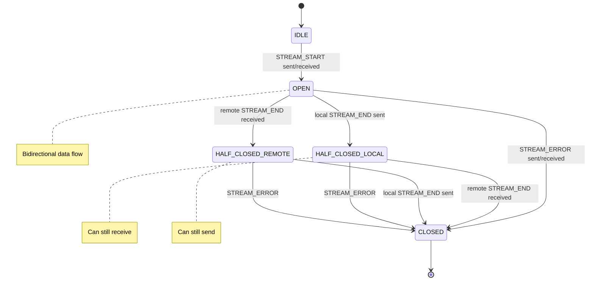
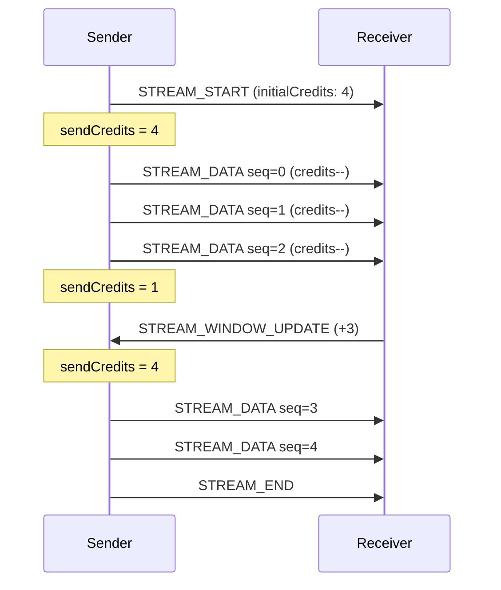

# Streaming Protocol

State machine, backpressure, and error recovery for BrowserMesh streams.

**Related specs**: [wire-format.md](../core/wire-format.md) | [message-envelope.md](message-envelope.md) | [stream-encryption.md](stream-encryption.md) | [pod-socket.md](pod-socket.md) | [channel-abstraction.md](channel-abstraction.md)

## 1. Overview

The streaming protocol defines the lifecycle for multi-message data transfers between pods. It builds on the STREAM_START/DATA/END/ERROR message types (0x12-0x15) declared in [wire-format.md](../core/wire-format.md) and adds:

- A formal state machine for stream lifecycle
- Credit-based backpressure (flow control)
- Stream multiplexing over a single session
- Ordered and unordered delivery modes
- Error recovery and partial stream cleanup

## 2. Stream Lifecycle State Machine



```typescript
type StreamState =
  | 'IDLE'
  | 'OPEN'
  | 'HALF_CLOSED_LOCAL'
  | 'HALF_CLOSED_REMOTE'
  | 'CLOSED';

interface StreamContext {
  id: Uint8Array;          // 16-byte stream ID
  state: StreamState;
  initiator: boolean;      // true if this side opened the stream
  sendSeq: number;         // Next sequence number to send
  recvSeq: number;         // Next expected sequence number
  sendCredits: number;     // Available send window
  recvCredits: number;     // Credits granted to remote
  ordered: boolean;        // Whether delivery must be ordered
  createdAt: number;
}
```

## 3. Message Interfaces

All stream messages extend the `MessageEnvelope` from [wire-format.md](../core/wire-format.md).

### 3.1 STREAM_START (0x12)

```typescript
interface StreamStartMessage extends MessageEnvelope {
  t: 0x12;
  p: {
    streamId: Uint8Array;       // 16-byte unique stream ID
    method: string;             // Purpose: e.g., "storage/download"
    ordered: boolean;           // Ordered delivery required
    encrypted?: boolean;        // Stream uses per-stream encryption (see stream-encryption.md)
    initialCredits: number;     // Initial receive window
    metadata?: Record<string, unknown>;
  };
}
```

### 3.2 STREAM_DATA (0x13)

```typescript
interface StreamDataMessage extends MessageEnvelope {
  t: 0x13;
  p: {
    streamId: Uint8Array;
    seq: number;                // Monotonic sequence number
    data: Uint8Array;           // Chunk payload (max 16 KB)
    final?: boolean;            // Shorthand: DATA + END combined
  };
}
```

### 3.3 STREAM_END (0x14)

```typescript
interface StreamEndMessage extends MessageEnvelope {
  t: 0x14;
  p: {
    streamId: Uint8Array;
    totalBytes?: number;        // Optional: total bytes sent
    checksum?: Uint8Array;      // Optional: SHA-256 of full payload
  };
}
```

### 3.4 STREAM_ERROR (0x15)

```typescript
interface StreamErrorMessage extends MessageEnvelope {
  t: 0x15;
  p: {
    streamId: Uint8Array;
    code: StreamErrorCode;
    message: string;
    retryable: boolean;
  };
}

type StreamErrorCode =
  | 'CANCELLED'              // Sender/receiver cancelled
  | 'TIMEOUT'                // Stream idle timeout exceeded
  | 'FLOW_CONTROL'           // Credit exhaustion
  | 'SEQUENCE_GAP'           // Missing sequence number (ordered mode)
  | 'TOO_LARGE'              // Stream exceeded size limit
  | 'INTERNAL'               // Unexpected internal error
  | 'PROTOCOL_VIOLATION';    // Invalid state transition
```

### 3.5 STREAM_WINDOW_UPDATE (0x16)

```typescript
interface StreamWindowUpdateMessage extends MessageEnvelope {
  t: 0x16;
  p: {
    streamId: Uint8Array;
    additionalCredits: number;  // Credits to add to send window
  };
}
```

> **Wire format note**: STREAM_WINDOW_UPDATE uses type code `0x16`, extending the Request/Response block (0x1*).

## 4. Backpressure: Credit-Based Flow Control

Streams use credit-based flow control to prevent a fast sender from overwhelming a slow receiver.



### Rules

1. The **receiver** sets `initialCredits` in STREAM_START (default: 8 chunks)
2. Each STREAM_DATA **decrements** the sender's credit by 1
3. The sender **must not** send when `sendCredits === 0`
4. The receiver sends STREAM_WINDOW_UPDATE to replenish credits
5. If the sender is blocked for longer than `streamIdleTimeout` (30s), it sends STREAM_ERROR with code `TIMEOUT`

```typescript
const STREAM_DEFAULTS = {
  initialCredits: 8,             // 8 chunks = 128 KB at 16 KB/chunk
  maxCredits: 64,                // Max outstanding chunks
  idleTimeout: 30_000,           // 30 seconds
  maxStreamSize: 256 * 1024 * 1024, // 256 MB per stream
  maxConcurrentStreams: 16,      // Per session
};
```

## 5. Stream Multiplexing

Multiple streams can be active simultaneously over a single encrypted session. Each stream is identified by its `streamId` and has independent state, sequence counters, and flow control.

```typescript
class StreamMultiplexer {
  private streams: Map<string, StreamContext> = new Map();
  private maxConcurrent: number = STREAM_DEFAULTS.maxConcurrentStreams;

  /** Open a new outgoing stream */
  async open(method: string, options?: StreamOptions): Promise<MeshStream> {
    if (this.streams.size >= this.maxConcurrent) {
      throw new StreamError('TOO_MANY_STREAMS', 'Concurrent stream limit reached');
    }

    const streamId = crypto.getRandomValues(new Uint8Array(16));
    const ctx: StreamContext = {
      id: streamId,
      state: 'OPEN',
      initiator: true,
      sendSeq: 0,
      recvSeq: 0,
      sendCredits: options?.initialCredits ?? STREAM_DEFAULTS.initialCredits,
      recvCredits: options?.initialCredits ?? STREAM_DEFAULTS.initialCredits,
      ordered: options?.ordered ?? true,
      createdAt: Date.now(),
    };

    this.streams.set(streamIdToKey(streamId), ctx);
    return new MeshStream(ctx, this);
  }

  /** Route an incoming stream message to the correct stream */
  dispatch(msg: MessageEnvelope): void {
    const streamId = msg.p?.streamId;
    if (!streamId) return;

    const key = streamIdToKey(streamId);
    const ctx = this.streams.get(key);

    if (msg.t === 0x12 && !ctx) {
      // New incoming stream
      this.handleStreamStart(msg as StreamStartMessage);
      return;
    }

    if (!ctx) {
      // Unknown stream — send error
      this.sendError(streamId, 'PROTOCOL_VIOLATION', 'Unknown stream ID');
      return;
    }

    switch (msg.t) {
      case 0x13: this.handleData(ctx, msg as StreamDataMessage); break;
      case 0x14: this.handleEnd(ctx, msg as StreamEndMessage); break;
      case 0x15: this.handleError(ctx, msg as StreamErrorMessage); break;
      case 0x16: this.handleWindowUpdate(ctx, msg as StreamWindowUpdateMessage); break;
    }
  }
}

function streamIdToKey(id: Uint8Array): string {
  return Array.from(id).map(b => b.toString(16).padStart(2, '0')).join('');
}
```

## 6. Delivery Modes

### 6.1 Ordered (Default)

Chunks are delivered to the application in sequence order. If a chunk arrives out of order, the receiver buffers it until the gap is filled. A gap lasting longer than `idleTimeout` triggers STREAM_ERROR with `SEQUENCE_GAP`.

### 6.2 Unordered

Chunks are delivered as they arrive. The `seq` field is still set (for deduplication) but ordering is not enforced. Suitable for parallel file transfers or log streaming.

```typescript
interface StreamOptions {
  ordered?: boolean;            // Default: true
  initialCredits?: number;      // Default: 8
  maxSize?: number;             // Max total bytes (0 = unlimited up to global max)
}
```

## 7. MeshStream: Application API

`MeshStream` integrates with the Web Streams API for ergonomic use.

```typescript
class MeshStream {
  readonly readable: ReadableStream<Uint8Array>;
  readonly writable: WritableStream<Uint8Array>;

  constructor(private ctx: StreamContext, private mux: StreamMultiplexer) {
    this.readable = new ReadableStream({
      pull: (controller) => this.pullChunk(controller),
      cancel: () => this.cancel(),
    });

    this.writable = new WritableStream({
      write: (chunk) => this.writeChunk(chunk),
      close: () => this.end(),
      abort: (reason) => this.abort(reason),
    });
  }

  /** Stream metadata */
  get id(): Uint8Array { return this.ctx.id; }
  get state(): StreamState { return this.ctx.state; }

  /** Cancel the stream (sends STREAM_ERROR) */
  async cancel(): Promise<void> {
    if (this.ctx.state === 'CLOSED') return;
    this.ctx.state = 'CLOSED';
    // Send cancellation error to peer
  }

  private async writeChunk(chunk: Uint8Array): Promise<void> {
    // Wait for credits if exhausted
    while (this.ctx.sendCredits <= 0) {
      await this.waitForCredits();
    }

    // Fragment if chunk exceeds max stream chunk size
    for (let offset = 0; offset < chunk.length; offset += 16384) {
      const slice = chunk.subarray(offset, Math.min(offset + 16384, chunk.length));
      this.ctx.sendCredits--;
      this.ctx.sendSeq++;
      // Send STREAM_DATA via multiplexer
    }
  }

  private async end(): Promise<void> {
    this.ctx.state = this.ctx.state === 'HALF_CLOSED_REMOTE'
      ? 'CLOSED'
      : 'HALF_CLOSED_LOCAL';
    // Send STREAM_END
  }
}
```

## 8. Integration with PodSocket

[PodSocket](pod-socket.md) exposes streaming through its `stream()` method:

```typescript
// Sending a stream
const socket: PodSocket = await mesh.connect(targetPodId);
const stream = await socket.stream('storage/upload', { ordered: true });
const writer = stream.writable.getWriter();
await writer.write(chunk1);
await writer.write(chunk2);
await writer.close();

// Receiving a stream
socket.onStream('storage/upload', async (stream) => {
  const reader = stream.readable.getReader();
  while (true) {
    const { done, value } = await reader.read();
    if (done) break;
    processChunk(value);
  }
});
```

## 9. Error Recovery

| Scenario | Behavior |
|----------|----------|
| Chunk lost (ordered) | Receiver detects gap, waits `idleTimeout`, then sends STREAM_ERROR `SEQUENCE_GAP` |
| Chunk lost (unordered) | No action — application tolerates gaps |
| Sender credit exhausted | Sender blocks until WINDOW_UPDATE received or `idleTimeout` |
| Session disconnect | All streams transition to CLOSED; application notified |
| Receiver too slow | Sender observes credit starvation, may cancel stream |
| Oversized stream | Receiver sends STREAM_ERROR `TOO_LARGE` when `maxSize` exceeded |

### Partial Stream Cleanup

When a stream transitions to CLOSED (whether normally or via error), both sides:

1. Remove the stream from the multiplexer's active set
2. Release any buffered out-of-order chunks
3. Notify the application via the ReadableStream/WritableStream error path
4. Free the stream ID for reuse after a 60-second cooldown

## 10. Limits

| Resource | Limit |
|----------|-------|
| Max chunk size | 16 KB |
| Max concurrent streams per session | 16 |
| Max stream size | 256 MB |
| Stream idle timeout | 30 seconds |
| Stream ID reuse cooldown | 60 seconds |
| Initial receive window | 8 chunks (128 KB) |
| Max receive window | 64 chunks (1 MB) |

## 11. Encrypted Streams

Streams can optionally use per-stream encryption by setting `encrypted: true` in the STREAM_START message. When enabled:

1. A stream-specific key is derived from the session key via `HKDF(sessionKey, streamId)`
2. Each STREAM_DATA chunk is individually encrypted with AES-GCM
3. Nonces are constructed from `streamId[0:4] || sequenceNumber[8B]` to ensure uniqueness
4. An optional running SHA-256 hash can be included in STREAM_END for end-to-end integrity verification

This provides **per-stream key isolation** — compromising one stream's key does not compromise others within the same session.

```typescript
// Opening an encrypted stream
const stream = await socket.stream('storage/upload', {
  ordered: true,
  encrypted: true,  // Enable per-stream encryption
});

// Encryption is transparent — write plaintext, receive plaintext
const writer = stream.writable.getWriter();
await writer.write(plaintextChunk);
await writer.close();
```

See [stream-encryption.md](stream-encryption.md) for the full key derivation, chunk encryption, and TransformStream integration.
