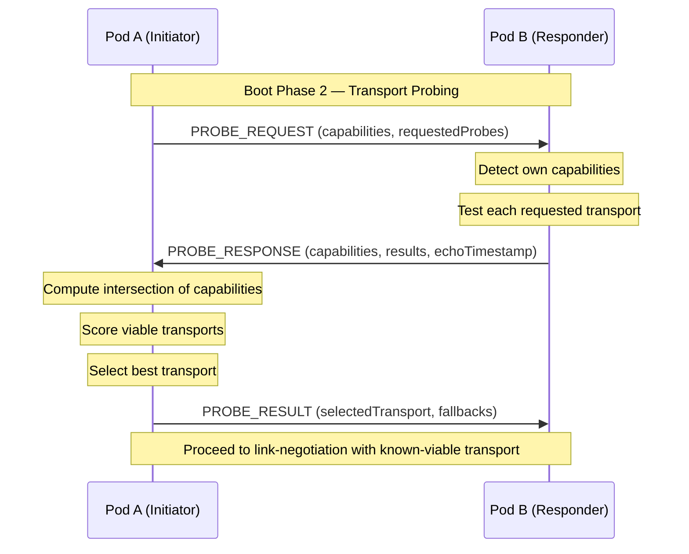
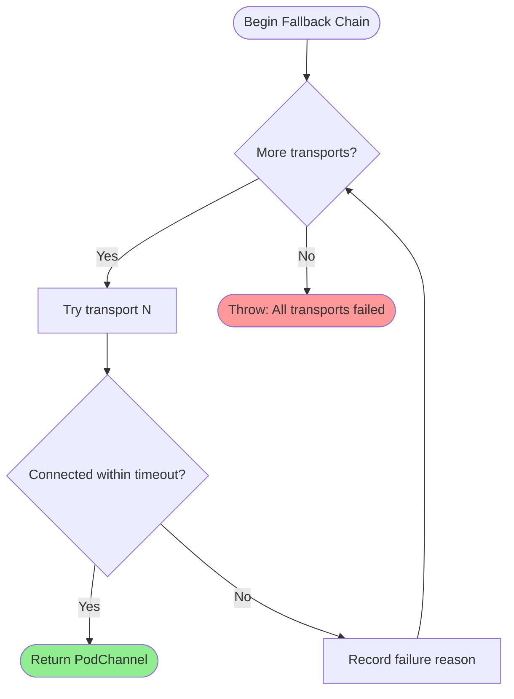

# Transport Probing

Transport auto-detection and smart channel selection for BrowserMesh pods.

**Related specs**: [channel-abstraction.md](channel-abstraction.md) | [link-negotiation.md](link-negotiation.md) | [boot-sequence.md](../core/boot-sequence.md) | [pod-types.md](../core/pod-types.md)

## 1. Overview

During boot (see [boot-sequence.md](../core/boot-sequence.md)), pods discover each other's capabilities through the hello/ack exchange. However, the hello exchange only advertises _what_ a pod supports, not _which transports actually work_ between two specific peers. Network conditions, browser restrictions, and same-origin policies all affect real reachability.

Transport probing fills this gap by:

- Actively testing transport availability between two peers
- Scoring transports by latency, throughput, and reliability
- Selecting the best available transport via `SmartChannel`
- Scheduling background upgrades to better transports when possible

Probing runs during boot-sequence Phase 2 (self-classification), **before** link-negotiation begins. This ensures link-negotiation already knows which transports are viable, avoiding wasted negotiation rounds.

## 2. Wire Format Messages

Probe messages use type codes 0xF0-0xF2 in the Probe (0xF*) block.

```typescript
enum ProbeMessageType {
  PROBE_REQUEST  = 0xF0,
  PROBE_RESPONSE = 0xF1,
  PROBE_RESULT   = 0xF2,
}
```

### 2.1 PROBE_REQUEST (0xF0)

Sent by the initiating pod to request transport capability testing.

```typescript
interface ProbeRequestMessage extends MessageEnvelope {
  t: 0xF0;
  p: {
    /** Initiator's transport capabilities */
    capabilities: TransportCapabilities;
    /** Transports the initiator wants to probe (subset of capabilities) */
    requestedProbes: PodChannelType[];
    /** Timestamp for RTT measurement */
    probeTimestamp: number;
    /** Maximum time the responder should spend probing (ms) */
    maxProbeTime: number;
  };
}
```

### 2.2 PROBE_RESPONSE (0xF1)

Sent by the responder with its own capabilities and probe results.

```typescript
interface ProbeResponseMessage extends MessageEnvelope {
  t: 0xF1;
  p: {
    /** Responder's transport capabilities */
    capabilities: TransportCapabilities;
    /** Per-transport probe results */
    results: TransportProbeResult[];
    /** Echo of initiator's probeTimestamp (for RTT) */
    echoTimestamp: number;
    /** Responder's own timestamp */
    probeTimestamp: number;
  };
}
```

### 2.3 PROBE_RESULT (0xF2)

Final agreed transport selection, broadcast to both peers.

```typescript
interface ProbeResultMessage extends MessageEnvelope {
  t: 0xF2;
  p: {
    /** Selected primary transport */
    selectedTransport: PodChannelType;
    /** Score that led to selection */
    score: TransportScore;
    /** Ordered fallback list */
    fallbacks: PodChannelType[];
    /** Whether upgrade scheduling is enabled */
    upgradeEnabled: boolean;
  };
}
```

## 3. TransportCapabilities Interface

Each pod advertises its transport support using the `TransportCapabilities` structure. This extends the general `PodCapabilities` (see [pod-types.md](../core/pod-types.md)) with transport-specific detail.

```typescript
interface TransportCapabilities {
  /** MessageChannel / MessagePort */
  messagePort: boolean;
  /** BroadcastChannel (same-origin only) */
  broadcastChannel: boolean;
  /** SharedWorker port relay */
  sharedWorker: boolean;
  /** WebRTC DataChannel */
  webRTC: boolean;
  /** WebSocket to relay server */
  webSocket: boolean;
  /** WebTransport (HTTP/3) */
  webTransport: boolean;
  /** window.postMessage */
  postMessage: boolean;
}

function detectTransportCapabilities(): TransportCapabilities {
  return {
    messagePort: typeof MessageChannel !== 'undefined',
    broadcastChannel: typeof BroadcastChannel !== 'undefined',
    sharedWorker: typeof SharedWorker !== 'undefined',
    webRTC: typeof RTCPeerConnection !== 'undefined',
    webSocket: typeof WebSocket !== 'undefined',
    webTransport: typeof WebTransport !== 'undefined',
    postMessage: typeof postMessage === 'function',
  };
}
```

## 4. Probe Protocol

The probe exchange occurs between two peers after boot-sequence Phase 1 (listeners installed) and before link-negotiation. It runs over whatever bootstrap channel is available (typically `postMessage` or `BroadcastChannel`).



### Probe Sequence

1. Pod A sends PROBE_REQUEST listing its `TransportCapabilities` and which transports it wants to actively probe.
2. Pod B receives the request, detects its own capabilities, and tests each requested transport (e.g., attempts a BroadcastChannel write, checks SharedWorker connectivity).
3. Pod B sends PROBE_RESPONSE with per-transport results and timestamps for RTT calculation.
4. Pod A computes transport scores and selects the best option.
5. Pod A sends PROBE_RESULT so both sides agree on the transport before link-negotiation.

### Per-Transport Probe Result

```typescript
interface TransportProbeResult {
  /** Transport type tested */
  transport: PodChannelType;
  /** Whether the transport is reachable between these two peers */
  reachable: boolean;
  /** Measured round-trip time (ms), if reachable */
  rttMs?: number;
  /** Reason for failure, if not reachable */
  failureReason?: string;
}
```

## 5. SmartChannel Factory

While `wrapChannel()` (see [channel-abstraction.md](channel-abstraction.md)) wraps a single known transport, `SmartChannel` provides automatic transport selection using probe results.

```typescript
interface SmartChannelOptions {
  /** Override default transport preference order */
  preferredOrder?: PodChannelType[];
  /** Connection timeout per transport attempt (ms) */
  timeout?: number;
  /** Enable background upgrade to better transport */
  upgradeEnabled?: boolean;
}

class SmartChannel {
  /**
   * Connect to a target pod using the best available transport.
   * Probes capabilities, scores options, and falls back through
   * alternatives on failure.
   */
  static async connect(
    target: string,
    options?: SmartChannelOptions
  ): Promise<PodChannel> {
    const {
      preferredOrder = DEFAULT_TRANSPORT_ORDER,
      timeout = PROBE_DEFAULTS.connectionTimeout,
      upgradeEnabled = true,
    } = options ?? {};

    // 1. Exchange probe messages with target
    const probeResult = await ProbeExchange.run(target, timeout);

    // 2. Filter to mutually-supported transports
    const viable = preferredOrder.filter(
      (t) => probeResult.isViable(t)
    );

    if (viable.length === 0) {
      throw new Error('No viable transport found');
    }

    // 3. Try each viable transport in order
    const channel = await FallbackChain.tryAll(viable, target, timeout);

    // 4. Schedule background upgrade if enabled
    if (upgradeEnabled && viable[0] !== channel.type) {
      UpgradeScheduler.schedule(channel, viable[0], target);
    }

    return channel;
  }
}
```

### Default Transport Preference Order

Transports are ordered by performance characteristics: low-latency, high-throughput options first, universal fallbacks last.

```typescript
const DEFAULT_TRANSPORT_ORDER: PodChannelType[] = [
  'webtransport',       // HTTP/3 streams, lowest latency
  'webrtc-data',        // P2P, good for cross-device
  'websocket',          // Universal network transport
  'message-port',       // Fast same-origin, zero overhead
  'shared-worker-port', // Shared singleton relay
  'broadcast-channel',  // Same-origin multicast
  'post-message',       // Universal fallback
];
```

## 6. Context-Aware Selection

Not all transports are available in all pod types. The probe protocol uses this matrix to skip unavailable transports before testing.

| Pod Type | Available Transports |
|----------|---------------------|
| WindowPod | messagePort, broadcastChannel, postMessage, webSocket, webRTC, webTransport |
| WorkerPod | messagePort, broadcastChannel |
| SharedWorkerPod | messagePort (via port) |
| ServiceWorkerPod | messagePort, postMessage |
| IframePod | postMessage, messagePort |
| ServerPod | webSocket, webTransport |

```typescript
const POD_TRANSPORT_MAP: Record<PodKind, PodChannelType[]> = {
  'window':         ['message-port', 'broadcast-channel', 'post-message', 'websocket', 'webrtc-data', 'webtransport'],
  'spawned':        ['message-port', 'broadcast-channel', 'post-message', 'websocket', 'webrtc-data', 'webtransport'],
  'iframe':         ['post-message', 'message-port'],
  'worker':         ['message-port', 'broadcast-channel'],
  'shared-worker':  ['message-port'],
  'service-worker': ['message-port', 'post-message'],
  'server':         ['websocket', 'webtransport'],
  'worklet':        ['message-port'],
};

/**
 * Filter transport candidates to those available for the local pod kind.
 */
function filterByPodKind(
  candidates: PodChannelType[],
  localKind: PodKind
): PodChannelType[] {
  const available = new Set(POD_TRANSPORT_MAP[localKind] ?? []);
  return candidates.filter((t) => available.has(t));
}
```

### Same-Origin Constraints

Several transports require same-origin between peers. The probe protocol checks origin compatibility before including these:

| Transport | Same-Origin Required |
|-----------|---------------------|
| messagePort | No (transferable) |
| broadcastChannel | Yes |
| sharedWorker | Yes |
| postMessage | No (cross-origin) |
| webSocket | No (server-mediated) |
| webRTC | No (P2P) |
| webTransport | No (server-mediated) |

```typescript
function requiresSameOrigin(transport: PodChannelType): boolean {
  return transport === 'broadcast-channel' || transport === 'shared-worker-port';
}
```

## 7. Fallback Chain

When the preferred transport fails, the fallback chain tries alternatives in order. Each attempt has its own timeout. If all attempts fail, the chain throws with a summary of failures.



```typescript
class FallbackChain {
  /**
   * Try each transport in order until one succeeds.
   * Each attempt is bounded by its own timeout.
   */
  static async tryAll(
    transports: PodChannelType[],
    target: string,
    perTransportTimeout: number
  ): Promise<PodChannel> {
    const failures: Array<{ transport: PodChannelType; error: string }> = [];

    for (const transport of transports) {
      try {
        const channel = await Promise.race([
          TransportConnector.connect(transport, target),
          timeout(perTransportTimeout).then(() => {
            throw new Error(`Timeout after ${perTransportTimeout}ms`);
          }),
        ]);
        return channel;
      } catch (err) {
        failures.push({
          transport,
          error: (err as Error).message,
        });
      }
    }

    throw new FallbackExhaustedError(failures);
  }
}

class FallbackExhaustedError extends Error {
  constructor(readonly failures: Array<{ transport: PodChannelType; error: string }>) {
    const summary = failures
      .map((f) => `${f.transport}: ${f.error}`)
      .join('; ');
    super(`All transports failed — ${summary}`);
    this.name = 'FallbackExhaustedError';
  }
}
```

### Configurable Timeouts

Different transports have different expected connection times. The probe protocol supports per-transport timeout overrides:

```typescript
const DEFAULT_TRANSPORT_TIMEOUTS: Record<PodChannelType, number> = {
  'webtransport':       5000,   // HTTP/3 setup
  'webrtc-data':        10000,  // ICE + DTLS handshake
  'websocket':          5000,   // TCP + TLS + WS upgrade
  'message-port':       1000,   // Near-instant in same origin
  'shared-worker-port': 2000,   // Port negotiation
  'broadcast-channel':  1000,   // Near-instant in same origin
  'post-message':       2000,   // Cross-origin handshake
};
```

## 8. Upgrade Scheduling

After establishing a connection on a fallback transport, the `UpgradeScheduler` monitors conditions and attempts a background upgrade to a better transport. This integrates with the MESH_UPGRADE mechanism from [link-negotiation.md](link-negotiation.md).

```typescript
class UpgradeScheduler {
  private pending: Map<string, UpgradeTask> = new Map();

  /**
   * Schedule a background upgrade from the current transport to a target.
   */
  static schedule(
    currentChannel: PodChannel,
    targetTransport: PodChannelType,
    targetPod: string
  ): void {
    const task: UpgradeTask = {
      targetPod,
      currentTransport: currentChannel.type,
      targetTransport,
      scheduledAt: Date.now(),
      attempts: 0,
      maxAttempts: PROBE_DEFAULTS.maxUpgradeAttempts,
      retryDelay: PROBE_DEFAULTS.upgradeRetryDelay,
    };

    scheduler.pending.set(targetPod, task);
    scheduler.runTask(task, currentChannel);
  }

  private async runTask(
    task: UpgradeTask,
    currentChannel: PodChannel
  ): Promise<void> {
    // Wait before first attempt to let the connection stabilize
    await sleep(PROBE_DEFAULTS.upgradeInitialDelay);

    while (task.attempts < task.maxAttempts) {
      task.attempts++;

      try {
        // Request upgrade via link-negotiation MESH_UPGRADE
        const upgraded = await requestUpgrade(
          currentChannel,
          task.targetPod,
          task.targetTransport
        );

        // Upgrade succeeded — swap channels
        await migrateChannel(currentChannel, upgraded);
        this.pending.delete(task.targetPod);
        return;
      } catch {
        // Upgrade failed — retry with backoff
        await sleep(task.retryDelay * task.attempts);
      }
    }

    // All attempts exhausted — stay on current transport
    this.pending.delete(task.targetPod);
  }
}

interface UpgradeTask {
  targetPod: string;
  currentTransport: PodChannelType;
  targetTransport: PodChannelType;
  scheduledAt: number;
  attempts: number;
  maxAttempts: number;
  retryDelay: number;
}
```

### Channel Migration

When an upgrade succeeds, the old channel is drained and replaced:

1. Stop sending new messages on the old channel
2. Wait for in-flight messages to be acknowledged (up to `migrationDrainTimeout`)
3. Send a `CHANNEL_MIGRATED` notification on the old channel
4. Begin using the new channel for all subsequent messages
5. Close the old channel after a grace period

## 9. Transport Scoring

The probe protocol scores each viable transport to make data-driven selection decisions. The score combines latency, throughput potential, and reliability.

```typescript
interface TransportScore {
  /** Transport being scored */
  transport: PodChannelType;
  /** Round-trip time from probe (ms) */
  latencyMs: number;
  /** Estimated throughput tier */
  throughputTier: 'high' | 'medium' | 'low';
  /** Historical reliability (0.0-1.0) */
  reliability: number;
  /** Composite score (higher is better) */
  composite: number;
}

/**
 * Compute a composite transport score.
 *
 * Formula:
 *   composite = (throughputWeight * throughputScore)
 *             + (latencyWeight * latencyScore)
 *             + (reliabilityWeight * reliability)
 *
 * where:
 *   throughputScore = { high: 1.0, medium: 0.6, low: 0.3 }
 *   latencyScore    = max(0, 1 - (latencyMs / maxAcceptableLatency))
 */
function computeTransportScore(
  transport: PodChannelType,
  probeResult: TransportProbeResult,
  history: TransportHistory
): TransportScore {
  const throughputMap: Record<string, number> = {
    high: 1.0,
    medium: 0.6,
    low: 0.3,
  };

  const tier = estimateThroughputTier(transport);
  const throughputScore = throughputMap[tier];
  const latencyScore = Math.max(0, 1 - (probeResult.rttMs ?? 999) / PROBE_DEFAULTS.maxAcceptableLatency);
  const reliability = history.getReliability(transport);

  const composite =
    PROBE_DEFAULTS.throughputWeight * throughputScore +
    PROBE_DEFAULTS.latencyWeight * latencyScore +
    PROBE_DEFAULTS.reliabilityWeight * reliability;

  return {
    transport,
    latencyMs: probeResult.rttMs ?? -1,
    throughputTier: tier,
    reliability,
    composite,
  };
}

/**
 * Estimate throughput tier based on transport type.
 */
function estimateThroughputTier(
  transport: PodChannelType
): 'high' | 'medium' | 'low' {
  switch (transport) {
    case 'webtransport':
    case 'webrtc-data':
    case 'message-port':
      return 'high';
    case 'websocket':
    case 'shared-worker-port':
      return 'medium';
    case 'broadcast-channel':
    case 'post-message':
      return 'low';
    default:
      return 'low';
  }
}
```

### Transport History

Pods maintain short-lived history of transport reliability to inform future scoring:

```typescript
class TransportHistory {
  private records: Map<PodChannelType, TransportRecord> = new Map();

  /** Record a successful or failed connection attempt */
  record(transport: PodChannelType, success: boolean): void {
    const rec = this.records.get(transport) ?? { successes: 0, failures: 0 };
    if (success) rec.successes++;
    else rec.failures++;
    this.records.set(transport, rec);
  }

  /** Compute reliability as success / total (default 0.5 for unknown) */
  getReliability(transport: PodChannelType): number {
    const rec = this.records.get(transport);
    if (!rec) return 0.5;
    const total = rec.successes + rec.failures;
    if (total === 0) return 0.5;
    return rec.successes / total;
  }
}

interface TransportRecord {
  successes: number;
  failures: number;
}
```

## 10. Configuration

```typescript
const PROBE_DEFAULTS = {
  /** Maximum time for the full probe exchange (ms) */
  probeTimeout: 10_000,

  /** Per-transport connection timeout (ms) */
  connectionTimeout: 5_000,

  /** Maximum acceptable latency for scoring (ms) */
  maxAcceptableLatency: 500,

  /** Scoring weights (must sum to 1.0) */
  throughputWeight: 0.4,
  latencyWeight: 0.35,
  reliabilityWeight: 0.25,

  /** Upgrade scheduling */
  upgradeInitialDelay: 5_000,
  upgradeRetryDelay: 10_000,
  maxUpgradeAttempts: 3,

  /** Channel migration drain timeout (ms) */
  migrationDrainTimeout: 2_000,
};
```

## 11. Limits

| Resource | Limit |
|----------|-------|
| Max probe exchange time | 10 seconds |
| Max per-transport timeout | 10 seconds (WebRTC) |
| Max transports probed per exchange | 7 |
| Max upgrade attempts | 3 |
| Transport history entries | 64 per pod |
| Probe message size | 1 KB max |
| Min re-probe interval | 60 seconds |
| Max concurrent probe exchanges | 4 |
