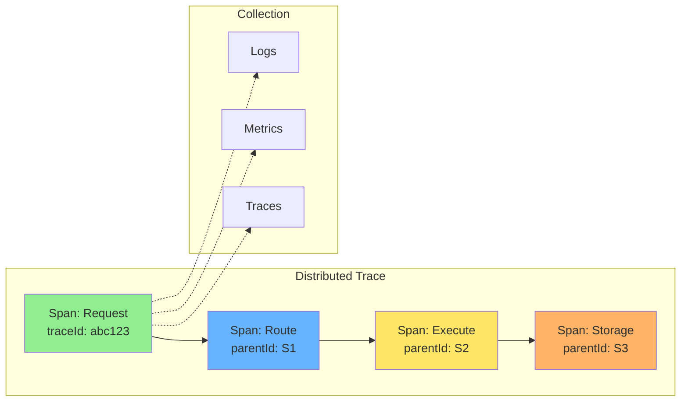

# Observability

Distributed tracing, logging, and metrics for BrowserMesh.

**Related specs**: [message-envelope.md](../networking/message-envelope.md) | [error-handling.md](../core/error-handling.md) | [wire-format.md](../core/wire-format.md)

## 1. Overview

Observability provides:
- Distributed tracing (trace/span IDs)
- Structured logging
- Metrics collection
- Hop tracking
- Timing information



## 2. Trace Context

Every message carries trace context:

```typescript
interface TraceContext {
  traceId: string;         // Unique trace identifier (UUID)
  spanId: string;          // Current span identifier
  parentSpanId?: string;   // Parent span (if nested)
  sampled: boolean;        // Whether to record this trace
  baggage?: Record<string, string>;  // Propagated context
}

interface TracedMessage {
  trace: TraceContext;
  timestamp: number;
  payload: any;
}

function createTraceContext(parent?: TraceContext): TraceContext {
  return {
    traceId: parent?.traceId ?? crypto.randomUUID(),
    spanId: crypto.randomUUID().slice(0, 16),
    parentSpanId: parent?.spanId,
    sampled: parent?.sampled ?? Math.random() < SAMPLE_RATE,
    baggage: parent?.baggage,
  };
}
```

## 3. Span Recording

```typescript
interface Span {
  traceId: string;
  spanId: string;
  parentSpanId?: string;

  operationName: string;
  serviceName: string;
  podId: string;

  startTime: number;
  endTime?: number;
  duration?: number;

  status: 'ok' | 'error' | 'timeout';
  error?: {
    code: string;
    message: string;
    stack?: string;
  };

  tags: Record<string, string | number | boolean>;
  logs: SpanLog[];
}

interface SpanLog {
  timestamp: number;
  level: 'debug' | 'info' | 'warn' | 'error';
  message: string;
  fields?: Record<string, any>;
}

class SpanRecorder {
  private spans: Span[] = [];
  private currentSpan?: Span;

  startSpan(
    operationName: string,
    parent?: TraceContext
  ): Span {
    const trace = createTraceContext(parent);

    const span: Span = {
      traceId: trace.traceId,
      spanId: trace.spanId,
      parentSpanId: trace.parentSpanId,
      operationName,
      serviceName: this.serviceName,
      podId: this.podId,
      startTime: Date.now(),
      status: 'ok',
      tags: {},
      logs: [],
    };

    this.currentSpan = span;
    return span;
  }

  finishSpan(span: Span, status: 'ok' | 'error' = 'ok'): void {
    span.endTime = Date.now();
    span.duration = span.endTime - span.startTime;
    span.status = status;

    this.spans.push(span);
    this.currentSpan = undefined;

    // Export if sampled
    if (this.shouldExport(span)) {
      this.export(span);
    }
  }

  log(message: string, level: SpanLog['level'] = 'info'): void {
    if (!this.currentSpan) return;

    this.currentSpan.logs.push({
      timestamp: Date.now(),
      level,
      message,
    });
  }

  tag(key: string, value: string | number | boolean): void {
    if (!this.currentSpan) return;
    this.currentSpan.tags[key] = value;
  }
}
```

## 4. Hop Tracking

Track message path through the mesh:

```typescript
interface Hop {
  podId: string;
  podKind: PodKind;
  origin: string;
  arrivalTime: number;
  departureTime?: number;
  processingTime?: number;
  action: 'receive' | 'forward' | 'process' | 'respond';
}

interface HopList {
  hops: Hop[];

  addHop(hop: Omit<Hop, 'arrivalTime'>): void;
  getTotalLatency(): number;
  getProcessingTime(): number;
  getNetworkTime(): number;
}

class HopTracker implements HopList {
  hops: Hop[] = [];

  addHop(hop: Omit<Hop, 'arrivalTime'>): void {
    const now = Date.now();

    // Update previous hop departure time
    if (this.hops.length > 0) {
      const prev = this.hops[this.hops.length - 1];
      prev.departureTime = now;
      prev.processingTime = now - prev.arrivalTime;
    }

    this.hops.push({
      ...hop,
      arrivalTime: now,
    });
  }

  getTotalLatency(): number {
    if (this.hops.length < 2) return 0;
    const first = this.hops[0];
    const last = this.hops[this.hops.length - 1];
    return (last.departureTime || last.arrivalTime) - first.arrivalTime;
  }

  getProcessingTime(): number {
    return this.hops.reduce((sum, hop) => sum + (hop.processingTime || 0), 0);
  }

  getNetworkTime(): number {
    return this.getTotalLatency() - this.getProcessingTime();
  }
}

// Add hop tracking to message envelope
interface TracedEnvelope extends MeshMessage {
  trace: TraceContext;
  hops: Hop[];
}
```

## 5. Metrics

```typescript
interface Metric {
  name: string;
  type: 'counter' | 'gauge' | 'histogram';
  value: number;
  labels: Record<string, string>;
  timestamp: number;
}

class MetricsCollector {
  private metrics: Metric[] = [];

  // Counters
  incrementCounter(
    name: string,
    labels: Record<string, string> = {},
    value: number = 1
  ): void {
    this.record({
      name,
      type: 'counter',
      value,
      labels,
      timestamp: Date.now(),
    });
  }

  // Gauges
  setGauge(
    name: string,
    value: number,
    labels: Record<string, string> = {}
  ): void {
    this.record({
      name,
      type: 'gauge',
      value,
      labels,
      timestamp: Date.now(),
    });
  }

  // Histograms
  recordHistogram(
    name: string,
    value: number,
    labels: Record<string, string> = {}
  ): void {
    this.record({
      name,
      type: 'histogram',
      value,
      labels,
      timestamp: Date.now(),
    });
  }

  private record(metric: Metric): void {
    this.metrics.push(metric);

    // Export if buffer full
    if (this.metrics.length >= METRICS_BUFFER_SIZE) {
      this.flush();
    }
  }
}

// Standard metrics
const STANDARD_METRICS = {
  // Request metrics
  'mesh.requests.total': 'counter',
  'mesh.requests.duration': 'histogram',
  'mesh.requests.errors': 'counter',

  // Connection metrics
  'mesh.peers.active': 'gauge',
  'mesh.connections.total': 'counter',

  // Message metrics
  'mesh.messages.sent': 'counter',
  'mesh.messages.received': 'counter',
  'mesh.messages.bytes': 'counter',

  // Pod metrics
  'pod.memory.used': 'gauge',
  'pod.cpu.usage': 'gauge',
  'pod.uptime': 'gauge',
};
```

## 6. Structured Logging

```typescript
interface LogEntry {
  timestamp: number;
  level: 'debug' | 'info' | 'warn' | 'error';
  message: string;

  // Context
  podId: string;
  podKind: PodKind;
  traceId?: string;
  spanId?: string;

  // Structured data
  fields?: Record<string, any>;
  error?: {
    name: string;
    message: string;
    stack?: string;
  };
}

class StructuredLogger {
  private podId: string;
  private podKind: PodKind;
  private currentTrace?: TraceContext;

  withTrace(trace: TraceContext): StructuredLogger {
    const logger = new StructuredLogger(this.podId, this.podKind);
    logger.currentTrace = trace;
    return logger;
  }

  info(message: string, fields?: Record<string, any>): void {
    this.log('info', message, fields);
  }

  warn(message: string, fields?: Record<string, any>): void {
    this.log('warn', message, fields);
  }

  error(message: string, error?: Error, fields?: Record<string, any>): void {
    this.log('error', message, {
      ...fields,
      error: error ? {
        name: error.name,
        message: error.message,
        stack: error.stack,
      } : undefined,
    });
  }

  private log(
    level: LogEntry['level'],
    message: string,
    fields?: Record<string, any>
  ): void {
    const entry: LogEntry = {
      timestamp: Date.now(),
      level,
      message,
      podId: this.podId,
      podKind: this.podKind,
      traceId: this.currentTrace?.traceId,
      spanId: this.currentTrace?.spanId,
      fields,
    };

    this.emit(entry);
  }

  private emit(entry: LogEntry): void {
    // Console output
    const prefix = `[${entry.level.toUpperCase()}] [${entry.podId.slice(0, 8)}]`;
    if (entry.traceId) {
      console.log(`${prefix} [${entry.traceId.slice(0, 8)}] ${entry.message}`, entry.fields || '');
    } else {
      console.log(`${prefix} ${entry.message}`, entry.fields || '');
    }

    // Export to collector
    this.collector?.collect(entry);
  }
}
```

## 7. Error Classification

```typescript
enum ErrorCategory {
  NETWORK = 'network',
  TIMEOUT = 'timeout',
  ROUTING = 'routing',
  AUTHORIZATION = 'authorization',
  EXECUTION = 'execution',
  INTERNAL = 'internal',
}

interface ClassifiedError {
  category: ErrorCategory;
  code: string;
  message: string;
  retryable: boolean;
  details?: Record<string, any>;
}

function classifyError(error: Error): ClassifiedError {
  // Network errors
  if (error.message.includes('network') || error.message.includes('fetch')) {
    return {
      category: ErrorCategory.NETWORK,
      code: 'NETWORK_ERROR',
      message: error.message,
      retryable: true,
    };
  }

  // Timeout errors
  if (error.message.includes('timeout')) {
    return {
      category: ErrorCategory.TIMEOUT,
      code: 'TIMEOUT',
      message: error.message,
      retryable: true,
    };
  }

  // Routing errors
  if (error.message.includes('no route') || error.message.includes('not found')) {
    return {
      category: ErrorCategory.ROUTING,
      code: 'NO_ROUTE',
      message: error.message,
      retryable: false,
    };
  }

  // Authorization errors
  if (error.message.includes('unauthorized') || error.message.includes('forbidden')) {
    return {
      category: ErrorCategory.AUTHORIZATION,
      code: 'UNAUTHORIZED',
      message: error.message,
      retryable: false,
    };
  }

  // Default: internal error
  return {
    category: ErrorCategory.INTERNAL,
    code: 'INTERNAL_ERROR',
    message: error.message,
    retryable: false,
  };
}
```

## 8. Trace Visualization

```typescript
interface TraceTree {
  rootSpan: Span;
  children: Map<string, TraceTree>;
}

function buildTraceTree(spans: Span[]): TraceTree | null {
  if (spans.length === 0) return null;

  // Find root span (no parent)
  const root = spans.find(s => !s.parentSpanId);
  if (!root) return null;

  // Build tree
  const tree: TraceTree = {
    rootSpan: root,
    children: new Map(),
  };

  function addChildren(node: TraceTree): void {
    const children = spans.filter(
      s => s.parentSpanId === node.rootSpan.spanId
    );

    for (const child of children) {
      const childNode: TraceTree = {
        rootSpan: child,
        children: new Map(),
      };
      node.children.set(child.spanId, childNode);
      addChildren(childNode);
    }
  }

  addChildren(tree);
  return tree;
}

// ASCII visualization
function visualizeTrace(tree: TraceTree, indent = 0): string {
  const prefix = '  '.repeat(indent);
  const span = tree.rootSpan;
  let result = `${prefix}├─ ${span.operationName} (${span.duration}ms) [${span.status}]\n`;

  for (const child of tree.children.values()) {
    result += visualizeTrace(child, indent + 1);
  }

  return result;
}

// Example output:
// ├─ mesh.send (45ms) [ok]
//   ├─ routing.resolve (2ms) [ok]
//   ├─ transport.send (40ms) [ok]
//     ├─ compute.execute (35ms) [ok]
```

## 9. Export Formats

### OpenTelemetry Compatible

```typescript
interface OTelSpan {
  traceId: string;
  spanId: string;
  parentSpanId?: string;
  name: string;
  kind: 'INTERNAL' | 'CLIENT' | 'SERVER';
  startTimeUnixNano: number;
  endTimeUnixNano: number;
  attributes: Array<{ key: string; value: { stringValue?: string; intValue?: number } }>;
  status: { code: 'OK' | 'ERROR'; message?: string };
}

function toOTelSpan(span: Span): OTelSpan {
  return {
    traceId: span.traceId,
    spanId: span.spanId,
    parentSpanId: span.parentSpanId,
    name: span.operationName,
    kind: 'INTERNAL',
    startTimeUnixNano: span.startTime * 1_000_000,
    endTimeUnixNano: (span.endTime || span.startTime) * 1_000_000,
    attributes: Object.entries(span.tags).map(([key, value]) => ({
      key,
      value: typeof value === 'number'
        ? { intValue: value }
        : { stringValue: String(value) },
    })),
    status: {
      code: span.status === 'ok' ? 'OK' : 'ERROR',
      message: span.error?.message,
    },
  };
}
```

## 10. Browser-Specific Constraints

Observability in browsers faces unique challenges not present in server environments.

### 10.1 Limited Performance APIs

Browsers restrict access to system metrics:

```typescript
// What's available vs what we'd want

interface BrowserMetricsLimitations {
  // Memory: Only available in Chrome, deprecated
  memory: {
    available: 'Chrome only (performance.memory)',
    precision: 'Coarse (MB granularity)',
    includes: 'JS heap only, not WebAssembly or DOM',
  };

  // CPU: Not directly available
  cpu: {
    available: 'None - must estimate from timing',
    workaround: 'Measure task duration, infer load',
  };

  // Network: Limited visibility
  network: {
    available: 'Resource Timing API, Navigation Timing',
    missing: 'Cannot see other tabs, WebSocket frame timing',
  };
}

// Practical memory monitoring (Chrome only)
function getMemoryUsage(): MemoryInfo | null {
  const perf = performance as any;
  if (!perf.memory) return null;

  return {
    usedJSHeapSize: perf.memory.usedJSHeapSize,
    totalJSHeapSize: perf.memory.totalJSHeapSize,
    jsHeapSizeLimit: perf.memory.jsHeapSizeLimit,
    // Note: These values update infrequently and are approximate
  };
}

// CPU estimation via task timing
class CPUEstimator {
  private samples: number[] = [];

  measureTask<T>(fn: () => T): T {
    const start = performance.now();
    const result = fn();
    const duration = performance.now() - start;

    this.samples.push(duration);
    if (this.samples.length > 100) this.samples.shift();

    return result;
  }

  getEstimatedLoad(): 'low' | 'medium' | 'high' {
    const avg = this.samples.reduce((a, b) => a + b, 0) / this.samples.length;
    // Compare against baseline established during idle
    if (avg < this.baseline * 1.5) return 'low';
    if (avg < this.baseline * 3) return 'medium';
    return 'high';
  }
}
```

### 10.2 Console and Storage Limitations

Browser consoles and storage have constraints:

```typescript
// Console logs can be cleared, have size limits, and slow down the page

class BrowserLogger {
  private buffer: LogEntry[] = [];
  private readonly maxBuffer = 1000;

  // Problem: console.log is synchronous and blocks main thread
  // Solution: Buffer and batch writes

  log(entry: LogEntry): void {
    this.buffer.push(entry);

    // Batch write to avoid blocking
    if (this.buffer.length >= 50) {
      this.flush();
    }
  }

  private flush(): void {
    // Use requestIdleCallback to avoid blocking user interaction
    requestIdleCallback(() => {
      const batch = this.buffer.splice(0, 50);

      // Write to IndexedDB for persistence
      this.persistLogs(batch);

      // Optionally write to console (can be disabled in production)
      if (this.consoleEnabled) {
        console.groupCollapsed(`[BrowserMesh] ${batch.length} logs`);
        batch.forEach(e => console.log(e));
        console.groupEnd();
      }
    });
  }

  // Problem: IndexedDB has storage limits
  // Solution: Rotate logs, keep recent only

  private async persistLogs(logs: LogEntry[]): Promise<void> {
    const tx = this.db.transaction('logs', 'readwrite');
    const store = tx.objectStore('logs');

    for (const log of logs) {
      await store.add(log);
    }

    // Prune old logs if over limit
    const count = await store.count();
    if (count > this.maxStoredLogs) {
      const cursor = await store.openCursor();
      let deleted = 0;
      const toDelete = count - this.maxStoredLogs;

      while (cursor && deleted < toDelete) {
        await cursor.delete();
        await cursor.continue();
        deleted++;
      }
    }
  }
}
```

### 10.3 Trace Export Challenges

Exporting traces from browsers requires care:

```typescript
// Challenge: No persistent background process to export traces
// Solution: Multiple export strategies

class BrowserTraceExporter {
  // Strategy 1: Beacon API (works even during page unload)
  exportViaBeacon(spans: Span[]): boolean {
    const payload = JSON.stringify(spans);
    return navigator.sendBeacon('/traces', payload);
    // Note: Limited to ~64KB, no response, fire-and-forget
  }

  // Strategy 2: Service Worker background sync
  async exportViaSW(spans: Span[]): Promise<void> {
    // Store in IndexedDB
    await this.db.put('pending-traces', {
      id: crypto.randomUUID(),
      spans,
      timestamp: Date.now(),
    });

    // Request background sync (SW will handle export)
    const reg = await navigator.serviceWorker.ready;
    await reg.sync.register('export-traces');
  }

  // Strategy 3: Export on visibility change
  setupVisibilityExport(): void {
    document.addEventListener('visibilitychange', () => {
      if (document.visibilityState === 'hidden') {
        // Page might be closing - export now
        const spans = this.collectPendingSpans();
        if (spans.length > 0) {
          this.exportViaBeacon(spans);
        }
      }
    });
  }

  // Strategy 4: Periodic export during activity
  setupPeriodicExport(intervalMs: number = 30000): void {
    setInterval(() => {
      if (document.visibilityState === 'visible') {
        this.exportViaFetch();
      }
    }, intervalMs);
  }
}

// Service Worker trace export handler
self.addEventListener('sync', (event: SyncEvent) => {
  if (event.tag === 'export-traces') {
    event.waitUntil(exportPendingTraces());
  }
});

async function exportPendingTraces(): Promise<void> {
  const db = await openDB('traces');
  const pending = await db.getAll('pending-traces');

  for (const batch of pending) {
    try {
      await fetch('/traces', {
        method: 'POST',
        body: JSON.stringify(batch.spans),
        headers: { 'Content-Type': 'application/json' },
      });
      await db.delete('pending-traces', batch.id);
    } catch {
      // Will retry on next sync
      break;
    }
  }
}
```

### 10.4 Cross-Origin Tracing

Tracing across origins requires coordination:

```typescript
// Challenge: postMessage doesn't preserve trace context automatically
// Solution: Explicitly propagate trace context in messages

interface CrossOriginTracedMessage {
  // Standard message fields
  type: string;
  payload: any;

  // Trace context (must be serializable)
  __trace?: {
    traceId: string;
    spanId: string;
    parentSpanId?: string;
    sampled: boolean;
    // Baggage for cross-cutting concerns
    baggage?: Record<string, string>;
  };
}

class CrossOriginTracer {
  // Inject trace context into outgoing messages
  wrapMessage<T>(message: T, span: Span): CrossOriginTracedMessage {
    return {
      ...message,
      __trace: {
        traceId: span.traceId,
        spanId: span.spanId,
        parentSpanId: span.parentSpanId,
        sampled: true,
      },
    };
  }

  // Extract trace context from incoming messages
  extractTrace(message: CrossOriginTracedMessage): TraceContext | undefined {
    if (!message.__trace) return undefined;

    return {
      traceId: message.__trace.traceId,
      spanId: message.__trace.spanId,
      parentSpanId: message.__trace.parentSpanId,
      sampled: message.__trace.sampled,
      baggage: message.__trace.baggage,
    };
  }

  // Continue trace from incoming message
  continueTrace(message: CrossOriginTracedMessage): Span {
    const parentTrace = this.extractTrace(message);
    return this.tracer.startSpan('handle-message', parentTrace);
  }
}
```

### 10.5 Timing Precision Issues

Browser timing can be imprecise or deliberately reduced:

```typescript
// Challenge: performance.now() precision is reduced for security (Spectre mitigations)
// Typical precision: 5μs to 100μs depending on browser and context

interface TimingConsiderations {
  // Cross-origin isolated contexts get better precision
  crossOriginIsolated: boolean;

  // Actual precision varies
  precision: {
    sameOrigin: '5-20μs',
    crossOrigin: '100μs',
    reduced: '1ms (some browsers)',
  };
}

class PrecisionAwareTimer {
  private readonly minMeaningfulDuration: number;

  constructor() {
    // Determine actual precision
    this.minMeaningfulDuration = this.measurePrecision();
  }

  private measurePrecision(): number {
    const samples: number[] = [];
    for (let i = 0; i < 100; i++) {
      const start = performance.now();
      const end = performance.now();
      if (end > start) {
        samples.push(end - start);
      }
    }
    // Minimum non-zero difference is our precision floor
    return Math.min(...samples.filter(s => s > 0)) || 0.1;
  }

  // Only record durations that exceed our precision
  shouldRecord(duration: number): boolean {
    return duration > this.minMeaningfulDuration * 10;
  }

  // Warn if timing seems unreliable
  checkReliability(span: Span): void {
    if (span.duration && span.duration < this.minMeaningfulDuration * 5) {
      span.tags['timing.unreliable'] = true;
      span.tags['timing.precision'] = this.minMeaningfulDuration;
    }
  }
}
```

### 10.6 Summary: Browser vs Server Observability

| Aspect | Server | Browser |
|--------|--------|---------|
| Memory metrics | Full (RSS, heap, etc.) | JS heap only (Chrome) |
| CPU metrics | Full utilization | Must estimate |
| Log persistence | Files, stdout | IndexedDB (with limits) |
| Trace export | Always-on daemon | Best-effort, may lose data |
| Timing precision | Nanoseconds | 5μs - 1ms |
| Background processing | Continuous | Throttled/frozen |
| Cross-process tracing | Standard (gRPC, HTTP) | Manual propagation |
| Storage for telemetry | Unlimited | Quota-limited |

## 11. HAR Traffic Capture

Map mesh request/response pairs to HAR 1.2 entries for analysis in Chrome DevTools or other HAR-compatible tools.

### 11.1 MeshHarEntry

```typescript
interface MeshHarEntry {
  /** Standard HAR 1.2 entry fields */
  startedDateTime: string;  // ISO 8601
  time: number;             // Total elapsed time (ms)

  /** Request details */
  request: {
    method: string;         // Mesh method (e.g., 'compute/run')
    url: string;            // Mesh address (e.g., 'mesh://pod-id/service')
    headers: Array<{ name: string; value: string }>;
    bodySize: number;
    postData?: { mimeType: string; text: string };
  };

  /** Response details */
  response: {
    status: number;         // 200 for success, error codes mapped
    statusText: string;
    headers: Array<{ name: string; value: string }>;
    bodySize: number;
    content: { size: number; mimeType: string; text?: string };
  };

  /** Timing breakdown */
  timings: {
    blocked: number;        // Time in queue
    dns: -1;                // Not applicable for mesh
    connect: number;        // Session establishment
    send: number;           // Time to send request
    wait: number;           // Waiting for first response byte
    receive: number;        // Time to receive response
    ssl: number;            // Crypto handshake (if applicable)
  };

  /** BrowserMesh extensions */
  _meshPodId: string;
  _meshTraceId?: string;
  _meshHops?: number;
}
```

### 11.2 MeshHarLog

```typescript
interface MeshHarLog {
  log: {
    version: '1.2';
    creator: { name: 'BrowserMesh'; version: string };
    entries: MeshHarEntry[];

    /** Capture session metadata */
    comment?: string;
    _meshSessionStart: number;
    _meshSessionEnd?: number;
    _meshPodId: string;
  };
}
```

### 11.3 TrafficRecorder

```typescript
class TrafficRecorder {
  private entries: MeshHarEntry[] = [];
  private recording = false;
  private startTime?: number;
  private filter?: (msg: MessageEnvelope) => boolean;

  /** Start recording traffic */
  start(filter?: (msg: MessageEnvelope) => boolean): void {
    this.recording = true;
    this.startTime = Date.now();
    this.filter = filter;
    this.entries = [];
  }

  /** Stop recording */
  stop(): void {
    this.recording = false;
  }

  /** Record a request/response pair */
  record(request: MeshRequest, response: unknown, timing: RequestTiming): void {
    if (!this.recording) return;
    if (this.filter && !this.filter(request as any)) return;

    this.entries.push(this.toHarEntry(request, response, timing));
  }

  /** Export as HAR 1.2 JSON */
  export(): MeshHarLog {
    return {
      log: {
        version: '1.2',
        creator: { name: 'BrowserMesh', version: '1.0.0' },
        entries: [...this.entries],
        _meshSessionStart: this.startTime ?? Date.now(),
        _meshSessionEnd: Date.now(),
        _meshPodId: this.podId,
      },
    };
  }

  /** Replay captured traffic against a target */
  async replay(log: MeshHarLog, target: MeshClient): Promise<ReplayResult[]> {
    const results: ReplayResult[] = [];

    for (const entry of log.log.entries) {
      const start = Date.now();
      try {
        const response = await target.request(
          { podId: entry._meshPodId },
          entry.request.method,
          entry.request.postData
            ? JSON.parse(entry.request.postData.text)
            : undefined
        );
        results.push({
          entry,
          success: true,
          duration: Date.now() - start,
          response,
        });
      } catch (error) {
        results.push({
          entry,
          success: false,
          duration: Date.now() - start,
          error: error as Error,
        });
      }
    }

    return results;
  }

  private toHarEntry(
    request: MeshRequest,
    response: unknown,
    timing: RequestTiming
  ): MeshHarEntry {
    const requestBody = JSON.stringify(request.args);
    const responseBody = JSON.stringify(response);

    return {
      startedDateTime: new Date(timing.startTime).toISOString(),
      time: timing.totalTime,
      request: {
        method: request.method,
        url: `mesh://${request.from}/${request.method}`,
        headers: [
          { name: 'X-Mesh-From', value: request.from },
          { name: 'X-Mesh-Id', value: request.id },
        ],
        bodySize: requestBody.length,
        postData: { mimeType: 'application/json', text: requestBody },
      },
      response: {
        status: 200,
        statusText: 'OK',
        headers: [],
        bodySize: responseBody.length,
        content: {
          size: responseBody.length,
          mimeType: 'application/json',
          text: responseBody,
        },
      },
      timings: {
        blocked: timing.queueTime,
        dns: -1,
        connect: timing.connectTime,
        send: timing.sendTime,
        wait: timing.waitTime,
        receive: timing.receiveTime,
        ssl: timing.cryptoTime,
      },
      _meshPodId: request.from,
      _meshTraceId: timing.traceId,
      _meshHops: timing.hops,
    };
  }
}

interface RequestTiming {
  startTime: number;
  totalTime: number;
  queueTime: number;
  connectTime: number;
  sendTime: number;
  waitTime: number;
  receiveTime: number;
  cryptoTime: number;
  traceId?: string;
  hops?: number;
}

interface ReplayResult {
  entry: MeshHarEntry;
  success: boolean;
  duration: number;
  response?: unknown;
  error?: Error;
}
```

## 12. Integration Example

```typescript
class ObservableMesh {
  private tracer: SpanRecorder;
  private logger: StructuredLogger;
  private metrics: MetricsCollector;

  async send(
    target: string,
    message: any,
    parentTrace?: TraceContext
  ): Promise<any> {
    // Start span
    const span = this.tracer.startSpan('mesh.send', parentTrace);
    span.tags['mesh.target'] = target;

    const logger = this.logger.withTrace({
      traceId: span.traceId,
      spanId: span.spanId,
      sampled: true,
    });

    // Track hops
    const hops = new HopTracker();
    hops.addHop({
      podId: this.podId,
      podKind: this.podKind,
      origin: this.origin,
      action: 'send',
    });

    try {
      logger.info('Sending message', { target });
      this.metrics.incrementCounter('mesh.requests.total', { target });

      const startTime = Date.now();

      // Actual send with trace context
      const result = await this.doSend(target, {
        trace: {
          traceId: span.traceId,
          spanId: span.spanId,
          sampled: true,
        },
        hops: hops.hops,
        payload: message,
      });

      // Record metrics
      const duration = Date.now() - startTime;
      this.metrics.recordHistogram('mesh.requests.duration', duration, { target });

      logger.info('Request completed', { duration, hops: hops.hops.length });

      this.tracer.finishSpan(span, 'ok');
      return result;

    } catch (error) {
      logger.error('Request failed', error as Error);

      const classified = classifyError(error as Error);
      span.tags['error.category'] = classified.category;
      span.tags['error.code'] = classified.code;
      span.error = { code: classified.code, message: classified.message };

      this.metrics.incrementCounter('mesh.requests.errors', {
        target,
        category: classified.category,
      });

      this.tracer.finishSpan(span, 'error');
      throw error;
    }
  }
}
```
