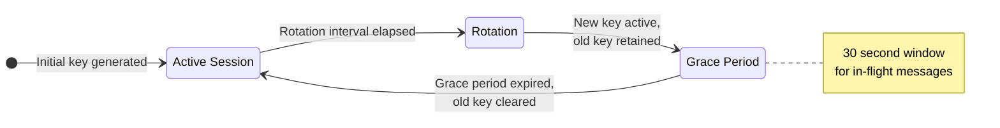
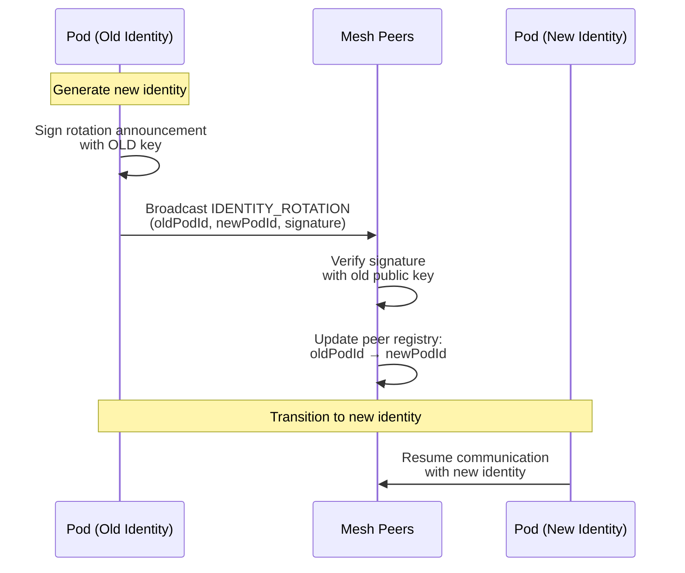
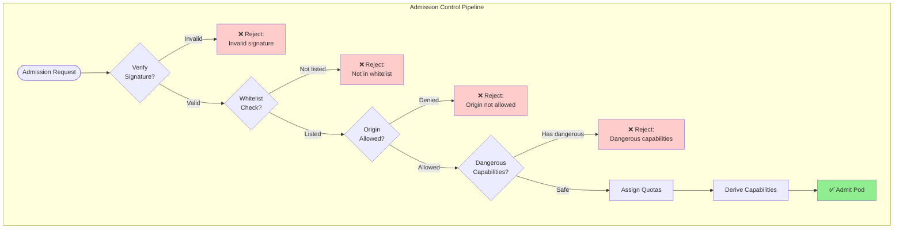
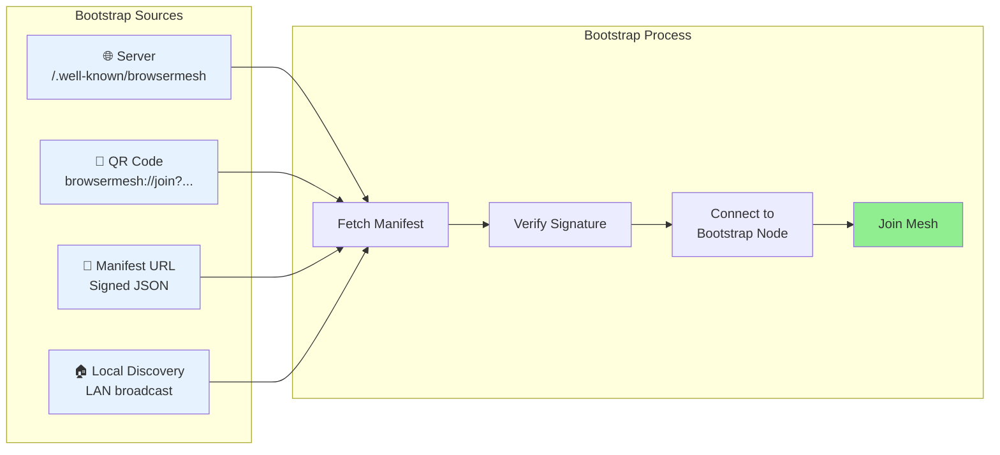
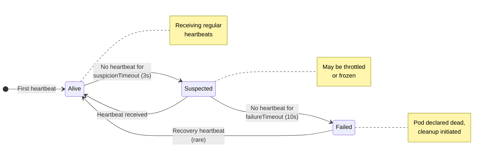
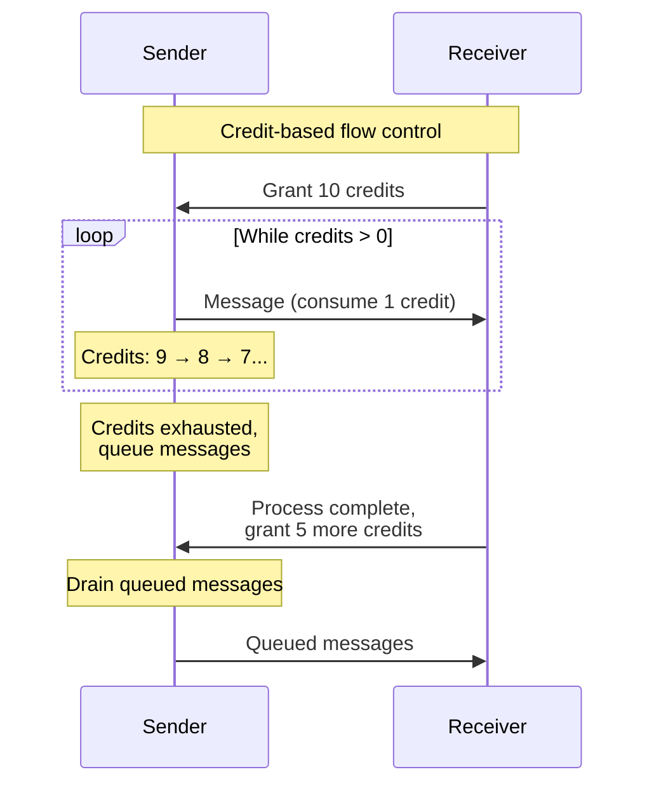
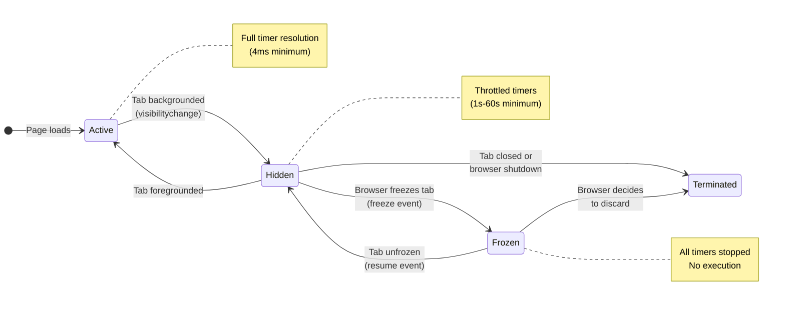

# Operations

Key rotation, admission control, bootstrap, and operational concerns for BrowserMesh.

**Related specs**: [identity-keys.md](../crypto/identity-keys.md) | [session-keys.md](../crypto/session-keys.md) | [security-model.md](../core/security-model.md)

## 1. Key Rotation

### 1.1 Session Key Rotation

Session keys should rotate regularly:



```typescript
interface SessionKeyRotation {
  currentKey: CryptoKey;
  previousKey?: CryptoKey;  // Keep for in-flight messages
  rotatedAt: number;
  expiresAt: number;
}

class SessionKeyManager {
  private rotation: SessionKeyRotation;
  private rotationInterval = 3600000;  // 1 hour

  async rotateSessionKey(): Promise<void> {
    // Generate new key
    const newKey = await this.deriveSessionKey(Date.now());

    // Keep old key briefly for in-flight messages
    this.rotation = {
      currentKey: newKey,
      previousKey: this.rotation?.currentKey,
      rotatedAt: Date.now(),
      expiresAt: Date.now() + this.rotationInterval,
    };

    // Clear previous key after grace period
    setTimeout(() => {
      this.rotation.previousKey = undefined;
    }, 30000);  // 30s grace period
  }

  async decrypt(
    ciphertext: Uint8Array,
    nonce: Uint8Array
  ): Promise<Uint8Array> {
    // Try current key first
    try {
      return await decrypt(this.rotation.currentKey, ciphertext, nonce);
    } catch {
      // Fall back to previous key
      if (this.rotation.previousKey) {
        return await decrypt(this.rotation.previousKey, ciphertext, nonce);
      }
      throw new Error('Decryption failed');
    }
  }
}
```

### 1.2 Identity Key Rotation

Identity keys are long-lived but may need rotation:



```typescript
interface IdentityRotation {
  currentIdentity: PodIdentityHD;
  previousIdentity?: PodIdentityHD;
  announcement?: IdentityRotationAnnouncement;
}

interface IdentityRotationAnnouncement {
  type: 'IDENTITY_ROTATION';
  oldPodId: string;
  newPodId: string;
  oldPublicKey: Uint8Array;
  newPublicKey: Uint8Array;
  signature: Uint8Array;  // Signed by OLD key
  timestamp: number;
}

class IdentityRotator {
  /**
   * Rotate identity key
   */
  async rotateIdentity(): Promise<IdentityRotationAnnouncement> {
    // Create new identity
    const newIdentity = await PodIdentityHD.create();

    // Sign rotation announcement with OLD key
    const announcement: IdentityRotationAnnouncement = {
      type: 'IDENTITY_ROTATION',
      oldPodId: this.currentIdentity.podId,
      newPodId: newIdentity.podId,
      oldPublicKey: await this.currentIdentity.getRootPublicKey(),
      newPublicKey: await newIdentity.getRootPublicKey(),
      timestamp: Date.now(),
      signature: new Uint8Array(0),  // Will be set below
    };

    // Sign with old key
    const message = this.encodeAnnouncement(announcement);
    announcement.signature = await this.currentIdentity.signRoot(message);

    // Broadcast announcement
    await this.broadcast(announcement);

    // Update state
    this.rotation = {
      currentIdentity: newIdentity,
      previousIdentity: this.currentIdentity,
      announcement,
    };

    return announcement;
  }

  /**
   * Verify rotation announcement
   */
  async verifyRotation(
    announcement: IdentityRotationAnnouncement
  ): Promise<boolean> {
    // Verify signature with old key
    const oldKey = await importEd25519PublicKey(announcement.oldPublicKey);
    const message = this.encodeAnnouncement({
      ...announcement,
      signature: new Uint8Array(0),
    });

    return crypto.subtle.verify(
      'Ed25519',
      oldKey,
      announcement.signature,
      message
    );
  }
}
```

### 1.3 Recovery Procedures

```typescript
interface RecoveryOptions {
  // Backup methods
  exportMnemonic(): string[];
  exportBackupKey(): Uint8Array;

  // Recovery methods
  restoreFromMnemonic(words: string[]): Promise<PodIdentityHD>;
  restoreFromBackup(key: Uint8Array): Promise<PodIdentityHD>;
}

class IdentityRecovery {
  /**
   * Export as mnemonic (BIP-39 style)
   */
  exportMnemonic(rootSecret: Uint8Array): string[] {
    // Convert 32 bytes to 24 words
    return bytesToMnemonic(rootSecret);
  }

  /**
   * Restore from mnemonic
   */
  async restoreFromMnemonic(words: string[]): Promise<PodIdentityHD> {
    const rootSecret = mnemonicToBytes(words);
    return PodIdentityHD.restore(rootSecret);
  }

  /**
   * Export encrypted backup
   */
  async exportBackup(
    rootSecret: Uint8Array,
    password: string
  ): Promise<Uint8Array> {
    const key = await deriveKeyFromPassword(password);
    return encrypt(key, rootSecret);
  }

  /**
   * Restore from encrypted backup
   */
  async restoreFromBackup(
    backup: Uint8Array,
    password: string
  ): Promise<PodIdentityHD> {
    const key = await deriveKeyFromPassword(password);
    const rootSecret = await decrypt(key, backup);
    return PodIdentityHD.restore(rootSecret);
  }
}
```

## 2. Admission Control

### 2.1 Pod Admission

Validate pods before they join the mesh:



```typescript
interface AdmissionRequest {
  podInfo: PodInfo;
  capabilities: CapabilitySet;
  publicKey: Uint8Array;
  signature: Uint8Array;
}

interface AdmissionDecision {
  allowed: boolean;
  reason?: string;
  assignedQuotas?: QuotaAssignment;
  derivedCapabilities?: string[];
}

class AdmissionController {
  private policies: AdmissionPolicy[] = [];

  /**
   * Evaluate admission request
   */
  async evaluate(request: AdmissionRequest): Promise<AdmissionDecision> {
    // 1. Verify signature
    if (!await this.verifySignature(request)) {
      return { allowed: false, reason: 'Invalid signature' };
    }

    // 2. Check against policies
    for (const policy of this.policies) {
      const result = await policy.evaluate(request);
      if (!result.allowed) {
        return result;
      }
    }

    // 3. Assign quotas
    const quotas = this.assignQuotas(request);

    // 4. Derive capabilities
    const capabilities = this.deriveCapabilities(request);

    return {
      allowed: true,
      assignedQuotas: quotas,
      derivedCapabilities: capabilities,
    };
  }
}

interface AdmissionPolicy {
  name: string;
  evaluate(request: AdmissionRequest): Promise<AdmissionDecision>;
}

// Example policies
const policies: AdmissionPolicy[] = [
  // Whitelist policy
  {
    name: 'whitelist',
    async evaluate(request) {
      const allowed = WHITELIST.has(request.podInfo.id);
      return { allowed, reason: allowed ? undefined : 'Not in whitelist' };
    },
  },

  // Origin policy
  {
    name: 'origin-check',
    async evaluate(request) {
      const allowed = ALLOWED_ORIGINS.some(
        o => request.podInfo.origin.startsWith(o)
      );
      return { allowed, reason: allowed ? undefined : 'Origin not allowed' };
    },
  },

  // Capability policy
  {
    name: 'capability-check',
    async evaluate(request) {
      const dangerous = DANGEROUS_CAPABILITIES.filter(
        c => request.capabilities[c]
      );
      const allowed = dangerous.length === 0;
      return {
        allowed,
        reason: allowed ? undefined : `Dangerous capabilities: ${dangerous}`,
      };
    },
  },
];
```

### 2.2 Quota Assignment

```typescript
interface QuotaAssignment {
  // Rate limits
  requestsPerMinute: number;
  messagesPerSecond: number;

  // Resource limits
  maxConcurrentConnections: number;
  maxPendingRequests: number;
  maxMessageSize: number;

  // Storage limits
  maxStorageBytes?: number;

  // Compute limits
  maxComputeTimeMs?: number;
}

class QuotaManager {
  private quotas: Map<string, QuotaAssignment> = new Map();
  private usage: Map<string, QuotaUsage> = new Map();

  assign(podId: string, quota: QuotaAssignment): void {
    this.quotas.set(podId, quota);
    this.usage.set(podId, {
      requestsThisMinute: 0,
      messagesThisSecond: 0,
      activeConnections: 0,
      pendingRequests: 0,
    });
  }

  checkQuota(podId: string, action: string): boolean {
    const quota = this.quotas.get(podId);
    const usage = this.usage.get(podId);

    if (!quota || !usage) return false;

    switch (action) {
      case 'request':
        return usage.requestsThisMinute < quota.requestsPerMinute;
      case 'message':
        return usage.messagesThisSecond < quota.messagesPerSecond;
      case 'connect':
        return usage.activeConnections < quota.maxConcurrentConnections;
      default:
        return true;
    }
  }

  recordUsage(podId: string, action: string): void {
    const usage = this.usage.get(podId);
    if (!usage) return;

    switch (action) {
      case 'request':
        usage.requestsThisMinute++;
        break;
      case 'message':
        usage.messagesThisSecond++;
        break;
      case 'connect':
        usage.activeConnections++;
        break;
    }
  }
}
```

## 3. Bootstrap Anchors

How fresh installations discover the mesh:



```typescript
interface BootstrapAnchor {
  type: 'server' | 'manifest' | 'qr' | 'local';
  address: string;
  publicKey?: Uint8Array;
  signature?: Uint8Array;
}

class BootstrapManager {
  private anchors: BootstrapAnchor[] = [];

  /**
   * Bootstrap from well-known server
   */
  async bootstrapFromServer(serverUrl: string): Promise<void> {
    // Fetch bootstrap manifest
    const response = await fetch(`${serverUrl}/.well-known/browsermesh`);
    const manifest = await response.json();

    // Verify signature
    if (!await this.verifyManifest(manifest)) {
      throw new Error('Invalid bootstrap manifest');
    }

    // Connect to bootstrap pod
    const pod = await this.connect(manifest.bootstrapPod);
    await pod.join();
  }

  /**
   * Bootstrap from QR code
   */
  async bootstrapFromQR(qrData: string): Promise<void> {
    // Parse QR data
    // Format: browsermesh://join?pod=<podId>&key=<publicKey>&sig=<signature>
    const url = new URL(qrData);
    const podId = url.searchParams.get('pod');
    const key = base64urlDecode(url.searchParams.get('key')!);
    const sig = base64urlDecode(url.searchParams.get('sig')!);

    // Verify and connect
    await this.connectWithInvite({ podId, publicKey: key, signature: sig });
  }

  /**
   * Bootstrap from local discovery (LAN)
   */
  async bootstrapLocal(): Promise<void> {
    // Use well-known server pod on local network
    const localServers = await this.discoverLocal();

    for (const server of localServers) {
      try {
        await this.connect(server);
        return;
      } catch {
        continue;
      }
    }

    throw new Error('No local servers found');
  }

  /**
   * Bootstrap from signed manifest
   */
  async bootstrapFromManifest(manifestUrl: string): Promise<void> {
    const response = await fetch(manifestUrl);
    const manifest: BootstrapManifest = await response.json();

    // Verify chain of trust
    if (!await this.verifyManifestChain(manifest)) {
      throw new Error('Invalid manifest chain');
    }

    // Connect to first available bootstrap node
    for (const node of manifest.bootstrapNodes) {
      try {
        await this.connect(node);
        return;
      } catch {
        continue;
      }
    }
  }
}

interface BootstrapManifest {
  version: string;
  chainId: string;
  bootstrapNodes: BootstrapNode[];
  trustedKeys: Uint8Array[];
  signature: Uint8Array;
}

interface BootstrapNode {
  podId: string;
  address: string;
  publicKey: Uint8Array;
  capabilities: string[];
}
```

## 4. Failure Detection



```typescript
interface FailureDetector {
  // Heartbeat configuration
  heartbeatInterval: number;  // ms between heartbeats
  suspicionTimeout: number;   // ms before suspicion
  failureTimeout: number;     // ms before failure declaration

  // State
  lastSeen: Map<string, number>;
  suspectedPods: Set<string>;
  failedPods: Set<string>;
}

class PhiAccrualDetector implements FailureDetector {
  heartbeatInterval = 1000;
  suspicionTimeout = 3000;
  failureTimeout = 10000;

  lastSeen = new Map<string, number>();
  suspectedPods = new Set<string>();
  failedPods = new Set<string>();

  private heartbeatHistory: Map<string, number[]> = new Map();

  /**
   * Record heartbeat from pod
   */
  recordHeartbeat(podId: string): void {
    const now = Date.now();
    const lastTime = this.lastSeen.get(podId);

    if (lastTime) {
      // Record interval
      const history = this.heartbeatHistory.get(podId) || [];
      history.push(now - lastTime);
      if (history.length > 100) history.shift();
      this.heartbeatHistory.set(podId, history);
    }

    this.lastSeen.set(podId, now);
    this.suspectedPods.delete(podId);
    this.failedPods.delete(podId);
  }

  /**
   * Check if pod is alive
   */
  isAlive(podId: string): boolean {
    return !this.failedPods.has(podId);
  }

  /**
   * Check all pods
   */
  checkAll(): void {
    const now = Date.now();

    for (const [podId, lastTime] of this.lastSeen) {
      const elapsed = now - lastTime;

      if (elapsed > this.failureTimeout) {
        this.failedPods.add(podId);
        this.suspectedPods.delete(podId);
        this.emit('pod:failed', podId);
      } else if (elapsed > this.suspicionTimeout) {
        if (!this.suspectedPods.has(podId)) {
          this.suspectedPods.add(podId);
          this.emit('pod:suspected', podId);
        }
      }
    }
  }
}
```

## 5. Sandboxing & Least Privilege

```typescript
interface PodSandbox {
  // Permissions
  canRequestUserGesture: boolean;
  canAccessOPFS: boolean;
  canOpenWindows: boolean;
  canConnectToServer: boolean;
  canAccessCamera: boolean;
  canAccessMicrophone: boolean;

  // Capability restrictions
  allowedCapabilities: string[];
  deniedCapabilities: string[];

  // Network restrictions
  allowedOrigins: string[];
  deniedOrigins: string[];
}

class SandboxEnforcer {
  private sandboxes: Map<string, PodSandbox> = new Map();

  /**
   * Check if action is allowed
   */
  isAllowed(podId: string, action: string, target?: string): boolean {
    const sandbox = this.sandboxes.get(podId);
    if (!sandbox) return true;  // No sandbox = allow all

    switch (action) {
      case 'user-gesture':
        return sandbox.canRequestUserGesture;

      case 'opfs':
        return sandbox.canAccessOPFS;

      case 'window.open':
        return sandbox.canOpenWindows;

      case 'server-connect':
        return sandbox.canConnectToServer;

      case 'capability':
        if (sandbox.deniedCapabilities.includes(target!)) return false;
        if (sandbox.allowedCapabilities.length > 0) {
          return sandbox.allowedCapabilities.includes(target!);
        }
        return true;

      case 'network':
        if (sandbox.deniedOrigins.some(o => target?.startsWith(o))) return false;
        if (sandbox.allowedOrigins.length > 0) {
          return sandbox.allowedOrigins.some(o => target?.startsWith(o));
        }
        return true;

      default:
        return true;
    }
  }
}
```

## 6. Backpressure & Flow Control



```typescript
interface FlowControlConfig {
  // Credit-based flow control
  initialCredits: number;
  creditRefreshRate: number;  // credits per second

  // Queue limits
  maxQueueSize: number;
  dropPolicy: 'oldest' | 'newest' | 'random';

  // Memory pressure
  memoryThreshold: number;  // bytes
}

class FlowController {
  private credits: Map<string, number> = new Map();
  private queues: Map<string, any[]> = new Map();

  constructor(private config: FlowControlConfig) {}

  /**
   * Check if can send to peer
   */
  canSend(peerId: string): boolean {
    const credits = this.credits.get(peerId) || this.config.initialCredits;
    return credits > 0;
  }

  /**
   * Consume credit for send
   */
  consumeCredit(peerId: string): boolean {
    const credits = this.credits.get(peerId) || this.config.initialCredits;
    if (credits <= 0) return false;

    this.credits.set(peerId, credits - 1);
    return true;
  }

  /**
   * Grant credits (called by receiver)
   */
  grantCredits(peerId: string, amount: number): void {
    const credits = this.credits.get(peerId) || 0;
    this.credits.set(peerId, credits + amount);
  }

  /**
   * Queue message if cannot send immediately
   */
  enqueue(peerId: string, message: any): boolean {
    const queue = this.queues.get(peerId) || [];

    if (queue.length >= this.config.maxQueueSize) {
      // Apply drop policy
      switch (this.config.dropPolicy) {
        case 'oldest':
          queue.shift();
          break;
        case 'newest':
          return false;  // Don't add new message
        case 'random':
          const idx = Math.floor(Math.random() * queue.length);
          queue.splice(idx, 1);
          break;
      }
    }

    queue.push(message);
    this.queues.set(peerId, queue);
    return true;
  }
}
```

## 7. Browser-Specific Constraints

Operating a distributed runtime in browsers presents unique challenges not found in server environments.

### 7.1 Page Lifecycle Impact

Browsers aggressively manage tab resources:



```typescript
// Problem: Timers stop when tabs are backgrounded/frozen
// Solution: Use visibilitychange to handle state transitions

interface LifecycleAwareManager {
  private frozen = false;
  private pendingRotations: (() => Promise<void>)[] = [];

  constructor() {
    // Handle page lifecycle events
    document.addEventListener('visibilitychange', () => {
      if (document.visibilityState === 'hidden') {
        this.onHidden();
      } else {
        this.onVisible();
      }
    });

    // Handle freeze/resume (Page Lifecycle API)
    document.addEventListener('freeze', () => this.onFreeze());
    document.addEventListener('resume', () => this.onResume());
  }

  private onHidden(): void {
    // Tabs may be frozen soon - persist critical state
    this.persistState();
  }

  private onVisible(): void {
    // Check if any scheduled operations were missed
    this.catchUpMissedOperations();
  }

  private onFreeze(): void {
    this.frozen = true;
    // All timers stop - record what was pending
    this.recordPendingOperations();
  }

  private onResume(): void {
    this.frozen = false;
    // Execute any operations that should have run while frozen
    this.executePendingOperations();
  }
}
```

### 7.2 Timer Throttling

Background tabs have severely throttled timers:

| State | Timer Resolution | Impact |
|-------|-----------------|--------|
| Foreground | 4ms minimum | Normal operation |
| Background (recent) | 1000ms minimum | Delayed rotations |
| Background (>5min) | 60000ms minimum | Severely delayed |
| Frozen | Timers stopped | No rotation until resume |

```typescript
// Mitigation: Use multiple strategies for time-sensitive operations

class ThrottleAwareRotation {
  private lastRotation: number;
  private rotationInterval: number;

  scheduleRotation(): void {
    // Strategy 1: setTimeout (works in foreground)
    this.timerId = setTimeout(() => this.rotate(), this.rotationInterval);

    // Strategy 2: Check on any activity (catches missed rotations)
    // Called whenever pod processes any message
  }

  onActivity(): void {
    const elapsed = Date.now() - this.lastRotation;
    if (elapsed > this.rotationInterval) {
      // Rotation was missed due to throttling - do it now
      this.rotate();
    }
  }

  // Strategy 3: Service Worker can wake tabs via postMessage
  // SW runs with less throttling than regular tabs
}
```

### 7.3 Storage Constraints

IndexedDB has browser-imposed limits:

| Browser | Default Quota | Behavior |
|---------|--------------|----------|
| Chrome | 60% of disk | Evicted under storage pressure |
| Firefox | 50% of disk | Prompts user at 50MB |
| Safari | 1GB | Evicts after 7 days without visit |

```typescript
// Handle storage pressure and eviction

class ResilientKeyStore {
  async storeKey(keyId: string, keyData: Uint8Array): Promise<void> {
    try {
      await this.db.put('keys', { id: keyId, data: keyData });
    } catch (error) {
      if (error.name === 'QuotaExceededError') {
        // Try to free space
        await this.evictOldSessions();
        // Retry
        await this.db.put('keys', { id: keyId, data: keyData });
      }
      throw error;
    }
  }

  // Request persistent storage to prevent eviction
  async requestPersistence(): Promise<boolean> {
    if (navigator.storage?.persist) {
      return navigator.storage.persist();
    }
    return false;
  }

  // Check if storage might be evicted
  async checkStorageHealth(): Promise<StorageHealth> {
    const estimate = await navigator.storage?.estimate();
    const persisted = await navigator.storage?.persisted();

    return {
      used: estimate?.usage ?? 0,
      quota: estimate?.quota ?? 0,
      percentUsed: (estimate?.usage ?? 0) / (estimate?.quota ?? 1) * 100,
      persisted: persisted ?? false,
      atRisk: !persisted && (estimate?.usage ?? 0) / (estimate?.quota ?? 1) > 0.8,
    };
  }
}
```

### 7.4 Cross-Origin Limitations

Admission control across origins is constrained:

```typescript
// Same-origin: Full validation possible
// Cross-origin: Limited to cryptographic verification

class BrowserAdmissionController {
  async evaluate(request: AdmissionRequest): Promise<AdmissionDecision> {
    const isSameOrigin = request.podInfo.origin === location.origin;

    if (isSameOrigin) {
      // Full validation: can check DOM, storage, etc.
      return this.fullValidation(request);
    } else {
      // Cross-origin: cryptographic validation only
      // Cannot inspect internal state of cross-origin pod
      return this.cryptographicValidation(request);
    }
  }

  private async cryptographicValidation(
    request: AdmissionRequest
  ): Promise<AdmissionDecision> {
    // Can only verify:
    // 1. Signature is valid
    // 2. Public key matches claimed pod ID
    // 3. Capabilities are self-consistent
    // Cannot verify:
    // - Actual origin (postMessage origin can be spoofed in some scenarios)
    // - Internal state or behavior
    // - Resource usage
  }
}
```

### 7.5 Service Worker Considerations

Service Workers have unique lifecycle challenges:

```typescript
// SW can be terminated at any time by the browser
// State must be persisted, not held in memory

class ServiceWorkerKeyManager {
  // BAD: Keys in memory - lost on SW termination
  // private keys = new Map<string, CryptoKey>();

  // GOOD: Keys in IndexedDB, loaded on demand
  async getKey(keyId: string): Promise<CryptoKey> {
    // Always load from storage - SW may have been terminated and restarted
    const stored = await this.db.get('keys', keyId);
    if (!stored) {
      throw new Error('Key not found - may have been lost on SW restart');
    }
    return crypto.subtle.importKey('raw', stored.data, 'Ed25519', false, ['sign']);
  }

  // Handle SW lifecycle events
  self.addEventListener('activate', (event) => {
    event.waitUntil(this.onActivate());
  });

  private async onActivate(): Promise<void> {
    // Verify critical state survived SW update
    await this.verifyKeyIntegrity();
    // Re-establish connections to controlled clients
    await this.reconnectClients();
  }
}
```

### 7.6 Failure Detection Challenges

Browser pods can become unresponsive without explicit disconnect:

```typescript
// Challenge: Distinguishing between "slow", "frozen", and "dead"

class BrowserAwareFailureDetector {
  // Adjust timeouts based on observed behavior
  private dynamicTimeout(podId: string): number {
    const peer = this.peers.get(podId);

    if (peer?.lastKnownState === 'background') {
      // Background tabs are throttled - use longer timeout
      return this.failureTimeout * 10;
    }

    if (peer?.missedHeartbeats > 0 && peer?.missedHeartbeats < 3) {
      // Might be temporarily frozen - don't declare failure yet
      return this.failureTimeout * 2;
    }

    return this.failureTimeout;
  }

  // Request visibility state from peers
  async probeVisibility(podId: string): Promise<'visible' | 'hidden' | 'unknown'> {
    try {
      const response = await this.sendWithTimeout(
        podId,
        { type: 'VISIBILITY_PROBE' },
        1000  // Short timeout
      );
      return response.visibility;
    } catch {
      return 'unknown';
    }
  }

  // Use BroadcastChannel as backup heartbeat for same-origin
  private setupBroadcastHeartbeat(): void {
    const bc = new BroadcastChannel('mesh:heartbeat');

    // Broadcast heartbeat even if MessagePort is slow
    setInterval(() => {
      bc.postMessage({
        type: 'HEARTBEAT',
        podId: this.podId,
        timestamp: Date.now(),
        visibility: document.visibilityState,
      });
    }, 5000);

    // Listen for peer heartbeats
    bc.onmessage = (e) => {
      this.recordHeartbeat(e.data.podId, e.data.visibility);
    };
  }
}
```

### 7.7 Summary: Browser vs Server Operations

| Concern | Server | Browser |
|---------|--------|---------|
| Timer reliability | Precise | Throttled in background |
| Process lifetime | Long-lived | Tab/worker can close anytime |
| Storage persistence | Guaranteed | Can be evicted |
| Cross-origin access | Full network | Restricted by CORS/CSP |
| CPU/memory monitoring | Full metrics | Limited APIs |
| Heartbeat accuracy | <100ms precision | Can drift by minutes |
| Key storage | Secure enclave/HSM | IndexedDB (encrypted) |
| Admission control | Full inspection | Crypto verification only |

## 8. Operational Checklist

### 8.1 Deployment

- [ ] Generate and securely store root identity
- [ ] Configure bootstrap anchors
- [ ] Set up admission policies
- [ ] Configure quotas and rate limits
- [ ] Enable observability (tracing, metrics, logs)

### 8.2 Monitoring

- [ ] Track peer count and churn
- [ ] Monitor request latency (p50, p95, p99)
- [ ] Alert on error rate spikes
- [ ] Watch memory and connection limits

### 8.3 Maintenance

- [ ] Schedule session key rotation
- [ ] Plan identity key rotation procedure
- [ ] Test recovery procedures
- [ ] Audit capability assignments

### 8.4 Security

- [ ] Review admission policies regularly
- [ ] Rotate trusted keys
- [ ] Monitor for suspicious activity
- [ ] Keep bootstrap manifests updated
