# Proposal: BrowserMesh ↔ Clawser Integration Surface

BrowserMesh provides the distributed runtime primitives (identity, transport, coordination, compute). Clawser provides the browser-based OS experience (shell, filesystem, applications, user-facing services). This document proposes specs to add to BrowserMesh so that Clawser can optionally consume them as OS-level primitives.

All additions are **optional extensions** — BrowserMesh remains usable without Clawser, and Clawser can run without BrowserMesh, but together they form a complete peer-to-peer operating system.

---

## What BrowserMesh Already Covers

| Capability | Spec | Status |
|---|---|---|
| Cryptographic identity (single) | `identity-keys.md` | Stable |
| Session encryption | `session-keys.md` | Stable |
| Hardware-backed keys | `webauthn-identity.md` | Draft |
| Capability scoping | `capability-scope-grammar.md` | Draft |
| Pod types and lifecycle | `pod-types.md` | Stable |
| CBOR wire format | `wire-format.md` | Stable |
| Transport negotiation | `link-negotiation.md`, `transport-probing.md` | Stable/Draft |
| Streaming + backpressure | `streaming-protocol.md` | Draft |
| CRDT state sync | `state-sync.md` | Draft |
| Pub/sub messaging | `pubsub-topics.md` | Draft |
| DHT peer discovery | `dht-routing.md` | Draft |
| Leader election | `leader-election.md` | Draft |
| Compute offload | `compute-offload.md` | Draft |
| Storage (IPFS/CID) | `storage-integration.md` | Draft |
| Server pods | `server-pod.md` | Draft |
| HTTP interop | `http-interop.md` | Draft |
| Transport, auth, channels (via wsh) | Clawser's `wsh` protocol | Production |

> **Note on wsh**: Clawser's wsh (WebSocket Shell) protocol provides a production-quality implementation of transport framing, authentication (challenge-response), and channel multiplexing. BrowserMesh can adopt wsh's wire encoding directly or bridge to it. The type code allocations below are designed to avoid collision with wsh's existing `0x01`–`0x9E` range.

---

## Wire Format: wsh Allocations and BrowserMesh Extensions

### Existing wsh Type Code Allocations (0x01–0x9E)

wsh is built and in production. BrowserMesh's new mesh messages use the `0xA0`–`0xBF` range to avoid collision.

| Range | Category | Description |
|---|---|---|
| `0x01`–`0x07` | Handshake | Hello, ServerHello, Challenge, AuthMethods, Auth, AuthOk, AuthFail |
| `0x10`–`0x16` | Channel | Open, OpenOk, OpenFail, Resize, Signal, Exit, Close |
| `0x20`–`0x22` | Transport | Error, Ping, Pong |
| `0x30`–`0x3E` | Session Management | 15 codes |
| `0x40`–`0x43` | MCP Bridge | Discover, Tools, Call, Result |
| `0x50`–`0x53` | Reverse Proxy | Register, List, Peers, Connect |
| `0x60` | WebSocket Framing | WebSocket frame encapsulation |
| `0x70`–`0x7E` | Gateway/Proxy | 15 codes for TCP/UDP/DNS |
| `0x80`–`0x8F` | Access Control & Encryption | 16 codes |
| `0x90`–`0x9E` | Advanced Features | 15 codes |

### BrowserMesh Type Code Allocations (0xA0–0xB8)

| Code | Name | Spec |
|---|---|---|
| `0xA0` | `CHAT_MESSAGE` | chat-protocol |
| `0xA1` | `TRANSFER_OFFER` | file-transfer |
| `0xA2` | `TRANSFER_ACCEPT` | file-transfer |
| `0xA3` | `TRANSFER_REJECT` | file-transfer |
| `0xA4` | `TRANSFER_PROGRESS` | file-transfer |
| `0xA5` | `STREAM_OPEN` | direct-stream |
| `0xA6` | `RESOURCE_ADVERT` | resource-marketplace |
| `0xA7` | `RESOURCE_QUERY` | resource-marketplace |
| `0xA8` | `RESOURCE_RESERVE` | resource-marketplace |
| `0xA9` | `RESOURCE_RELEASE` | resource-marketplace |
| `0xAA` | `PAYMENT_INVOICE` | payment-channels |
| `0xAB` | `PAYMENT_RECEIPT` | payment-channels |
| `0xAC` | `PAYMENT_ESCROW` | payment-channels |
| `0xAD` | `PROPOSAL` | voting-protocol |
| `0xAE` | `VOTE` | voting-protocol |
| `0xAF` | `PROPOSAL_RESULT` | voting-protocol |
| `0xB0` | `FEDERATION_HELLO` | swarm-protocol |
| `0xB1` | `FEDERATION_YIELD` | swarm-protocol |
| `0xB2` | `SWARM_JOIN` | swarm-protocol |
| `0xB3` | `SWARM_LEAVE` | swarm-protocol |
| `0xB4` | `APP_MANIFEST` | app-distribution |
| `0xB5` | `NAME_RESOLVE` | name-resolution |
| `0xB6` | `NAME_REGISTER` | name-resolution |
| `0xB7` | `RELAY_REGISTER` | relay-service |
| `0xB8` | `RELAY_REQUEST` | relay-service |

All BrowserMesh codes fall within the `0xA0`–`0xBF` range, which is unassigned in wsh's wire format. The range `0xC0`–`0xEF` remains reserved for future use.

---

## Identity Encoding: base64url

Both BrowserMesh and Clawser standardize on **base64url** (RFC 4648 §5) for encoding identity fingerprints. This produces 43-character strings (for 256-bit keys) without padding.

> **Migration note**: Clawser currently uses hex encoding (64 chars) for fingerprints in several places. Both projects will converge on base64url. This is a mechanical change — no cryptographic impact.

---

## Trust Model: Floats [0.0, 1.0]

Trust scores throughout this proposal use **float values in the range [0.0, 1.0]**. This applies to trust graph edges, peer reputation, marketplace ranking weights, and relay access thresholds.

> **Migration note**: Clawser's `clawser-tool-builder.js` currently uses a boolean trust flag. This will be migrated to float (estimated ~150 LOC change). A value of `1.0` maps to the current `trusted = true` and `0.0` maps to `trusted = false`.

---

## What's Missing: 15 Proposed Additions

### Category A: Identity and Access (3 specs)

---

### A1. Multi-Identity Keyring

**File**: `specs/crypto/identity-keyring.md`

**Problem**: BrowserMesh assumes one identity per pod. Clawser needs users to manage multiple cryptographic identities — personal, professional, anonymous, organization-scoped — and switch between them or present different identities to different peers.

**What it covers**:
- **Keyring container**: An encrypted, OPFS-backed store holding multiple Ed25519 identity keypairs, each with a human-readable label and metadata
- **Identity hierarchy**: Optional parent-child derivation using HD key paths (BIP-32 style over Ed25519). A root identity can derive sub-identities for specific contexts (e.g., `root/work/project-x`)
- **Identity linking**: Cryptographic proof that two identities are controlled by the same entity — a signed attestation from identity A endorsing identity B's public key, and vice versa. Links can be public (visible to all peers) or private (revealed selectively via capability grant)
- **Identity selection**: API for choosing which identity to present when initiating a connection or signing a message. The pod's `src` field in wire-format messages reflects the active identity
- **Key rotation per identity**: Each identity in the keyring rotates independently. Old keys are retained (read-only) for signature verification of historical messages
- **Cross-device sync**: Keyrings replicate across a user's devices via an encrypted CRDT, using the root identity's key for envelope encryption

**Clawser integration point**: The OS exposes an "Identity Switcher" in the shell — users select which persona is active. Applications see only the active identity unless granted `keyring:list` capability.

**Depends on**: `identity-keys.md`, `identity-persistence.md`, `state-sync.md`

---

### A2. Remote Access Control

**File**: `specs/coordination/remote-access.md`

**Problem**: BrowserMesh capabilities are currently peer-to-peer grants between known pods. Clawser needs an instance owner to manage which remote identities can log in, what resources they can access, and for how long — like `sshd_config` + RBAC, but capability-based.

**What it covers**:
- **Access roster**: A signed, replicated list of remote identity public keys authorized to connect to this instance. Each entry includes: identity (public key or keyring link), granted capability scopes, quota limits, expiration timestamp, and optional human label
- **Scope templates**: Named bundles of capabilities (e.g., `guest` = `chat:read, files:read`; `collaborator` = `chat:*, files:read, files:write, compute:submit`; `admin` = `*:*`). Templates are defined by the instance owner and applied to roster entries
- **Quota enforcement**: Per-identity limits on storage bytes, compute seconds, bandwidth bytes/sec, concurrent streams, and message rate. Quotas are tracked in a local counter CRDT and enforced at the pod-socket layer
- **Time-bounded grants**: Every roster entry has an `expires_at` field. Expired entries are automatically revoked. Short-lived grants (e.g., 1 hour) support the "temporary secure dev exposure" use case
- **Invitation flow**: Owner generates a signed invitation token containing: instance endpoint, owner's public key, offered scope template, and expiration. Remote user presents the token to establish a session. Token is single-use (nonce-tracked)
- **Revocation**: Owner signs a revocation message referencing the identity's public key. Revocation propagates via the presence protocol. Active sessions are terminated with a GOODBYE message
- **Audit trail**: All access grants, revocations, and quota changes are logged to the signed audit log (`signed-audit-log.md`)

**Clawser integration point**: The OS provides a "Users & Permissions" panel. The instance owner manages the roster through a GUI. Remote users authenticate by presenting their identity key during the join protocol.

**Depends on**: `identity-keys.md`, `capability-scope-grammar.md`, `join-protocol.md`, `presence-protocol.md`, `signed-audit-log.md`

---

### A3. Trust Graph

**File**: `specs/coordination/trust-graph.md`

**Problem**: BrowserMesh trust is currently binary — you either have a capability or you don't. Clawser needs weighted, transitive trust for scenarios like resource marketplace routing, reputation-based peer selection, and delegated authority.

**What it covers**:
- **Trust edges**: Directed, weighted edges between identities. Weight is a float in `[0.0, 1.0]`. An edge from A→B with weight 0.8 means "A trusts B with 80% confidence"
- **Trust categories**: Edges are scoped to categories: `compute` (will they return correct results?), `storage` (will they persist my data?), `availability` (will they be online?), `identity` (is this really who they claim to be?). Each category has an independent weight
- **Transitive trust with decay**: Trust propagates along paths with multiplicative decay. A→B (0.8) + B→C (0.9) = A→C (0.72). Maximum path length of 3 hops to limit unbounded propagation
- **Trust evidence**: Edges are justified by evidence types: `direct` (personal experience), `vouched` (a trusted peer vouched), `verified` (cryptographic proof like a co-signed attestation), `observed` (behavioral scoring from uptime/delivery metrics)
- **Trust CRDT**: The graph is a replicated OR-Set of signed trust edges. Conflicts (A sets trust for B to 0.5 on one device, 0.7 on another) resolve by last-writer-wins on the edge's timestamp
- **Revocation and decay**: Trust edges decay linearly over time if not refreshed. Default half-life: 90 days. Explicit revocation sets weight to 0.0 immediately
- **Query API**: `trustLevel(from, to, category)` returns the effective trust score considering all paths. Used by service routing, compute offload peer selection, and storage replication placement

**Clawser integration point**: The OS visualizes the trust graph. Users can manually adjust trust weights or let the system learn from interactions. Applications query trust scores to make routing and delegation decisions.

**Depends on**: `identity-keys.md`, `state-sync.md`, `peer-reputation.md`

---

### Category B: Communication Protocols (3 specs)

---

### B1. Chat Protocol

**File**: `specs/extensions/chat-protocol.md`

**Problem**: BrowserMesh has pub/sub topics and streaming, but no structured chat protocol. Clawser needs Matrix-like chatrooms — persistent, replicated, with history, threads, reactions, and presence.

**What it covers**:
- **Room model**: A chat room is a pub/sub topic (`chat/{room-id}`) with a CRDT-backed message log. Rooms have: a unique ID (UUID v7), a human-readable name, a creator identity, and an access roster (reuses `remote-access.md` scope templates)
- **Message types**: `text` (UTF-8, max 32KB), `file` (CID reference to artifact-registry), `reply` (references parent message ID), `reaction` (emoji + target message ID), `edit` (replacement body + target message ID), `redaction` (tombstone + target message ID), `system` (join/leave/topic-change notifications)
- **Message envelope**: Each message is a signed CBOR structure: `{ room_id, message_id, sender, timestamp, type, body, parent_id?, edit_of?, signature }`. Messages are appended to the room's CRDT log
- **History sync**: New joiners receive a state snapshot of the room's message log. Delta sync keeps all participants current. Messages older than a configurable retention period (default 90 days) are compacted — only CID references retained, full content garbage-collected
- **Threads**: A thread is a sub-topic (`chat/{room-id}/thread/{parent-message-id}`). Thread messages replicate independently from the main room log to reduce sync overhead
- **Presence**: Room-scoped presence (typing indicators, online/offline) layered on top of `presence-protocol.md`
- **End-to-end encryption**: Room messages are encrypted with the room's group key (`group-keys.md`). Key rotation occurs when members join or leave
- **Moderation**: Room creator and designated moderators can redact messages, ban identities, and modify the room's access roster

**Wire format**: New message type `CHAT_MESSAGE` (type code `0xA0`) with subtypes for each message kind.

**Clawser integration point**: The OS provides a built-in chat application. Rooms appear as "channels" in the OS shell. File sharing in chat uses the OS filesystem's CID-based storage.

**Depends on**: `pubsub-topics.md`, `state-sync.md`, `group-keys.md`, `presence-protocol.md`, `artifact-registry.md`, `remote-access.md` (proposed)

---

### B2. File Transfer Protocol

**File**: `specs/networking/file-transfer.md`

**Problem**: BrowserMesh has streaming and resumable transfers, but no high-level file transfer abstraction. Clawser needs "send this file to that peer" with progress, resume, integrity verification, and metadata — like AirDrop but peer-to-peer.

**What it covers**:
- **Transfer offer**: Sender creates a signed offer: `{ transfer_id, sender, recipient, files: [{ name, size, mime_type, cid }], total_size, expires_at }`. Offer is sent as a REQUEST message to the recipient
- **Acceptance flow**: Recipient reviews the offer (file list, sizes, sender identity, trust score) and sends an ACCEPT or REJECT response. No data transfers until explicit acceptance
- **Chunked transfer**: Files are split into 256KB chunks. Each chunk is content-addressed (SHA-256). Transfer uses `streaming-protocol.md` with backpressure. Chunks can arrive out of order and are reassembled by the recipient
- **Resumability**: If the connection drops mid-transfer, the recipient advertises which chunk CIDs it already has. Sender resumes from the first missing chunk. Reuses `resumable-transfer.md` checkpoint semantics
- **Integrity verification**: After all chunks arrive, the recipient verifies the file's CID matches the offer. Mismatch triggers an automatic retry or abort
- **Multi-file transfers**: A single transfer can include multiple files. Each file is an independent stream within the transfer session. Files can complete independently
- **Progress reporting**: Sender and recipient both track: bytes transferred, bytes remaining, estimated time, transfer rate. Progress is reported via a dedicated progress stream
- **Bandwidth limits**: Optional sender-side and recipient-side bandwidth caps to prevent transfer floods. Integrates with backpressure config proposed in `bridge/README.md §8.2`

**Wire format**: New message types `TRANSFER_OFFER` (`0xA1`), `TRANSFER_ACCEPT` (`0xA2`), `TRANSFER_REJECT` (`0xA3`), `TRANSFER_PROGRESS` (`0xA4`).

**Clawser integration point**: The OS filesystem exposes a "Send to Peer" action. Incoming transfers appear as system notifications. Accepted files land in a configurable downloads directory in OPFS.

**Depends on**: `streaming-protocol.md`, `resumable-transfer.md`, `artifact-registry.md`, `wire-format.md`

---

### B3. Direct Data Streaming

**File**: `specs/networking/direct-stream.md`

**Problem**: BrowserMesh streaming is request/response oriented. Clawser needs long-lived, bidirectional data streams — for AI token streaming, live sensor feeds, screen sharing, collaborative editing cursors, and audio/video.

**What it covers**:
- **Named streams**: A stream is identified by `{ source_pod, target_pod, stream_name, stream_id }`. Stream names are human-readable labels (e.g., `ai/inference`, `screen/share`, `cursor/position`). Multiple named streams can coexist between two pods
- **Stream modes**: `unidirectional` (source → target), `bidirectional` (both directions), `broadcast` (source → multiple targets via pub/sub fan-out)
- **QoS profiles**: `reliable-ordered` (TCP-like, for chat/files), `reliable-unordered` (for bulk data where order doesn't matter), `unreliable` (for cursor positions, sensor data where dropped frames are acceptable)
- **Codec negotiation**: Stream establishment includes a codec field. Peers agree on encoding format: `raw` (bytes), `cbor` (structured), `json` (text), `media/{codec}` (for audio/video via WebCodecs API). No transcoding — both sides must support the agreed codec
- **Flow control**: Per-stream credit-based flow control. Receiver advertises a credit window (in bytes). Sender pauses when credits are exhausted. Credits are replenished as the receiver processes data
- **Stream lifecycle**: `STREAM_OPEN` → data flow → `STREAM_CLOSE` (graceful) or `STREAM_RESET` (abort). Either side can close. Streams survive transport reconnection if session resumption succeeds
- **Multiplexing**: Multiple streams share a single transport connection. Each stream has an independent flow control window. Streams do not head-of-line block each other (if transport supports it — WebTransport and WebRTC DataChannels do)

**Wire format**: Extends existing `STREAM_DATA` (type `0x10`) with additional stream metadata fields. New type `STREAM_OPEN` (`0xA5`) for stream establishment with codec negotiation.

**Clawser integration point**: The OS provides a `DataStream` API that applications use for real-time data. AI inference results stream tokens via this protocol. Screen sharing and collaborative editing use unreliable streams for cursor/viewport data.

**Depends on**: `streaming-protocol.md`, `stream-encryption.md`, `wire-format.md`

---

### Category C: Resource Economy (3 specs)

---

### C1. Resource Advertisement and Marketplace

**File**: `specs/coordination/resource-marketplace.md`

**Problem**: BrowserMesh compute-offload dispatches jobs, but there's no way for peers to advertise available resources or for requesters to discover and compare offers. Clawser needs a resource marketplace where peers publish what they have and consumers find what they need.

**What it covers**:
- **Resource advertisements**: Peers publish signed, time-stamped capability manifests: `{ pod_id, resources: [{ type, capacity, availability, price?, constraints }], signature, expires_at }`. Resource types: `compute/cpu` (cores, clock), `compute/gpu` (VRAM, model), `compute/wasm` (max memory, supported APIs), `storage/persistent` (bytes available), `storage/ephemeral` (bytes, TTL), `bandwidth` (bytes/sec), `ai/model` (model ID, quantization, max context)
- **Discovery protocol**: Advertisements are published to a well-known DHT key (`resource/{resource_type}`). Consumers query the DHT and receive a ranked list of providers. Ranking factors: trust score (from trust-graph), price, latency, capacity
- **Matching engine**: Consumer submits a resource request with constraints (min GPU VRAM, max price, min trust score, max latency). The matching engine filters and ranks available advertisements. Runs locally on the consumer — no central coordinator
- **Reservation**: Consumer sends a `RESERVE` request to the chosen provider. Provider responds with a reservation token (fencing token for exclusive access) or rejection. Reservation has a TTL (default 60 seconds) — if not used, it expires
- **Utilization reporting**: Active providers periodically update their advertisements to reflect current utilization. Stale advertisements (older than 5 minutes) are discounted in ranking

**Wire format**: New message types `RESOURCE_ADVERT` (`0xA6`), `RESOURCE_QUERY` (`0xA7`), `RESOURCE_RESERVE` (`0xA8`), `RESOURCE_RELEASE` (`0xA9`).

**Clawser integration point**: The OS provides a "Resource Browser" that shows available compute/storage/AI from trusted peers. Applications request resources through the OS scheduler, which queries the marketplace transparently.

**Depends on**: `dht-routing.md`, `compute-offload.md`, `trust-graph.md` (proposed), `wire-format.md`

---

### C2. Payment Channels

**File**: `specs/extensions/payment-channels.md`

**Problem**: Resource sharing without economic incentives leads to free-riding. Clawser needs optional payment rails so that peers can charge for compute, storage, bandwidth, and AI inference.

**What it covers**:
- **Payment abstraction**: A provider-agnostic payment interface. BrowserMesh does not mandate a specific payment network. The spec defines the message protocol; payment backends are pluggable
- **Payment backends**: Reference integrations for: `lightning` (WebLN/LN-URL for Bitcoin Lightning), `ecash` (Cashu/Fedimint for privacy-preserving micropayments), `voucher` (signed IOUs between trusted peers — no blockchain needed). Backends implement a `PaymentAdapter` interface: `createInvoice()`, `payInvoice()`, `verifyReceipt()`
- **Pay-per-use flow**: (1) Consumer requests resource. (2) Provider returns an invoice (amount, currency, expiry, payment method). (3) Consumer pays. (4) Provider verifies receipt. (5) Resource is unlocked. All messages are signed and logged
- **Streaming payments**: For long-running jobs (AI inference, storage leases), payments settle incrementally. Provider streams work + receipts. Consumer streams payments. If payment stops, provider pauses work after a grace period (configurable, default 30 seconds)
- **Escrow pattern**: For untrusted peers, payment is escrowed: (1) Consumer locks funds. (2) Provider performs work. (3) Consumer verifies result. (4) Funds release to provider. Dispute resolution is out of scope (deferred to governance/voting spec)
- **Receipt log**: Every payment produces a signed receipt: `{ payer, payee, amount, currency, resource_id, timestamp, payment_proof }`. Receipts are appended to the signed audit log
- **Price discovery**: Providers include pricing in resource advertisements. Consumers can compare prices across providers. No price-fixing mechanism — pure market

**Wire format**: New message types `PAYMENT_INVOICE` (`0xAA`), `PAYMENT_RECEIPT` (`0xAB`), `PAYMENT_ESCROW` (`0xAC`).

**Clawser integration point**: The OS provides a "Wallet" panel showing balance, transaction history, and active payment channels. Applications request payment authorization through the OS — users approve or deny each transaction.

**Depends on**: `resource-marketplace.md` (proposed), `signed-audit-log.md`, `wire-format.md`

---

### C3. Quota and Metering

**File**: `specs/coordination/quota-metering.md`

**Problem**: BrowserMesh has no resource accounting. Clawser needs to track how much compute, storage, and bandwidth each remote identity consumes — both for enforcement (stopping overuse) and for billing (feeding payment channels).

**What it covers**:
- **Metering points**: Every resource-consuming operation records a meter event: `{ identity, resource_type, quantity, unit, timestamp }`. Resource types and units: `compute/cpu` (ms), `compute/gpu` (ms), `storage/bytes` (bytes·seconds), `bandwidth/ingress` (bytes), `bandwidth/egress` (bytes), `ai/tokens` (token count), `messages` (count)
- **Meter CRDT**: Per-identity usage is tracked in a PNCounter CRDT. Increments are local. Decrements happen when quotas reset (daily/monthly) or when credit is purchased. The counter is replicated across the instance owner's devices for consistency
- **Quota policy**: Instance owner sets quota limits per identity or per scope template (from `remote-access.md`). Limits can be: hard (request rejected when exceeded), soft (warning issued, request allowed), burst (short-term overage allowed, averaged over a window)
- **Enforcement hooks**: Quota checks are inserted at the pod-socket layer. Before processing a REQUEST, the pod checks the sender's usage against their quota. Exceeded → respond with error code `QUOTA_EXCEEDED` (new error code in `error-handling.md`)
- **Usage reporting**: Consumers can query their own usage via `GET /mesh/usage/{identity}` (extends HTTP interop endpoints). Providers can query usage for any identity they host
- **Billing integration**: Metering events feed into payment channels. At configurable intervals (per-request, hourly, daily), accumulated usage is converted to an invoice via the payment adapter
- **Retention**: Raw meter events are retained for 30 days (configurable). Aggregated summaries (hourly, daily) are retained indefinitely

**Clawser integration point**: The OS provides a "Usage Dashboard" showing per-user resource consumption, quota utilization, and billing projections. Instance owners manage quotas through the "Users & Permissions" panel.

**Depends on**: `remote-access.md` (proposed), `payment-channels.md` (proposed), `error-handling.md`, `state-sync.md`

---

### Category D: Governance and Coordination (2 specs)

---

### D1. Voting and Consensus Decisions

**File**: `specs/coordination/voting-protocol.md`

**Problem**: BrowserMesh has deterministic leader election but no general-purpose voting. Clawser needs governance primitives for: group decisions (should we accept this new member?), resource policy (raise storage quota?), content moderation (remove this message?), and swarm-level coordination.

**What it covers**:
- **Proposal lifecycle**: `PROPOSED` → `VOTING` → `DECIDED` (accepted/rejected) → `EXECUTED` (optional). Each phase has a configurable duration. Proposals that don't reach quorum transition to `EXPIRED`
- **Proposal types**: `membership` (add/remove identity from roster), `policy` (change quota, scope template, or configuration), `action` (execute a specific operation — e.g., delete a room, migrate a workload), `amendment` (modify the voting rules themselves — requires supermajority)
- **Voting schemes**: `simple-majority` (>50%), `supermajority` (>66%), `unanimous`, `weighted` (votes weighted by trust score or stake), `ranked-choice` (for multi-option decisions). Scheme is declared per-proposal
- **Vote messages**: `{ proposal_id, voter, choice, weight?, justification?, signature }`. Votes are signed and appended to the proposal's CRDT log. Votes are immutable once cast (no vote changing)
- **Quorum**: Configurable minimum participation (default 50% of eligible voters). Quorum is checked at the end of the voting period. No quorum → proposal expires
- **Result verification**: Any participant can independently verify the outcome by replaying the signed vote log. No trusted tallier required
- **Delegation**: A voter can delegate their vote to another identity for a specific proposal or category. Delegation is a signed capability grant with scope `vote:delegate/{category}`

**Wire format**: New message types `PROPOSAL` (`0xAD`), `VOTE` (`0xAE`), `PROPOSAL_RESULT` (`0xAF`).

**Clawser integration point**: The OS provides a "Governance" panel for viewing active proposals, casting votes, and reviewing past decisions. System-critical changes (e.g., changing the instance owner) require voting by default.

**Depends on**: `state-sync.md`, `trust-graph.md` (proposed), `remote-access.md` (proposed), `signed-audit-log.md`

---

### D2. Swarm Coordination and Instance Yielding

**File**: `specs/coordination/swarm-protocol.md`

**Problem**: BrowserMesh pods operate within a single mesh. Clawser needs multiple independent instances to federate — yielding control, merging resources, splitting apart — for scenarios like the "temporary autonomous organization" and "self-healing personal mesh."

**What it covers**:
- **Instance identity**: Each Clawser instance has a root identity (from `identity-keyring.md`). Instances are peers at the inter-mesh level
- **Federation handshake**: Two instances establish a federation link: mutual authentication (identity key exchange), capability negotiation (what resources each side offers), and trust score exchange. Federation is explicitly initiated — not automatic
- **Resource pooling**: Federated instances can pool resources into a shared marketplace. Resource advertisements from both instances are merged. Scheduling can route jobs to either instance. Ownership and billing remain per-instance
- **Control yielding**: An instance owner can yield partial or full control to another instance's owner via a signed `YIELD` message. Yield is scoped: `yield:compute` (the other instance can schedule jobs), `yield:storage` (can store data), `yield:admin` (full control). Yield is revocable at any time
- **Swarm formation**: Three or more instances can form a swarm — a federated group with shared governance. The swarm uses the voting protocol for collective decisions. Each instance retains sovereignty (can leave the swarm at will)
- **Swarm lifecycle**: `FORMING` (instances negotiate terms) → `ACTIVE` (swarm operates) → `DISSOLVING` (members leave) → `DISSOLVED` (all links severed, logs archived). If membership drops below quorum, the swarm transitions to `DISSOLVING`
- **State partitioning**: Swarm state is partitioned by namespace. Each instance owns its namespace. Shared namespaces require consensus for writes. This prevents one instance from overwriting another's state
- **Disconnection and rejoin**: If an instance goes offline, its resources are removed from the pool. On rejoin, state is reconciled via the standard CRDT sync protocol. No data loss — just temporary unavailability

**Wire format**: New message types `FEDERATION_HELLO` (`0xB0`), `FEDERATION_YIELD` (`0xB1`), `SWARM_JOIN` (`0xB2`), `SWARM_LEAVE` (`0xB3`).

**Clawser integration point**: The OS provides a "Federation" panel showing connected instances, active swarms, and yielded capabilities. Users can initiate federation from the shell.

**Depends on**: `identity-keyring.md` (proposed), `resource-marketplace.md` (proposed), `voting-protocol.md` (proposed), `state-sync.md`, `presence-protocol.md`

---

### Category E: Application-Level Protocols (2 specs)

---

### E1. Application Distribution

**File**: `specs/extensions/app-distribution.md`

**Problem**: Clawser needs to distribute applications without a centralized app store. BrowserMesh's content-addressed storage provides the substrate, but there's no protocol for publishing, discovering, verifying, and installing applications.

**What it covers**:
- **App manifest**: A signed CBOR document: `{ app_id, name, version, publisher (identity key), entry_point (CID), dependencies: [CID], permissions: [capability scopes], size, signature }`. The manifest CID is the app's identity
- **Publishing**: Publisher signs the manifest and stores it + all referenced CIDs in the artifact registry. Publishes a `APP_PUBLISHED` announcement to the `apps/{category}` pub/sub topic
- **Discovery**: Peers browse app announcements on pub/sub topics. DHT stores a mapping from `app/{app_id}` → latest manifest CID. Search is keyword-based over app metadata replicated in the local state
- **Verification**: Before installation, the OS verifies: (1) manifest signature matches publisher key, (2) publisher's trust score exceeds threshold, (3) all CIDs are retrievable, (4) requested permissions are acceptable to the user
- **Installation**: App files are fetched from the artifact registry (peer-to-peer replication). Files are stored in OPFS under `/apps/{app_id}/{version}/`. The OS registers the app's entry point and capability requirements
- **Updates**: Publisher pushes a new manifest with incremented version. Peers receive update notifications via pub/sub. Delta updates (only changed CIDs) minimize bandwidth
- **Sandboxing**: Installed apps run as spawned pods (`pod-types.md` kind `spawned` or `worker`). The OS grants only the capabilities listed in the manifest and approved by the user. No ambient authority

**Wire format**: New message type `APP_MANIFEST` (`0xB4`).

**Clawser integration point**: The OS provides an "App Store" (decentralized — just a UI over the pub/sub + DHT discovery). Users install, update, and remove apps through the shell.

**Depends on**: `artifact-registry.md`, `pubsub-topics.md`, `dht-routing.md`, `trust-graph.md` (proposed), `pod-executor.md`

---

### E2. Audit and Black Box Recording

**File**: `specs/operations/audit-recorder.md`

**Problem**: BrowserMesh has a signed audit log for cryptographic operations, but Clawser needs comprehensive "black box" recording — every significant OS event (file access, network connection, capability grant, resource usage, AI interaction) recorded in a tamper-evident log for accountability, replay, and dispute resolution.

**What it covers**:
- **Event taxonomy**: Categorized events: `identity` (key creation, rotation, linking), `access` (login, logout, capability grant/revoke), `storage` (file create, read, write, delete), `compute` (job submit, complete, cancel), `network` (connection established, stream opened, message sent), `payment` (invoice created, payment made, receipt issued), `governance` (proposal created, vote cast, decision executed), `ai` (inference request, response, model loaded)
- **Event structure**: `{ event_id (UUID v7), timestamp, actor (identity), category, action, target, details (capped at 4KB per wire-format §11 governance), parent_event_id? (for causal chains), signature }`
- **Storage model**: Events are appended to a Merkle-chain (hash-linked log). Each event includes the hash of the previous event. The chain is anchored to the signed audit log. Chain forks are detectable and flagged
- **Retention tiers**: `hot` (last 24 hours, in-memory for fast query), `warm` (last 30 days, IndexedDB), `cold` (older, replicated to peer storage via artifact-registry CIDs). Tier transitions are automatic
- **Replication**: The audit chain is replicated to a configurable number of trusted peers (default 2). Replicas are encrypted with the instance owner's key. Peers cannot read the events — they just store encrypted blobs
- **Query API**: Filter events by category, actor, time range, or target. Returns signed event entries that can be independently verified
- **Dispute resolution**: In a dispute, a party produces a Merkle proof showing a specific event exists in the chain at a specific position. The counterparty (or an arbitrator) can verify without access to the full chain

**Clawser integration point**: The OS provides an "Activity Log" viewer. Users can browse their own events. Instance owners can audit remote users' events (subject to privacy policy). The "black box" can be exported as a verifiable archive.

**Depends on**: `signed-audit-log.md`, `artifact-registry.md`, `storage-integration.md`, `state-sync.md`

---

### Category F: Networking Infrastructure (2 specs)

---

### F1. Name Resolution Protocol

**File**: `specs/networking/name-resolution.md`

**Problem**: BrowserMesh identifies peers by cryptographic fingerprints, which are not human-friendly. Users need to address peers and services by memorable names — `@alice`, `@bob@relay.example.com` — without a centralized naming authority.

**What it covers**:
- **Name formats**: The protocol supports multiple name syntaxes:
  - `@alice` — short name, resolved against the local mesh or default relay
  - `@alice@relay.example.com` — fully qualified name with relay hint
  - `did:key:z6Mk...` — DID-based identity reference (interop with decentralized identity standards)
  - `mesh://alice/service/path` — URI scheme for addressing services on a named peer
- **Registration**: A peer registers a name by signing a record `{ name, fingerprint, timestamp, ttl, signature }` and publishing it to the DHT under `name/{name}`. The fingerprint owner must sign the registration — names cannot be claimed by third parties
- **Resolution**: A peer resolves a name by querying the DHT for `name/{name}`. The result includes the fingerprint and the registration signature. The resolver verifies the signature before accepting the mapping. Results are cached locally with TTL (default 1 hour)
- **Uniqueness**: Names are first-come-first-served within a mesh. Name collisions across federated meshes are resolved by the relay qualifier (`@alice@relay1` vs `@alice@relay2`). Within a single mesh, a name registration replaces the previous one only if signed by the same fingerprint
- **Transfer**: The current owner can transfer a name to a new fingerprint by signing a transfer record `{ name, old_fingerprint, new_fingerprint, timestamp, signature_old, signature_new }`. Both parties must sign
- **Reverse resolution**: Given a fingerprint, query `names/{fingerprint}` to get all registered names. Useful for displaying human-readable labels in UIs
- **Search**: Keyword-based search over name metadata (display name, description) replicated in the local DHT state. Returns ranked matches
- **Expiration**: Name registrations expire after their TTL unless renewed. Expired names can be re-registered by any peer

**Wire format**: New message types `NAME_RESOLVE` (`0xB5`), `NAME_REGISTER` (`0xB6`).

**Clawser integration point**: The OS shell resolves `@names` in chat, file transfer, and federation commands. The "Contacts" panel shows named peers. Users register their preferred name during first-run onboarding.

**Depends on**: `dht-routing.md`, `identity-keys.md`, `wire-format.md`

---

### F2. Relay Service Protocol

**File**: `specs/networking/relay-service.md`

**Problem**: Not all peers can establish direct connections due to NAT, firewalls, or restrictive network environments. BrowserMesh needs an opt-in relay mechanism where peers with public connectivity can forward traffic for NAT-blocked peers — without compromising end-to-end encryption.

**What it covers**:
- **Opt-in relay**: Any pod with public connectivity can offer relay service. Relay is voluntary — pods opt in by publishing a relay advertisement. No peer is forced to relay
- **Registration**: A relay publishes its availability to the DHT under `relay/{region}` (e.g., `relay/us-east`, `relay/eu-west`). The advertisement includes: relay fingerprint, supported transports (WebSocket, WebTransport), bandwidth capacity, connection limit, and policy (see below)
- **Relay request flow**: (1) Peer A cannot reach Peer B directly. (2) Peer A queries the DHT for relays in B's region. (3) Peer A sends a `RELAY_REQUEST` to the chosen relay, specifying B's fingerprint. (4) The relay establishes a forwarding path A ↔ Relay ↔ B. (5) All traffic between A and B flows through the relay
- **End-to-end encryption**: The relay never decrypts traffic. It forwards encrypted envelopes between A and B. The session encryption (from `session-keys.md`) is established directly between A and B — the relay is a transparent pipe
- **Bandwidth limits**: The relay sets per-peer bandwidth caps (e.g., 1 MB/s per connection). Peers exceeding the cap are throttled or disconnected. Total relay bandwidth is bounded by the relay operator's configuration
- **Policy**: The relay owner configures who can use the relay:
  - **Trust threshold**: minimum trust score (from trust-graph) required to use the relay
  - **Payment required**: relay charges per-byte or per-connection via payment channels
  - **Allowlist/denylist**: explicit fingerprint-based access control
  - **Anonymous access**: whether peers with no trust history can use the relay (default: no)
- **Statistics**: The relay tracks and publishes (to the DHT, periodically): total relayed connections, bandwidth used, uptime, and average latency. Consumers use these stats for relay selection
- **Relay chaining**: For additional anonymity, peers can chain through multiple relays (A → Relay1 → Relay2 → B). Each relay only knows its immediate neighbors. This is optional and increases latency

**Wire format**: New message types `RELAY_REGISTER` (`0xB7`), `RELAY_REQUEST` (`0xB8`).

**Clawser integration point**: The OS detects NAT status on startup. If direct connections fail, it automatically discovers and connects through relays. The "Network" panel shows relay status, bandwidth usage, and allows users to offer their instance as a relay.

**Depends on**: `dht-routing.md`, `session-keys.md`, `trust-graph.md` (proposed), `wire-format.md`

---

## Dependency Graph (New Specs)

```mermaid
flowchart TD
    subgraph Existing["Existing BrowserMesh Specs"]
        IK[identity-keys]
        IP[identity-persistence]
        CSG[capability-scope-grammar]
        SS[state-sync]
        PR[peer-reputation]
        PT[pubsub-topics]
        DHT[dht-routing]
        PP[presence-protocol]
        JP[join-protocol]
        SAL[signed-audit-log]
        SP[streaming-protocol]
        RT[resumable-transfer]
        AR[artifact-registry]
        CO[compute-offload]
        PE[pod-executor]
        WF[wire-format]
        EH[error-handling]
        SE[stream-encryption]
        GK[group-keys]
        SK[session-keys]
    end

    subgraph Identity["A: Identity & Access"]
        KR[A1: identity-keyring]
        RA[A2: remote-access]
        TG[A3: trust-graph]
    end

    subgraph Comms["B: Communication"]
        CP[B1: chat-protocol]
        FT[B2: file-transfer]
        DS[B3: direct-stream]
    end

    subgraph Economy["C: Resource Economy"]
        RM[C1: resource-marketplace]
        PC[C2: payment-channels]
        QM[C3: quota-metering]
    end

    subgraph Governance["D: Governance"]
        VP[D1: voting-protocol]
        SW[D2: swarm-protocol]
    end

    subgraph Apps["E: Applications"]
        AD[E1: app-distribution]
        AU[E2: audit-recorder]
    end

    subgraph Networking["F: Networking Infrastructure"]
        NR[F1: name-resolution]
        RS[F2: relay-service]
    end

    IK --> KR
    IP --> KR
    SS --> KR

    IK --> RA
    CSG --> RA
    JP --> RA
    PP --> RA
    SAL --> RA

    IK --> TG
    SS --> TG
    PR --> TG

    PT --> CP
    SS --> CP
    GK --> CP
    PP --> CP
    AR --> CP
    RA --> CP

    SP --> FT
    RT --> FT
    AR --> FT
    WF --> FT

    SP --> DS
    SE --> DS
    WF --> DS

    DHT --> RM
    CO --> RM
    TG --> RM
    WF --> RM

    RM --> PC
    SAL --> PC
    WF --> PC

    RA --> QM
    PC --> QM
    EH --> QM
    SS --> QM

    SS --> VP
    TG --> VP
    RA --> VP
    SAL --> VP

    KR --> SW
    RM --> SW
    VP --> SW
    SS --> SW
    PP --> SW

    AR --> AD
    PT --> AD
    DHT --> AD
    TG --> AD
    PE --> AD

    SAL --> AU
    AR --> AU
    SS --> AU

    DHT --> NR
    IK --> NR
    WF --> NR

    DHT --> RS
    SK --> RS
    TG --> RS
    WF --> RS
```

---

## Implementation Phases

### Phase 1: Foundation (build first — enables everything else)
1. **A1: Identity Keyring** — multi-identity is prerequisite for access control and federation
2. **A2: Remote Access Control** — needed before any multi-user features
3. **A3: Trust Graph** — needed for marketplace ranking and governance weighting
4. **Stabilize `state-sync.md`** — currently Draft, must be Stable before Phase 2 features depend on it for CRDT replication (chat rooms, trust edges, meter counters, vote logs). The spec already exists; this is stabilization work, not new authoring

### Phase 2: Communication (the "killer app" layer)
5. **B1: Chat Protocol** — highest-impact user-facing feature; drives adoption
6. **B2: File Transfer** — second-highest user demand ("send this to my laptop")
7. **B3: Direct Data Streaming** — enables AI inference streaming and screen sharing

### Phase 3: Networking Infrastructure (enables connectivity)
8. **F1: Name Resolution** — human-friendly addressing, needed for usable chat and federation
9. **F2: Relay Service** — NAT traversal, needed for real-world connectivity

### Phase 4: Economy (enables sustainability)
10. **C1: Resource Marketplace** — peers can discover what's available
11. **C3: Quota and Metering** — track usage before enabling payment
12. **C2: Payment Channels** — optional economic layer on top of metering

### Phase 5: Governance (enables scale)
13. **D1: Voting Protocol** — group decision-making
14. **D2: Swarm Coordination** — multi-instance federation

### Phase 6: Ecosystem (enables growth)
15. **E1: App Distribution** — decentralized app ecosystem
16. **E2: Audit Recorder** — accountability and dispute resolution

---

## Offline-First Behavior

BrowserMesh and Clawser are designed to work offline. The mesh is an enhancement, not a requirement.

- **Local operations continue normally**: When disconnected from the mesh, all local operations (filesystem, AI inference, application execution) work without degradation. The agent core (`clawser-agent.js`) has no mesh dependency in its critical path
- **CRDT operation queue**: While offline, CRDT mutations (chat messages, trust edge updates, meter events) queue locally. The queue is bounded: default 10,000 operations or 10 MB, whichever is reached first. When the queue fills, oldest non-critical operations are dropped (meter events first, then presence updates) while critical operations (chat messages, trust changes) are retained
- **Automatic delta sync on reconnect**: When connectivity is restored, delta sync fires automatically. The CRDT merge algorithm handles concurrent edits without user intervention. Sync is incremental — only operations created since the last sync point are exchanged
- **Long-offline reconciliation**: If a peer has been offline for more than 7 days, the system prompts the user before performing a bulk merge. This prevents surprise state changes from accumulating silently. The prompt shows a summary: "X chat messages, Y trust changes, Z file updates from N peers"
- **Conflict resolution UI**: For CRDT conflicts that cannot be automatically resolved (e.g., concurrent edits to the same quota policy, competing name registrations), the OS surfaces a conflict resolution dialog. Users see both versions side-by-side and choose which to keep
- **Graceful degradation**: Mesh-dependent features (peer discovery, resource marketplace, relay connections) show an "offline" badge in the UI. They do not throw errors or display broken states. When connectivity returns, badges clear automatically

---

## First-Run Onboarding

The integration between BrowserMesh and Clawser begins at first launch.

- **Root identity creation**: On first launch, standalone Clawser generates an Ed25519 keypair as the root identity. The private key is stored in the identity keyring (OPFS-backed, encrypted at rest). No server interaction required — identity is self-sovereign from the start
- **"Join Mesh" wizard**: After identity creation, the user is offered an optional "Join Mesh" flow. This is skippable — Clawser works fully offline without mesh participation
- **Connection methods**:
  - Enter a relay URL manually (e.g., `wss://relay.example.com`)
  - Scan a QR code displayed by an existing peer on the same network
  - Accept an invitation link (e.g., `mesh://invite/...`) shared via external channel
- **QR code contents**: The QR code encodes a JSON payload: `{ relay_endpoint, inviter_public_key, invitation_token, expires_at }`. The invitation token is single-use and time-limited (default 15 minutes)
- **First connection**: On scanning/entering the invitation, the joining peer connects to the relay and performs mutual authentication with the inviter. The inviter sets an initial trust score for the new peer (default 0.3 — low but non-zero). Both peers exchange trust edges
- **Identity sync**: If the user has other devices already on the mesh, an encrypted keyring sync is offered. The root identity from the first device encrypts the keyring CRDT and replicates it to the new device. The user confirms on the original device before sync proceeds

---

## WebAuthn Integration

Hardware-backed keys provide stronger security guarantees for high-value operations.

- **Reference spec**: BrowserMesh's `webauthn-identity.md` (existing Draft) defines the WebAuthn integration at the protocol level. This section describes how Clawser surfaces it
- **High-value operations**: The following operations require or prefer hardware-backed signatures:
  - Admin access grants and revocations (scope template `admin`)
  - Payment signing (invoices, escrow release, receipt acknowledgment)
  - Identity linking (proving two identities share an owner)
  - Name transfers (transferring a registered name to a new fingerprint)
  - Swarm governance votes on critical proposals (membership, amendment types)
- **Passkey-based authentication**: As an alternative to Ed25519 challenge-response, peers can authenticate using passkeys (WebAuthn resident credentials). This enables password-free login from any device that supports the FIDO2 standard
- **Platform authenticator**: For daily operations (unlocking the keyring, approving file transfers, confirming moderate-trust actions), Clawser uses the platform authenticator — Touch ID on macOS/iOS, Windows Hello on Windows, fingerprint on Android. Low friction, high convenience
- **Roaming authenticator**: For recovery scenarios (lost device, keyring corruption) and cross-device identity linking, Clawser supports roaming authenticators like YubiKey. The roaming authenticator holds a recovery key that can reconstruct the root identity's access

---

## Rate Limiting and Anti-Abuse

Protecting the mesh from abuse requires defense at multiple layers.

- **Pre-authentication rate limiting**: Before a peer completes the handshake, connection attempts are rate-limited per IP address. Default: 10 connection attempts per minute per IP. Exceeding the limit results in a temporary ban (default 5 minutes). This defends against connection floods
- **Post-authentication rate limiting**: After authentication, per-identity rate limits apply. These are governed by the quota-metering spec (`C3`). Default limits for newly authenticated peers: 100 messages/minute, 10 MB/minute bandwidth, 10 resource queries/minute. Limits scale with trust score
- **Proof-of-work challenge**: For anonymous connections (no prior trust relationship) or connections from identities with trust score below 0.1, the server can require a proof-of-work challenge before accepting the connection. The challenge difficulty scales inversely with trust score. This raises the cost of Sybil attacks without blocking legitimate new peers
- **Sybil resistance**: New identities start at trust score 0.0. Trust must be earned through interactions: completing file transfers, maintaining uptime, fulfilling compute jobs, receiving positive trust edges from established peers. A new identity cannot participate in governance votes or access the resource marketplace until its trust score reaches 0.2
- **Relay abuse mitigation**: Relays can ban identities that: (1) exceed configured bandwidth caps repeatedly, (2) exhibit port scanning or connection probing behavior, (3) attempt to relay to non-existent or unresponsive peers at high rates. Bans are local to the relay and published to the DHT so other relays can consider the information

---

## Protocol Versioning

The protocol must evolve without breaking existing deployments.

- **Version in HELLO**: The handshake `HELLO` message (wsh type `0x01`) includes a protocol version string in the format `browsermesh/{major}.{minor}` (e.g., `browsermesh/1.0`). The initial version for all specs in this proposal is `browsermesh/1.0`
- **Version negotiation**: When two peers connect, they exchange version strings. The highest mutually supported version is selected. If no common version exists, the connection is rejected with an error describing the mismatch
- **Backward compatibility**: Peers must support at least version N-1 (the previous minor version). Major version changes may break backward compatibility and require explicit migration. Minor version changes are always backward compatible
- **Unknown message types**: If a peer receives a message with an unrecognized type code, it logs the event and ignores the message. It does not disconnect or error. This allows newer peers to send new message types to older peers without breaking the connection
- **Feature flags**: The `HELLO` message includes an optional `features` bitfield advertising which optional capabilities the peer supports. Feature flags include: `chat` (B1), `file_transfer` (B2), `streaming` (B3), `marketplace` (C1), `payments` (C2), `governance` (D1), `swarm` (D2), `apps` (E1), `names` (F1), `relay` (F2). Peers only send messages for features that both sides advertise

---

## What This Does NOT Cover

These are explicitly out of scope for BrowserMesh and belong in Clawser's OS layer:

- **Shell and UI** — window management, desktop metaphor, terminal emulator
- **Filesystem abstraction** — virtual filesystem layered over OPFS/artifact-registry
- **Process model** — OS-level process table, scheduling, IPC
- **Device drivers** — camera, microphone, sensors, USB (WebUSB, WebBluetooth)
- **AI model management** — model loading, quantization, GPU scheduling (Clawser's AI subsystem)

BrowserMesh provides the distributed primitives. Clawser composes them into an OS experience.
