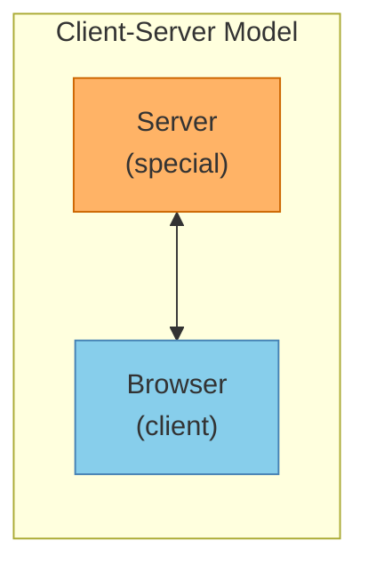
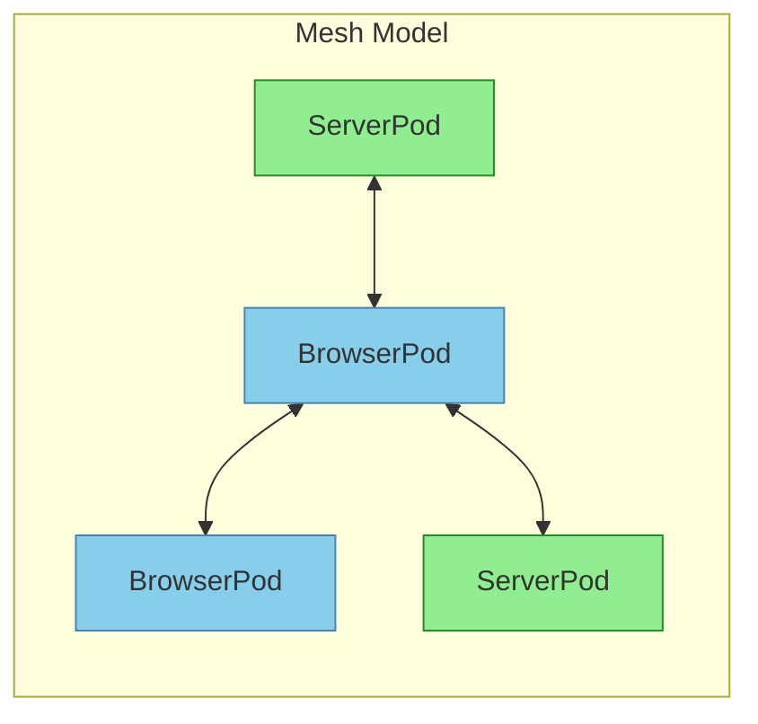
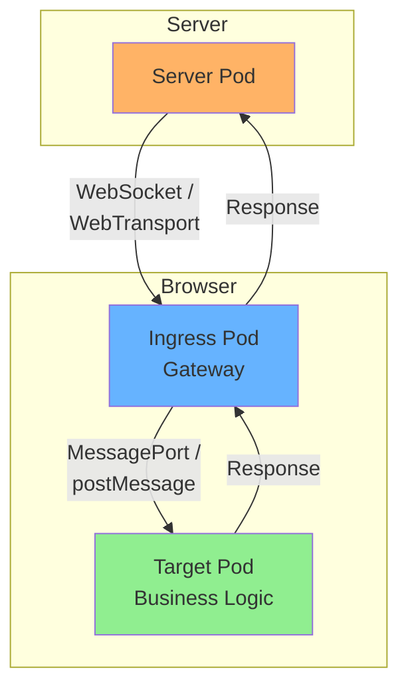
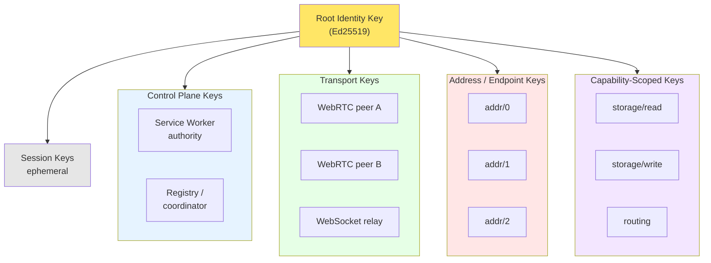

# Design Rationale

Explanations for key architectural decisions in BrowserMesh.

**Related specs**: [libp2p-alignment.md](libp2p-alignment.md) | [pod-types.md](../core/pod-types.md) | [identity-keys.md](../crypto/identity-keys.md)

## 1. Why Partition by Authority, Not API Surface

### The Design Principle

> Partition execution contexts by **default authority and lifecycle**, not by API surface.

If you partition by API surface, everything looks the same (all contexts can postMessage, fetch, etc.).

If you partition by authority + lifecycle, the distinctions become inevitable and meaningful.

### Consequence

Your runtime must start from the truth of what each context is entitled to, then optionally upgrade capabilities—never assume equivalence.

## 2. iframe vs Spawned Window: Why They're Different

### The Core Distinction: Parentage and Control

| Aspect | iframe | Spawned Window |
|--------|--------|----------------|
| Relationship | Child (has `parent`) | Peer (has `opener`) |
| Ownership | Embedded inside another document | Owns its own top-level browsing context |
| Lifecycle | Tied to parent's lifecycle | Independent, can outlive opener |
| Authority | Limited by parent | Own permission surface |

### Lifecycle Semantics

**iframe lifecycle**:
- Created by a parent
- Can be destroyed at any time by DOM mutation
- Paused/throttled with its parent
- Visually and hierarchically subordinate

In pod terms: **An iframe is not autonomous.** It behaves like:
- A containerized component
- A sub-process
- A sidecar that can be ripped out instantly

**Spawned window lifecycle**:
- Created by another window, but
- Becomes a top-level browsing context
- Can navigate independently
- Can survive opener navigation or close
- Can sever the relationship (`window.opener = null`)

In pod terms: **A spawned window is autonomous.** It behaves like:
- A peer node
- An independent pod
- A self-owning participant in the cluster

### Authority & Security Model

**iframe authority**:
- Parent can restrict permissions (`sandbox`, `allow`)
- Parent can intercept input (focus, pointer capture)
- Parent can visually obscure or clip
- Cross-origin iframe is heavily sandboxed

> An iframe **never** has more authority than its parent allows.

**Spawned window authority**:
- Has its own permission surface
- May prompt the user independently
- Has its own focus, fullscreen, media, etc.
- Opener has limited control

> A spawned window can act as an **independent trust principal**.

### Addressability & Topology

**iframe topology**:
- Always has a place in a DOM tree
- Addressed via `window.frames[index]`, `iframe.contentWindow`
- Naturally forms a **tree**

Good for: structured composition, plugin systems, UI micro-frontends
Bad for: dynamic peer discovery, symmetric networking, cluster membership

**Spawned window topology**:
- Lives in the global browsing context group
- Discovered via `window.open` return, `clients.matchAll()`, BroadcastChannel
- Naturally forms a **graph**

Graphs are what distributed systems want.

### Scheduling & Throttling

Browsers treat these differently under load:

| Aspect | iframe | Spawned Window |
|--------|--------|----------------|
| Throttling | With parent | Independent |
| Background behavior | Background if parent is | Can be foreground while opener is background |
| Scheduling | Tied to parent | Independent |
| Display | Within parent | Can move to another display |

For a pod runtime:
- **iframe pods** = best-effort compute
- **window pods** = schedulable compute

### When They Collapse

iframes and spawned windows are equivalent when:
- Same-origin
- No sandboxing
- iframe is treated as autonomous
- Parent does not assert control

But the browser does **not guarantee** that symmetry—so your runtime must not assume it.

### Runtime Design Rule

```
WindowPod → autonomous participant
         → eligible for: leadership, routing, ingress, federation

FramePod  → subordinate participant
         → good for: plugins, UI, constrained compute, isolation
```

The mixin can **upgrade** either role—but it must start from the truth.

## 3. Why Cryptographic Identity, Not Origin Trust

### The Problem with Origin-Based Trust

Traditional web security relies on:
- CORS
- Cookies
- Origin checks
- Same-origin policy

This breaks down when:
- You need cross-origin cooperation
- You want stronger-than-origin guarantees
- Multiple pods from the same origin need distinct identities

### Cryptographic Identity Provides

| Property | How |
|----------|-----|
| Self-certifying | Pod ID = hash of public key |
| Origin-agnostic | Works same-origin and cross-origin |
| Verifiable | Signatures prove ownership |
| Delegatable | HD-style key derivation |
| Revocable | Policy-based, no central CRL |

### The Identity Hierarchy

```
Root Identity Key (Ed25519)
├── Control plane keys
│   ├── Service Worker authority
│   └── Registry / coordinator
├── Transport keys
│   ├── WebRTC peer A
│   ├── WebRTC peer B
│   └── WebSocket relay
├── Capability-scoped keys
│   ├── storage/read
│   ├── storage/write
│   └── routing
└── Session keys (ephemeral)
```

This is object-capability security, not just crypto.

## 4. Why Service Worker as Control Plane

### Service Worker Properties

| Property | Benefit for Control Plane |
|----------|--------------------------|
| Per-origin daemon | Single coordination point |
| Event-driven | Resource efficient |
| Long-lived (relative to pages) | Can outlive tabs |
| Fetch interception | Service mesh routing |
| Client enumeration | Pod registry |

### What the Service Worker Controls

```typescript
// The SW acts as:
const controlPlane = {
  apiServer: true,      // Receives manifests
  scheduler: true,      // Opens/closes pods
  meshRouter: true,     // Routes messages
  registry: true,       // Tracks pod state
  ingressController: true, // External connections
};

// It does NOT:
const notControlPlane = {
  runWorkloads: false,  // Pods do this
  storeData: false,     // Pods use IndexedDB
  computeHeavy: false,  // Offload to workers
};
```

This separation mirrors Kubernetes perfectly.

## 5. Why Topology Discovery at Runtime

### The Problem with Declared Topology

Static configuration assumes:
- You know what contexts will exist
- Relationships are predictable
- Network is stable

Browsers violate all of these:
- Users open/close tabs arbitrarily
- iframes appear/disappear
- Workers spawn and terminate
- Visibility changes constantly

### Runtime Discovery Provides

1. **Resilience**: Pods adapt to actual topology
2. **Flexibility**: No configuration needed
3. **Correctness**: Never assumes unavailable relationships
4. **Simplicity**: One boot sequence works everywhere

### The Boot Principle

> Listen first, then announce. Treat all messages as proposals. Never assume intent.

A pod:
1. Installs handlers for all possible relationships
2. Announces itself
3. Waits for responses
4. Becomes what the topology allows

## 6. Why MessagePort Over Other Channels

### Channel Comparison

| Channel | Addressability | Bandwidth | Backpressure | Transfer |
|---------|---------------|-----------|--------------|----------|
| postMessage | Broadcast | Medium | No | Yes |
| MessagePort | Point-to-point | High | Yes | Yes |
| BroadcastChannel | Pub/sub | Low | No | No |
| SharedArrayBuffer | Shared memory | Highest | Manual | N/A |

### MessagePort Wins Because

1. **Explicit connections**: No ambient messaging
2. **Transferable**: Can hand off to other pods
3. **Backpressure**: Built-in flow control
4. **High performance**: Direct channel, no broadcast overhead
5. **Universal**: Works in all pod types (except some worklets)

### Upgrade Path

```
Initial: postMessage (discovery)
    ↓
Negotiated: MessagePort (stable link)
    ↓
Optional: WebRTC/SharedArrayBuffer (high performance)
```

## 7. Why Ed25519

### The Choice

As of 2025, Ed25519 is fully supported in WebCrypto across all major browsers, making it the clear choice for BrowserMesh.

| Curve | Key Size | WebCrypto | Performance | libp2p Parity |
|-------|----------|-----------|-------------|---------------|
| Ed25519 | 32 bytes | ✅ Native | Excellent | ✅ Full |
| X25519 | 32 bytes | ✅ Native | Excellent | ✅ Full |
| P-256 | 65 bytes | ✅ Native | Good | ⚠️ Partial |

### Ed25519 Chosen Because

1. **Compact keys**: 32 bytes vs 65 bytes for P-256
2. **Fast operations**: Optimized for modern CPUs
3. **libp2p compatibility**: Direct interop with libp2p peer IDs
4. **WebCrypto native**: Full browser support as of 2025
5. **Simple API**: Single algorithm for signing (Ed25519) and key exchange (X25519)
6. **Strong security**: ~128-bit equivalent, resistant to timing attacks

### Key Pairing

BrowserMesh uses the Ed25519/X25519 curve family:
- **Ed25519**: Signing and identity (deterministic signatures)
- **X25519**: Key exchange for session keys (ECDH)

## 8. Server Pods: Why Symmetry Matters

### The Insight

> The browser isn't special. The server isn't special. **The pod is the unit.**

### Without Server Pods



**Problems:** Asymmetric trust, different protocols, browser is "dumb terminal"

### With Server Pods



**Benefits:** Symmetric routing, same identity model, bidirectional calls, browser can route to server, server can route to browser

### What Changes

Almost nothing—and that's the point.

| Aspect | Browser Pod | Server Pod |
|--------|-------------|------------|
| Identity | Same key model | Same key model |
| Addressing | Pod IDs | Pod IDs |
| Routing | Mesh routing | Mesh routing |
| Capabilities | Browser-specific | Server-specific |

## 9. Architecture Diagrams

### Server-to-Browser Routing



### HD Key Derivation Tree



## 10. Analogues in Other Systems

BrowserMesh aligns with:

| System | Shared Concept |
|--------|---------------|
| libp2p | Peer ID = hash of public key, ephemeral session keys |
| Noise Protocol | Static identity + ephemeral handshake |
| WireGuard | Static public key identity, ephemeral sessions |
| SPIFFE/SPIRE | Workload identity (but decentralized) |
| Actor systems | Capability security, message passing |
| Kubernetes | Declarative state, reconciliation loops |

This is not exotic—it's correct distributed systems design.
