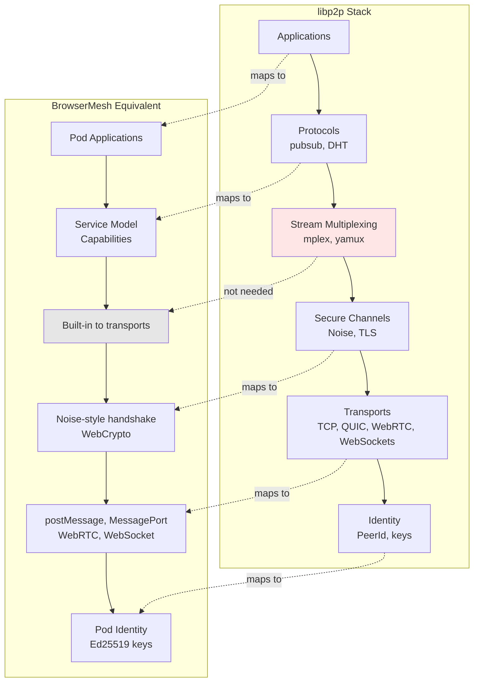

# libp2p Alignment

How BrowserMesh relates to libp2p: what to adopt, what to avoid, and why.

**Related specs**: [design-rationale.md](design-rationale.md) | [identity-keys.md](../crypto/identity-keys.md) | [session-keys.md](../crypto/session-keys.md)

## 1. Overview

BrowserMesh converges on the same architectural shape as libp2p from the browser side. The question is not "should we use libp2p?" but "which layers are compatible with browser security and lifecycle models?"

**Answer**: Use libp2p as a design reference and parts catalog, not a dependency.

## 2. Why libp2p is Relevant

BrowserMesh overlaps heavily with libp2p's core ideas:

| Concept | libp2p | BrowserMesh |
|---------|--------|-------------|
| Self-certifying identities | Peer ID = hash of public key | Pod ID = hash of public key |
| Transport-agnostic networking | TCP, QUIC, WebRTC, WebSocket | postMessage, MessagePort, WebRTC, WebSocket |
| Capability negotiation | Protocol negotiation | HELLO/CAPS/UPGRADE handshake |
| Connection upgrade | Plaintext → secure → multiplexed | Plaintext → encrypted → optimal channel |
| Peer memory | Peerstore | IndexedDB peer registry |
| Decentralized discovery | DHT, mDNS | BroadcastChannel, Service Worker, opener/parent |

This convergence is not accidental—these are fundamental distributed systems patterns.

## 3. The libp2p Stack

libp2p is a layer cake:



## 4. What to Adopt

### ✅ Identity Model (Strong YES)

libp2p's identity model is almost exactly what BrowserMesh uses:

| Aspect | libp2p | BrowserMesh |
|--------|--------|-------------|
| Keypair | Ed25519/secp256k1 | Ed25519 (WebCrypto native) |
| Peer ID | Hash of public key | Hash of public key |
| Self-certifying | Yes | Yes |
| TOFU-friendly | Yes | Yes |

**Adopt**:
- Peer ID derivation pattern
- Key encoding formats
- Signature verification logic

**Skip**:
- Full peerstore machinery

### ✅ Secure Channel Handshake (Partial YES)

libp2p uses Noise handshakes with static identity + ephemeral session keys.

This matches BrowserMesh's:
- Pod identity key (long-lived)
- Per-link ephemeral encryption key

**However**:
- Browser WebCrypto ≠ Node crypto
- Full Noise implementations can be heavy
- We control both endpoints

**Best approach**: Copy the pattern, not the implementation.

```typescript
// BrowserMesh approach: Noise-style semantics with WebCrypto
const handshake = {
  // Reuse from Noise:
  messageFormats: true,
  transcriptLogic: true,

  // Implement with WebCrypto:
  keyDerivation: 'HKDF',
  encryption: 'AES-GCM-256',  // or ChaCha20-Poly1305
};
```

### ✅ Transport Abstraction (Conceptual YES)

libp2p's philosophical win: protocols don't care what transport they run over.

This aligns perfectly with BrowserMesh transports:
- postMessage
- MessagePort
- WebRTC
- WebSocket
- Service Worker–routed fetch

**Adopt**:
- Transport interface concept
- Connection upgrading pattern

**Skip**:
- Socket assumptions (browser transports are message-based, capability-gated)

## 5. What to Avoid

### ❌ libp2p DHT (Kademlia)

**Why it doesn't fit**:
- Requires long-lived processes
- Assumes stable connectivity
- Heavy bandwidth + storage
- Browser lifecycles are hostile to it

**BrowserMesh alternatives**:
- Service Workers
- SharedWorkers
- BroadcastChannel
- Optional server pods

### ❌ Stream Multiplexers (mplex / yamux)

**Why they exist in libp2p**:
- TCP gives you one byte stream
- Need logical streams on top

**Why they're redundant in browsers**:
- MessagePort already multiplexes
- WebRTC already multiplexes
- WebTransport already multiplexes
- Streams API already exists

### ❌ Full libp2p Node Lifecycle

**libp2p assumes**:
- Long-lived daemons
- Explicit dialing
- Explicit listening
- Stable process memory

**Browser pods**:
- Reload arbitrarily
- Suspend without notice
- Die and reappear
- Have ephemeral memory

The node model is wrong for browsers.

## 6. Implementation Strategy

### What to Take from libp2p

| Component | Take |
|-----------|------|
| Identity derivation | ✅ |
| Handshake structure | ✅ |
| Transport-agnostic mindset | ✅ |
| Peer trust/memorization model | ✅ |

### What to Reimplement Natively

| Component | Browser-Native Alternative |
|-----------|---------------------------|
| Discovery | SW + BroadcastChannel + opener/parent |
| Routing | Service Worker mesh |
| Multiplexing | MessagePort / Streams API |
| Lifecycle | Pod mixin with topology discovery |

### Result

- libp2p-grade security and decentralization
- Browser-native ergonomics
- Vastly lower complexity

## 7. Problem Space Comparison

**libp2p is optimized for**:
> "Untrusted machines on the open internet."

**BrowserMesh is optimized for**:
> "Many semi-trusted execution contexts sharing an origin, sometimes crossing origins."

These are adjacent but not identical problem spaces.

BrowserMesh is closer to:
- libp2p + actor systems + capability-secure runtimes + browser OS design

## 8. Concrete Mapping

| libp2p Concept | BrowserMesh Equivalent |
|----------------|------------------------|
| PeerId | `podId = base64url(SHA-256(publicKey))` |
| Multiaddr | Service addresses (`service://name:version`) |
| Protocol ID | Capability strings (`compute/wasm`, `storage/read`) |
| Noise XX/IK | X25519 key exchange + HKDF handshake |
| Peerstore | IndexedDB peer registry |
| DHT | Service Worker routing + BroadcastChannel |
| Pubsub | BroadcastChannel + MessagePort fan-out |
| Connection Manager | Pod mixin peer management |

## 9. Interoperability Considerations

### Potential libp2p Bridge

For connecting to actual libp2p networks:

```typescript
interface Libp2pBridge {
  // Convert BrowserMesh pod ID to libp2p peer ID
  toLibp2pPeerId(podId: string): PeerId;

  // Bridge via WebRTC (libp2p supports this)
  connectViaWebRTC(multiaddr: string): Promise<Connection>;

  // Protocol translation
  wrapProtocol(browserProtocol: string): string;
}
```

### When to Use Actual libp2p

Consider using js-libp2p when:
- Connecting to existing libp2p networks (IPFS, Filecoin)
- Need DHT for global discovery
- Building a hybrid browser/server node

## 10. Summary

| Layer | Use libp2p? | BrowserMesh Approach |
|-------|-------------|---------------------|
| Identity | ✅ Pattern | Ed25519 keys, hash-based pod IDs |
| Handshake | ✅ Pattern | Noise-style with WebCrypto |
| Transport | ✅ Pattern | Browser-native channels |
| Multiplexing | ❌ Skip | Built into browser APIs |
| Discovery | ❌ Skip | SW, BroadcastChannel, parent/opener |
| DHT | ❌ Skip | Service Worker routing |
| Node lifecycle | ❌ Skip | Pod mixin with topology discovery |

**Treat libp2p as a specimen, not a framework.**
