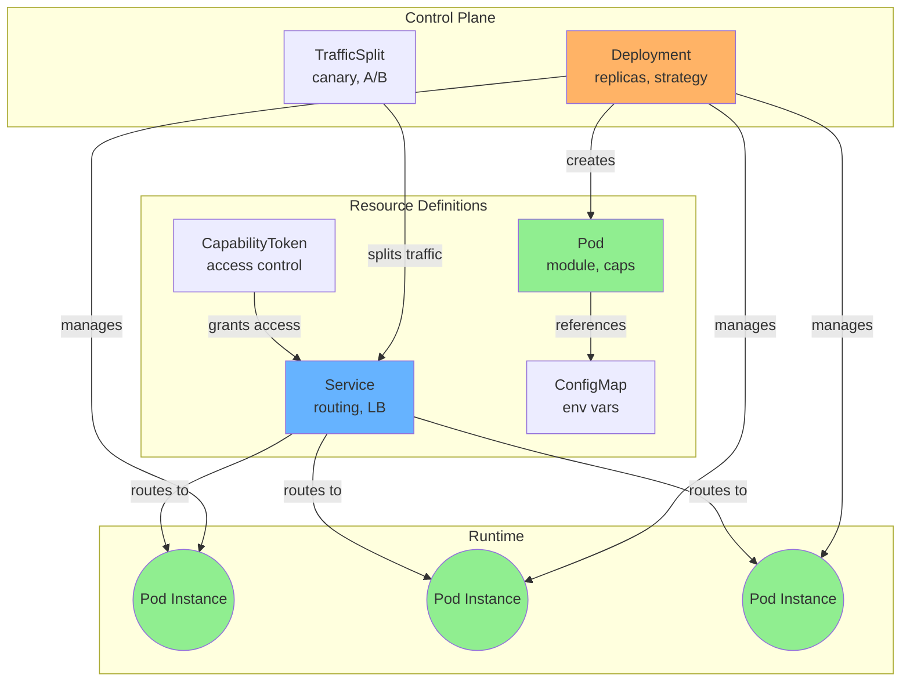

# BrowserMesh Manifest Format

Declarative specifications for pods, services, and deployments.

**Related specs**: [pod-types.md](../core/pod-types.md) | [service-model.md](../coordination/service-model.md) | [reconciliation-loop.md](../coordination/reconciliation-loop.md)

## Manifest Relationships



## 1. Pod Manifest

```yaml
apiVersion: browsermesh/v1
kind: Pod
metadata:
  name: image-resizer
  namespace: default
  labels:
    app: image-resizer
    version: v1.0.0
spec:
  # Pod type
  kind: worker  # window | worker | shared-worker | service-worker | frame

  # Module to load
  module:
    # Content-addressed reference
    cid: bafybeigdyrzt5sfp7udm7hu76uh7y26nf3efuylqabf3oczesz...
    # Or URL (for development)
    url: https://example.com/modules/resizer.js
    # Entry point
    entry: handleRequest

  # Resources (advisory)
  resources:
    requests:
      memory: 64Mi
      cpu: 100m
    limits:
      memory: 256Mi
      cpu: 500m

  # Capabilities required
  capabilities:
    required:
      - compute/wasm
      - storage/read
    optional:
      - network/webrtc

  # Environment
  env:
    - name: LOG_LEVEL
      value: info
    - name: MAX_SIZE
      valueFrom:
        configMapKeyRef:
          name: resizer-config
          key: maxSize

  # Liveness probe
  livenessProbe:
    message:
      type: MESH_PING
    initialDelayMs: 1000
    periodMs: 5000
    timeoutMs: 1000
    failureThreshold: 3

  # Readiness probe
  readinessProbe:
    message:
      type: MESH_READY_CHECK
    initialDelayMs: 500
    periodMs: 2000
    timeoutMs: 500
    successThreshold: 1
```

## 2. Service Manifest

```yaml
apiVersion: browsermesh/v1
kind: Service
metadata:
  name: image-resizer
  namespace: default
spec:
  # Service type
  type: ClusterLocal  # ClusterLocal | CrossOrigin | External

  # Selector for pods
  selector:
    matchLabels:
      app: image-resizer

  # Ports / endpoints
  ports:
    - name: resize
      protocol: mesh-rpc
      targetPort: resize

  # Load balancing
  loadBalancing:
    strategy: round-robin  # round-robin | least-connections | consistent-hash
    hashKey: request.input.imageCid  # For consistent-hash

  # Health-based routing
  routing:
    onlyReady: true
    preferVisible: true  # Prefer visible tabs
    preferLocal: false   # Prefer same-origin pods

  # Traffic policy
  trafficPolicy:
    circuitBreaker:
      maxFailures: 5
      resetTimeoutMs: 30000
    retryPolicy:
      maxRetries: 3
      retryOn:
        - timeout
        - connection-error
```

## 3. Deployment Manifest

```yaml
apiVersion: browsermesh/v1
kind: Deployment
metadata:
  name: image-resizer
  namespace: default
spec:
  # Replica count
  replicas: 3

  # Min/max for autoscaling
  minReplicas: 1
  maxReplicas: 10

  # Pod selector
  selector:
    matchLabels:
      app: image-resizer

  # Pod template
  template:
    metadata:
      labels:
        app: image-resizer
        version: v1.0.0
    spec:
      kind: worker
      module:
        cid: bafybeigdyrzt5sfp7udm7hu76uh7y26nf3efuylqabf3oczesz...
      # ... rest of PodSpec

  # Update strategy
  strategy:
    type: RollingUpdate
    rollingUpdate:
      maxUnavailable: 1
      maxSurge: 1

  # Autoscaling
  autoscaling:
    enabled: true
    metrics:
      - type: QueueDepth
        target:
          averageValue: 10
      - type: Latency
        target:
          averageValueMs: 100
```

## 4. ConfigMap Manifest

```yaml
apiVersion: browsermesh/v1
kind: ConfigMap
metadata:
  name: resizer-config
  namespace: default
data:
  maxSize: "10485760"
  allowedFormats: "jpeg,png,webp,avif"
  quality: "85"
```

## 5. TrafficSplit Manifest

```yaml
apiVersion: browsermesh/v1
kind: TrafficSplit
metadata:
  name: resizer-canary
  namespace: default
spec:
  service: image-resizer
  backends:
    - service: image-resizer-v1
      weight: 90
    - service: image-resizer-v2
      weight: 10
  # Optional: header-based routing
  match:
    - headers:
        x-canary: "true"
      backend: image-resizer-v2
```

## 6. CapabilityToken Manifest

```yaml
apiVersion: browsermesh/v1
kind: CapabilityToken
metadata:
  name: resizer-access
  namespace: default
spec:
  # Target service
  service: image-resizer

  # Caveats (restrictions)
  caveats:
    - type: expires
      at: "2025-12-31T23:59:59Z"
    - type: rate-limit
      max: 1000
      per: hour
    - type: method
      allowed:
        - resize
        - thumbnail
    - type: parameter
      name: maxWidth
      max: 4096

  # Delegation rules
  delegation:
    allowed: true
    maxDepth: 3
```

## 7. Applying Manifests

### JavaScript API

```typescript
import { MeshClient } from '@browsermesh/client';

const mesh = new MeshClient();

// Apply a manifest
await mesh.apply(manifest);

// Apply from YAML string
await mesh.applyYAML(`
apiVersion: browsermesh/v1
kind: Deployment
...
`);

// Get current state
const deployment = await mesh.get('Deployment', 'image-resizer');

// Delete
await mesh.delete('Deployment', 'image-resizer');

// Watch for changes
mesh.watch('Pod', { labelSelector: 'app=image-resizer' }, (event) => {
  console.log(event.type, event.object);
});
```

### CLI (mesh-ctl)

```bash
# Apply manifest
mesh-ctl apply -f deployment.yaml

# Get resources
mesh-ctl get pods
mesh-ctl get services
mesh-ctl get deployments

# Describe
mesh-ctl describe pod image-resizer-abc123

# Delete
mesh-ctl delete deployment image-resizer

# Logs
mesh-ctl logs pod/image-resizer-abc123

# Port forward (for debugging)
mesh-ctl port-forward pod/image-resizer-abc123 8080:mesh
```

## 8. Manifest Storage

Manifests are stored in the coordinator pod (SharedWorker) with content-addressed backups:

```typescript
interface ManifestStore {
  // Store manifest (returns CID)
  put(manifest: Manifest): Promise<string>;

  // Get by kind + name
  get(kind: string, name: string, namespace?: string): Promise<Manifest | null>;

  // List by kind
  list(kind: string, namespace?: string): Promise<Manifest[]>;

  // Watch for changes
  watch(kind: string, options: WatchOptions): AsyncIterable<WatchEvent>;

  // Get history (content-addressed)
  history(kind: string, name: string): Promise<ManifestVersion[]>;
}
```
