# Specification Index

Complete index of BrowserMesh specifications with dependency relationships.

## 1. Directory Structure

```
specs/
├── core/                    # Core runtime specifications
│   ├── pod-types.md         # Pod kinds and capabilities
│   ├── boot-sequence.md     # Boot protocol
│   ├── wire-format.md       # CBOR message encoding
│   ├── error-handling.md    # Error codes and recovery
│   ├── security-model.md    # Threat model and mitigations
│   └── protocol-versioning.md  # Version negotiation and feature flags
│
├── crypto/                  # Cryptographic specifications
│   ├── identity-keys.md     # Ed25519 identity, HD derivation
│   ├── session-keys.md      # X25519 handshake, session encryption
│   ├── capability-scope-grammar.md  # Scope string grammar and validation
│   ├── webauthn-identity.md # Optional hardware-backed identity (WebAuthn)
│   ├── group-keys.md        # Symmetric group encryption
│   └── identity-persistence.md  # Key storage and at-rest protection
│
├── networking/              # Communication specifications
│   ├── channel-abstraction.md  # PodChannel interface and adapters
│   ├── link-negotiation.md  # Channel negotiation state machine
│   ├── message-envelope.md  # Request/response protocol
│   ├── message-middleware.md   # Composable transform pipeline
│   ├── pod-socket.md        # Unified socket abstraction
│   ├── pod-addr.md          # IPv6-style virtual addressing
│   ├── streaming-protocol.md   # Stream state machine and backpressure
│   ├── stream-encryption.md    # Per-stream encryption
│   ├── resumable-transfer.md   # Checkpoint-and-resume large transfers
│   ├── binary-request-protocol.md  # HTTP-style req/resp over non-HTTP channels
│   ├── http-interop.md         # HTTP mapping layer for infrastructure traversal
│   ├── transport-probing.md    # Transport auto-detection and selection
│   ├── signaling-protocol.md   # WebRTC signaling and ICE exchange
│   ├── dht-routing.md         # Kademlia DHT for peer discovery
│   ├── source-route-labels.md # Compact multi-hop path encoding
│   ├── device-pairing.md    # Cross-device pairing handshake
│   └── session-resumption.md   # Abbreviated reconnection
│
├── coordination/            # Coordination specifications
│   ├── service-model.md     # Service naming and discovery
│   ├── presence-protocol.md # Real-time presence tracking
│   ├── join-protocol.md     # Session join ritual
│   ├── leader-election.md   # Deterministic leader election
│   ├── offline-queue.md     # Message buffering for disconnected peers
│   ├── slot-lease-protocol.md  # SharedWorker coordination
│   ├── reconciliation-loop.md  # Desired state reconciliation
│   ├── pubsub-topics.md     # Topic-based pub/sub messaging
│   ├── state-sync.md        # CRDT state synchronization
│   ├── reactive-signals.md  # Lightweight reactive state primitives
│   ├── peer-reputation.md   # Peer quality scoring
│   └── pod-migration.md     # Pod state migration
│
├── operations/              # Operational specifications
│   ├── observability.md     # Tracing, logging, metrics
│   ├── operations.md        # Key rotation, admission control
│   ├── chaos-testing.md     # Fault injection and testing
│   └── test-transport.md    # In-memory test transport
│
├── extensions/              # Extension specifications
│   ├── signed-audit-log.md  # Hash-chained audit entries
│   ├── pod-executor.md      # Ephemeral WorkerPod lifecycle
│   ├── server-pod.md        # Server-side runtime
│   ├── storage-integration.md  # IPFS/Storacha integration
│   ├── compute-offload.md   # WASM compute offload
│   └── artifact-registry.md # Content-addressable artifact storage
│
└── reference/               # Reference documentation
    ├── libp2p-alignment.md  # libp2p comparison
    ├── design-rationale.md  # Architectural decisions
    ├── manifest-format.md   # Kubernetes-style manifests
    ├── pod-capability-schema.json  # JSON Schema for capabilities
    ├── client-api.md        # MeshClient/MeshServer/MeshRuntime API
    ├── mesh-ctl.md          # CLI command reference
    └── utility-functions.md # Shared helper functions
```

## 2. Dependency Graph

```mermaid
flowchart TD
    subgraph Foundation["Foundation Layer"]
        PT[pod-types<br/>capabilities]
        CA[channel-abstraction<br/>PodChannel]
        CSG[capability-scope-grammar<br/>scope strings]
    end

    subgraph Core["Core Layer"]
        IK[identity-keys<br/>Ed25519]
        IP[identity-persistence<br/>key storage]
        BS[boot-sequence<br/>discovery]
        WF[wire-format<br/>CBOR]
        PV[protocol-versioning<br/>feature flags]
    end

    subgraph Security["Security Layer"]
        SK[session-keys<br/>X25519]
        WA[webauthn-identity<br/>optional hardware]
        LN[link-negotiation<br/>state machine]
        EH[error-handling<br/>recovery]
        GK[group-keys<br/>symmetric group]
    end

    subgraph Communication["Communication Layer"]
        PS[pod-socket<br/>unified API]
        SP[streaming-protocol<br/>backpressure]
        SE[stream-encryption<br/>per-stream keys]
        BRP[binary-request-protocol<br/>binary framing]
        TP[transport-probing<br/>auto-detection]
        SR[session-resumption<br/>abbreviated reconnect]
        DP[device-pairing<br/>cross-device]
        SIG[signaling-protocol<br/>WebRTC signaling]
        RT[resumable-transfer<br/>checkpoint/resume]
        MM[message-middleware<br/>transform pipeline]
        HI[http-interop<br/>HTTP mapping]
        DHT[dht-routing<br/>Kademlia DHT]
        SRL[source-route-labels<br/>compact paths]
    end

    subgraph Application["Application Layer"]
        ME[message-envelope<br/>request/response]
        SM[service-model<br/>routing]
        SEC[security-model<br/>threat model]
        CAPI[client-api<br/>MeshClient]
    end

    subgraph Protocol["Protocol Layer"]
        PP[presence-protocol<br/>presence states]
        JP[join-protocol<br/>session join]
        OQ[offline-queue<br/>message buffer]
        PUB[pubsub-topics<br/>topic messaging]
        SS[state-sync<br/>CRDT sync]
        RS[reactive-signals<br/>lightweight state]
        PR[peer-reputation<br/>quality scoring]
        PM[pod-migration<br/>state transfer]
    end

    subgraph Advanced["Advanced Features"]
        LE[leader-election<br/>consensus]
        SAL[signed-audit-log<br/>hash chain]
        PE[pod-executor<br/>ephemeral workers]
        AR[artifact-registry<br/>CID storage]
        CT[chaos-testing<br/>fault injection]
        TT[test-transport<br/>in-memory channels]
    end

    PT --> IK
    PT --> BS
    PT --> WF
    CA --> SK
    CA --> LN
    CA --> TP
    CSG --> IK
    IK --> IP

    IK --> SK
    IK -.-> WA
    BS -.-> WA
    BS --> LN
    BS --> TP
    WF --> EH
    WF --> PV
    BS --> PV

    SK --> PS
    LN --> PS
    SK --> GK
    IK --> GK

    PS --> ME
    PS --> SM
    PS --> SEC
    WF --> SP
    PS --> SP
    SP --> SE
    SK --> SE
    PS --> BRP
    WF --> BRP
    SK --> SR
    SK --> DP
    IK --> DP

    CA --> SIG
    LN --> SIG
    SP --> RT
    WF --> RT
    WF --> MM
    ME --> MM
    WF --> DHT
    IK --> DHT
    SM --> DHT
    WF --> SRL
    DHT --> SRL
    WF --> RS
    PP --> RS
    WF --> PR
    TP --> PR
    IK --> PR

    ME --> CAPI
    SM --> CAPI
    PS --> CAPI

    BS --> PP
    WF --> PP
    BS --> JP
    IK --> JP
    CSG --> JP
    CA --> OQ
    PP --> OQ

    WF --> PUB
    ME --> PUB
    CSG --> PUB
    PP --> SS
    WF --> SS
    SP --> PM
    SK --> PM

    JP --> LE
    PP --> LE
    IK --> SAL
    WF --> SAL
    PT --> PE
    BS --> PE
    CSG --> PE

    SM --> AR
    WF --> AR
    CA --> CT
    WF --> CT
    CA --> TT

    WF --> HI
    BRP --> HI
    SEC --> HI

    style PT fill:#FFE666
    style CA fill:#FFE666
    style CSG fill:#FFE666
    style PS fill:#90EE90
    style WA fill:#E6FFE6,stroke-dasharray: 5 5
    style ME fill:#E6F3FF
    style SM fill:#E6F3FF
    style SEC fill:#E6F3FF
    style PP fill:#FFE6FF
    style JP fill:#FFE6FF
    style OQ fill:#FFE6FF
    style LE fill:#FFB366
    style SAL fill:#FFB366
    style PE fill:#FFB366
    style SP fill:#90EE90
    style SR fill:#90EE90
    style DP fill:#90EE90
    style GK fill:#E6FFE6
    style PV fill:#E6F3FF
    style PUB fill:#FFE6FF
    style SS fill:#FFE6FF
    style PM fill:#FFE6FF
    style CAPI fill:#E6F3FF
    style AR fill:#FFB366
    style CT fill:#FFB366
    style IP fill:#E6F3FF
    style TP fill:#90EE90
    style SE fill:#90EE90
    style BRP fill:#90EE90
    style TT fill:#FFB366
    style SIG fill:#90EE90
    style RT fill:#90EE90
    style MM fill:#90EE90
    style DHT fill:#90EE90
    style SRL fill:#90EE90
    style HI fill:#90EE90
    style RS fill:#FFE6FF
    style PR fill:#FFE6FF
```



## 3. Reading Order

### Essential (Start Here)

| Order | Spec | Description |
|-------|------|-------------|
| 1 | [pod-types.md](core/pod-types.md) | What pods are, capability matrix |
| 2 | [identity-keys.md](crypto/identity-keys.md) | Ed25519 identity, Pod IDs |
| 3 | [boot-sequence.md](core/boot-sequence.md) | How pods discover topology |
| 4 | [wire-format.md](core/wire-format.md) | Message encoding (CBOR) |
| 5 | [session-keys.md](crypto/session-keys.md) | Secure channel establishment |
| 2a | [identity-persistence.md](crypto/identity-persistence.md) | Key storage and at-rest protection |

### Foundation Protocols

| Order | Spec | Description |
|-------|------|-------------|
| 5a | [channel-abstraction.md](networking/channel-abstraction.md) | Unified channel interface |
| 5b | [capability-scope-grammar.md](crypto/capability-scope-grammar.md) | Scope string grammar |
| 5c | [protocol-versioning.md](core/protocol-versioning.md) | Version negotiation and feature flags |
| 5d | [transport-probing.md](networking/transport-probing.md) | Transport auto-detection and selection |

### Communication Layer

| Order | Spec | Description |
|-------|------|-------------|
| 6 | [link-negotiation.md](networking/link-negotiation.md) | Channel negotiation |
| 7 | [pod-socket.md](networking/pod-socket.md) | Unified socket API |
| 8 | [message-envelope.md](networking/message-envelope.md) | Request/response protocol |
| 8a | [streaming-protocol.md](networking/streaming-protocol.md) | Stream lifecycle and backpressure |
| 8b | [stream-encryption.md](networking/stream-encryption.md) | Per-stream encryption |
| 8c | [binary-request-protocol.md](networking/binary-request-protocol.md) | Binary HTTP-style req/resp |
| 8d | [session-resumption.md](networking/session-resumption.md) | Abbreviated reconnection |
| 8e | [signaling-protocol.md](networking/signaling-protocol.md) | WebRTC signaling and ICE |
| 8f | [resumable-transfer.md](networking/resumable-transfer.md) | Checkpoint-and-resume transfers |
| 8g | [message-middleware.md](networking/message-middleware.md) | Composable transform pipeline |
| 8h | [http-interop.md](networking/http-interop.md) | HTTP mapping for infrastructure traversal |

### Coordination Layer

| Order | Spec | Description |
|-------|------|-------------|
| 9 | [service-model.md](coordination/service-model.md) | Service naming and routing |
| 9a | [presence-protocol.md](coordination/presence-protocol.md) | Real-time presence |
| 9b | [join-protocol.md](coordination/join-protocol.md) | Session join ritual |
| 9c | [offline-queue.md](coordination/offline-queue.md) | Disconnected peer buffering |
| 9d | [pubsub-topics.md](coordination/pubsub-topics.md) | Topic-based pub/sub messaging |
| 9e | [state-sync.md](coordination/state-sync.md) | CRDT state synchronization |
| 9f | [pod-migration.md](coordination/pod-migration.md) | Pod state transfer |
| 9g | [reactive-signals.md](coordination/reactive-signals.md) | Lightweight reactive state |
| 9h | [peer-reputation.md](coordination/peer-reputation.md) | Peer quality scoring |
| 10 | [slot-lease-protocol.md](coordination/slot-lease-protocol.md) | SharedWorker coordination |
| 11 | [reconciliation-loop.md](coordination/reconciliation-loop.md) | Desired state management |

### Operations

| Order | Spec | Description |
|-------|------|-------------|
| 12 | [error-handling.md](core/error-handling.md) | Error codes and recovery |
| 13 | [security-model.md](core/security-model.md) | Threat model |
| 14 | [observability.md](operations/observability.md) | Tracing and metrics |
| 15 | [operations.md](operations/operations.md) | Key rotation, etc. |

### Advanced Features

| Order | Spec | Description |
|-------|------|-------------|
| 16 | [leader-election.md](coordination/leader-election.md) | Deterministic leader election |
| 17 | [signed-audit-log.md](extensions/signed-audit-log.md) | Hash-chained audit entries |
| 18 | [pod-executor.md](extensions/pod-executor.md) | Ephemeral WorkerPod lifecycle |
| 19 | [group-keys.md](crypto/group-keys.md) | Symmetric group encryption |
| 20 | [device-pairing.md](networking/device-pairing.md) | Cross-device pairing |
| 21 | [dht-routing.md](networking/dht-routing.md) | Kademlia DHT peer discovery |
| 22 | [source-route-labels.md](networking/source-route-labels.md) | Compact multi-hop paths |

### Extensions (Optional)

| Order | Spec | Description |
|-------|------|-------------|
| — | [server-pod.md](extensions/server-pod.md) | Server-side runtime |
| — | [storage-integration.md](extensions/storage-integration.md) | IPFS integration |
| — | [compute-offload.md](extensions/compute-offload.md) | WASM offload |
| — | [artifact-registry.md](extensions/artifact-registry.md) | Content-addressable artifacts |

### Reference

| Order | Spec | Description |
|-------|------|-------------|
| — | [client-api.md](reference/client-api.md) | MeshClient/MeshServer/MeshRuntime API |
| — | [mesh-ctl.md](reference/mesh-ctl.md) | CLI command reference |
| — | [utility-functions.md](reference/utility-functions.md) | Shared helper functions |
| — | [chaos-testing.md](operations/chaos-testing.md) | Fault injection framework |
| — | [test-transport.md](operations/test-transport.md) | In-memory test transport |

## 4. Spec Dependencies

### [core/pod-types.md](core/pod-types.md)

**Depends on**: None (foundational)

**Required by**:
- [boot-sequence.md](core/boot-sequence.md)
- [link-negotiation.md](networking/link-negotiation.md)
- [service-model.md](coordination/service-model.md)
- [pod-executor.md](extensions/pod-executor.md)
- [reconciliation-loop.md](coordination/reconciliation-loop.md)
- [slot-lease-protocol.md](coordination/slot-lease-protocol.md)
- [compute-offload.md](extensions/compute-offload.md)
- [server-pod.md](extensions/server-pod.md)
- [pod-migration.md](coordination/pod-migration.md)

### [crypto/identity-keys.md](crypto/identity-keys.md)

**Depends on**:
- [capability-scope-grammar.md](crypto/capability-scope-grammar.md)

**Required by**:
- [session-keys.md](crypto/session-keys.md)
- [boot-sequence.md](core/boot-sequence.md)
- [security-model.md](core/security-model.md)
- [join-protocol.md](coordination/join-protocol.md)
- [signed-audit-log.md](extensions/signed-audit-log.md)
- [slot-lease-protocol.md](coordination/slot-lease-protocol.md)
- [pod-addr.md](networking/pod-addr.md)
- [operations.md](operations/operations.md)
- [group-keys.md](crypto/group-keys.md)
- [device-pairing.md](networking/device-pairing.md)
- [identity-persistence.md](crypto/identity-persistence.md)

### [crypto/capability-scope-grammar.md](crypto/capability-scope-grammar.md)

**Depends on**: None (foundational)

**Required by**:
- [identity-keys.md](crypto/identity-keys.md)
- [join-protocol.md](coordination/join-protocol.md)
- [pod-executor.md](extensions/pod-executor.md)
- [pod-types.md](core/pod-types.md)
- [pubsub-topics.md](coordination/pubsub-topics.md)
- [chaos-testing.md](operations/chaos-testing.md)

### [networking/channel-abstraction.md](networking/channel-abstraction.md)

**Depends on**: None (foundational)

**Required by**:
- [session-keys.md](crypto/session-keys.md)
- [link-negotiation.md](networking/link-negotiation.md)
- [offline-queue.md](coordination/offline-queue.md)
- [chaos-testing.md](operations/chaos-testing.md)
- [transport-probing.md](networking/transport-probing.md)
- [test-transport.md](operations/test-transport.md)

### [crypto/session-keys.md](crypto/session-keys.md)

**Depends on**:
- [identity-keys.md](crypto/identity-keys.md)
- [channel-abstraction.md](networking/channel-abstraction.md)

**Required by**:
- [pod-socket.md](networking/pod-socket.md)
- [message-envelope.md](networking/message-envelope.md)
- [error-handling.md](core/error-handling.md)
- [server-pod.md](extensions/server-pod.md)
- [operations.md](operations/operations.md)
- [group-keys.md](crypto/group-keys.md)
- [session-resumption.md](networking/session-resumption.md)
- [device-pairing.md](networking/device-pairing.md)
- [pod-migration.md](coordination/pod-migration.md)

### [crypto/webauthn-identity.md](crypto/webauthn-identity.md)

**Depends on**:
- [identity-keys.md](crypto/identity-keys.md)
- [boot-sequence.md](core/boot-sequence.md)

**Required by**: None (optional extension)

### [crypto/group-keys.md](crypto/group-keys.md)

**Depends on**:
- [session-keys.md](crypto/session-keys.md)
- [identity-keys.md](crypto/identity-keys.md)
- [wire-format.md](core/wire-format.md)

**Required by**: None (leaf spec)

### [core/boot-sequence.md](core/boot-sequence.md)

**Depends on**:
- [pod-types.md](core/pod-types.md)
- [identity-keys.md](crypto/identity-keys.md)
- [wire-format.md](core/wire-format.md)

**Required by**:
- [link-negotiation.md](networking/link-negotiation.md)
- [presence-protocol.md](coordination/presence-protocol.md)
- [join-protocol.md](coordination/join-protocol.md)
- [pod-executor.md](extensions/pod-executor.md)
- [slot-lease-protocol.md](coordination/slot-lease-protocol.md)
- [protocol-versioning.md](core/protocol-versioning.md)
- [pod-migration.md](coordination/pod-migration.md)

### [core/protocol-versioning.md](core/protocol-versioning.md)

**Depends on**:
- [wire-format.md](core/wire-format.md)
- [boot-sequence.md](core/boot-sequence.md)

**Required by**: None (leaf spec; referenced by all handshake-aware specs)

### [networking/link-negotiation.md](networking/link-negotiation.md)

**Depends on**:
- [pod-types.md](core/pod-types.md)
- [boot-sequence.md](core/boot-sequence.md)
- [session-keys.md](crypto/session-keys.md)
- [channel-abstraction.md](networking/channel-abstraction.md)

**Required by**:
- [pod-socket.md](networking/pod-socket.md)
- [signaling-protocol.md](networking/signaling-protocol.md)

### [networking/pod-socket.md](networking/pod-socket.md)

**Depends on**:
- [link-negotiation.md](networking/link-negotiation.md)
- [session-keys.md](crypto/session-keys.md)

**Required by**:
- [message-envelope.md](networking/message-envelope.md)
- [service-model.md](coordination/service-model.md)
- [streaming-protocol.md](networking/streaming-protocol.md)
- [client-api.md](reference/client-api.md)

### [networking/streaming-protocol.md](networking/streaming-protocol.md)

**Depends on**:
- [wire-format.md](core/wire-format.md)
- [pod-socket.md](networking/pod-socket.md)

**Required by**:
- [pod-migration.md](coordination/pod-migration.md)
- [stream-encryption.md](networking/stream-encryption.md)
- [resumable-transfer.md](networking/resumable-transfer.md)

### [networking/session-resumption.md](networking/session-resumption.md)

**Depends on**:
- [session-keys.md](crypto/session-keys.md)
- [wire-format.md](core/wire-format.md)

**Required by**:
- [pod-migration.md](coordination/pod-migration.md)

### [networking/device-pairing.md](networking/device-pairing.md)

**Depends on**:
- [identity-keys.md](crypto/identity-keys.md)
- [session-keys.md](crypto/session-keys.md)
- [wire-format.md](core/wire-format.md)

**Required by**: None (leaf spec)

### [networking/message-envelope.md](networking/message-envelope.md)

**Depends on**:
- [wire-format.md](core/wire-format.md)
- [pod-socket.md](networking/pod-socket.md)
- [session-keys.md](crypto/session-keys.md)

**Required by**:
- [service-model.md](coordination/service-model.md)
- [error-handling.md](core/error-handling.md)
- [observability.md](operations/observability.md)
- [compute-offload.md](extensions/compute-offload.md)
- [server-pod.md](extensions/server-pod.md)
- [pubsub-topics.md](coordination/pubsub-topics.md)
- [client-api.md](reference/client-api.md)

### [coordination/service-model.md](coordination/service-model.md)

**Depends on**:
- [pod-types.md](core/pod-types.md)
- [message-envelope.md](networking/message-envelope.md)

**Required by**:
- [reconciliation-loop.md](coordination/reconciliation-loop.md)
- [storage-integration.md](extensions/storage-integration.md)
- [artifact-registry.md](extensions/artifact-registry.md)
- [client-api.md](reference/client-api.md)
- [dht-routing.md](networking/dht-routing.md)

### [coordination/presence-protocol.md](coordination/presence-protocol.md)

**Depends on**:
- [boot-sequence.md](core/boot-sequence.md)
- [wire-format.md](core/wire-format.md)

**Required by**:
- [offline-queue.md](coordination/offline-queue.md)
- [leader-election.md](coordination/leader-election.md)
- [state-sync.md](coordination/state-sync.md)

### [coordination/join-protocol.md](coordination/join-protocol.md)

**Depends on**:
- [boot-sequence.md](core/boot-sequence.md)
- [identity-keys.md](crypto/identity-keys.md)
- [capability-scope-grammar.md](crypto/capability-scope-grammar.md)

**Required by**:
- [leader-election.md](coordination/leader-election.md)

### [coordination/offline-queue.md](coordination/offline-queue.md)

**Depends on**:
- [presence-protocol.md](coordination/presence-protocol.md)
- [channel-abstraction.md](networking/channel-abstraction.md)

**Required by**: None (leaf spec)

### [coordination/pubsub-topics.md](coordination/pubsub-topics.md)

**Depends on**:
- [wire-format.md](core/wire-format.md)
- [message-envelope.md](networking/message-envelope.md)
- [capability-scope-grammar.md](crypto/capability-scope-grammar.md)

**Required by**: None (leaf spec)

### [coordination/state-sync.md](coordination/state-sync.md)

**Depends on**:
- [wire-format.md](core/wire-format.md)
- [presence-protocol.md](coordination/presence-protocol.md)

**Required by**: None (leaf spec)

### [coordination/pod-migration.md](coordination/pod-migration.md)

**Depends on**:
- [pod-types.md](core/pod-types.md)
- [streaming-protocol.md](networking/streaming-protocol.md)
- [session-keys.md](crypto/session-keys.md)
- [session-resumption.md](networking/session-resumption.md)

**Required by**: None (leaf spec)

### [coordination/leader-election.md](coordination/leader-election.md)

**Depends on**:
- [join-protocol.md](coordination/join-protocol.md)
- [presence-protocol.md](coordination/presence-protocol.md)
- [identity-keys.md](crypto/identity-keys.md)

**Required by**: None (leaf spec)

### [extensions/signed-audit-log.md](extensions/signed-audit-log.md)

**Depends on**:
- [identity-keys.md](crypto/identity-keys.md)
- [wire-format.md](core/wire-format.md)

**Required by**: None (leaf spec)

### [extensions/pod-executor.md](extensions/pod-executor.md)

**Depends on**:
- [pod-types.md](core/pod-types.md)
- [boot-sequence.md](core/boot-sequence.md)
- [capability-scope-grammar.md](crypto/capability-scope-grammar.md)
- [channel-abstraction.md](networking/channel-abstraction.md)

**Required by**: None (leaf spec)

### [extensions/artifact-registry.md](extensions/artifact-registry.md)

**Depends on**:
- [service-model.md](coordination/service-model.md)
- [wire-format.md](core/wire-format.md)
- [capability-scope-grammar.md](crypto/capability-scope-grammar.md)

**Required by**: None (leaf spec)

### [core/wire-format.md](core/wire-format.md)

**Depends on**: None (foundational)

**Required by**:
- [boot-sequence.md](core/boot-sequence.md)
- [error-handling.md](core/error-handling.md)
- [presence-protocol.md](coordination/presence-protocol.md)
- [signed-audit-log.md](extensions/signed-audit-log.md)
- [observability.md](operations/observability.md)
- [pod-addr.md](networking/pod-addr.md)
- [streaming-protocol.md](networking/streaming-protocol.md)
- [protocol-versioning.md](core/protocol-versioning.md)
- [group-keys.md](crypto/group-keys.md)
- [pubsub-topics.md](coordination/pubsub-topics.md)
- [state-sync.md](coordination/state-sync.md)
- [device-pairing.md](networking/device-pairing.md)
- [session-resumption.md](networking/session-resumption.md)
- [artifact-registry.md](extensions/artifact-registry.md)
- [chaos-testing.md](operations/chaos-testing.md)
- [http-interop.md](networking/http-interop.md)

### [core/error-handling.md](core/error-handling.md)

**Depends on**:
- [wire-format.md](core/wire-format.md)
- [session-keys.md](crypto/session-keys.md)
- [message-envelope.md](networking/message-envelope.md)

**Required by**:
- [security-model.md](core/security-model.md)
- [observability.md](operations/observability.md)

### [core/security-model.md](core/security-model.md)

**Depends on**:
- [identity-keys.md](crypto/identity-keys.md)
- [session-keys.md](crypto/session-keys.md)
- [error-handling.md](core/error-handling.md)

**Required by**:
- [operations.md](operations/operations.md)
- [storage-integration.md](extensions/storage-integration.md)
- [http-interop.md](networking/http-interop.md)

### [networking/pod-addr.md](networking/pod-addr.md)

**Depends on**:
- [identity-keys.md](crypto/identity-keys.md)
- [wire-format.md](core/wire-format.md)

**Required by**: None (optional extension)

### [coordination/slot-lease-protocol.md](coordination/slot-lease-protocol.md)

**Depends on**:
- [pod-types.md](core/pod-types.md)
- [boot-sequence.md](core/boot-sequence.md)
- [identity-keys.md](crypto/identity-keys.md)

**Required by**: None (leaf spec)

### [coordination/reconciliation-loop.md](coordination/reconciliation-loop.md)

**Depends on**:
- [pod-types.md](core/pod-types.md)
- [service-model.md](coordination/service-model.md)
- [manifest-format.md](reference/manifest-format.md)

**Required by**: None (leaf spec)

### [operations/observability.md](operations/observability.md)

**Depends on**:
- [message-envelope.md](networking/message-envelope.md)
- [error-handling.md](core/error-handling.md)
- [wire-format.md](core/wire-format.md)

**Required by**: None (leaf spec)

### [operations/operations.md](operations/operations.md)

**Depends on**:
- [identity-keys.md](crypto/identity-keys.md)
- [session-keys.md](crypto/session-keys.md)
- [security-model.md](core/security-model.md)

**Required by**: None (leaf spec)

### [operations/chaos-testing.md](operations/chaos-testing.md)

**Depends on**:
- [wire-format.md](core/wire-format.md)
- [channel-abstraction.md](networking/channel-abstraction.md)
- [capability-scope-grammar.md](crypto/capability-scope-grammar.md)

**Required by**: None (leaf spec)

### [crypto/identity-persistence.md](crypto/identity-persistence.md)

**Depends on**:
- [identity-keys.md](crypto/identity-keys.md)

**Required by**: None (leaf spec; referenced by boot-sequence.md)

### [networking/transport-probing.md](networking/transport-probing.md)

**Depends on**:
- [channel-abstraction.md](networking/channel-abstraction.md)
- [boot-sequence.md](core/boot-sequence.md)
- [wire-format.md](core/wire-format.md)

**Required by**:
- [peer-reputation.md](coordination/peer-reputation.md)

### [networking/stream-encryption.md](networking/stream-encryption.md)

**Depends on**:
- [streaming-protocol.md](networking/streaming-protocol.md)
- [session-keys.md](crypto/session-keys.md)

**Required by**: None (leaf spec; referenced by streaming-protocol.md)

### [networking/binary-request-protocol.md](networking/binary-request-protocol.md)

**Depends on**:
- [wire-format.md](core/wire-format.md)
- [pod-socket.md](networking/pod-socket.md)

**Required by**:
- [http-interop.md](networking/http-interop.md)

### [networking/http-interop.md](networking/http-interop.md)

**Depends on**:
- [wire-format.md](core/wire-format.md)
- [binary-request-protocol.md](networking/binary-request-protocol.md)
- [security-model.md](core/security-model.md)

**Required by**: None (leaf spec; referenced by server-pod.md, bridge/README.md)

### [operations/test-transport.md](operations/test-transport.md)

**Depends on**:
- [channel-abstraction.md](networking/channel-abstraction.md)

**Required by**: None (leaf spec; referenced by chaos-testing.md)

### [extensions/server-pod.md](extensions/server-pod.md)

**Depends on**:
- [pod-types.md](core/pod-types.md)
- [session-keys.md](crypto/session-keys.md)
- [message-envelope.md](networking/message-envelope.md)

**Required by**:
- [storage-integration.md](extensions/storage-integration.md)
- [compute-offload.md](extensions/compute-offload.md)

### [extensions/storage-integration.md](extensions/storage-integration.md)

**Depends on**:
- [server-pod.md](extensions/server-pod.md)
- [service-model.md](coordination/service-model.md)
- [security-model.md](core/security-model.md)

**Required by**:
- [compute-offload.md](extensions/compute-offload.md)

### [extensions/compute-offload.md](extensions/compute-offload.md)

**Depends on**:
- [pod-types.md](core/pod-types.md)
- [storage-integration.md](extensions/storage-integration.md)
- [message-envelope.md](networking/message-envelope.md)

**Required by**: None (leaf spec)

### [reference/client-api.md](reference/client-api.md)

**Depends on**:
- [pod-socket.md](networking/pod-socket.md)
- [message-envelope.md](networking/message-envelope.md)
- [service-model.md](coordination/service-model.md)

**Required by**:
- [mesh-ctl.md](reference/mesh-ctl.md)

### [reference/mesh-ctl.md](reference/mesh-ctl.md)

**Depends on**:
- [client-api.md](reference/client-api.md)
- [manifest-format.md](reference/manifest-format.md)

**Required by**: None (leaf spec)

### [networking/signaling-protocol.md](networking/signaling-protocol.md)

**Depends on**:
- [link-negotiation.md](networking/link-negotiation.md)
- [channel-abstraction.md](networking/channel-abstraction.md)
- [session-keys.md](crypto/session-keys.md)
- [transport-probing.md](networking/transport-probing.md)

**Required by**: None (leaf spec; referenced by link-negotiation.md)

### [networking/resumable-transfer.md](networking/resumable-transfer.md)

**Depends on**:
- [streaming-protocol.md](networking/streaming-protocol.md)
- [wire-format.md](core/wire-format.md)
- [session-resumption.md](networking/session-resumption.md)

**Required by**: None (leaf spec; extends streaming-protocol.md)

### [networking/message-middleware.md](networking/message-middleware.md)

**Depends on**:
- [wire-format.md](core/wire-format.md)
- [message-envelope.md](networking/message-envelope.md)

**Required by**: None (leaf spec; referenced by client-api.md)

### [coordination/reactive-signals.md](coordination/reactive-signals.md)

**Depends on**:
- [wire-format.md](core/wire-format.md)
- [presence-protocol.md](coordination/presence-protocol.md)

**Required by**: None (leaf spec; referenced by client-api.md)

### [coordination/peer-reputation.md](coordination/peer-reputation.md)

**Depends on**:
- [wire-format.md](core/wire-format.md)
- [transport-probing.md](networking/transport-probing.md)
- [identity-keys.md](crypto/identity-keys.md)

**Required by**: None (leaf spec; referenced by transport-probing.md)

### [networking/dht-routing.md](networking/dht-routing.md)

**Depends on**:
- [wire-format.md](core/wire-format.md)
- [identity-keys.md](crypto/identity-keys.md)
- [service-model.md](coordination/service-model.md)

**Required by**:
- [source-route-labels.md](networking/source-route-labels.md)

### [networking/source-route-labels.md](networking/source-route-labels.md)

**Depends on**:
- [wire-format.md](core/wire-format.md)
- [dht-routing.md](networking/dht-routing.md)

**Required by**: None (leaf spec; extends wire-format routing header)

### [reference/utility-functions.md](reference/utility-functions.md)

**Depends on**: None (shared utilities, referenced by many specs)

**Required by**: Referenced by all specs that use encoding, crypto, or validation helpers.

## 5. Implementation Order

For implementers, build in this order:

### Phase 1: Foundation

1. Wire format (CBOR encoding)
2. Identity keys (Ed25519)
3. Identity persistence (key storage and protection)
4. Pod type detection
5. Channel abstraction (PodChannel interface)
6. Capability scope grammar
7. Utility functions

### Phase 2: Boot

8. Boot sequence
9. Peer discovery
10. Protocol versioning
11. Transport probing (auto-detection)

### Phase 3: Security

12. Session keys (X25519 handshake)
13. Message signing/verification
14. Group keys (multi-party encryption)

### Phase 4: Communication

15. Link negotiation
16. Pod socket abstraction
17. Message envelope
18. Message middleware (transform pipeline)
19. Streaming protocol
20. Stream encryption (per-stream keys)
21. Resumable transfer (checkpoint/resume)
22. Binary request protocol (HTTP-style framing)
23. Session resumption
24. Signaling protocol (WebRTC signaling)

### Phase 5: Coordination

25. Service model
26. Presence protocol
27. Join protocol
28. Offline queue
29. Pub/sub topics
30. State sync (CRDT)
31. Reactive signals (lightweight state)
32. Peer reputation (quality scoring)
33. Pod migration
34. Slot lease (if using SharedWorker)
35. Reconciliation (if using SW control plane)

### Phase 6: Advanced Features

36. Leader election
37. Signed audit log
38. Pod executor
39. Device pairing
40. DHT routing (Kademlia)
41. Source route labels (compact paths)

### Phase 7: Operations

42. Error handling (integrate throughout)
43. Observability (tracing + HAR capture)
44. Operations (key rotation)
45. Chaos testing (test harness)
46. Test transport (in-memory channels)

### Phase 8: Application Layer

47. Client API (MeshClient, MeshServer, MeshRuntime)
48. Artifact registry
49. mesh-ctl CLI (debug + capture commands)

## 6. Spec Status

| Spec | Status | Notes |
|------|--------|-------|
| [pod-types](core/pod-types.md) | ✅ Stable | Core definition |
| [identity-keys](crypto/identity-keys.md) | ✅ Stable | Ed25519 finalized |
| [session-keys](crypto/session-keys.md) | ✅ Stable | X25519 + AES-GCM |
| [capability-scope-grammar](crypto/capability-scope-grammar.md) | 📋 Draft | Scope string grammar |
| [webauthn-identity](crypto/webauthn-identity.md) | 📋 Draft | Optional hardware-backed identity |
| [group-keys](crypto/group-keys.md) | 📋 Draft | Symmetric group encryption |
| [identity-persistence](crypto/identity-persistence.md) | 📋 Draft | Key storage and at-rest protection |
| [channel-abstraction](networking/channel-abstraction.md) | 📋 Draft | PodChannel interface |
| [boot-sequence](core/boot-sequence.md) | ✅ Stable | 6-phase boot (Phase -1 optional) |
| [wire-format](core/wire-format.md) | ✅ Stable | CBOR encoding |
| [protocol-versioning](core/protocol-versioning.md) | 📋 Draft | Version negotiation |
| [link-negotiation](networking/link-negotiation.md) | ✅ Stable | State machine |
| [pod-socket](networking/pod-socket.md) | ✅ Stable | Unified API |
| [message-envelope](networking/message-envelope.md) | ✅ Stable | Request/response |
| [streaming-protocol](networking/streaming-protocol.md) | 📋 Draft | Stream state machine |
| [session-resumption](networking/session-resumption.md) | 📋 Draft | Abbreviated reconnect |
| [stream-encryption](networking/stream-encryption.md) | 📋 Draft | Per-stream encryption |
| [binary-request-protocol](networking/binary-request-protocol.md) | 📋 Draft | Binary HTTP-style framing |
| [transport-probing](networking/transport-probing.md) | 📋 Draft | Transport auto-detection |
| [device-pairing](networking/device-pairing.md) | 📋 Draft | Cross-device pairing |
| [signaling-protocol](networking/signaling-protocol.md) | 📋 Draft | WebRTC signaling |
| [resumable-transfer](networking/resumable-transfer.md) | 📋 Draft | Checkpoint/resume transfers |
| [message-middleware](networking/message-middleware.md) | 📋 Draft | Transform pipeline |
| [dht-routing](networking/dht-routing.md) | 📋 Draft | Kademlia DHT |
| [source-route-labels](networking/source-route-labels.md) | 📋 Draft | Compact path encoding |
| [http-interop](networking/http-interop.md) | 📋 Draft | HTTP mapping layer |
| [reactive-signals](coordination/reactive-signals.md) | 📋 Draft | Lightweight reactive state |
| [peer-reputation](coordination/peer-reputation.md) | 📋 Draft | Peer quality scoring |
| [service-model](coordination/service-model.md) | ✅ Stable | Service naming |
| [presence-protocol](coordination/presence-protocol.md) | 📋 Draft | Presence states |
| [join-protocol](coordination/join-protocol.md) | 📋 Draft | Session join |
| [offline-queue](coordination/offline-queue.md) | 📋 Draft | Message buffering |
| [pubsub-topics](coordination/pubsub-topics.md) | 📋 Draft | Topic-based pub/sub |
| [state-sync](coordination/state-sync.md) | 📋 Draft | CRDT synchronization |
| [pod-migration](coordination/pod-migration.md) | 📋 Draft | State transfer |
| [leader-election](coordination/leader-election.md) | 📋 Draft | Deterministic election |
| [error-handling](core/error-handling.md) | ✅ Stable | Error codes |
| [security-model](core/security-model.md) | ✅ Stable | Threat model |
| [signed-audit-log](extensions/signed-audit-log.md) | 📋 Draft | Hash-chained audit |
| [pod-executor](extensions/pod-executor.md) | 📋 Draft | Ephemeral workers |
| [artifact-registry](extensions/artifact-registry.md) | 📋 Draft | CID-based artifact storage |
| [slot-lease-protocol](coordination/slot-lease-protocol.md) | ⚠️ Review | SharedWorker specific |
| [reconciliation-loop](coordination/reconciliation-loop.md) | ⚠️ Review | SW control plane |
| [observability](operations/observability.md) | ⚠️ Review | Needs implementation |
| [operations](operations/operations.md) | ⚠️ Review | Needs implementation |
| [chaos-testing](operations/chaos-testing.md) | 📋 Draft | Fault injection framework |
| [test-transport](operations/test-transport.md) | 📋 Draft | In-memory test transport |
| [server-pod](extensions/server-pod.md) | 📋 Draft | Extension |
| [storage-integration](extensions/storage-integration.md) | 📋 Draft | Extension |
| [compute-offload](extensions/compute-offload.md) | 📋 Draft | Extension |
| [pod-addr](networking/pod-addr.md) | 📋 Draft | Virtual addressing |
| [client-api](reference/client-api.md) | 📋 Draft | Public API surface |
| [mesh-ctl](reference/mesh-ctl.md) | 📋 Draft | CLI reference |
| [utility-functions](reference/utility-functions.md) | 📋 Draft | Shared helpers |

## 7. Quick Reference

### Key Sizes

| Key Type | Size |
|----------|------|
| Ed25519 public key | 32 bytes |
| Ed25519 signature | 64 bytes |
| X25519 public key | 32 bytes |
| X25519 shared secret | 32 bytes |
| Pod ID | 32 bytes (SHA-256) |
| Message ID | 16 bytes |
| AES-GCM nonce | 12 bytes |
| AES-GCM tag | 16 bytes |
| Group key | 32 bytes (AES-256) |
| Session ticket | ≤512 bytes |

### Timeouts

| Operation | Default |
|-----------|---------|
| Handshake | 1000 ms |
| Discovery | 2000 ms |
| Request | 30000 ms |
| Session | 24 hours |
| Presence heartbeat | 30000 ms |
| Offline queue TTL | 300000 ms |
| Stream idle | 30000 ms |
| Session ticket | 24 hours |
| Migration prepare | 5000 ms |

### Limits

| Resource | Limit |
|----------|-------|
| Max message size | 64 KB |
| Max payload size | 63 KB |
| Max stream chunk | 16 KB |
| Max routing hops | 8 |
| Offline queue per peer | 500 messages |
| Offline queue total | 5000 messages |
| Max concurrent streams | 16 per session |
| Max group size | 64 members |
| Max pub/sub subscriptions | 256 per pod |
| Max topic depth | 8 segments |
| Max state document size | 1 MB |
| Max paired devices | 32 |
| Max registry entries | 10,000 |

### Wire Format Type Ranges

| Range | Block | Spec |
|-------|-------|------|
| 0x01-0x08 | Handshake | wire-format, session-resumption |
| 0x09-0x0B | Fast-Track Auth | session-resumption |
| 0x10-0x16 | Request/Response/Stream | wire-format, streaming-protocol |
| 0x17-0x1B | Resumable Transfer | resumable-transfer |
| 0x20-0x23 | Control | wire-format |
| 0x30-0x32 | Routing | wire-format |
| 0x33-0x37 | DHT | dht-routing |
| 0x40-0x42 | Discovery | wire-format |
| 0x43-0x48 | Signaling | signaling-protocol |
| 0x50-0x52 | Presence | presence-protocol |
| 0x53-0x55 | Reputation | peer-reputation |
| 0x60-0x61 | Lifecycle | wire-format |
| 0x70-0x71 | Audit | signed-audit-log |
| 0x80-0x83 | Group Keys | group-keys |
| 0x90-0x95 | Pub/Sub | pubsub-topics |
| 0xA0-0xA5 | State Sync | state-sync |
| 0xA6-0xA9 | Reactive Signals | reactive-signals |
| 0xB0-0xB3 | Migration | pod-migration |
| 0xC0-0xC3 | Pairing | device-pairing |
| 0xD0-0xD2 | Registry | artifact-registry |
| 0xE0-0xE2 | Chaos | chaos-testing |
| 0xF0-0xF2 | Transport Probing | transport-probing |
| 0xF3-0xF6 | Binary Request | binary-request-protocol |
