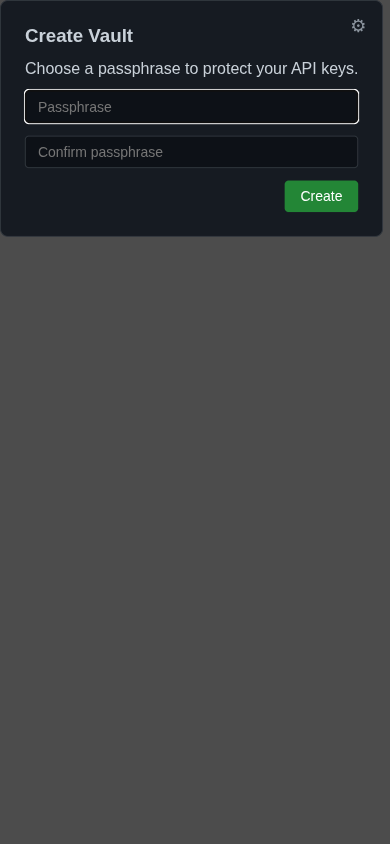
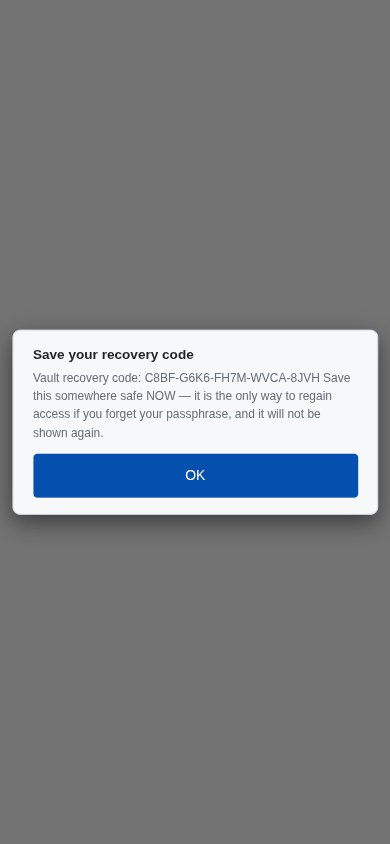
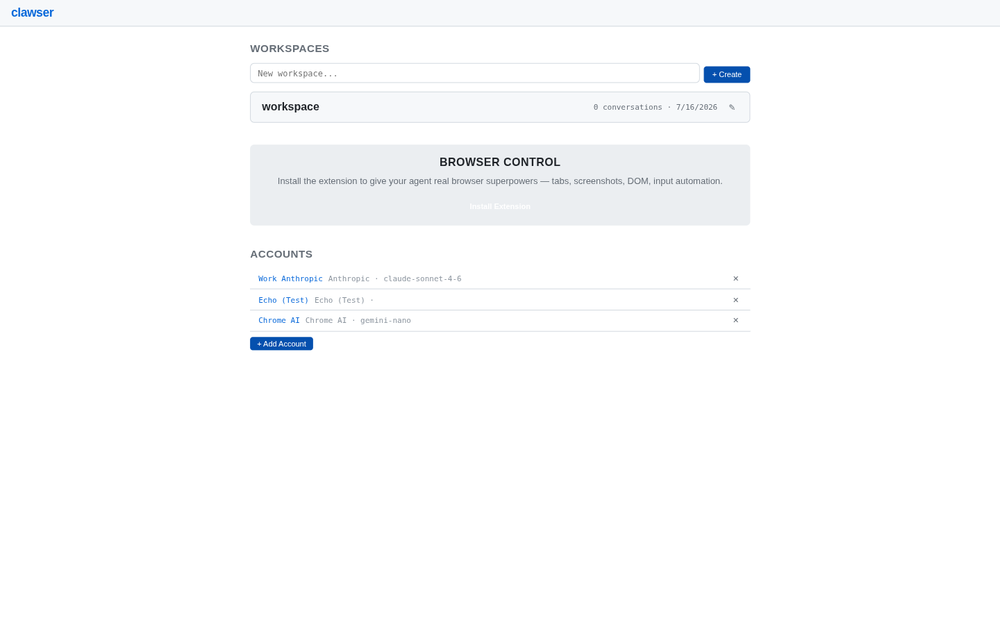
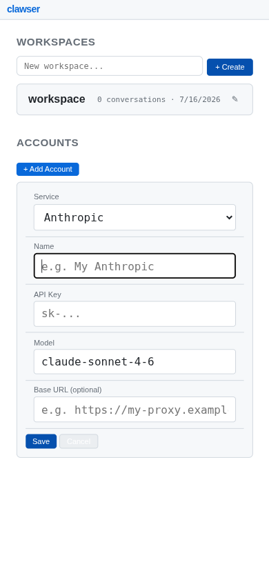
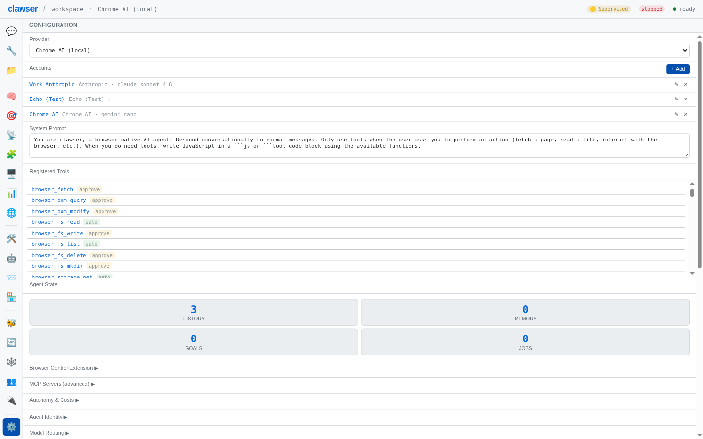

# Getting Started with Clawser

Set up Clawser, create your vault, add an LLM provider, and send your first message.

**Time:** ~10 minutes

**Prerequisites:**
- Chrome 131+ (for Chrome AI) or any modern browser
- Clawser served via a static file server (see [Quick Start](../../README.md#quick-start))

---

## 1. Launch Clawser

Start the built-in local HTTPS server and open it in your browser:

```bash
npm start

# Optional HTTP fallback
npm run start:http
```

`npm start` serves `web/` at `https://localhost:8080` and generates a cached localhost certificate on first run.

Navigate to `https://localhost:8080`.

## 2. Create Your Vault

On first run, Clawser asks you to create a **vault** — an encrypted store (AES-GCM-256, OPFS-backed) that holds your provider API keys and other secrets entirely in the browser. Choose a passphrase and confirm it.



After you click **Create**, Clawser shows a one-time **recovery code**. Save it somewhere safe — it's the only way back into the vault if you forget your passphrase, and it is never shown again.



> **Returning later?** On your next visit, Clawser shows an **Unlock Vault** prompt instead of the creation form. Enter your passphrase, or click **Forgot passphrase? Use recovery code** if you saved one. See the [Vault guide](../VAULT.md) for passkey unlock and backup/reset options.

Once unlocked, you'll land on the **Home Screen** with a list of workspaces and an **Accounts** section.



The home screen shows your workspace cards on the left and account management on the right. On a fresh install, you'll see one default workspace.

## 3. Add an LLM Provider Account

Before you can chat with a real model, add a provider account. Click **+ Add Account** in the Accounts section.

Fill in the form:

- **Service** — Select your provider (Anthropic, OpenAI, Groq, etc.)
- **Name** — A label for this account (e.g., "Work Anthropic")
- **API Key** — Your provider's API key
- **Model** — The default model to use
- **Base URL** (optional) — For self-hosted or proxy endpoints



Click **Save**. The account appears in the account list.

> **Tip:** You can add multiple accounts for different providers. Clawser supports 38+ LLM backends across three tiers: built-in (Anthropic, OpenAI, Chrome AI), OpenAI-compatible (Groq, OpenRouter, Together, Fireworks, Mistral, DeepSeek, xAI, Perplexity, Ollama, LM Studio), and ai.matey (additional backends via CDN). Every workspace also ships with a no-network **Echo** account for testing without burning API credits.

## 4. Enter a Workspace

Click on a **workspace card** to enter it. The view switches from the home screen to the workspace interface.


The workspace view has three main areas:

- **Sidebar** (left) — Panel navigation icons. Click any icon, or use `Cmd+1` through `Cmd+9` for the first nine panels.
- **Main area** (center) — The active panel content. Starts on the **Chat** panel.
- **Header** (top) — Shows the workspace name, active provider, and status badges for autonomy, run state, and streaming.

## 5. Send Your First Message

With the **Chat** panel active, type a message in the input field at the bottom and press `Cmd+Enter` (or click **Send**).

Try something simple:

```
What can you help me with?
```

The agent responds with a summary of its capabilities. If streaming is supported by your provider, you'll see tokens appear progressively.

> Use the **⚡ command palette** button next to the input (or `Cmd+K`) to search and run any of the 280+ registered tools directly, without going through chat.

## 6. Explore the Sidebar

The sidebar has 20 panels total. The first nine have keyboard shortcuts; the rest are icon-only.

| Panel | Shortcut | Purpose |
|-------|----------|---------|
| Chat | `Cmd+1` | Conversations with the agent |
| Tool Calls | `Cmd+2` | History of tool executions |
| Files | `Cmd+3` | Browse the OPFS file system |
| Memory | `Cmd+4` | Agent's persistent memory |
| Goals | `Cmd+5` | Track goals and sub-goals |
| Events | `Cmd+6` | Event log of all actions |
| Skills | `Cmd+7` | Install and manage skills |
| Terminal | `Cmd+8` | Virtual shell (68 built-in commands) |
| Settings | `Cmd+9` | All settings and configuration |
| Dashboard | — | Cost, usage, and history charts |
| Servers | — | Local HTTP/proxy servers hosted from the workspace |
| Tool Management | — | Per-tool permissions, autonomy, command palette history |
| Agents | — | Agent definitions and `@agent` delegation |
| Channels | — | Discord/Slack/Telegram/webhook channel adapters |
| Marketplace | — | Browse and install skills from the skill marketplace |
| Swarms | — | BrowserMesh agent swarm coordination |
| Transfers | — | File transfer progress across mesh peers |
| Mesh | — | BrowserMesh network topology and visualization |
| Peers | — | Connected mesh peers, trust, and audit log |
| Remote | — | Remote runtime sessions (wsh) and reverse terminals |

## 7. Quick Configuration Check

Press `Cmd+9` to open the **Settings** panel. Verify:

- Your **provider** is selected in the dropdown at the top
- The **system prompt** is set (or leave the default)
- The **Autonomy & Costs** section (collapsible) has autonomy set to `supervised` — the safe default, where the agent asks before running approval-gated tools



You can explore the other collapsible sections (Registered Tools, MCP Servers, Agent Identity, Model Routing, Browser Control Extension) as you grow more comfortable. See the [Configuration Guide](../CONFIG.md) for details on every option.

## Next Steps

- [Chat & Conversations](02-chat-and-conversations.md) — Learn about conversations, forking, and exporting
- [Memory & Goals](03-memory-and-goals.md) — Teach the agent and track progress
- [Terminal & CLI](05-terminal-and-cli.md) — Use the built-in virtual shell
