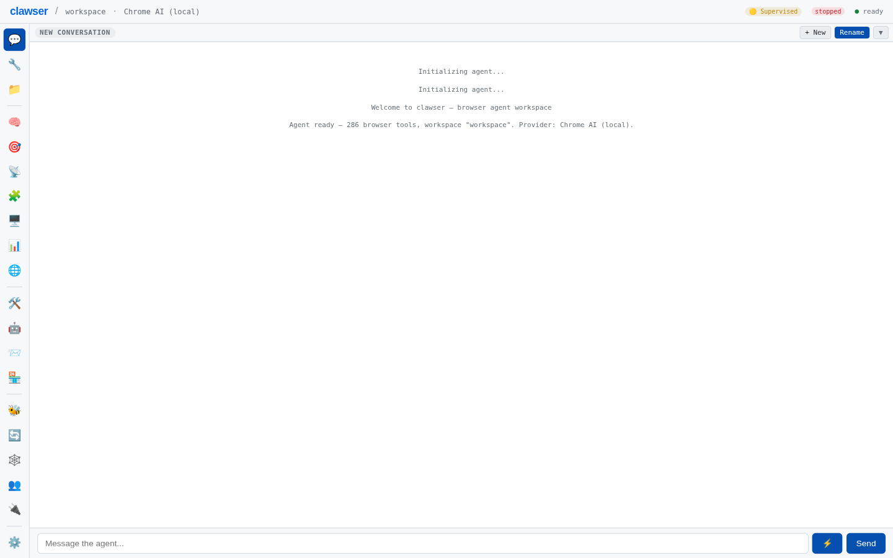
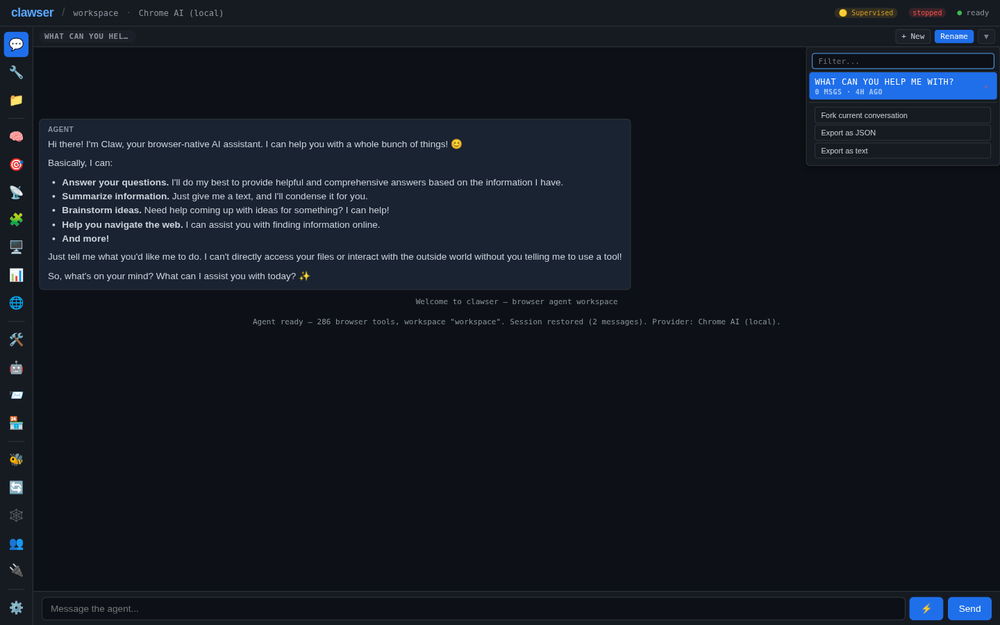
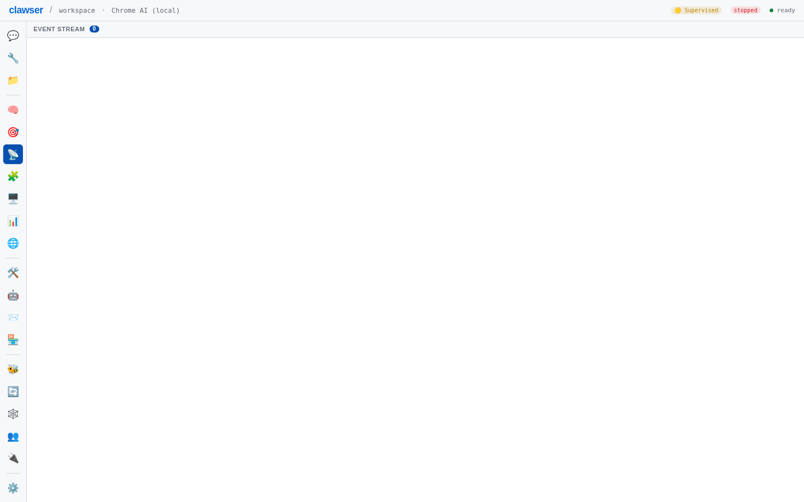

# Chat & Conversations

Send messages, watch tool calls execute inline, and manage conversations with forking, renaming, and exporting.

**Time:** ~8 minutes

**Prerequisites:**
- Completed [Getting Started](01-getting-started.md)
- An LLM provider account configured

---

## 1. The Chat Panel

Press `Cmd+1` or click **Chat** in the sidebar. The chat panel has three areas:

- **Conversation bar** (top) — Shows the active conversation name with a dropdown for history
- **Message area** (center) — Displays the conversation thread
- **Input area** (bottom) — Text field, command palette button, and send button

Type your message and press `Cmd+Enter` to send. If your provider supports streaming, tokens render progressively with a blinking cursor.

## 2. Tool Calls in Chat

When the agent needs to perform an action — fetching a URL, reading a file, searching the web — it executes **tool calls**. These appear inline in the chat as collapsible cards showing the tool name, parameters, and result.

If your **Autonomy** level is set to `supervised` (the default), the agent asks for approval before running tools that require it. You'll see an approval prompt with Accept/Deny buttons.

> **Tip:** Switch to `full` autonomy in the Config panel if you want the agent to run tools without asking. See [Tool Management](07-tool-management.md) for details.

## 3. Conversation History

Click the **▼** button at the top-right of the chat panel to open the conversation dropdown.

The dropdown has a filter field, a list of conversations in the current workspace (sorted by most recently used), and action rows for the active conversation. From here you can:

- **Switch** — Click any conversation in the filtered list to load it
- **Rename** — Click **Rename** in the panel header to give the active conversation a meaningful name
- **New** — Click **+ New** in the panel header to start a fresh conversation
- **Delete** — Remove a conversation you no longer need (hover a row in the list)
- **Fork current conversation** — Create a copy of the active conversation to explore a different direction
- **Export** — Download the active conversation as JSON or plain text

## 4. Starting a New Conversation

Press `Cmd+N` to create a new conversation. The chat panel clears and you start fresh. Your previous conversation is preserved in the history dropdown.

Each conversation has its own:
- Message history
- Tool call log
- Shell session state
- Cost tracking

## 5. Forking a Conversation

Forking creates a snapshot of the current conversation that you can take in a different direction without losing the original.

Open the conversation dropdown (**▼**) and click **Fork current conversation**. The fork appears in the conversation list; rename it afterward with **Rename** to keep track of which is which.

Use forking when you want to:
- Try a different approach to a task
- Explore alternative solutions
- Preserve a working conversation before experimenting

## 6. Exporting Conversations

Export the active conversation in two formats from the conversation dropdown:

| Format | Use Case |
|--------|----------|
| **JSON** | Structured data for programmatic use |
| **Text** | Plain-text transcript for reading or sharing |

Open the conversation dropdown (**▼**) and click **Export as JSON** or **Export as text**. The file downloads immediately.

> Need richer exports (HTML, Markdown, shell script) or a full replay log? Those live on the **Terminal** panel's session export (script/log/HTML/Markdown/JSON) and the `clawser session export` CLI command, not the chat conversation dropdown — see [Terminal & CLI](05-terminal-and-cli.md) and the [CLI Reference](../CLI.md#session-export).

## 7. The Events Panel

Press `Cmd+6` to open the **Events** panel. This shows a chronological log of everything that happened during your session — tool calls, memory operations, goal updates, and message metadata.

Each event row shows a timestamp, event type badge, and detail summary. The events panel is useful for:
- Auditing what tools the agent used
- Debugging unexpected behavior
- Understanding the agent's decision process

## Next Steps

- [Memory & Goals](03-memory-and-goals.md) — Teach the agent persistent information
- [Files & Web](04-files-and-web.md) — Work with files and web content
- [Tool Management](07-tool-management.md) — Control which tools the agent can use
