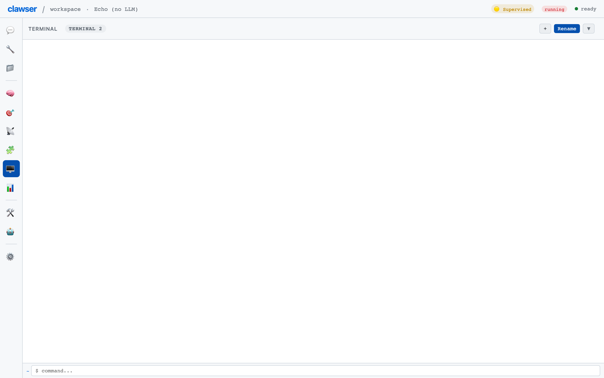

# Terminal & CLI

Use the virtual shell with 59 built-in commands, pipe data between commands, and manage terminal sessions.

**Time:** ~10 minutes

**Prerequisites:**
- Completed [Getting Started](01-getting-started.md)
- Familiarity with basic shell concepts (optional but helpful)

---

## 1. The Terminal Panel

Press `Cmd+8` to open the **Terminal** panel. You'll see a command input at the bottom, the current working directory indicator, and the output area above.


Type commands directly and press `Enter` to execute. The terminal runs entirely in the browser — no server or system shell access required.

## 2. Basic Commands

The shell provides 59 built-in commands organized into categories:

**File Operations:**

```bash
pwd                    # Print working directory
ls docs/               # List directory contents
cat notes/summary.md   # Display file contents
mkdir -p src/lib       # Create directories
cp file.txt backup.txt # Copy files
mv old.txt new.txt     # Move/rename files
rm temp.txt            # Remove files
```

**Text Processing:**

```bash
grep -i "error" log.txt     # Search text (case-insensitive)
wc notes/summary.md         # Word, line, character count
sort data.txt -n             # Sort numerically
uniq -c sorted.txt           # Deduplicate with counts
head -5 long-file.txt        # First 5 lines
tail -10 long-file.txt       # Last 10 lines
```

**Extended Commands:**

```bash
find docs/ -name "*.md"      # Find files by pattern
diff file1.txt file2.txt -u  # Unified diff
sed 's/old/new/g' file.txt   # Stream editing
tr 'a-z' 'A-Z'               # Character translation
base64 file.bin               # Base64 encode
sha256sum file.txt            # Hash a file
```

## 3. Pipes and Redirects

Chain commands together with pipes, just like a real shell:

```bash
echo "hello world" | wc           # Count words in piped input
ls docs/ | sort                   # Sort directory listing
cat log.txt | grep "error" | wc -l  # Count error lines
```

Redirect output to files:

```bash
echo "notes" > file.txt        # Write (overwrite)
echo "more notes" >> file.txt  # Append
ls docs/ 2> errors.txt         # Redirect stderr
```

Combine with logical operators:

```bash
mkdir build && echo "created"    # Run second only if first succeeds
rm missing.txt || echo "failed"  # Run second only if first fails
cmd1 ; cmd2                      # Run both regardless
```

## 4. The Clawser CLI

Inside the terminal, the `clawser` command provides an AI-integrated CLI with 18 subcommands:

```bash
clawser status     # Show agent state, provider, costs
```


Key CLI commands:

```bash
clawser "What files are in docs?"   # One-shot prompt
clawser do "Summarize this file"    # Agentic task (encourages tool use)
clawser chat                        # Enter interactive agent chat mode
clawser exit                        # Exit agent chat mode
clawser model gpt-4o               # Switch model
clawser cost                        # Show session costs
clawser tools                       # List available tools
clawser memory list                 # List all memories
clawser memory add key "value"      # Store a memory
clawser compact                     # Compact conversation context
clawser history                     # Show conversation history
```

Flags for customization:

```bash
clawser -m claude-sonnet "Explain this code"  # Override model
clawser --no-stream "Quick question"          # Disable streaming
clawser --tools fetch,fs_read "Read a URL"    # Restrict tools
clawser --max-turns 5 do "Complex task"       # Limit iterations
```

## 5. Terminal Sessions

The terminal supports multiple sessions, each with its own command history and shell state.



Click the **session bar** at the top of the terminal panel to open the session dropdown. From here you can:

- **New Session** — Start a fresh shell with clean state
- **Switch** — Jump between sessions
- **Fork** — Copy a session to branch your work
- **Rename** — Give sessions descriptive names
- **Export** — Download session history as script, markdown, or JSON

Each session preserves:
- Command history
- Environment variables (`export VAR=value`)
- Aliases (`alias ll='ls -la'`)
- Current working directory

## 6. Variables and Environment

Set and use environment variables:

```bash
export PROJECT="clawser"
echo "Working on $PROJECT"
env                          # List all variables
```

The shell supports `$VAR`, `${VAR}`, and `$?` (last exit code) substitution.

## 7. The Agent and the Shell

The agent uses the `shell` tool internally when it needs to process data, manipulate files, or run commands. The shell tool has `internal` permission — it runs without approval.

You can ask the agent to run shell commands through chat:

```
Run `ls docs/ | grep tutorial` in the terminal
```

The agent executes the command and returns the output.

## Next Steps

- [Files & Web](04-files-and-web.md) — OPFS file management beyond the shell
- [Chat & Conversations](02-chat-and-conversations.md) — Conversation management
- [Tool Management](07-tool-management.md) — Permission controls
