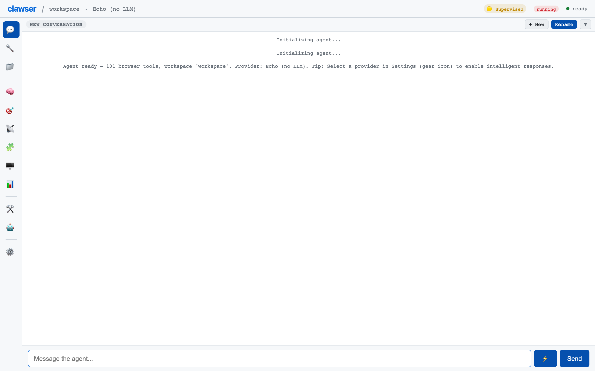

# Getting Started

Quick start guide — installation, first run, and basic usage.

---

### Installation

**Status:** ✅ Implemented

Clone the repository and install dependencies with npm. Requires Node.js >= 24.0.0. Run `npm install` to set up all devDependencies including andbox, browsermesh, and vitest.

**Source files:**

- `package.json`

> **Note:** Requires Node.js 24+ due to native ES module and Web Crypto API usage.

---

### Development Server

**Status:** ✅ Implemented

Start the HTTPS dev server with `npm start` (uses web/serve-https.mjs) or the HTTP fallback with `npm run start:http` (serves on port 8080 via npx serve).

**Source files:**

- `web/serve-https.mjs`

**API surface:**

- `npm start — HTTPS server`
- `npm run start:http — HTTP fallback on :8080`

> **Note:** HTTPS is recommended for Web Crypto API and Service Worker support.

---

### First Run

**Status:** ✅ Implemented

On first load, Clawser opens the workspace setup flow. Configure an LLM provider (API key), choose a model, and optionally import an existing workspace. The agent is ready to use once a provider is connected.

**Source files:**

- `web/clawser-ui.js`
- `web/clawser-state.js`

---

---

[Index](./index.md) | [Core →](./core.md)
