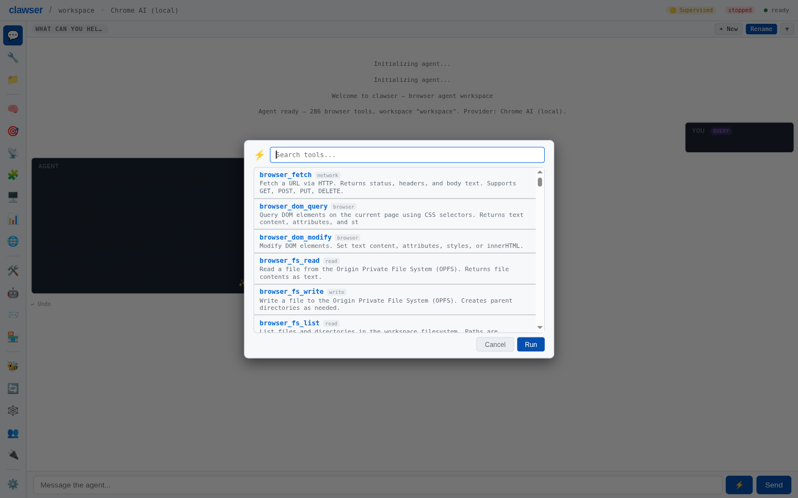
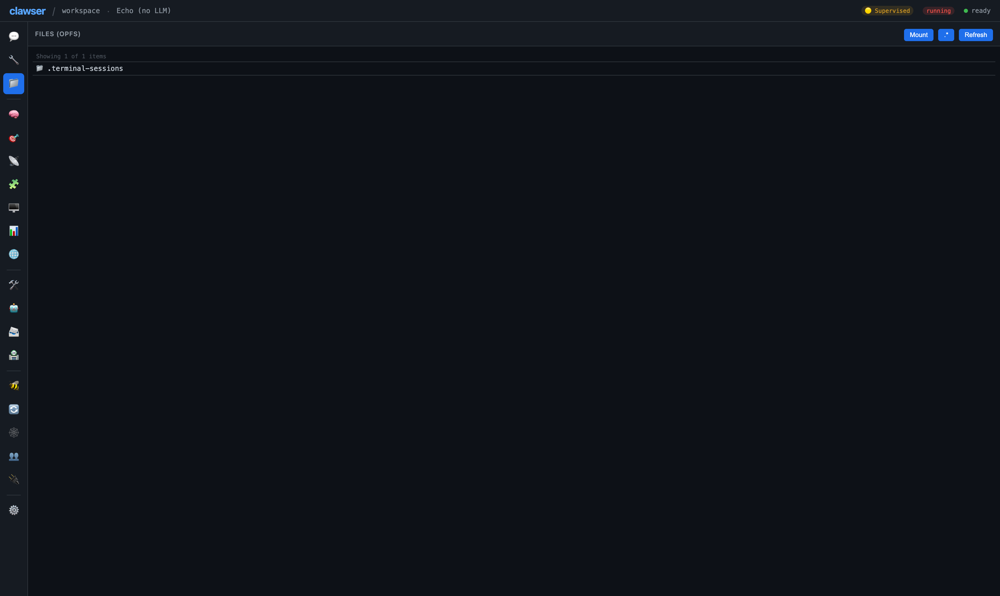
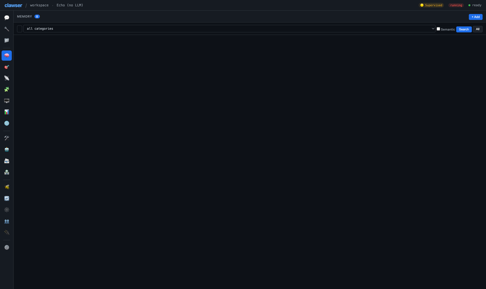
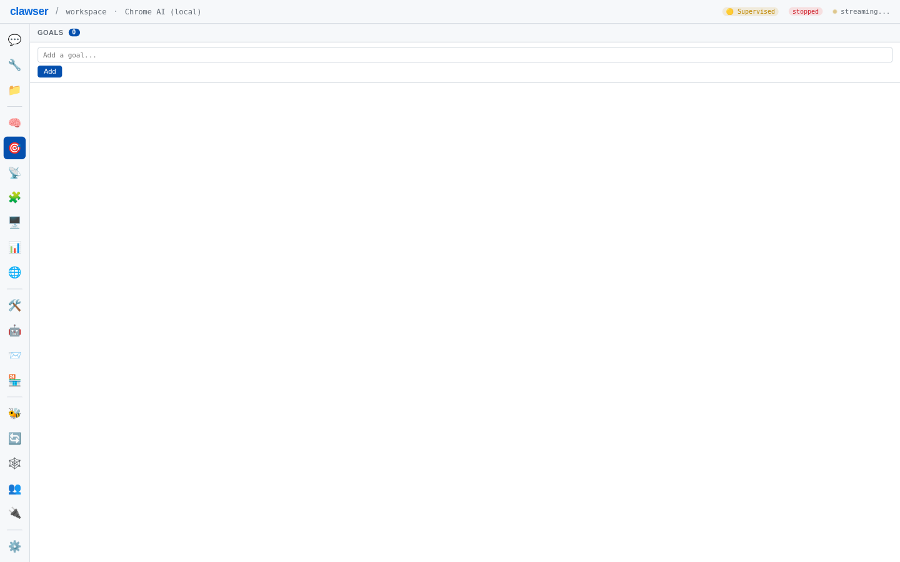
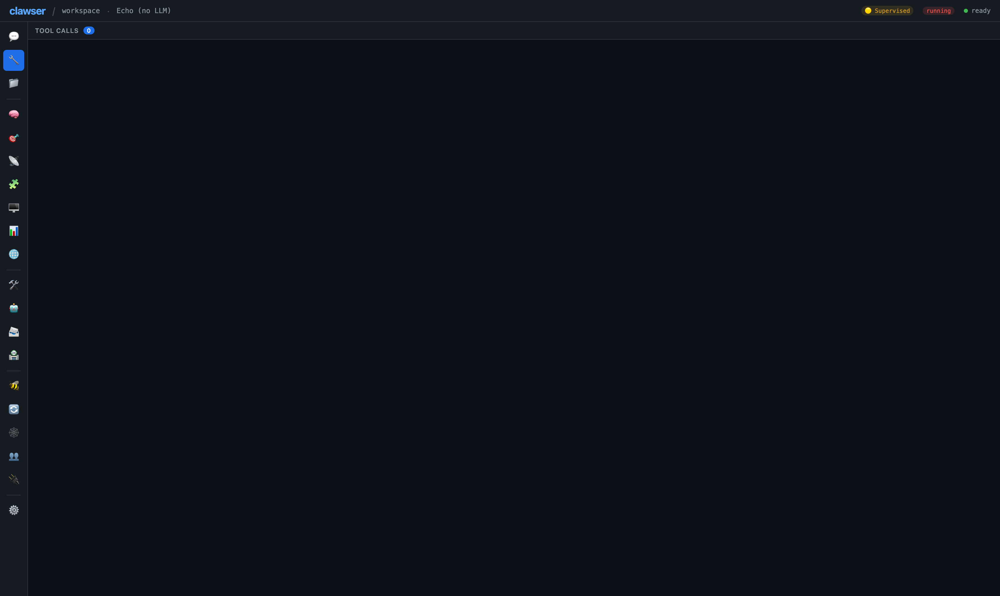
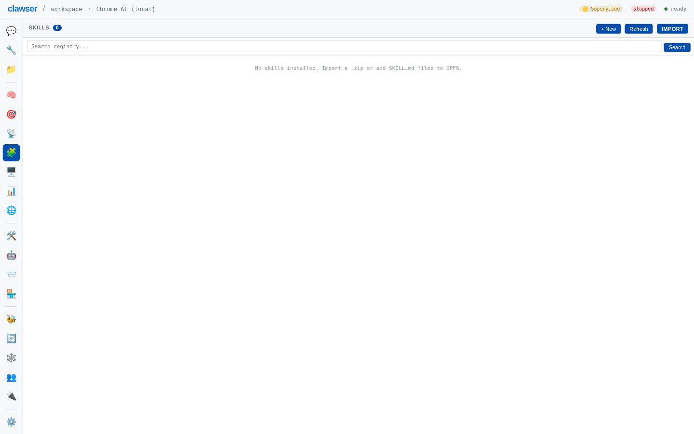
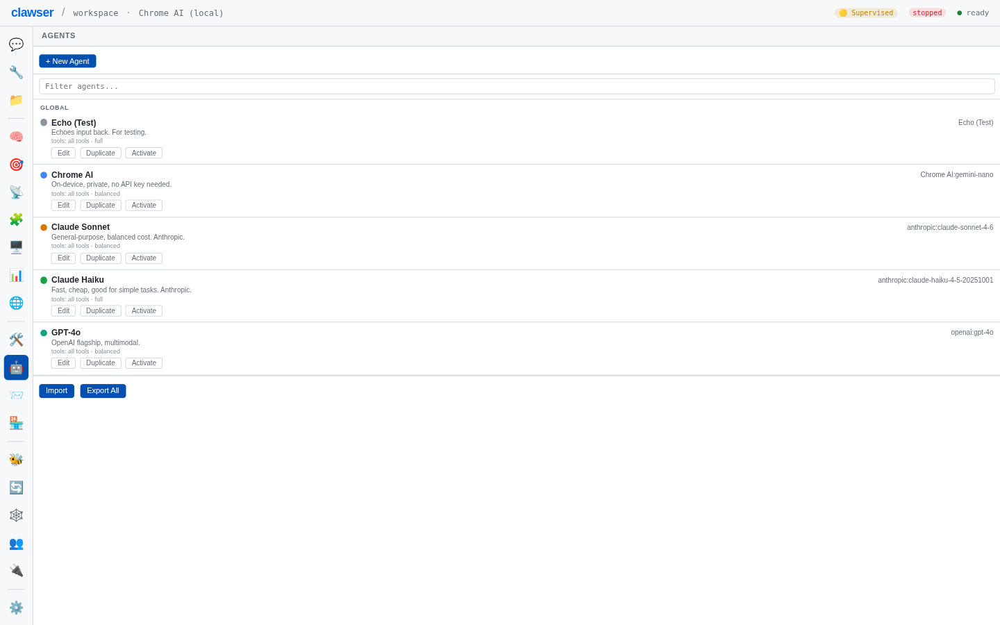
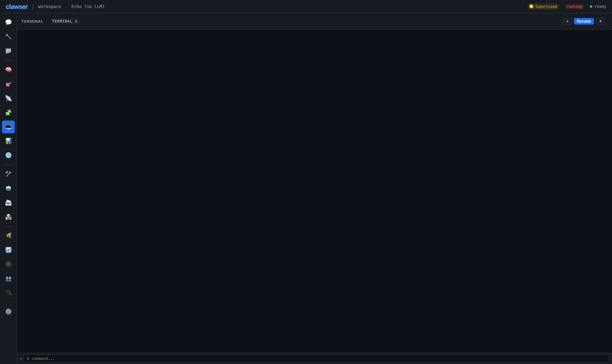
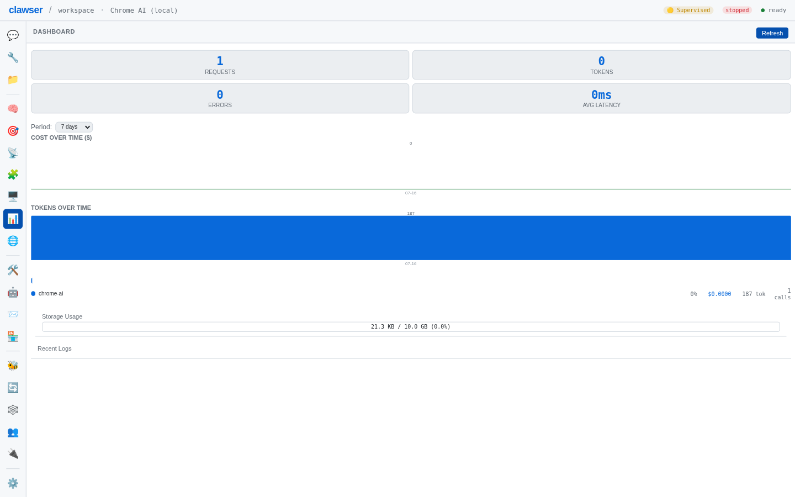

# Ui

All panels, Command Palette, keyboard shortcuts, responsive design, themes

---

### Chat Interface

**Status:** ✅ Implemented · **Category:** chat · **Since:** v1.0.0

Streaming chat with markdown rendering, code highlighting, collapsible tool calls, and message actions (copy, edit, retry, fork). Supports image and file attachments. Vision/multimodal input when provider supports it.

**Source files:**

- `web/clawser-ui-chat.js`

**API surface:**

- `addMsg`
- `createStreamingMsg`
- `appendToStreamingMsg`
- `finalizeStreamingMsg`

---

### Command Palette

**Status:** ✅ Implemented · **Category:** command-palette · **Since:** v1.0.0

Floating overlay (Cmd/Ctrl+K) for executing any registered tool outside the chat flow. Searchable tool list with typed parameter forms, required field validation, and inline results. Supports fuzzy matching.

**Source files:**

- `web/clawser-cmd-palette.js`
- `web/clawser-cmd-palette.d.ts`

**API surface:**

- `openCommandPalette`
- `closeCommandPalette`
- `renderCmdToolList`
- `selectCmdTool`
- `runCmdTool`
- `initCmdPaletteListeners`

---

### Panel System

**Status:** ✅ Implemented · **Category:** panels · **Since:** v1.0.0

Tabbed side panels for all major subsystems. Non-essential panels use lazy rendering — DOM is populated on first navigation. Hash-based SPA routing across 12 panels.

**Source files:**

- `web/clawser-ui-panels.js`
- `web/clawser-ui-panels.d.ts`

**API surface:**

- `initPanelListeners`

---

### Files Panel

**Status:** ✅ Implemented · **Category:** panel · **Since:** v1.0.0

OPFS file browser with directory navigation, file preview, local folder mounting, and mount list management. Supports drag-and-drop file upload.

**Source files:**

- `web/clawser-ui-files.js`

**API surface:**

- `refreshFiles`
- `mountLocalFolder`
- `renderMountList`

---

### Memory Panel

**Status:** ✅ Implemented · **Category:** panel · **Since:** v1.0.0

Memory search and management interface. Search memories by keyword, view results with category and score, create/edit/delete entries.

**Source files:**

- `web/clawser-ui-memory.js`

**API surface:**

- `renderMemoryResults`
- `doMemorySearch`

---

### Goals Panel

**Status:** ✅ Implemented · **Category:** panel · **Since:** v1.0.0

Goal tracking visualization with hierarchical tree view, progress bars, expandable sub-goals, and status indicators.

**Source files:**

- `web/clawser-ui-goals.js`

**API surface:**

- `renderGoals`
- `toggleGoalExpand`

---

### Config Panel

**Status:** ✅ Implemented · **Category:** panel · **Since:** v1.0.0

Settings interface for autonomy levels, identity configuration, routing rules, cache statistics, cost limits, sandbox settings, heartbeat configuration, OAuth connections, and self-repair thresholds.

**Source files:**

- `web/clawser-ui-config.js`

**API surface:**

- `applySecuritySettings`
- `renderAutonomySection`
- `saveAutonomySettings`
- `renderIdentitySection`
- `saveIdentitySettings`
- `renderRoutingSection`
- `renderAuthProfilesSection`
- `saveSelfRepairSettings`
- `renderSelfRepairSection`
- `updateCacheStats`
- `saveLimitsSettings`
- `renderLimitsSection`
- `saveSandboxSettings`
- `renderSandboxSection`
- `saveHeartbeatSettings`
- `renderHeartbeatSection`
- `renderOAuthSection`
- `renderCleanConversationsSection`

---

### Tool Registry Panel

**Status:** ✅ Implemented · **Category:** panel · **Since:** v1.0.0

Browse and test all registered tools. Shows tool name, description, category, permission level, and parameters. Inline test execution.

**Source files:**

- `web/clawser-ui-panels.js`

**API surface:**

- `renderToolRegistry`
- `renderToolManagementPanel`

---

### Shell Commands Panel

**Status:** ✅ Implemented · **Category:** panel · **Since:** v1.0.0

Browse all shell builtins with descriptions, usage, and flags. Searchable list.

**Source files:**

- `web/clawser-ui-panels.js`

**API surface:**

- `renderShellCommandPanel`

---

### Skills Panel

**Status:** ✅ Implemented · **Category:** panel · **Since:** v1.0.0

Skill installation and management interface. Shows installed skills, activation status, and provides marketplace search.

**Source files:**

- `web/clawser-ui-panels.js`

**API surface:**

- `renderSkills`
- `searchSkillRegistry`

---

### Agent Picker Panel

**Status:** ✅ Implemented · **Category:** panel · **Since:** v1.0.0

Agent definition picker with create, edit, switch, import/export, and delete. Shows agent properties (provider, model, system prompt, autonomy, tools).

**Source files:**

- `web/clawser-ui-panels.js`

**API surface:**

- `initAgentPicker`
- `updateAgentLabel`
- `renderAgentPanel`

---

### MCP Servers Panel

**Status:** ✅ Implemented · **Category:** panel · **Since:** v2.0.0

MCP server connection management. Add, remove, and monitor connected MCP servers. Shows discovered tools from each server.

**Source files:**

- `web/clawser-ui-panels.js`

**API surface:**

- `renderMcpServers`

---

### Terminal Panel

**Status:** ✅ Implemented · **Category:** panel · **Since:** v1.0.0

Split-pane terminal with session management. Multiple named sessions, history navigation, inline rename, fork, export, and replay.

**Source files:**

- `web/clawser-ui-panels.js`

**API surface:**

- `terminalAppend`
- `terminalExec`
- `terminalAskUser`
- `renderTerminalSessionBar`
- `replayTerminalSession`
- `termItemBar`

---

### Dashboard

**Status:** ✅ Implemented · **Category:** panel · **Since:** v1.0.0

Home screen with workspace cards, account overview, and quick actions. Shows recent conversations, active goals, and system status.

**Source files:**

- `web/clawser-home-views.js`
- `web/clawser-home-views.d.ts`

**API surface:**

- `renderHomeWorkspaceList`
- `renderHomeAccountList`
- `initHomeListeners`

---

### Identity Editor

**Status:** ✅ Implemented · **Category:** panel · **Since:** v1.5.0

Visual editor for AIEOS identity definitions. Edit personality traits, linguistics, motivations, and capabilities.

**Source files:**

- `web/clawser-ui-identity-editor.js`

**API surface:**

- `renderIdentityEditor`

---

### Mesh Visualization Panel

**Status:** ✅ Implemented · **Category:** panel · **Since:** v2.0.0

Visual representation of mesh topology, peer connections, and network state.

**Source files:**

- `web/clawser-ui-mesh.js`
- `web/clawser-ui-peers.js`
- `web/clawser-ui-swarms.js`

**API surface:**

- `renderMeshPanel`
- `renderConnectionPanel`
- `renderPeerStats`
- `renderSwarmPanel`
- `renderSwarmStats`

---

### Remote Access Panel

**Status:** ✅ Implemented · **Category:** panel · **Since:** v1.5.0

Remote pairing and session management UI. Generate pairing codes, view active sessions, and revoke access.

**Source files:**

- `web/clawser-ui-remote.js`

**API surface:**

- `renderRemoteTerminal`
- `renderRemoteFiles`
- `renderRemoteServiceList`
- `renderRemoteRuntimePanel`

---

### Servers Panel

**Status:** ✅ Implemented · **Category:** panel · **Since:** v2.0.0

Virtual server management UI. Add, configure, start/stop, and test servers.

**Source files:**

- `web/clawser-ui-servers.js`

**API surface:**

- `initServerPanel`

---

### Transfers Panel

**Status:** ✅ Implemented · **Category:** panel · **Since:** v2.0.0

File transfer management UI showing active and completed peer-to-peer transfers.

**Source files:**

- `web/clawser-ui-transfers.js`

**API surface:**

- `renderTransferPanel`

---

### Channels Panel

**Status:** ✅ Implemented · **Category:** panel · **Since:** v1.0.0

Channel configuration and monitoring UI. Add/remove channels, view status and message history.

**Source files:**

- `web/clawser-ui-channels.js`

**API surface:**

- `renderChannelPanel`

---

### Cost Charts

**Status:** ✅ Implemented · **Category:** panel · **Since:** v1.5.0

Usage and cost visualization charts. Daily cost trends, per-model breakdown, and hourly usage patterns.

**Source files:**

- `web/clawser-ui-charts.js`

**API surface:**

- `renderBarChart`
- `renderTimeSeriesChart`
- `renderCostBreakdown`

---

### Diff Viewer

**Status:** ✅ Implemented · **Category:** ui-component · **Since:** v1.5.0

Side-by-side diff visualization for file changes and undo previews.

**Source files:**

- `web/clawser-ui-diff.js`

**API surface:**

- `renderDiff`

---

### Drag-and-Drop Upload

**Status:** ✅ Implemented · **Category:** ui-component · **Since:** v1.0.0

File drop zone for uploading files to OPFS via drag-and-drop.

**Source files:**

- `web/clawser-ui-drop.js`

**API surface:**

- `extractHandles`
- `mountPathForHandle`
- `DropHandler`

---

### Item Bar

**Status:** ✅ Implemented · **Category:** ui-component · **Since:** v1.0.0

Reusable UI component for managing named lists (conversations, terminal sessions). History dropdown with search/filter, inline rename, delete, fork, and configurable export formats (script, markdown, JSON).

**Source files:**

- `web/clawser-item-bar.js`
- `web/clawser-item-bar.d.ts`

**API surface:**

- `createItemBar`
- `ItemBarConfig`
- `_relativeTime`
- `_downloadText`

---

### Modal System

**Status:** ✅ Implemented · **Category:** ui-component · **Since:** v1.0.0

Singleton modal system with alert(), confirm(), and prompt() methods. Supports danger mode for destructive operations.

**Source files:**

- `web/clawser-modal.js`
- `web/clawser-modal.d.ts`

**API surface:**

- `modal`
- `Modal.alert`
- `Modal.confirm`
- `Modal.prompt`

---

### Notification System

**Status:** ✅ Implemented · **Category:** notifications · **Since:** v1.5.0

In-app notification system with configurable preferences, quiet hours, and notification types. Manages notification display and dismissal.

**Source files:**

- `web/clawser-notifications.js`
- `web/clawser-notifications.d.ts`

**API surface:**

- `NotificationManager`
- `NotificationPreferences`
- `QuietHoursConfig`

---

### Keyboard Shortcuts

**Status:** ✅ Implemented · **Category:** shortcuts · **Since:** v1.0.0

Global keyboard shortcut bindings. Cmd/Ctrl+K for command palette, Cmd/Ctrl+L for new conversation, Cmd/Ctrl+/ for help, and panel navigation shortcuts.

**Source files:**

- `web/clawser-keys.js`
- `web/clawser-keys.d.ts`

**API surface:**

- `initKeyboardShortcuts`

---

### Status Badges

**Status:** ✅ Implemented · **Category:** status · **Since:** v1.0.0

Real-time status indicators in the UI header for cost meter, autonomy level, daemon mode, remote connections, and API key warnings.

**Source files:**

- `web/clawser-ui-panels.js`

**API surface:**

- `updateCostMeter`
- `updateAutonomyBadge`
- `updateDaemonBadge`
- `updateRemoteBadge`
- `renderApiKeyWarning`
- `renderQuotaBar`

---

### Workspace Dropdown

**Status:** ✅ Implemented · **Category:** navigation · **Since:** v1.0.0

Workspace switcher dropdown in the UI header. Shows all workspaces with quick-switch, create, rename, and delete.

**Source files:**

- `web/clawser-ui-panels.js`

**API surface:**

- `renderWsDropdown`

---

### Tab Views

**Status:** ✅ Implemented · **Category:** ui-component · **Since:** v1.5.0

Tab-based view management for organizing UI content into switchable panes.

**Source files:**

- `web/clawser-tab-views.js`

**API surface:**

- `TabViewManager`
- `parseTabViewHash`
- `buildTabViewUrl`

---

### Remote UI

**Status:** ✅ Implemented · **Category:** remote · **Since:** v2.0.0

Remote UI integration for controlling Clawser from external interfaces.

**Source files:**

- `web/remote-ui.js`

**API surface:**

- `RemoteUI`

---

### FsUiSync

**Status:** ✅ Implemented · **Category:** ui-component · **Since:** v2.1.0

Bidirectional synchronization between OPFS config files and UI state. Editing a config file in the shell updates the corresponding UI panel in real time; changing a setting in the UI writes back to the config file. Built on ReactiveConfigStore's subscribe/apply callbacks.

**Source files:**

- `web/clawser-fs-ui-sync.mjs`

**API surface:**

- `FsUiSync`
- `registerSyncBinding`

> **Note:** Bridges the gap between the Unix filesystem model and the graphical settings UI. Covers autonomy, provider, model, and notification preferences.

**See also:**

- Config File Reactivity

---

### Guest Filesystem Panel

**Status:** ✅ Implemented · **Category:** panel · **Since:** v2.1.0

Visual file browser panel for the embedded v86 Linux guest filesystem. Browse, upload, and download files between OPFS and the guest. Extends the existing Files panel with a guest mount tab.

**Source files:**

- `web/clawser-fs-guest-mount.mjs`

**API surface:**

- `mountGuest`
- `umountGuest`

> **Note:** Companion feature to the v86 proof of concept. Shell commands on /mnt/guest/ paths delegate to the guest OS via serial commands.

**See also:**

- Embedded Linux Guest (v86)

---

### wterm Migration

**Status:** 📋 Planned

Replace xterm.js with wterm DOM-native terminal renderer for better browser integration, accessibility, and smaller bundle size.

> **Note:** https://wterm.dev/ — Vercel Labs project, ~12KB WASM, Apache-2.0

---

---

[← Channels](./channels.md) | [Index](./index.md) | [Daemon →](./daemon.md)
